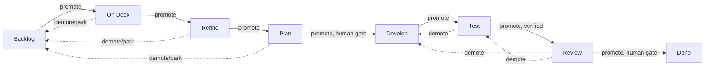

# AI Task Manager

**Turn your AI coding sessions into measurable, managed engineering work.**

AI Task Manager lets Claude Code and Codex share the same GitHub issue/project workflow. It binds every AI session to a GitHub issue, tracks time and context automatically, orchestrates full project backlogs from a spec, and generates stakeholder-ready ROI reports.

> **Your AI is drowning in context it never reads.** We cut cold-start skill load by 75% with a just-in-time loader — capability stayed flat, the tax disappeared. → [How we killed context bloat with JIT Skill Loading](docs/jit-loader-results.md)

<br>


<p>

While this ai skill project is a public repo it is currently under construction and has not been published yet.  
The rules and templates for interacting with github issue backlogs are under constant revision.

We are "dogfooding" the skill as we build it and patch every defect we find along the way.  
The design is evolving naturally on every iteration.  
As soon as the shape of the skill is stabilized we will publish it as an npm package for easy inclusion into your Agentic AI assisted project development.

</p>
---

## TL;DR — Up in 3 Minutes

### Prerequisites

- **Node.js 22+** — minimum supported runtime; Node 25 is preferred for cloud development environments
- **GitHub CLI (`gh`)** — [install](https://cli.github.com) and run `gh auth login`
- **jq** — `brew install jq` / `apt install jq` / `winget install jqlang.jq`
- **Claude Code and/or Codex** — install whichever agent you plan to use
- A **GitHub Projects V2** board. `init` can use an existing linked board, link an existing user/org board, or create a new board with AI Task Manager-compatible workflow fields.

### Install & Configure

```bash
# 1. install the package into your project repo (scoped name on the registry)
npm i -D @kburson/ai-task-manager

# 2. Install package configs into your project workspace
npx ai-task-manager install

# 3. Connect to your GitHub Project board (interactive)
npx ai-task-manager init

# 4. Commit the generated config — install/init outputs are project-portable,
#    so ephemeral clones (cloud workstations, fresh worktrees) inherit them
git add .ai-task-manager/ .github/ISSUE_TEMPLATE/ .claude/settings.json .claude/commands/task.md .claude/skills/task/SKILL.md .codex/hooks.json .agents/ AGENTS.md CLAUDE.md
git commit -m "chore: add ai-task-manager"
```

### The Public API You Actually Need

Once install and configure are done, this is the whole day-to-day surface — five commands:

```
/task brainstorm
/task new
/task [start|resume] [#N]
/task pause
/task promote|demote
```

| Command                    | What it does                                                                                    |
| -------------------------- | ----------------------------------------------------------------------------------------------- |
| `/task brainstorm`         | Open an untracked planning bucket for spec/design work before any issue exists                  |
| `/task new`                | Turn a spec (or a one-line idea) into a tracked issue — or a whole backlog                      |
| `/task [start\|resume] #N` | Bind the session to issue `#N` and show its brief — start it fresh or pick a paused one back up |
| `/task pause`              | Flush timing and step away — run this before `/clear` or ending a session                       |
| `/task promote\|demote`    | Move the active issue one state forward, or send it back a state for rework                     |

Bare `/task` (no arguments) always works too — it shows whatever is active right now: issue, elapsed time, word count.

That's it. Everything else below — `review`, `close`, `approve`, `ensureChecked`, `commit-trace`, `dod-stamp`, and the rest — is real and documented, but it's **the agent's** vocabulary for driving an issue through the state machine, not something you need to memorize. See [How Agents Actually Drive This](#how-agents-actually-drive-this).

#### In Codex, ask naturally:

```text
Use the task skill to start issue #42.
```

Of course either ai chat interface will eventually learn your patterns and be able to call the `/task` command verbs from natural language inference in the chat.

---

## What This Is:

Most AI coding tools give you a chat. This gives you an **engineering system**.

The gap between "I've been using AI coding agents for a few weeks" and "here's what we shipped, what it cost, and what we got for it" is exactly what this tool fills. Every session is bound to a GitHub issue. Every issue is tracked on a Kanban board. Every hour of AI engagement is measured and compared against your original estimate. At the end of a sprint — or a project — you can generate a report that answers the only question leadership actually cares about: _what did this cost versus what would it have cost without AI?_

The tool has three distinct capability layers:

1. **Session tracking** — bind Claude Code or Codex to a GitHub issue, auto-log time and context words, manage Kanban state hands-free
2. **Backlog orchestration** — generate a complete GitHub Projects backlog from a spec document, with epics, sub-issues, labels, sizing, stack ranking, and pickup directives
3. **ROI reporting** — produce a financial report comparing estimated effort against measured engaged hours, with fully-burdened cost tables by US region and role

---

## How Work Moves Through the Board

Every Kanban state is the same shape: an **entry gate** (checks that must pass to land here) and an **exit gate** (checks that must pass to leave). That makes every state a standalone place to enter, park in, or leave — never an implicit side effect of some other state.



Solid arrows are `/task promote`. Dashed arrows are `/task demote` (or `/task park <reason>` for the early states) — a state is never a one-way door.

| State       | Entry gate                                                                                                                                | Exit gate                                                                                                                                                                           |
| ----------- | ----------------------------------------------------------------------------------------------------------------------------------------- | ----------------------------------------------------------------------------------------------------------------------------------------------------------------------------------- |
| **Backlog** | Marker-trail contiguity (see below)                                                                                                       | Not blocked · no unresolved `{discuss}` brainstorming trigger                                                                                                                       |
| **On Deck** | Marker-trail contiguity (this stage's own marker is optional — pre-#433 issues never recorded it)                                         | Not blocked · Refine-entry fields present · parent/child state consistent · epic-child can't lead                                                                                   |
| **Refine**  | Marker-trail contiguity                                                                                                                   | Refine marked complete · not a stub · not blocked · Plan-entry fields present · WIP budget · parent/child consistent · user-story rule (hard)                                       |
| **Plan**    | Marker-trail contiguity                                                                                                                   | Not blocked · **plan approved (human gate)** · estimate set · deep dive present · Plan Metadata present · Verification Commands present · decomposition check · epic children ready |
| **Develop** | Marker-trail contiguity                                                                                                                   | Not blocked · code complete · sandbox/verify proof exists · commit trail has HEAD · every epic child at Review-or-later                                                             |
| **Test**    | Marker-trail contiguity · deep-dive placement/completeness · dependency map present                                                       | Not blocked · Definition of Done verified · pre-close completeness check                                                                                                            |
| **Review**  | Marker-trail contiguity · deep-dive placement/completeness · dependency map · all Verification Commands checked                           | Not blocked · **review approved (human gate)** · every epic child at Done · close gates                                                                                             |
| **Done**    | Same body gates as Review · no stray unchecked boxes anywhere · lifecycle labels (`agent-review-passed`, `passed-final-review`) satisfied | none — terminal                                                                                                                                                                     |

**Marker-trail contiguity** means every prior canonical stage must already carry an `aitm-entered-<stage>` HTML-comment marker on the issue body — the guard names the exact missing stage and refuses the move if one is gone (`contiguity-hole`); backward moves skip this check entirely. **Deep-dive placement/completeness** and **dependency map** are body-shape checks: the Deep-Dive Analysis section must sit between the Pickup Directive and the fields-block marker and clear a size-bucketed character floor once marked complete; the Dependency Map section must exist with real content once its checkbox is ticked. Source: [`scripts/task-tracker/lib/contiguity-entry-guard.mjs`](scripts/task-tracker/lib/contiguity-entry-guard.mjs), [`stage-entry-markers.mjs`](scripts/task-tracker/lib/stage-entry-markers.mjs), [`body-gates.mjs`](scripts/task-tracker/lib/body-gates.mjs).

The bold cell is the human gate on by default: **Plan → Develop** (don't let an agent start writing code before a human accepts the plan). Review → Done is likewise a human gate (`approve` + close gates, see below). Everything else is machine-checked. Full guard source: [`scripts/task-tracker/states/`](scripts/task-tracker/states/), architecture writeup at [`docs/architecture/state-machine.md`](docs/architecture/state-machine.md).

**Every cell in the table above is a real, per-state check, not a generic mover step.** Each guard is declared inside that state's own module (`scripts/task-tracker/states/<state>.mjs` exports its `entryGuards`/`exitGuards` arrays) and registered into a state-keyed registry (`guard-registry.mjs`) at boot. On every transition attempt, `runGuards(fromState, toState, ctx)` runs the _source_ state's exit guards then the _target_ state's entry guards — nothing state-specific is hardcoded into the mover; the mover just asks the registry "what does `develop` require to leave, what does `test` require to enter" and runs exactly those. Every transition path calls this — `move-state.mjs`, `promote.mjs`, `close.mjs`, and `review.mjs` — there is no move that skips it.

What genuinely has **no** per-state hook is a separate concept: an "on landing in this state, automatically do X" action. Every state's `onEnter` list is intentionally empty (`states/index.mjs` documents why: "deep work... is performed by `/task <verb>` sessions, not the state object"). The mechanical bookkeeping that happens on every successful move — stamping the `aitm-entered-<stage>` marker, writing the board's Status field — is one fixed sequence in the mover, identical regardless of target state. Anything beyond that (posting the pickup directive, appending a timing-log row, ticking the `story-closed`/`timing-flushed` lifecycle boxes on close) is driven by the `/task <verb>` command itself (`review`, `close`, etc.), not by the state.

**Resuming in place engages none of this.** `/task resume`, `/task update`, and `/task start` on an issue that's already bound to its current state never call `runGuards` — there's no re-validation of "does this issue still qualify to be here." The only check is a soft, non-blocking Status-drift audit (`runMoveInvariantAudit`): it compares the board's Status field against what the local session last recorded, and if they've drifted apart it prints a warning with a `reconcile` repair command — but it never refuses to resume. So the guards are a one-time toll paid at the moment of crossing into a state, not a standing condition re-checked every time you pick the issue back up.

## How Agents Actually Drive This

Most `/task` verbs are not meant for you to type. They're the vocabulary the AI agent uses to move an issue through the state machine correctly — deep-diving, ticking acceptance criteria, stamping evidence, running the verification gate, moving the Kanban card — while you stay on the five-command surface above. They're fully exposed for direct human use (nothing is hidden or privileged), but the expectation is that the agent handles the backlog mechanics:

- The agent binds the session (`/task start #N`), does the deep dive, writes code, and runs `verify-develop.mjs` before every commit.
- The agent flushes progress (`/task update`), stamps acceptance-criteria and Definition-of-Done evidence, and reports `CODE_COMPLETE` when done — it does not close its own work or skip ahead to Review/Done on its own initiative.
- You step in at the human gates: approve the plan, review the diff, approve the close. Everything in between is the agent driving.

---

## Install Targets

By default, install targets both Claude Code and Codex. Pass `--agent` to limit to one:

```bash
npx ai-task-manager install               # both (default)
npx ai-task-manager install --agent claude
npx ai-task-manager install --agent codex
```

The installer writes stable skill stubs by default:

- Claude Code: `.claude/skills/task/SKILL.md`
- Codex: `.agents/skills/task/SKILL.md`
- Codex hooks: `.codex/hooks.json`
- Shared templates and runtime state: `.ai-task-manager/`

### Optional Codex Superpowers Bootstrap

AITM can optionally mirror existing Claude Code Superpowers skills into Codex and add bootstrap instructions for new Codex sessions:

```bash
npx ai-task-manager install --codex-superpowers
```

This is not an AITM dependency. The installer first looks for an existing Claude Code Superpowers cache at:

```text
~/.claude/plugins/cache/claude-plugins-official/superpowers/<version>/skills
```

If found, AITM copies the supported skills into `~/.codex/skills` and appends an AITM-managed block to the repo-local `AGENTS.md`. That block tells Codex to load `using-superpowers` at conversation start and to check relevant Superpowers skills before planning, debugging, testing, implementing, dispatching agents, using worktrees, finishing a branch, or handling review.

By default the bootstrap instructions are repo-local. To update global Codex instructions instead, opt in explicitly:

```bash
npx ai-task-manager install --codex-superpowers-global
```

If Superpowers is missing, install continues normally and prints a follow-up command to rerun later. The AITM task skill remains separate at `.agents/skills/task/SKILL.md`.

---

## Session Tracking

### The Core Loop

The fundamental unit is a _task session_: Claude is working on one GitHub issue at a time. You switch issues with `/task #N`, and the skill handles the rest — moving the Kanban card, logging the start event, and watching for idle time.

```
/task #42          → switch to issue #42
...work for an hour...
/task update       → checkpoint — flush timing, reset counters, keep task active
...work more...
/task close        → done — move card to Done, write Engaged Time + Session Time to board
```

### Commands

Beyond the five daily-driver commands in the quickstart above, this is the fuller surface — mostly what the agent calls on your behalf as it drives an issue, exposed here for direct use, debugging, or scripting:

| Command                           | Action                                                                                               |
| --------------------------------- | ---------------------------------------------------------------------------------------------------- |
| `/task`                           | Show active task, elapsed minutes, context words since last marker                                   |
| `/task #N`                        | Switch to issue #N — bind the active session and display the brief                                   |
| `/task new [title]`               | Create a new issue and start tracking it                                                             |
| `/task brainstorm`                | Open an untracked planning bucket before an issue exists                                             |
| `/task resume`                    | Resume the last paused task (no body reload)                                                         |
| `/task resume #N`                 | Switch back to a paused task and display its body                                                    |
| `/task pause`                     | Flush timing, keep last-active. Run before `/clear` or closing an agent session                      |
| `/task update [msg]`              | Checkpoint — flush and reset counters, keep task active                                              |
| `/task close`                     | Hard-stop — flush, update board fields, move to Done                                                 |
| `/task log #N`                    | Re-compute and write Engaged Time and Session Time for any issue                                     |
| `/task migrate`                   | Select/configure a project, import repo issues, heal field DBs, and sync project fields              |
| `/task ensureChecked "<label>"`   | Ensure a checkbox is ticked in the active issue body — idempotent, never unticks (exact label match) |
| `/task ensureUnchecked "<label>"` | Ensure a checkbox is unticked — idempotent, never ticks (exact label match)                          |
| `/task promote`                   | Promote the active task to the next kanban state (pre-flights cheap exit-gates first)                |
| `/task demote`                    | Send the active task back a state for rework (Test/Review → Develop)                                 |
| `/task park <reason>`             | Send a Refine/Plan/On Deck issue back to Backlog without clearing sizing                             |
| `/task fleet`                     | Show all active tasks across parallel agent worktrees                                                |
| `/task config`                    | List all config values with sources                                                                  |
| `/task config <key> <value>`      | Set a config value project-locally                                                                   |
| `/task config init`               | Interactive interview — review and set all config values                                             |
| `/task help`                      | Print command reference                                                                              |

### How Timing Works

Every start, pause, update, and close appends a row to a "⏱ Timing Log" comment on the GitHub issue:

```
| Timestamp         | Event  | Active | Idle | Δ Words | Word Marker |
| 2026-04-25T14:30Z | start  | 0      | 0    | 0       | 2,341       |
| 2026-04-25T15:45Z | update | 72     | 3    | 1,204   | 3,545       |
| 2026-04-25T17:10Z | end    | 67     | 5    | 890     | 4,435       |
```

**Active Min** and **Idle Min** are deltas since the last baseline reset. **Idle** is any gap longer than `idleThresholdMinutes` (default: 5). Context words count the visible chat text — the conversation turns a human would read, review, and respond to. This excludes code, files, and references the AI loads into context internally. It's a measure of human review burden: the volume of AI output you're expected to engage with during the session. Reading long responses is also a common source of idle gaps — the clock sees silence while you're actually working through the output.

Hooks flush timing on every `/compact` and session start, so long sessions are never lost — **unless you use `/clear`** (always run `/task pause` first if you must).

### GitHub Projects Board Integration

When you switch tasks or close an issue, the skill updates your board automatically:

- **Kanban state** → moves the card through the 8-state workflow (Backlog → Refine → Ready for Planning → Plan → Develop → Test → Review → Done)
- **Engaged Time / Session Time** → measured minutes used by reports and board filters
- **Rank** → the issue's numeric wave-ordering position (see [Rank and Dependencies](#rank-and-dependencies) below)
- **Start date / End date** → set automatically when work moves into active development or Done

All board IDs are stored in `.ai-task-manager/task-tracker.json` and set once by `init`. You never manage IDs manually.

If the current repo has no linked project, `init` lists available user/org projects and offers to create a new repo-linked project. GitHub's built-in web templates, including Feature Release, are not exposed through the supported CLI/API create path, so new boards use an AI Task Manager-compatible Feature Release workflow by default.

Project field definitions live in `.ai-task-manager/project-fields.json`; event bindings live in `.ai-task-manager/project-field-events.json`. These files are intended to be committed so project-specific workflow customizations travel with the repo.

AITM stores portable field values in a compact machine block at the bottom of each issue body. GitHub Project fields are treated as a rebuildable index for filtering, sorting, and reporting. If that block is missing or malformed, field-writing commands heal it before syncing board fields.

The embedded block is intentionally terse and machine-owned:

````md
<!-- ai-task-manager:fields:start -->

```json
{ "schema": 1, "values": { "priority": "P1", "estimate": 6, "sessionTime": 42 } }
```

<!-- ai-task-manager:fields:end -->
````

---

## Backlog Orchestration

The orchestration mode is where the tool shifts from tracker to co-pilot.

### Plan Mode

Start a planning session before any issues exist:

```
/task brainstorm
```

This opens an untracked bucket for time spent thinking, speccing, and designing. When you're ready to execute:

```
/task new My Feature Backlog
```

If you're in plan mode and have a spec in context, the skill prompts:

> "I see a spec in context — use it to build out the full backlog? I'll create all epics and sub-issues, set sizing/priority/rank, and inject pickup directives across the entire plan — no stopping between issues."

Reply **yes** and the orchestration runs end-to-end. Reply **no** to create a single issue instead.

### From Spec to GitHub in One Pass

Given a spec document (markdown, loaded into context), the orchestrator creates the full project structure:

1. **Labels** — creates `plan:<slug>` for the backlog, plus purpose labels (`backend`, `client`, `infrastructure`, `security`, `data`, `test`, `dx`) inferred from each issue's scope
2. **Epics** — one per epic block in the spec, with full scope, acceptance criteria, and Pickup Directive
3. **Sub-issues** — each linked to its parent epic via GitHub's sub-issue relationship
4. **Solo tasks** — standalone issues with no parent
5. **Project tethering** — every issue is verified from the Project V2 side before orchestration continues; issue-side `projectItems` metadata alone is not trusted
6. **Project fields** — Size, Estimate, Priority, and Rank set on every issue via GitHub Projects V2 API
7. **Kanban state** — every issue lands in Backlog, ready to work

All of this runs automatically. You watch the progress stream and review the summary table at the end.

### Rank and Dependencies

Every issue in the spec should include a `**Rank:** N` field. Sub-issues sharing a Rank form a **wave** — they can be dispatched in parallel — while a sub-issue at Rank N+1 waits for every Rank-N sibling to reach Done before it can start. The `wave-admission` gate enforces this when an issue enters Plan; solo issues with no parent epic bypass it entirely.

```markdown
#### E1-S1 — Implement email/password registration

**Priority:** P0 | **Size:** M | **Estimate:** 4h | **Rank:** 1

#### E1-S2 — Add Google OAuth integration

**Priority:** P0 | **Size:** M | **Estimate:** 3h | **Rank:** 2 | **Depends on:** E1-S1 (JWT infrastructure)
```

During epic pickup, the agent validates these values against actual code dependencies and posts a confirmed dependency map before fanning out. Once an epic is in progress, all parallel work happens within that epic's sub-issues — no cross-epic fan-out until the active epic closes.

Full wave-admission mechanics, discovered-sub-issue handling, and same-wave-newcomer semantics: [docs/guides/workflow.md § Rank-as-wave-id](docs/guides/workflow.md#rank-as-wave-id).

### Conversational Backlog Management

The GitHub integration and skill definitions mean you don't have to memorize slash commands to manage your backlog. The AI agent can discuss and manage issues directly from chat — reading context, inferring intent, and issuing the right `gh` API calls behind the scenes.

Ask naturally:

```
"What's the status of the auth epic?"
"Create a new issue for the rate-limiting bug we just found — P1, S estimate."
"Move issue #34 to Review."
"Link #42 as a sub-issue of #38 and set rank 2."
"Show me all open P0 issues with no estimate."
"Close the current task and log time."
```

The agent translates these into the right combination of `gh issue`, `gh project`, and GitHub Projects V2 GraphQL calls. The pickup directive, definition-of-done checklist, and fleet rules are structured knowledge embedded in the skill — so the agent can enforce your workflow even when driving from conversation, not commands.

`/task` commands are the precise, scriptable interface. Conversation is the flexible one. Both drive the same underlying system.

---

## Pickup Directive

The Pickup Directive makes every issue self-contained. Any agent, on any machine, after any context reset, can pick up an issue cold and know exactly what to do.

> **This is a project-editable template, not fixed behavior.** Both the Pickup Directive and the Definition of Done live at `.ai-task-manager/templates/` after install — see [Customizing](#customizing) below.

### What Gets Injected

Every issue created from a master plan gets a Definition of Done with three sections — **Functional** (checked at Test: tests pass, lint/format clean, commits present, acceptance criteria met, issue checkboxes ticked), **Lifecycle** (checked at Review: `Agent Review Passed`, `Final Review Passed`), and **Housekeeping** (checked at Close: `Story closed and moved to Done`, `Timing data flushed to issue`) — plus a Pickup Directive block:

```markdown
### Definition of Done

#### Functional

- [ ] `npm test`
- [ ] `npm run lint`
- [ ] `npm run format:check`
- [ ] Acceptance criteria met
- [ ] Issue body checkboxes ticked

#### Lifecycle

- [ ] Agent Review Passed
- [ ] Final Review Passed

#### Housekeeping

- [ ] Story closed and moved to Done
- [ ] Timing data flushed to issue

## Pickup Directive — MANDATORY, DO NOT SKIP

> Follow: `.ai-task-manager/templates/pickup-directive.md`

- [ ] Deep dive complete

---
```

The issue body stays lean. The detailed agent instructions live in `.ai-task-manager/templates/pickup-directive.md` — the agent reads that file at pickup time. The injected block is built by `scripts/task-tracker/preflight-issue.mjs`, which also gates issue creation: if either template file is missing, the script aborts and the skill stops creating issues until the install is fixed.

### Hard Rules — Enforced by the Gates

The `/task close` pre-close gate AND `move-state.mjs <issue> done` both refuse if:

- any `- [ ]` remains in the issue body (Deep Dive checkpoint, DoD, acceptance criteria), or
- the line `- [x] Deep dive complete` is not present when the body contains a Pickup Directive block.

No env override exists. The GitHub UI (drag a card to Done, delete an issue) is the only abandonment path; the script-driven paths are consistent and auditable.

### The Deep Dive Checkpoint

On first pickup, the agent runs a just-in-time analysis against the current repo state and appends it as a `## Deep-Dive Analysis (YYYY-MM-DD)` section — placed after the Pickup Directive's `- [ ] Deep dive complete` line and before the hidden fields block, never as a trailing appendix. The deep dive must include:

- Files to edit (full repo-relative paths)
- Step-by-step implementation plan
- Test additions (each test file with a one-line description)
- Verification Commands as enforceable checkboxes for issue-specific checks not
  already covered by the standard DoD:

  ```markdown
  ### Verification Commands

  - [ ] `node scripts/task-tracker/tests/config.test.mjs`
  - [ ] `node scripts/task-tracker/tests/state.test.mjs`
  ```

  Do not add words like `PASS`; a checked box means the exact command was run successfully and output was read.

- Identified risks beyond the original scope
- **Sibling sub-issues to spawn**, if the deep dive uncovers scope that belongs in its own issue rather than this one
- **Dependency map** — always required, even if the answer is "none":

  ```
  ## Dependency Map
  Depends on: #12 (JWT model), #14 (refresh token schema)
  Blocks: #19 (OAuth flow), #21 (MFA enrollment)
  ```

The deep dive is narrative — it must never nest `Acceptance Criteria`, `Verification Commands`, or `Definition of Done` headings inside it. Those three names are read only at the document root by their respective gates; nesting them inside the appendix hides real checkboxes from the gates that need them, or fools a gate into treating narrative prose as satisfied criteria. A guard refuses issue-body writes that would introduce this.

Once the deep dive checkbox is checked, every subsequent pickup — after `/clear`, machine switches, or agent handoffs — skips straight to implementation.

### Rank-Ordered Fan-Out

When an epic is picked up, before fanning out sub-agents:

1. All sub-issue Rank fields are validated against actual code dependencies found in the deep dive
2. Any incorrect Rank values are updated on the project board
3. A confirmed dependency map is posted as a comment on the epic
4. Rank-1 sub-issues are fanned out immediately; each subsequent wave unblocks when the previous closes

### Customizing

Both files below are project-editable — the whole point of the Pickup Directive and DoD is that they encode **your** project's workflow, not a fixed one. They're installed to `.ai-task-manager/templates/` and can be edited freely:

| File                    | Purpose                                                                     |
| ----------------------- | --------------------------------------------------------------------------- |
| `pickup-directive.md`   | Agent instructions — deep dive steps, implementation pattern, fan-out rules |
| `definition-of-done.md` | DoD checklist inlined into every new issue body at creation                 |

If a local edit differs from the bundled template, reinstall saves the previous file as `.bak` before refreshing it.

---

## Multi-Agent Orchestration

When work fans out to parallel sub-agents, the **active task should always be the issue whose work is being performed in this session right now**.

| What you're doing                                       | Active task    |
| ------------------------------------------------------- | -------------- |
| Dispatching sub-agents, reviewing output, orchestrating | `/task #epic`  |
| Performing a child issue's work directly (no sub-agent) | `/task #child` |
| Returned to orchestration after agent completes         | `/task #epic`  |

The fleet command shows all active tasks across parallel worktrees:

```
/task fleet
```

### Orchestration Directive (add to `CLAUDE.md`)

```
## Task Tracker: Orchestration Rules

- Orchestrating (dispatching, reviewing, synthesizing): /task #<epic>
- Performing child work directly in this session: /task #<child>
- Return to /task #<epic> the moment work goes to a sub-agent

Never leave the epic active while working a child directly.
Never leave a child active while orchestrating.
```

---

## Status Line

Show the active issue number in the Claude Code CLI header bar:

```bash
npx ai-task-manager statusline
```

Installs `~/.claude/statusline.sh` and wires it into `~/.claude/settings.json`. The CLI header shows `task #42` while a task is running, blank when idle.

> Supported in the Claude Code CLI only. No effect in the web or desktop app.

Requires `jq`.

---

## Value Report

Generate a financial report showing the ROI of AI-assisted development across your entire GitHub Projects board.

```bash
# HTML report (no dependencies)
npx github-project-report --html

# PDF report (requires: npm install --save-dev puppeteer)
npx github-project-report

# Closed issues only, Q1 date range
npx github-project-report --html --state closed --from 2026-01-01 --to 2026-03-31
```

### What the Report Shows

The report answers: **what did it actually cost to ship this, versus what would it have cost without AI?** It reads `Estimate` (pre-work hours) and `Session Time` (measured minutes) from the board, plus chat words, and builds a print-optimized PDF or HTML document: an executive summary cover page, a cost-comparison page (Human Engineering Cost vs. AI-Assisted Cost, with acceleration multiples across six baselines), and supporting detail pages — a per-issue backlog table, cost-by-US-region table, and a created→started→closed timeline analysis.

**Key metrics:**

- **Engaged Hours** = session minutes + human review time (visible chat words ÷ WPM × overlap factor)
- **Acceleration ratio** = Estimate ÷ Engaged Hours
- **Human Leverage** = Estimate ÷ human-only engagement time (orchestrator + solo sessions, agent time excluded)

This makes AI productivity legible to stakeholders. Not "we used AI" — but "we delivered 82 estimated hours in 11 engaged hours at `$800` instead of `$14,000`."

Run `npx github-project-report --help` for the full flag reference (date/issue filters, region and role overrides, output path, report title, and more). Full ROI methodology: [docs/guides/ai-value-framework.md](docs/guides/ai-value-framework.md).

---

## Configuration

Config is stored in `.ai-task-manager/task-tracker.json` (project-local, committed) and `~/.ai-task-manager/task-tracker-config.json` (user-global). Legacy `~/.claude/task-tracker-config.json` is still read as a fallback. Project values override user-global; both override defaults.

Run the interactive interview to review and set everything:

```
/task config init
```

Or set individual values:

```
/task config repo myorg/my-project
/task config assignee @me
/task config pickupDirective true
```

### User Settings

| Key                    | Default | Description                                                 |
| ---------------------- | ------- | ----------------------------------------------------------- |
| `repo`                 | `''`    | GitHub repo (`owner/repo` format) — required                |
| `assignee`             | `'@me'` | Assignee for issues created via `/task new`                 |
| `defaultLabels`        | `[]`    | Labels applied to every new issue                           |
| `wpm`                  | `180`   | Your reading speed — used for context-word time calculation |
| `autoEndOnSwitch`      | `true`  | Auto-close previous task when switching                     |
| `idleThresholdMinutes` | `5`     | Gap length before time stops counting as active             |
| `recordWallClock`      | `true`  | Record wall-clock time in addition to active time           |
| `pickupDirective`      | `true`  | Inject Pickup Directive block into new issues               |
| `hookNetworkTimeoutMs` | `2000`  | GitHub API timeout from hooks                               |

Internal, `init`-managed settings (board/field IDs) are not meant for manual editing — full list in [docs/DESIGN.md](docs/DESIGN.md).

---

## Permissions

`install` adds auto-allow rules to `.claude/settings.json` so orchestration runs hands-free. During backlog creation, every shell command executes without a prompt:

| Rule                             | What it covers                                |
| -------------------------------- | --------------------------------------------- |
| `Bash(gh issue create*)`         | Issue creation                                |
| `Bash(gh api graphql*)`          | Project field mutations, sub-issue linking    |
| `Bash(gh label create*)`         | Label setup                                   |
| `Bash(gh project item-edit*)`    | Size, Estimate, Priority fields               |
| `Bash(cat > ./.tmp/gh/*)`        | Issue body temp files (project-local scratch) |
| `Bash(node */task-tracker.mjs*)` | All `/task` verbs                             |
| `Bash(*/move-state.mjs*)`        | Kanban state transitions                      |
| `Bash(*/set-priority.mjs*)`      | Priority setting                              |
| `Bash(*/set-rank.mjs*)`          | Rank (wave ordering) setting                  |

All mutations are scoped to the issues being created or updated in the current project. Nothing reaches outside your configured repo and project board.

To review each invocation manually, remove the rules from `.claude/settings.json`.

---

## Session Management

### `/compact` vs `/clear`

Default to `/compact`. It summarizes your session, keeps hooks active, and costs ~25× fewer tokens than a cold reload.

|             | `/compact`                     | `/clear`                     |
| ----------- | ------------------------------ | ---------------------------- |
| Token cost  | ~2k (summary)                  | ~50k (full reload)           |
| Hooks       | Fires PreCompact + PostCompact | Bypasses all hooks           |
| Timing data | Flushed automatically          | Lost if not manually paused  |
| When to use | Same task, same thread         | Completely different context |

**Before `/clear`,** always flush first:

```
/task pause
/clear
```

### One Session Per Workspace

The state file (`.ai-task-manager/task-tracker-state.json`) is workspace-scoped. Two simultaneous agent sessions in the same directory will corrupt each other's word-count baseline. Timing (minutes) stays correct; only Delta Words is affected.

**Rule:** only run `/task` commands from one session at a time. Treat any second session as read-only.

> **In progress:** [#1048](https://github.com/kburson/ai-task-manager/issues/1048) is delivering exclusive, GitHub-native work leases so two agents (e.g. Claude Code and Codex, or two worktrees) can no longer silently corrupt each other's baseline. Once it lands, binding an issue that's already leased elsewhere will fail closed with a clear conflict instead of quietly desyncing Delta Words — GitHub issue comments become the durable authority instead of the local per-workspace state file.

---

## Helper Scripts

Every routed script and `/task` verb self-documents — pass `help`, `?`, `--help`, or `-h` and it prints its own purpose and syntax, so an agent (or you) can [re]discover usage without leaving the terminal. For the full grouped command list:

```bash
npx aitm help
```

| Script                                                        | Description                                                                                                                                                                                                       |
| ------------------------------------------------------------- | ----------------------------------------------------------------------------------------------------------------------------------------------------------------------------------------------------------------- |
| `scripts/gh/project-tether.mjs --issue <N> ...`               | Add an issue to the configured Project V2, verify it through `ProjectV2.items`, repair issue-side phantom project items when possible, set project fields, and optionally link a parent epic with `--parent <N>`. |
| `scripts/gh/move-state.mjs <issue#> <state> [--item-id <id>]` | Move issue to Kanban state (backlog/assigned/refine/plan/develop/test/review/done). Pass `--item-id` to skip the GraphQL lookup when you already have the project item ID.                                        |
| `scripts/gh/set-priority.mjs <issue#> <priority> [--cascade]` | Set P0/P1/P2 priority. `--cascade` applies to all sub-issues too.                                                                                                                                                 |
| `scripts/gh/set-rank.mjs <issue#> <n>`                        | Set the project Rank number field (wave ordering) on one issue. Warns and exits 0 when no rank field is configured.                                                                                               |

All scripts read board/field IDs from `.ai-task-manager/task-tracker.json`. No manual ID management.

---

## Troubleshooting

**`task-tracker not configured`** — Run `npx ai-task-manager init`.

**`Issue #N not found in project`** — The issue hasn't been added to your GitHub Project board. Open the issue on GitHub and add it, or check that `repo` in your config matches the project owner.

**`gh: command not found`** — Install the GitHub CLI: [cli.github.com](https://cli.github.com)

**Timing not appearing on issues** — Verify hooks are registered in `.claude/settings.json` for Claude Code or `.codex/hooks.json` for Codex (the install command adds them). Run `gh auth status` to confirm authentication.

**Backlog creation stalls on a permission prompt** — Check that your `.claude/settings.json` includes the `gh api graphql*` and `gh issue create*` allow rules. See [Permissions](#permissions) above.

**Not sure what a command does** — Run it with `help`/`--help`/`-h`/`?`, or `npx aitm help` for the full list. See [Helper Scripts](#helper-scripts) above.

---

## Design and References

| Document                                                                                                | Contents                                                                                                                                                   |
| ------------------------------------------------------------------------------------------------------- | ---------------------------------------------------------------------------------------------------------------------------------------------------------- |
| [docs/README.md](docs/README.md)                                                                        | Documentation table of contents and archive map                                                                                                            |
| [Introduction guide](https://github.com/kburson/ai-task-manager/blob/trunk/docs/introduction/README.md) | Current onboarding guide and quickstart path (hosted on the project, not shipped in the package)                                                           |
| [docs/DESIGN.md](docs/DESIGN.md)                                                                        | Full design spec — data model, state file format, timing comment structure, hook behavior                                                                  |
| [docs/architecture/state-machine.md](docs/architecture/state-machine.md)                                | The state-object model behind [How Work Moves Through the Board](#how-work-moves-through-the-board) — guard/action containers, registry, migration roadmap |
| [docs/guides/workflow.md](docs/guides/workflow.md)                                                      | GitHub Issues, Kanban, estimates, and cleanup — full workflow rules                                                                                        |
| [docs/guides/ai-value-framework.md](docs/guides/ai-value-framework.md)                                  | ROI methodology — how Engaged Hours, acceleration, and cost tables are calculated                                                                          |
| [docs/guides/settings-guide.md](docs/guides/settings-guide.md)                                          | Recommended Claude Code settings for this tool                                                                                                             |

---

## License

ai-task-manager is dual-licensed.

- **Open source:** [GNU AGPL-3.0-or-later](LICENSE). You may use, modify, and
  redistribute it for free under the AGPL, including self-hosting inside your own
  organization, as long as you honor the AGPL's source-disclosure obligations —
  notably section 13, which requires offering the corresponding source to users
  who interact with a modified version over a network.
- **Commercial:** if you want to embed ai-task-manager in a closed-source
  product or a hosted service without releasing your own source under the AGPL,
  a separate commercial license is available. See
  [LICENSE-COMMERCIAL](LICENSE-COMMERCIAL) and contact
  [kpburson@pm.me](mailto:kpburson@pm.me).

Copyright (C) 2025-2026 Kendrick Burson. See [NOTICE](NOTICE) for the copyright
and dual-license summary.
