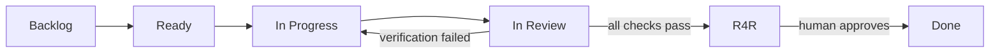
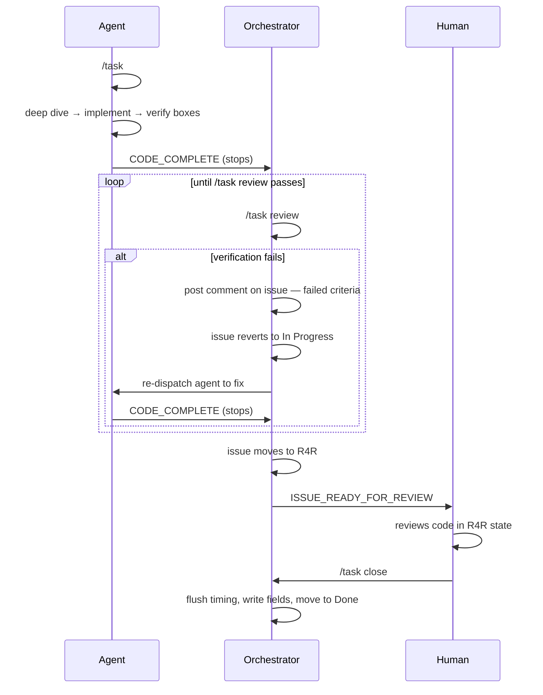

# AI Task Manager — Quickstart Guide

AI Task Manager (AITM) binds every AI coding session to a GitHub issue, tracks time and context automatically, and enforces a structured review workflow across human developers and AI agents. It is designed for teams using Claude Code, Codex, or any AI agent that can execute shell commands.

---

## What It Does

AITM has three layers:

| Layer | What it gives you |
|---|---|
| **Session Tracking** | Every agent session tied to a GitHub issue. Time and context words logged automatically to a timing comment on the issue. |
| **Backlog Orchestration** | Generate a full GitHub Projects backlog from a spec document — epics, sub-issues, sizing, sequencing, pickup directives, all in one pass. |
| **ROI Reporting** | Financial report comparing estimated effort against measured AI-engaged hours. Answers: *what did this actually cost vs. without AI?* |

---

## Install

```bash
# Add to your project
npx ai-task-manager install

# Connect to your GitHub Projects board (interactive)
npx ai-task-manager init

# Commit the generated config
git add .ai-task-manager/task-tracker.json .github/ISSUE_TEMPLATE/
git commit -m "chore: add ai-task-manager"
```

Prerequisites: Node.js 18+, GitHub CLI (`gh auth login`), `jq`.

---

## Kanban State Flow

Every issue on the board moves through these states. The transitions are enforced — you cannot skip or reverse them without the audited bypass.



| State | What it means | Who moves the issue here |
|---|---|---|
| **Backlog** | Created, not yet scheduled | Orchestrator at issue creation |
| **Ready** | Groomed, estimated, prioritized | Human or orchestrator |
| **In Progress** | Agent actively working | `/task #N` (agent) |
| **In Review** | Agent finished; verification running | `/task review` (orchestrator) |
| **R4R** | All checks passed; awaiting human approval | `/task review` on success (auto) |
| **Done** | Human approved and closed | `/task close` (human only) |

### State Gate Rules

- **In Progress → In Review**: triggered by orchestrator calling `/task review` after agent reports `CODE_COMPLETE`.
- **In Review → In Progress**: automatic revert if any unchecked boxes are found during verification. Orchestrator posts a comment on the issue, then re-dispatches the agent.
- **In Review → R4R**: automatic promotion when all verification gates pass.
- **R4R → Done**: human-only. No agent or automated signal can trigger this.
- **Epic R4R gate**: an epic cannot move to R4R until ALL its child issues are already in R4R.
- **Epic cascade close**: `/task close` on an epic closes all R4R children first (board move + GitHub close + fleet deregister), then closes the epic.

---

## Agent / Orchestrator / Human Boundaries



**Hard rules:**
- Agents MUST NOT call `/task review` or `/task close`.
- Orchestrators MUST NOT call `/task close`.
- `/task close` requires an explicit human instruction ("close #N", "mark #N done").

---

## Use Case Scenarios

### Scenario 1 — Developer Starts a Single Task

You have an open GitHub issue `#42` and want to work on it with Claude Code.

```
Developer:  /task #42
```

AITM:
1. Moves issue #42 to **In Progress** on the board
2. Displays the issue title, body, and Pickup Directive
3. Starts the timer — every minute of AI-engaged time is now logged

```
Developer:  [works with Claude for 90 minutes]
Developer:  /task close
```

AITM:
1. Flushes the timing log (appends a row to the ⏱ Timing Log comment on the issue)
2. Writes Engaged Time, Session Time, and Context Length to GitHub Projects fields
3. Moves the issue to **Done**

**Timing log on the issue:**
```
| Timestamp            | Event  | Active | Idle | Δ Words | Word Marker | Description |
| 2026-05-07 09:00 +00 | start  | 0      | 0    | 0       | 2,341       |             |
| 2026-05-07 10:32 +00 | close  | 87     | 5    | 3,204   | 5,545       |             |
```

---

### Scenario 2 — Building a Backlog from a Spec

You have a product spec in context and want to create the full GitHub backlog.

```
Developer:  /task plan
```

AITM opens an untracked planning bucket. You load your spec document.

```
Developer:  /task new
```

AITM prompts:
> "I see a spec in context — use it to build out the full backlog? I'll create all epics and sub-issues, set sizing/priority/sequence, and inject pickup directives across the entire plan — no stopping between epics. **yes / no**"

```
Developer:  yes
```

AITM automatically:
1. Creates labels (`plan:<slug>`, purpose labels like `backend`, `auth`, `data`)
2. Creates each **Epic** issue with full scope + acceptance criteria + Pickup Directive
3. Creates each **Sub-issue** linked to its parent epic
4. Sets Size, Estimate, Priority, and Sequence on every issue
5. Places all issues in **Backlog** on the board

**Result:** A fully structured GitHub Projects board, ready for agent fan-out.

```
Epic 1 — Auth System          [Backlog, P0, Seq:1]
  ├── #10 Registration flow   [Backlog, P0, M, Seq:1]
  ├── #11 Google OAuth        [Backlog, P0, M, Seq:2]
  └── #12 Session management  [Backlog, P1, S, Seq:2]

Epic 2 — Dashboard            [Backlog, P1, Seq:2]
  ├── #13 Data tables         [Backlog, P1, L, Seq:1]
  └── #14 Chart widgets       [Backlog, P1, M, Seq:2]
```

---

### Scenario 3 — Agent Works a Sub-Issue (with Orchestrator)

The orchestrator picks up Epic #10 and fans out sub-agent to issue #11.

**Orchestrator (picks up epic):**
```bash
/task #10                    # start epic timer
move-state.sh 10 in-progress # epic moves to In Progress
```

Orchestrator reads the Pickup Directive, validates sub-issue sequencing, posts dependency map, and fans out Sequence-1 issues.

**Agent (works #11):**
```bash
/task #11                    # start sub-issue timer, moves to In Progress
# ... runs deep dive, appends to issue body, checks Deep dive complete ...
# ... implements code, runs tests, checks each DoD/AC checkbox ...
```

Agent reports `CODE_COMPLETE` and stops.

**Orchestrator (receives CODE_COMPLETE):**
```bash
/task review #11             # moves to In Review → runs verification gate
```

**If verification fails** (exit 3):
- Orchestrator posts a comment on #11 listing the failed criteria
- Issue automatically reverts to In Progress
- Orchestrator re-dispatches the agent to fix

**If verification passes:**
- Issue moves to **R4R** automatically
- Orchestrator reports `ISSUE_READY_FOR_REVIEW` and notifies the developer

**Developer (reviews):**
- Inspects code in the R4R state
- Instructs: "close #11"
- AITM flushes timing, writes fields, moves to **Done**

---

### Scenario 4 — Epic Close with Cascade

All 3 sub-issues of Epic #10 are in R4R. Developer closes the epic.

```
Developer:  /task close #10
```

AITM:
1. Verifies all child issues (#11, #12, #13) are in R4R
2. For each R4R child:
   - Posts a `done` timing row to the child's timing log
   - Moves child to **Done** on the board
   - Closes the GitHub issue
   - Deregisters from fleet
3. Closes Epic #10: flushes timing, writes fields, moves to **Done**

If any child is not in R4R, the command refuses:
```
⛔ Cannot close epic #10 — 2 child issue(s) not in R4R:
   #12: in-progress
   #13: in-review
All sub-issues must reach R4R before the epic can close.
```

---

### Scenario 5 — Multi-Session Work (Pause and Resume)

You work for an hour, need to take a break, and return later.

```
# Before breaking
/task pause

# After returning (context still warm in same session)
/task resume

# Or in a fresh session
/task resume #42
```

Before `/clear` (which bypasses timing hooks), always pause first:
```
/task pause
/clear
```

To checkpoint without stopping:
```
/task update "finished auth middleware"
```

This flushes timing and resets word counters but keeps the task active.

---

### Scenario 6 — Parallel Agents Across Worktrees

Multiple agents working in parallel git worktrees, each on a different sub-issue.

**Orchestrator session:**
```bash
/task #10          # epic is the active task for the orchestrator
/task fleet        # shows all active tasks across worktrees
```

**Each agent session (separate worktrees):**
```bash
/task #11          # agent 1 works sub-issue 11
/task #12          # agent 2 works sub-issue 12
```

Fleet output:
```
Active tasks:
  #10   Epic: Auth System       [orchestrator]   12 min, 890 words
  #11   Registration flow       [worktree-11]    34 min, 2,340 words
  #12   Google OAuth            [worktree-12]    28 min, 1,876 words
```

---

## Spec Format

For backlog orchestration, your spec should follow this structure:

```markdown
**Sequencing key:** Same Sequence = parallel. Higher Sequence = blocked until all lower close.
**Epic execution order:** Epic 1 (Auth) → Epic 2 (Dashboard)

## Epic 1 — Auth System
**Priority:** P0 | **Size:** XL | **Estimate:** 18h | **Sequence:** 1

Build user authentication with email/password and Google OAuth.

### Acceptance Criteria
- [ ] Users can register with email and password
- [ ] Users can sign in with Google
- [ ] Sessions expire after 24 hours of inactivity

### E1-S1 — Registration flow
**Priority:** P0 | **Size:** M | **Estimate:** 4h | **Sequence:** 1 | **Model:** sonnet

#### Scope
Implement /register endpoint, bcrypt hashing, JWT issuance.

#### Acceptance Criteria
- [ ] POST /register returns 201 with signed JWT
- [ ] Duplicate email returns 409
- [ ] Password is never stored in plaintext

### E1-S2 — Google OAuth integration
**Priority:** P0 | **Size:** M | **Estimate:** 3h | **Sequence:** 2
**Depends on:** E1-S1 (JWT infrastructure)

#### Scope
Add Google OAuth 2.0 flow. Reuse JWT issuance from E1-S1.

#### Acceptance Criteria
- [ ] /auth/google redirects to Google consent screen
- [ ] Callback creates or logs in user, returns JWT
```

Key fields on each issue:
- `**Priority:**` P0 / P1 / P2
- `**Size:**` XS / S / M / L / XL
- `**Estimate:**` hours
- `**Sequence:**` integer (same = parallel, higher = blocked)
- `**Model:**` optional — which AI model to use when fanning out

---

## The Pickup Directive

Every issue created from a spec gets a self-contained pickup block injected automatically:

```markdown
### Definition of Done
- [ ] Acceptance criteria met (including test additions from deep dive)
- [ ] Tests pass; new coverage committed
- [ ] Pre-commit hooks pass
- [ ] Issue body checkboxes ticked

## Pickup Directive — MANDATORY, DO NOT SKIP
> Follow: `.ai-task-manager/pickup-directive.md`

- [ ] Deep dive complete
```

When any agent — after a context reset, machine switch, or handoff — picks up the issue, it runs the deep-dive analysis first and appends it to the issue body before writing a single line of code. The deep dive includes:

- Files to edit (full repo-relative paths)
- Step-by-step implementation plan
- Test additions with verification commands as enforceable checkboxes
- Risk identification
- Dependency map

Once `Deep dive complete` is checked, every subsequent pickup skips straight to implementation.

---

## Verification Loop

```mermaid
flowchart TD
    A([Agent checks all DoD and AC boxes]) --> B[reports CODE_COMPLETE]
    B --> C[Orchestrator calls /task review #N]
    C --> D{pass?}

    D -->|FAIL| E[Post comment — failed criteria list]
    E --> F[Issue reverts to In Progress]
    F --> G[Orchestrator re-dispatches agent]
    G --> A

    D -->|PASS| H[Issue moves to R4R]
    H --> I[Orchestrator notifies human]
    I --> J[Human reviews code in R4R state]
    J --> K[/task close]
    K --> L([Done])
```

---

## Key Commands Reference

| Command | Who runs it | What it does |
|---|---|---|
| `/task #N` | Agent | Switch to issue, move to In Progress, display brief |
| `/task new` | Human/Agent | Create issue (or orchestrate full backlog from spec) |
| `/task plan` | Human | Open untracked planning bucket |
| `/task update` | Agent | Checkpoint — flush timing, keep task active |
| `/task pause` | Agent | Flush timing, keep last-active. Run before `/clear`. |
| `/task resume #N` | Agent | Resume a paused task |
| `/task check "<label>"` | Agent | Check off a DoD/AC checkbox |
| `/task review #N` | Orchestrator | Move to In Review, verify gates, promote to R4R or revert |
| `/task fleet` | Orchestrator | Show all active tasks across worktrees |
| `/task close` | Human | Flush, write fields, move to Done. Explicit instruction only. |
| `/task log #N` | Human/Agent | Re-compute and write board fields for any issue |
| `/task config` | Human | Show or set configuration values |

---

## ROI Report

After a sprint or project:

```bash
# HTML report
npx github-project-report --html

# Closed issues only, this quarter
npx github-project-report --html --state closed --from 2026-01-01 --to 2026-03-31
```

The report compares **Estimate** (pre-work hours) against **Engaged Hours** (measured AI session minutes + human review time) and produces a cost comparison across engineering roles and US regions:

```
Estimated effort:       82 hours   →  $14,760  (solo senior, national avg)
AI-assisted actual:     11 hours   →     $990
Acceleration ratio:     7.5×
Human leverage:        18.2×
```

Full methodology: [docs/guides/ai-value-framework.md](guides/ai-value-framework.md)

---

## Configuration

```bash
/task config init          # interactive interview
/task config repo org/repo # set repo directly
/task config assignee @me  # who new issues are assigned to
```

Config lives in `.ai-task-manager/task-tracker.json` (project, committed) and `~/.ai-task-manager/task-tracker-config.json` (user, personal).

---

## Design References

| Document | Contents |
|---|---|
| [DESIGN.md](DESIGN.md) | Full data model, state file format, timing structure, hook behavior |
| [guides/workflow.md](guides/workflow.md) | Kanban, estimates, cleanup procedure |
| [guides/ai-value-framework.md](guides/ai-value-framework.md) | ROI methodology |
| [guides/settings-guide.md](guides/settings-guide.md) | Recommended Claude Code settings |
