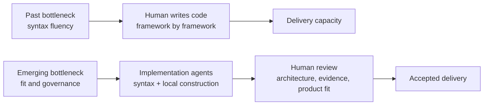
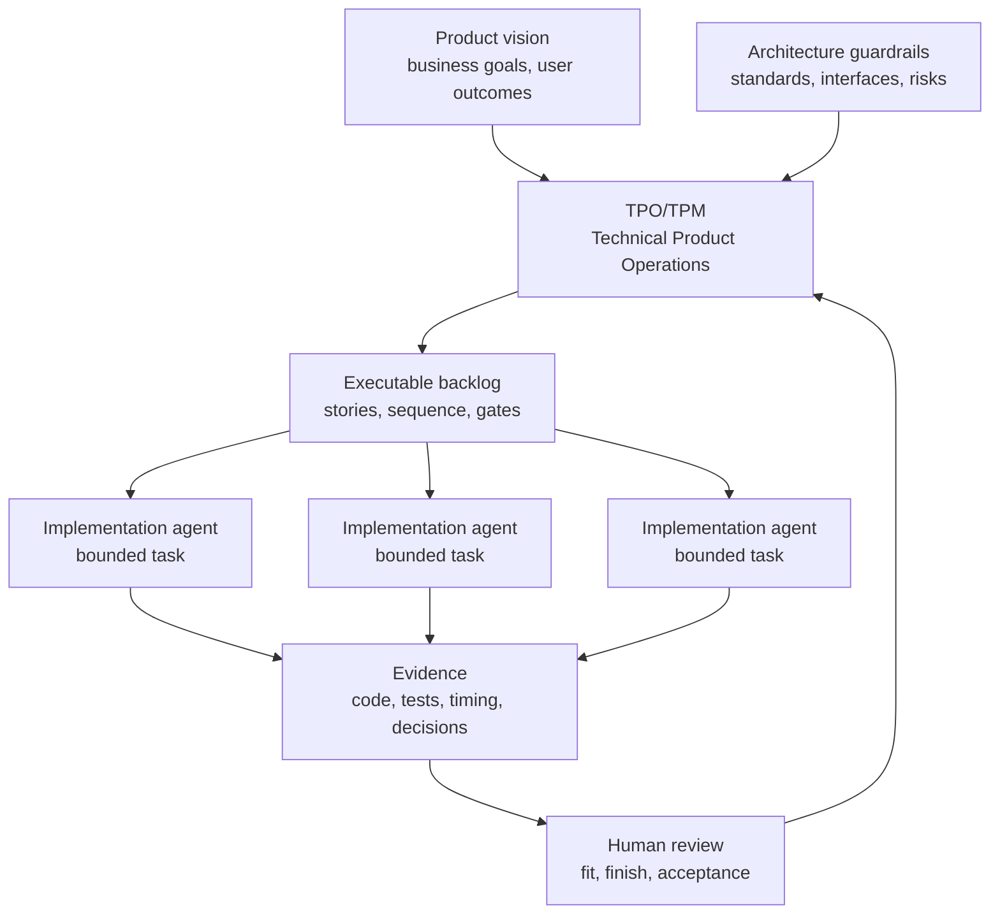

# The Rise Of Technical Product Operations

<!-- markdownlint-disable MD034 -->

## Series Roadmap

| Status      | #      | Article                                                                                    | Role In Series                                |
| ----------- | ------ | ------------------------------------------------------------------------------------------ | --------------------------------------------- |
| **Current** | **00** | **[The Rise Of Technical Product Operations](00-technical-product-operations.md)**         | Industry thesis: Technical Product Operations |
|             | 01     | [The Vibe Coding Hangover](01-vibe-coding-hangover.md)                                     | Failure mode: vibe slop and review debt       |
|             | 02     | [Spec-Driven Development Is Necessary But Not Sufficient](02-spec-driven-is-not-enough.md) | Why specs need execution governance           |
|             | 03     | [The Rise Of The Technical Product Owner](03-technical-product-owner.md)                   | Human operator: TPO/TPM as delivery architect |
|             | 04     | [The Backlog Becomes The Control Plane](04-backlog-as-control-plane.md)                    | Backlog as executable control surface         |
|             | 05     | [The Just-In-Time Planner](05-just-in-time-planner.md)                                     | Progressive decomposition and deep dives      |
|             | 06     | [Context Durability Is A Feature](06-context-durability.md)                                | JIT loading and post-compaction recovery      |
|             | 07     | [Evidence Beats Trust](07-evidence-beats-trust.md)                                         | Evidence gates and auditability               |
|             | 08     | [The Adapter Future](08-adapter-future.md)                                                 | Backlog and agent platform adapters           |

The future software team may not be organized around who writes the most code. It may be organized around who can safely accept the most agent-produced code.

That sounds backward only if we assume code production remains the scarce part of software delivery. For most of the industry's history, that assumption was reasonable. A team needed people who knew the programming language, the framework, the build system, the test conventions, and the local architecture. Syntax fluency was delivery capacity.

Agentic AI is changing that equation.

Implementation agents can already move across languages, frameworks, file layouts, and test conventions faster than most humans can retool. They can inspect a repository, mimic its patterns, draft code, run tests, respond to failures, and produce a plausible implementation. They are not perfect, but they are good enough to shift the bottleneck.

The harder problem is no longer simply "who can write the code?"

The harder problem is:

- who defines the intent clearly enough,
- who decomposes it into safe work,
- who decides what should run first,
- who prevents parallel agents from colliding,
- who knows when the result fits the product,
- who decides whether the evidence is strong enough,
- who can tell the difference between useful acceleration and expensive slop?

That is the emerging discipline I am calling **Technical Product Operations**.

Technical Product Operations is the discipline of turning product intent, architecture guardrails, and delivery risk into an executable backlog that implementation agents can safely act on.

It is not prompt engineering with a better title. It is not project management with AI vocabulary. It is not product management replacing engineering. It is the coordination layer that lets product vision, architecture, backlog governance, implementation agents, and evidence review operate as one delivery system.

## The Syntax Inversion

Software organizations have spent decades building abstractions to help humans reason about code.

Frameworks, managed runtimes, scaffolding tools, design systems, ORMs, dependency injection containers, build pipelines, and service templates all help humans manage complexity. Some abstractions improve correctness and maintainability. Some exist because raw platform code is tedious. Some exist because a team would rather standardize on one familiar structure than ask every developer to reason from first principles.

Those abstractions will not disappear overnight. But their center of gravity is changing.

When implementation agents become competent syntax operators, syntax becomes cheaper. They can learn the local project faster than a newly assigned human. They can operate in React, Angular, Go, Rust, Swift, Kotlin, Java, Python, or a project-specific internal framework without needing a multi-week ramp. They can follow lint rules, infer file conventions, copy testing patterns, and adjust to compiler or test failures.

That creates a syntax inversion:

The question becomes less "which framework lets humans type this fastest?" and more "which technical foundation best fits this product's performance, operational, security, maintainability, and deployment needs?"

That is a very different conversation.

It means teams may care less about whether one developer personally knows every API in a framework. They may care more about whether the architecture exposes stable boundaries, whether services can be verified independently, whether generated changes are reviewable, and whether the chosen technology gives the product the right long-term shape.

It also opens an uncomfortable possibility for the last twenty years of framework debate: some abstractions were selected because they made humans faster, not because they made the product better. As implementation agents reduce the human cost of lower-level construction, teams may choose thinner internal frameworks, more native platform code, or more specialized utilities instead of hauling in large kitchen-sink frameworks where only a fraction of the surface area is used.

This is not a claim that framework choices no longer matter. They still matter. But the reason they matter shifts. Framework choice becomes less about human memorization and more about product fit, operational cost, security surface, testability, and long-term control.

## Why SDLC And Agile Matter More

Agentic AI does not make SDLC and agile practices obsolete. It makes the useful parts more load-bearing.

When one human developer works on one feature, ambiguity can be handled informally. The developer asks a question. They remember a decision from last month. They infer a missing dependency. They notice a ticket is too broad and push back.

When a fleet of implementation agents works from vague prompts, ambiguity multiplies.

Each agent can make a different plausible choice. Each one can generate code that looks reasonable in isolation. Each one can bury assumptions in a branch. Each one can produce a confident explanation that sounds more complete than it is. The result may be a lot of code and very little acceptance confidence.

This is why the boring parts of delivery become strategic:

- Work breakdown structures prevent giant prompts from becoming giant failures.
- Backlog refinement turns intent into executable slices.
- Acceptance criteria define what the agent must prove.
- Dependency sequencing prevents parallel agents from colliding.
- Review gates prevent generated code from becoming accepted code too early.
- Timing and context records show the human supervision cost.
- Audit trails preserve why work changed, paused, failed, or pivoted.

These are not ceremonies. They are the operating system for agentic delivery.

The teams that win with AI will not be the teams that simply let agents generate the most code. They will be the teams that build the best system for accepting, rejecting, steering, and learning from AI-generated work.

## The New Human Role

The Technical Product Owner or Technical Product Manager becomes a delivery architect.

That role sits between product intent and implementation execution. It requires more technical depth than traditional status-oriented project management, but it does not require the person to personally write every line of code.

The TPO/TPM operating this system needs to answer questions like:

- What is the product trying to become?
- Which work matters first?
- Which parts are architectural load-bearing decisions?
- Which parts can be delegated to implementation agents?
- What should be decomposed now, and what should wait?
- Which stories can run in parallel?
- Which stories share files, interfaces, or migration paths?
- What evidence proves that a story is complete?
- When does a defect become a separate task?
- When should the plan pivot because the codebase revealed a better path?

Engineering leaders still own architecture standards, production readiness, security posture, and code quality expectations. The TPO/TPM does not replace that responsibility. The TPO/TPM makes those expectations operational in the backlog.

That distinction matters. The future role is not "product manager as amateur engineer." It is product-facing delivery architecture: turning vision, constraints, and risk into a work system implementation agents can execute without losing the plot.

## The Operating Model

The model looks less like a single developer receiving a prompt and more like an evidence-driven delivery system.

The important detail is the feedback loop. Agents do not disappear into a black box and return "done." They return evidence. That evidence informs review. Review informs backlog sequencing. Backlog sequencing keeps the next wave of agent work aligned with the current state of the product and codebase.

This is where the product role becomes more technical. If the backlog becomes executable, backlog quality becomes delivery quality.

## Failure Mode: Vibe Slop

The industry already has a name for unmanaged AI output: vibe slop.

The term is harsh, but the review experience is real. Vibe slop is code that appears to satisfy the prompt, but becomes expensive when someone has to maintain, secure, test, extend, or explain it.

The key distinction is this:

> Vibe slop is not caused by AI writing code. It is caused by AI writing code outside a governed delivery system.

This is why "better prompts" are not enough. A prompt can describe what the user wants. It cannot, by itself, maintain dependency order, enforce review gates, preserve evidence, manage blocked work, recover from context compaction, or decide when a discovered defect deserves its own story.

The answer is not to reject AI coding. The answer is to stop treating code generation as the whole job.

## AITM And The Backlog Manager Pattern

In this series, **AITM** means `@kburson/ai-task-manager`: an AI skill and npm package that currently supports GitHub-backed task workflows with Claude Code and Codex.

That clarification matters because "AI task manager" is also a generic phrase, and there are unrelated npm packages and projects using similar names. This series is about the `@kburson/ai-task-manager` project and the delivery pattern it explores.

AITM provides a concrete operating model for Technical Product Operations.

The pattern is story-governed delivery:

1. Start with product or feature intent.
2. Decompose it into epics, stories, and atomic product backlog items.
3. Stack-rank the backlog by priority, size, and dependency order.
4. Delay detailed planning until the smallest useful item is ready to execute.
5. Require a current-code deep dive before implementation.
6. Bind each agent session to one issue.
7. Move work through state gates.
8. Require verification evidence before review.
9. Preserve timing, context, decisions, defects, pivots, and approvals.

The current implementation uses GitHub Projects because GitHub provides issues, project fields, sub-issues, comments, pull requests, and API access in one practical surface. But the pattern is not GitHub-specific.

The deeper idea is the **Backlog Manager Pattern**: use the backlog as the durable control plane for agentic execution. The chat window is not the system of record. The backlog item is.

That backlog item carries intent, scope, dependency order, acceptance criteria, state, evidence, review status, and recovery context. The implementation agent works inside that boundary. The human operator reviews the evidence and decides whether the result fits.

## Practical Takeaway

If you are a product manager, project manager, TPO, TPM, or engineering leader, the question is not whether AI can write code. It can.

The useful question is whether your delivery system can answer:

- What work was the agent supposed to do?
- Why was that work next?
- What assumptions did the agent make?
- What tests or checks prove the result?
- What changed when the codebase disagreed with the plan?
- Who accepted the result, and based on what evidence?

If those answers live only in a chat transcript, the process is fragile.

If those answers live in the backlog, in gates, in evidence records, and in review decisions, agentic AI becomes governable.

That is the promise of Technical Product Operations. Not more prompt craft. Not less engineering. A better operating model for a world where code construction is increasingly automated and acceptance judgment becomes the scarce resource.

## Series Link

This flagship article states the industry thesis. The next article, [The Vibe Coding Hangover](01-vibe-coding-hangover.md), starts the proof chain by examining the failure mode that appears when AI-generated code is produced faster than teams can govern it.

## LinkedIn Article Shape

Opening hook:

> The future software team may not be organized around who writes the most code. It may be organized around who can safely accept the most agent-produced code.

Middle:

- Explain the syntax inversion.
- Argue that SDLC and agile practices become more important under agentic AI.
- Define Technical Product Operations and the TPO/TPM as delivery architect.
- Introduce vibe slop as the unmanaged failure mode.
- Define AITM as `@kburson/ai-task-manager`.
- Position it as a concrete story-governed delivery pattern.

Close:

> The winning teams will not be the ones that let AI write the most code. They will be the ones that build the best operating model for accepting, rejecting, and steering AI-written code.

## Bibliography

- GitHub. "GitHub Spec Kit." https://github.com/github/spec-kit
- GitHub Blog. "Spec-driven development with AI." https://github.blog/ai-and-ml/generative-ai/spec-driven-development-with-ai-get-started-with-a-new-open-source-toolkit/
- Atlassian. "Spec Driven Development with Rovo Dev." https://www.atlassian.com/blog/development/spec-driven-development-with-rovo-dev
- Atlassian. "What is backlog refinement?" https://www.atlassian.com/agile/scrum/backlog-refinement
- Project Management Institute. "Applying work breakdown structure to the project lifecycle." https://www.pmi.org/learning/library/applying-work-breakdown-structure-project-lifecycle-6979
- DORA. "State of AI-assisted Software Development 2025." https://dora.dev/dora-report-2025/
- METR. "Measuring the Impact of Early-2025 AI on Experienced Open-Source Developer Productivity." https://metr.org/blog/2025-07-10-early-2025-ai-experienced-os-dev-study/
- Stack Overflow. "2025 Developer Survey: AI." https://survey.stackoverflow.co/2025/ai
- The Wall Street Journal. "The AI Superstars Who Say a 'Vibe Slop' Crisis Is Coming." https://www.wsj.com/tech/ai/vibe-coding-slop-ai-tools-e6a99394
- AI Task Manager. "Agentic Development Process." ../introduction/agentic-development-process.md
- AI Task Manager. "Core Workflow." ../introduction/core-workflow.md
- AI Task Manager. "Measurement and ROI." ../introduction/measurement-and-roi.md
