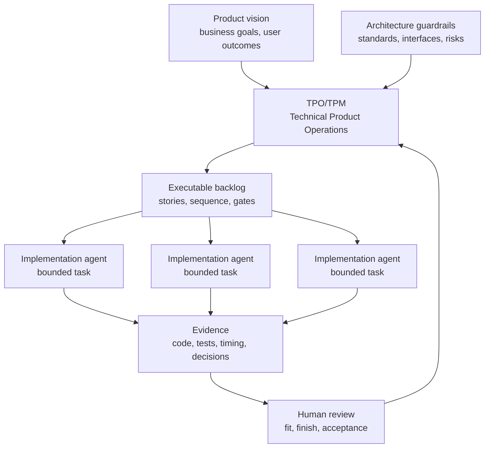

# The Rise Of Technical Product Operations

<!-- markdownlint-disable MD034 -->

[Series](README.md) | Previous: [Research Synopsis](research-synopsis.md) | Next: [The Vibe Coding Hangover](01-vibe-coding-hangover.md)

## Draft Thesis

The future software team may not be organized around who writes the most code. It may be organized around who can govern the most agent-produced code safely.

As implementation agents take over more code construction, the scarce human skill becomes the ability to define product intent, shape architecture, decompose work, sequence dependencies, govern evidence, and decide whether the result fits.

That is Technical Product Operations: the product-facing discipline of operating an agentic delivery system.

## Core Argument

For decades, software organizations invested heavily in abstractions that helped humans reason about code: frameworks, libraries, managed runtimes, scaffolding systems, conventions, and architectural patterns. Those abstractions still matter, but their center of gravity is changing.

AI agents are becoming increasingly capable syntax operators. They can move across languages, frameworks, file layouts, and test conventions faster than most humans can retool. That does not make engineering easier in every sense. It moves the bottleneck.

The hard work shifts from:

- remembering framework APIs,
- producing boilerplate,
- managing local syntax,
- wiring repetitive structure,
- drafting tests from known patterns,

to:

- defining product fit,
- shaping architecture,
- choosing boundaries,
- decomposing work,
- sequencing dependencies,
- controlling risk,
- verifying evidence,
- deciding when generated work is good enough to accept.

This is not the end of engineering. It is a shift in where engineering judgment concentrates.

## The Syntax Inversion

Software teams used to treat syntax fluency as a major component of delivery capacity. The person who knew React, Angular, Spring Boot, Go, Rust, Swift, Kotlin, or a cloud SDK could move faster than the person who had to look everything up.

Implementation agents weaken that advantage. They can become near-instant syntax specialists for the local project. They can inspect the repository, mimic conventions, produce code in the language already in use, and adjust to test failures.

That creates a syntax inversion:

> Syntax becomes cheaper. Intent, architecture, verification, and fit become more expensive.

In that world, language and framework debates do not disappear, but they change. The question becomes less "which framework is easiest for humans to type?" and more "which technical foundation best fits this product's performance, operational, security, maintainability, and deployment needs?"

If agents reduce the cost of lower-level implementation, teams may choose more specialized foundations. They may write thinner internal frameworks. They may prefer native platforms or lower-level services when those choices improve product fit. The old justification for large kitchen-sink frameworks weakens when the main reason for using them was to help humans produce familiar structure quickly.

This is a pressure vector, not a completed transition. But it is the direction worth preparing for.

## Why SDLC And Agile Matter More

Agentic AI does not eliminate SDLC and agile disciplines. It makes them more load-bearing.

When one human writes one feature, ambiguity is often handled through informal judgment. The developer asks a question, infers a missing detail, or remembers a prior architectural decision.

When a fleet of implementation agents works from vague prompts, ambiguity multiplies. Each agent can make a different plausible choice. Each one can produce confident output. Each one can leave the team with review debt.

That is why familiar practices become more important:

- Work breakdown structures prevent giant prompts from becoming giant failures.
- Backlog refinement turns intent into executable slices.
- Acceptance criteria define what the agent must prove.
- Dependency sequencing prevents parallel agents from colliding.
- Review gates prevent generated code from becoming accepted code too early.
- Audit trails preserve why work changed, paused, failed, or pivoted.

These are not ceremonial controls. They are the operating system for agentic delivery.

## The New Human Role

The Technical Product Owner or Technical Product Manager becomes a delivery architect.

That role is not a project administrator and not a prompt typist. It is the person who can translate product vision into a governed execution system:

- What is the product trying to become?
- Which work matters first?
- What should be decomposed now, and what should wait?
- Which stories can run in parallel?
- Which work requires architectural review before implementation?
- Which evidence proves the agent did the right thing?
- When does a defect become a separate task?
- When should the plan pivot because the codebase revealed a better path?

Engineering leaders still own architecture standards, security posture, production readiness, and code quality expectations. The TPO/TPM makes those expectations operational in the backlog.

That is the role shift: product ownership becomes more technical because the backlog becomes executable.

## Failure Mode: Vibe Slop

The industry already has a name for unmanaged AI output: vibe slop.

The term is harsh, but the review experience is real. Vibe slop is code that appears to satisfy the prompt, but becomes expensive when someone has to maintain, secure, test, extend, or explain it.

The key distinction is this:

> Vibe slop is not caused by AI writing code. It is caused by AI writing code outside a governed delivery system.

The answer is not to reject AI coding. The answer is to stop treating code generation as the whole job.

## AITM And The Backlog Manager Pattern

This article series uses **AITM** to mean `@kburson/ai-task-manager`: an AI skill and npm package that currently supports GitHub-backed task workflows with Claude Code and Codex.

That clarification matters because "AI task manager" is also a generic phrase, and there are unrelated npm packages and projects using similar names. This series is about the `@kburson/ai-task-manager` project and the delivery pattern it explores.

`@kburson/ai-task-manager` provides a concrete operating model for this shift.

The pattern is story-governed delivery:

1. Start with product or feature intent.
2. Decompose it into epics, stories, and atomic product backlog items.
3. Stack-rank the backlog by priority, size, and dependency order.
4. Delay detailed planning until the smallest useful item is ready to execute.
5. Require a current-code deep dive before implementation.
6. Bind each agent session to one issue.
7. Move work through state gates.
8. Require verification evidence before review.
9. Preserve timing, context, decisions, defects, pivots, and approvals.

AITM's point is not that every team must use GitHub Projects. The deeper point is that agentic software delivery needs a durable control plane outside the chat window.

## Operating Model

## Series Link

This flagship article states the industry thesis. The next article, [The Vibe Coding Hangover](01-vibe-coding-hangover.md), starts the proof chain by examining the failure mode that appears when AI-generated code is produced faster than teams can govern it.

## LinkedIn Article Shape

Opening hook:

> The future software team may not be organized around who writes the most code. It may be organized around who can safely accept the most agent-produced code.

Middle:

- Explain the syntax inversion.
- Argue that SDLC and agile practices become more important under agentic AI.
- Define Technical Product Operations and the TPO/TPM as delivery architect.
- Introduce vibe slop as the unmanaged failure mode.
- Define AITM as `@kburson/ai-task-manager`.
- Position it as a concrete story-governed delivery pattern.

Close:

> The winning teams will not be the ones that let AI write the most code. They will be the ones that build the best operating model for accepting, rejecting, and steering AI-written code.

## Bibliography

- GitHub. "GitHub Spec Kit." https://github.com/github/spec-kit
- GitHub Blog. "Spec-driven development with AI." https://github.blog/ai-and-ml/generative-ai/spec-driven-development-with-ai-get-started-with-a-new-open-source-toolkit/
- Atlassian. "Spec Driven Development with Rovo Dev." https://www.atlassian.com/blog/development/spec-driven-development-with-rovo-dev
- Atlassian. "What is backlog refinement?" https://www.atlassian.com/agile/scrum/backlog-refinement
- Project Management Institute. "Applying work breakdown structure to the project lifecycle." https://www.pmi.org/learning/library/applying-work-breakdown-structure-project-lifecycle-6979
- DORA. "State of AI-assisted Software Development 2025." https://dora.dev/dora-report-2025/
- METR. "Measuring the Impact of Early-2025 AI on Experienced Open-Source Developer Productivity." https://metr.org/blog/2025-07-10-early-2025-ai-experienced-os-dev-study/
- Stack Overflow. "2025 Developer Survey: AI." https://survey.stackoverflow.co/2025/ai
- The Wall Street Journal. "The AI Superstars Who Say a 'Vibe Slop' Crisis Is Coming." https://www.wsj.com/tech/ai/vibe-coding-slop-ai-tools-e6a99394
- AI Task Manager. "Agentic Development Process." ../introduction/agentic-development-process.md
- AI Task Manager. "Core Workflow." ../introduction/core-workflow.md
- AI Task Manager. "Measurement and ROI." ../introduction/measurement-and-roi.md
