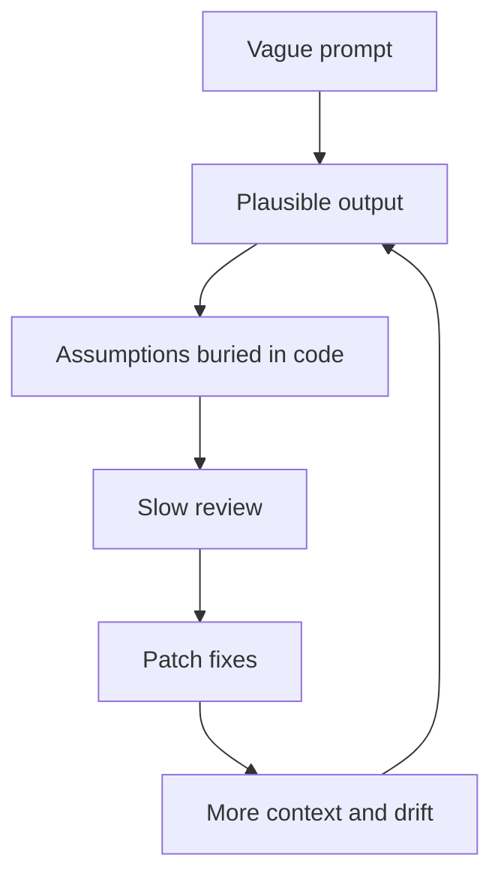
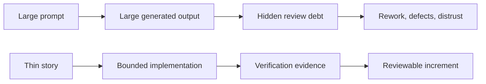

# The Vibe Coding Hangover

<!-- markdownlint-disable MD034 -->

## Series Roadmap

| Status      | #      | Article                                                                                    | Role In Series                                |
| ----------- | ------ | ------------------------------------------------------------------------------------------ | --------------------------------------------- |
|             | 00     | [The Rise Of Technical Product Operations](00-technical-product-operations.md)             | Industry thesis: Technical Product Operations |
| **Current** | **01** | **[The Vibe Coding Hangover](01-vibe-coding-hangover.md)**                                 | Failure mode: vibe slop and review debt       |
|             | 02     | [Spec-Driven Development Is Necessary But Not Sufficient](02-spec-driven-is-not-enough.md) | Why specs need execution governance           |
|             | 03     | [The Rise Of The Technical Product Owner](03-technical-product-owner.md)                   | Human operator: TPO/TPM as delivery architect |
|             | 04     | [The Backlog Becomes The Control Plane](04-backlog-as-control-plane.md)                    | Backlog as executable control surface         |
|             | 05     | [The Just-In-Time Planner](05-just-in-time-planner.md)                                     | Progressive decomposition and deep dives      |
|             | 06     | [Context Durability Is A Feature](06-context-durability.md)                                | JIT loading and post-compaction recovery      |
|             | 07     | [Evidence Beats Trust](07-evidence-beats-trust.md)                                         | Evidence gates and auditability               |
|             | 08     | [The Adapter Future](08-adapter-future.md)                                                 | Backlog and agent platform adapters           |

We spent the first wave of AI coding asking the wrong question.

The question was: how much can the agent build?

The better question is: how much can the team safely accept?

That distinction is the hangover. AI can generate code quickly. It can produce entire features, migration scripts, test suites, UI components, API handlers, and documentation in a single burst. The output can look confident. It can look complete. It can even pass a few local checks.

But software delivery does not end when code appears. Someone still has to decide whether the generated work is correct, maintainable, secure, aligned with architecture, aligned with product intent, and safe to extend later.

When that review burden is invisible, AI looks more productive than it really is.

## What "Vibe Slop" Is Actually Naming

The harsher industry term is **vibe slop**.

It is denigrative, but it stuck because it names a real experience: AI-generated code that looks shippable at the surface, but becomes expensive once someone has to maintain, secure, test, extend, or explain it.

Vibe slop is not always obviously bad code. That is why it is dangerous. It may compile. It may follow the broad shape of the prompt. It may include plausible abstractions and confident comments. The problem is that the work was generated faster than it was understood.

The term joins two anxieties:

- **Vibe coding:** describing the desired behavior and letting the model improvise the implementation.
- **AI slop:** low-effort generated output produced at scale.

Together, they describe a failure mode where generation outruns governance.

That matters because the answer is not "stop using AI." The answer is to stop treating code generation as the whole delivery system.

> Vibe slop is not caused by AI writing code. It is caused by AI writing code outside a governed delivery system.

## The Hidden Review Debt Loop

The failure pattern is familiar.

A product person or engineer gives an agent a broad prompt: build the feature, refactor the subsystem, add the workflow, generate the service, fix the UI. The agent produces a large result. The result looks plausible enough that the team wants to believe the work is nearly done.

Then review starts.

The reviewer has to reconstruct the intent. They have to compare the implementation against unstated assumptions. They have to check whether the agent respected local architecture, whether it created duplicated logic, whether it skipped edge cases, whether tests assert meaningful behavior, and whether the explanation matches the actual diff.

If the review uncovers problems, the team usually asks the agent to patch them. That adds more context, more diffs, more explanation, and more assumptions to inspect.

The loop looks like this:

This is review debt. It is not always visible on a dashboard. It does not show up if the only metric is "lines generated" or "minutes until first working demo." It appears later as rework, reviewer fatigue, shallow approvals, unexplained architecture drift, and defects that should have been prevented by a smaller work boundary.

## The Evidence Is Already Complicated

The public evidence does not support a simple "AI coding works" or "AI coding fails" story.

It supports a more useful one: AI coding amplifies the delivery system around it.

METR's 2025 randomized study found experienced open-source developers took longer on selected mature-repository tasks when AI tools were available, even though they expected to be faster. Stack Overflow's 2025 survey showed strong AI tool adoption alongside low trust in AI output accuracy. GitClear's code-quality research raised concerns about churn, duplication, and copy/paste patterns in AI-assisted code. OWASP's LLM guidance highlights risks such as prompt injection, insecure output handling, and excessive agency.

None of that means AI coding is a dead end.

It means unmanaged AI coding is not automatically productivity.

The harder lesson is that generation speed and delivery speed are different. A team can generate code quickly and still move slowly if acceptance requires extensive human reconstruction. A team can produce a demo quickly and still accumulate maintainability debt. A team can reduce typing time while increasing review time.

That is the hangover: speed at the keyboard becomes friction at the gate.

## Why Classic Delivery Practices Come Back Stronger

This is where the older disciplines become more important, not less.

Work breakdown structures, backlog refinement, acceptance criteria, dependency mapping, test gates, review gates, and audit trails can sound bureaucratic when humans are moving slowly. Under agentic AI, they become control surfaces.

An implementation agent is useful inside a narrow, explicit work boundary. It can inspect code, make local changes, run tests, and report evidence. But if the boundary is vague, the agent fills the gaps. It may fill them well. It may fill them badly. Either way, the reviewer inherits the cost of discovering which assumptions were made.

The solution is not to write larger prompts. Larger prompts often create a larger surface area for drift.

The solution is to change the unit of work.

Instead of asking an agent to "build the feature," the delivery system should ask:

- What is the smallest valuable slice?
- What acceptance criteria define success?
- What files or boundaries are likely involved?
- What dependencies block this work?
- What tests or checks will prove the result?
- What should happen if the work discovers a defect?
- What evidence must remain after the agent stops?

Those questions turn AI coding from a generation event into a governed workflow.

## From Vibe Coding To Story-Governed Delivery

The alternative to vibe slop is not manual coding nostalgia. It is story-governed delivery.

The key change is that the backlog item becomes the work contract.

A thin story gives the implementation agent a bounded objective. Acceptance criteria define what matters. Dependencies define what must already be true. Verification commands define what evidence must exist. Review gates define when generated work is ready for human judgment.

This does not make agents less useful. It makes them more usable.

An agent that receives a giant prompt has to infer the work system. An agent that receives a governed story can operate inside the work system.

## AITM And The Backlog Manager Pattern

In this series, **AITM** means `@kburson/ai-task-manager`: an AI skill and npm package that currently supports GitHub-backed task workflows with Claude Code and Codex.

AITM starts from a simple premise: do not hand the agent a giant wish. Hand it a governed work item.

The work item should carry:

- a narrow outcome,
- acceptance criteria,
- relevant context and dependencies,
- a defined workflow state,
- entry and exit gates,
- required verification evidence,
- a way to pause, pivot, switch, or demote when reality changes.

That turns the backlog into a control plane. The implementation agent does not merely generate code into a chat. It works against a durable issue, moves through states, leaves evidence, and stops at review.

The human role also changes. The TPO/TPM is not merely writing prompts. They are shaping the work system. Implementation agents work inside bounded assignments; the TPO/TPM preserves product vision, architectural intent, dependency order, and review discipline.

## Warning Signs For TPOs And TPMs

If you are trying to adopt agentic AI, watch for these signals:

- Agents regularly receive prompts that describe whole features instead of thin stories.
- Reviewers have to reconstruct acceptance criteria after the code is written.
- Generated tests exist, but nobody knows which product behavior they prove.
- Agents patch defects inside the current task instead of creating explicit discovered work.
- Review discussions happen mostly in chat and are not reflected in the backlog.
- The team measures generation speed but not review burden.
- The agent says "done" before evidence exists outside the chat.

These are not signs that AI is useless. They are signs that the delivery system is under-specified.

## Practical Takeaway

The first AI coding maturity step is not buying a better model. It is reducing the size and ambiguity of the work you give the model.

Before asking an implementation agent to build, ask whether the backlog item is small enough, clear enough, sequenced enough, and verifiable enough that a reviewer can safely accept or reject the result.

If the answer is no, the team is not doing agentic delivery. It is generating review debt.

The future is not less product management. It is product management with sharper technical boundaries, clearer acceptance criteria, and evidence trails strong enough for agentic work.

## Series Link

This article establishes the failure mode. The next article, [Spec-Driven Development Is Necessary But Not Sufficient](02-spec-driven-is-not-enough.md), explains why specifications improve the situation but still need story-level execution governance.

## LinkedIn Article Shape

Opening hook:

> We spent the first wave of AI coding asking, "How much can the agent build?" The better question is, "How much can the team safely accept?"

Middle:

- Define vibe slop as generated output outside governance.
- Explain hidden review debt.
- Summarize the productivity/trust/quality evidence.
- Introduce story-governed delivery as the missing control loop.
- Position AITM as a concrete Backlog Manager Pattern implementation.

Close:

> The future is not less product management. It is product management with sharper technical boundaries, clearer acceptance criteria, and evidence trails strong enough for agentic work.

## Bibliography

- METR. "Measuring the Impact of Early-2025 AI on Experienced Open-Source Developer Productivity." https://metr.org/blog/2025-07-10-early-2025-ai-experienced-os-dev-study/
- Becker, Joel; Rush, Nate; Barnes, Elizabeth; Rein, David. "Measuring the Impact of Early-2025 AI on Experienced Open-Source Developer Productivity." https://arxiv.org/abs/2507.09089
- Stack Overflow. "2025 Developer Survey: AI." https://survey.stackoverflow.co/2025/ai
- Stack Overflow. "Stack Overflow's 2025 Developer Survey Reveals Trust in AI at an All-Time Low." https://stackoverflow.co/company/press/archive/stack-overflow-2025-developer-survey/
- GitClear. "AI Assistant Code Quality 2025." https://www.gitclear.com/ai_assistant_code_quality_2025_research
- The Wall Street Journal. "The AI Superstars Who Say a 'Vibe Slop' Crisis Is Coming." https://www.wsj.com/tech/ai/vibe-coding-slop-ai-tools-e6a99394
- The New Stack. "Vibe slop is the symptom. Context debt is the disease." https://thenewstack.io/vibe-coding-context-debt/
- testRigor. "What Is 'Vibe Slopping'? The Hidden Risk Behind AI-Powered Coding." https://testrigor.com/blog/what-is-vibe-slopping/
- OWASP. "Top 10 for Large Language Model Applications." https://owasp.org/www-project-top-10-for-large-language-model-applications/
- OWASP. "LLM06:2025 Excessive Agency." https://genai.owasp.org/llmrisk/llm06-sensitive-information-disclosure/
- DORA. "State of AI-assisted Software Development 2025." https://dora.dev/dora-report-2025/
