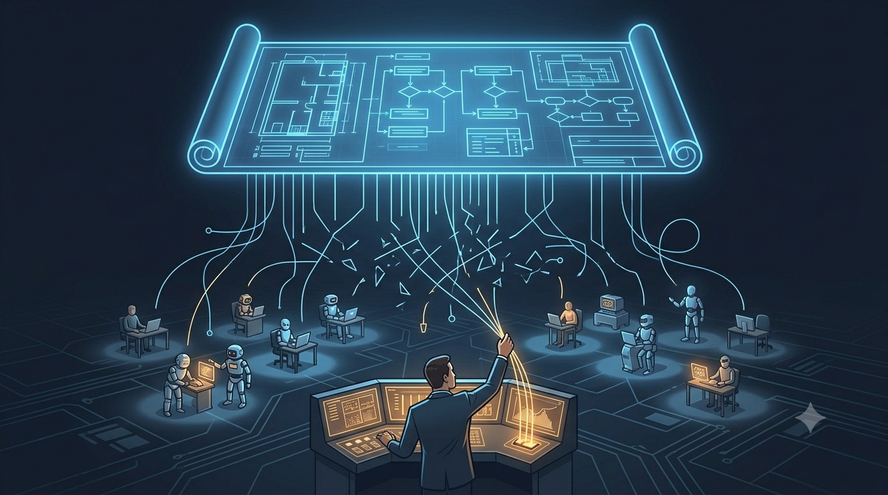
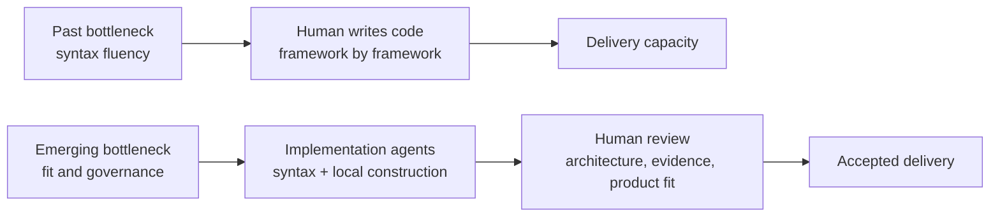
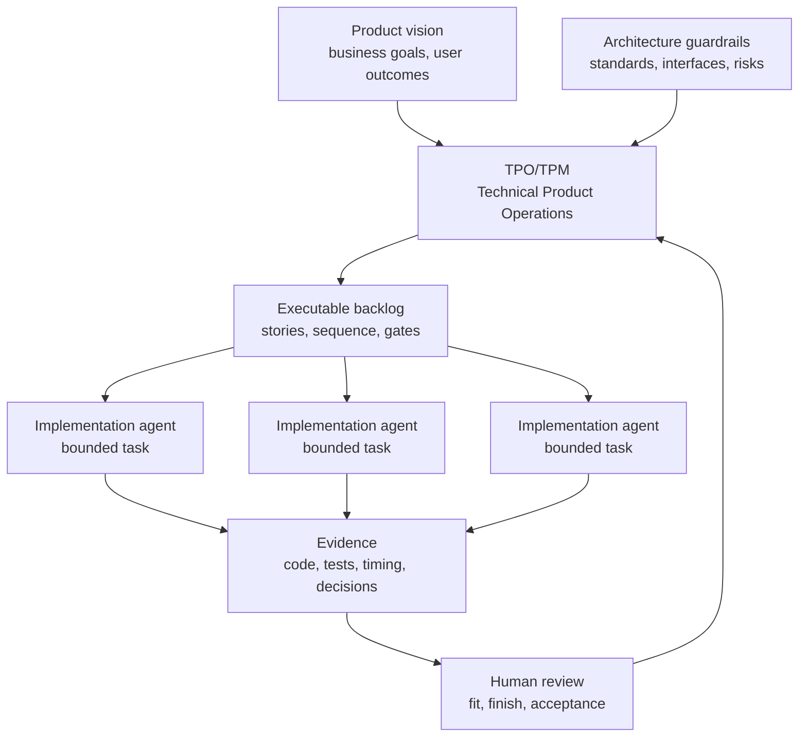

# The Backlog Governance Postulate

**The Rise Of Technical Product Operations**

<!-- markdownlint-disable MD034 -->

_Part 2 of a series of articles on succeeding with Agentic Agile Delivery_

The future software team may not be organized around who writes the most code. It may be organized around who can safely accept the most agent-produced code.

That sounds backward only if you assume code production is still the scarce part of software delivery. For most of the industry's history, that was a fair assumption. You needed people who knew the language, the framework, the build system, the test conventions, the local architecture. Syntax fluency _was equated with_ delivery capacity.

Agentic AI is breaking that equation.

Implementation agents can already move across languages, frameworks, file layouts, and test conventions faster than most humans can retool. They inspect a repository, mimic its patterns, draft code, run tests, respond to failures, and hand back something plausible. They are not perfect. They are good enough to shift the bottleneck, and that is the part that actually matters.

The harder problem shifted away from "who can write the code?" a while ago. The harder problem is:

- who defines the intent clearly enough,
- who decomposes it into safe work,
- who decides what should run first,
- who prevents parallel agents from colliding,
- who knows when the result fits the product,
- who decides whether the evidence is strong enough,
- who can tell the difference between useful acceleration and expensive slop?

That is the emerging discipline I am calling **Technical Product Operations**.

Technical Product Operations is the discipline of turning product intent, architecture guardrails, and delivery risk into an executable backlog that implementation agents can safely act on.

It is not prompt engineering with a better title. It is not project management with AI vocabulary bolted on. It is not product management quietly replacing engineering. It is the coordination layer that lets product vision, architecture, backlog governance, implementation agents, and evidence review operate as one delivery system instead of five disconnected ones.

## The Syntax Inversion

I have watched organizations spend decades building abstractions to help humans reason about code.

Frameworks, managed runtimes, scaffolding tools, design systems, ORMs, dependency injection containers, build pipelines, service templates — all of it exists to help humans manage complexity. Some of those abstractions genuinely improve correctness and maintainability. Some exist because raw platform code is tedious. Some exist because a team would rather standardize on one familiar structure than ask every developer to reason from first principles.

I do not think those abstractions are disappearing overnight. But I have noticed their center of gravity shifting.

When implementation agents become competent syntax operators, syntax gets cheap. I have seen them learn a local project faster than a newly onboarded human ever could. They work in React, Angular, Go, Rust, Swift, Kotlin, Java, Python, or a team's homegrown internal framework without needing a multi-week ramp. They follow lint rules, infer file conventions, copy testing patterns, and adjust when the compiler or the test suite pushes back.

I call that the syntax inversion:

For me, the question shifts from "which framework lets humans type this fastest?" to "which technical foundation actually fits this product's performance, operational, security, maintainability, and deployment needs?"

That is a very different conversation to have.

It means I care less about whether one developer has personally memorized every API in a framework, and more about whether the architecture exposes stable boundaries, whether services can be verified independently, whether generated changes are reviewable, and whether the chosen technology gives the product the right shape five years out.

It also raises an uncomfortable question I keep asking myself about the last twenty years of framework debate: how many of those choices got made because they made humans faster, not because they made the product better? As implementation agents lower the human cost of low-level construction, I expect teams to start choosing thinner internal frameworks, more native platform code, or more specialized utilities instead of hauling in a kitchen-sink framework where only a sliver of the surface area ever gets used.

I am not claiming framework choice stops mattering. It still matters. But the reason it matters shifts, in my experience. Framework choice becomes less about human memorization and more about product fit, operational cost, security surface, testability, and long-term control.

## Why SDLC And Agile Matter More

I do not think agentic AI makes SDLC and agile practices obsolete. What I have seen is the useful parts of them become load-bearing in a way they never had to be before.

When one human developer works on one feature, ambiguity can be handled informally. The developer asks a question. They remember a decision from last month. They infer a missing dependency. They notice a ticket is too broad and push back before doing anything expensive.

A fleet of implementation agents working from vague prompts does not get any of that. What I have watched happen instead is ambiguity multiplying.

Each agent can make a different, individually plausible choice. Each one can generate code that looks reasonable in isolation. Each one can bury an assumption three files deep. Each one can hand back a confident explanation that sounds more finished than it is. Multiply that across however many agents you are running in parallel, and I end up with a lot of code and very little acceptance confidence.

This is why I have found the boring parts of delivery becoming strategic:

- Work breakdown structures prevent giant prompts from becoming giant failures.
- Backlog refinement turns intent into executable slices.
- Acceptance criteria define what the agent must prove.
- Dependency sequencing prevents parallel agents from colliding.
- Review gates prevent generated code from becoming accepted code too early.
- Timing and context records show the human supervision cost.
- Audit trails preserve why work changed, paused, failed, or pivoted.

I do not treat these as ceremonies I run because a process document says so. I have come to see them as the operating system for agentic delivery.

The teams that win with AI, in my view, will not be the ones that simply let agents generate the most code. They will be the ones that build the best system for accepting, rejecting, steering, and learning from AI-generated work.

Here is the part worth sitting with, though: nobody handed me that system off the shelf as a settled industry standard, and I doubt anyone will hand it to you either. Some teams will build their own version of it, shaped around their own culture, stack, and risk tolerance. Others will adopt one someone else already built and battle-tested. Neither path is wrong, and this is not a new fork for the industry to be standing at. Look at frontend frameworks over the last two decades — Angular, React, Vue, Svelte, Ember, Meteor, SolidJS, Qwik. Look at styling — LESS, Sass, Bootstrap, Tailwind. Nobody settled on One True Framework, because there was never one right answer. There were different teams solving for different constraints, and the market kept producing new options because the underlying need was real and the fit was never universal.

I expect the same pattern here. Some teams will roll their own "system for accepting, rejecting, steering, and learning from AI-generated work." Others will adopt an existing one, the same way most teams stopped building their own CI pipeline from scratch a long time ago. What almost certainly will not happen is everyone converging on a single blessed framework and calling the question settled. The real decision in front of every team, as I see it, is not "which system is correct." It is "build or adopt" — and then living with the tradeoffs of whichever you pick.

**Full disclosure**: I am firmly in the "build" camp myself, mostly because I could not find a system that provided the control systems I wanted, and partly because I did not know what I wanted until I started building and saw what was possible. This work is not incidental to why this series exists. Building my own version of this system is what pushed me to write these articles and share what I have learned with the community. I get into that project in more depth toward the end of this piece, under [AITM And The Backlog Manager Pattern](#aitm-and-the-backlog-manager-pattern), if you want the specifics.

## The New Human Role

In this model, the Technical Product Owner or Technical Product Manager becomes a delivery architect.

That role sits between product intent and implementation execution. It requires more technical depth than traditional status-oriented project management, but it does not require the person to personally write every line of code.

I have found that the TPO/TPM operating this system needs to answer questions like:

- What is the product trying to become?
- Which work matters first?
- Which parts are architectural load-bearing decisions?
- Which parts can be delegated to implementation agents?
- What should be decomposed now, and what should wait?
- Which stories can run in parallel?
- Which stories share files, interfaces, or migration paths?
- What evidence proves that a story is complete?
- When does a defect become a separate task?
- When should the plan pivot because the codebase revealed a better path?

Engineering leaders still own architecture standards, production readiness, security posture, and code quality expectations. The TPO/TPM does not replace that responsibility. What I have seen the TPO/TPM do instead is make those expectations operational in the backlog.

That distinction matters to me. The future role is not "product manager as amateur engineer." It is product-facing delivery architecture: turning vision, constraints, and risk into a work system implementation agents can execute without losing the plot.

## The Operating Model

What I run looks less like a single developer receiving a prompt and more like an evidence-driven delivery system.

The detail I care about most is the feedback loop. Agents do not disappear into a black box and return "done." They return evidence. That evidence informs review. Review informs backlog sequencing. Backlog sequencing keeps the next wave of agent work aligned with the current state of the product and codebase.

This is where I have found the product role getting more technical. If the backlog becomes executable, backlog quality becomes delivery quality.

## Failure Mode: Vibe Slop

The industry already has a name for the unmanaged AI output I kept running into: vibe slop.

The term is harsh, but the review experience behind it is real to me. Vibe slop is code that appears to satisfy the prompt, then turns expensive the moment someone has to maintain, secure, test, extend, or explain it.

The distinction I keep coming back to is this:

> Vibe slop is not caused by AI writing code. It is caused by AI writing code outside a governed delivery system.

That is why I do not think "better prompts" are enough. A prompt can describe what the user wants. It cannot, by itself, maintain dependency order, enforce review gates, preserve evidence, manage blocked work, recover from context compaction, or decide when a discovered defect deserves its own story.

My answer was never to reject AI coding. It was to stop treating code generation as the whole job.

## Practical Takeaway

If you are a product manager, project manager, TPO, TPM, or engineering leader, the question I would ask is not whether AI can write code. It can.

The question I actually find useful is whether your delivery system can answer:

- What work was the agent supposed to do?
- Why was that work next?
- What assumptions did the agent make?
- What tests or checks prove the result?
- What changed when the codebase disagreed with the plan?
- Who accepted the result, and based on what evidence?

If those answers live only in a chat transcript, I consider the process fragile.

If those answers live in the backlog, in gates, in evidence records, and in review decisions, I have found agentic AI becomes governable.

That is the promise of Technical Product Operations, as I see it. Not more prompt craft. Not less engineering. A better operating model for a world where code construction is increasingly automated and acceptance judgment becomes the scarce resource — and where every team still has to decide, on its own, whether to build that operating model or adopt one.

## Series Link

This article lays out the thesis I have been building toward. Next, in [The Vibe Coding Hangover](03-the-vibe-coding-deficiency.md), I walk through the failure mode I ran into when AI-generated code got produced faster than I could govern it.

## AITM And The Backlog Manager Pattern

I built AITM because I kept hitting the same wall with unconstrained vibe coding and prompt engineering: an agent would hand me confident-sounding code, and the only way to know what it actually got right, what it guessed at, or what it quietly skipped was to re-read the entire chat transcript myself. That does not scale, and it is not evidence. So I started building a skill for my own agents that would constrain their work to the same patterns a disciplined agile team already uses — a backlog, explicit acceptance criteria, state gates, a review step before anything counted as done. I wanted an audit trail I could check in minutes, not gigabytes of chat context to mine after the fact. Mostly, I wanted the confidence that comes from evidence built into delivery, not from how convincing the agent's summary sounded.

That skill became **AITM** — `@kburson/ai-task-manager` — an AI skill and npm package that currently supports GitHub-backed task workflows with Claude Code and Codex. It is worth flagging that "AI task manager" is also a generic phrase, and a handful of unrelated projects use similar names.

The patterns I walk through in this series come from two places: other projects I have worked on, and dogfooding this exact skill while building `@kburson/ai-task-manager` itself.

AITM provides a concrete operating model for Technical Product Operations — one answer to the build-or-adopt question above, not the only one that will ever exist, and not a claim that every other approach is wrong.

The pattern is story-governed delivery:

1. Start with product or feature intent.
2. Decompose it into epics, stories, and atomic product backlog items.
3. Stack-rank the backlog by priority, size, and dependency order.
4. Delay detailed planning until the smallest useful item is ready to execute.
5. Require a current-code deep dive before implementation.
6. Bind each agent session to one issue.
7. Move work through state gates.
8. Require verification evidence before review.
9. Preserve timing, context, decisions, defects, pivots, and approvals.

The current implementation uses GitHub Projects because GitHub provides issues, project fields, sub-issues, comments, pull requests, and API access in one practical surface. But the pattern is not GitHub-specific.

The deeper idea is the **Backlog Manager Pattern**: use the backlog as the durable control plane for agentic execution. The chat window is not the system of record. The backlog item is.

That backlog item carries intent, scope, dependency order, acceptance criteria, state, evidence, review status, and recovery context. The implementation agent works inside that boundary. The human operator reviews the evidence and decides whether the result fits.

## Series Roadmap

| Status      | #      | Article                                                                                                            | Role In Series                                       |
| ----------- | ------ | ------------------------------------------------------------------------------------------------------------------ | ----------------------------------------------------- |
|             | 01     | [The Refactoring Bloat Precursor](01-the-refactoring-bloat-precursor.md) | Prequel: history of AI-assisted coding before agents |
| **Current** | **02** | **[The Rise Of Technical Product Operations](02-the-backlog-governance-postulate.md)** | Industry thesis: Technical Product Operations |
|             | 03     | [The Vibe Coding Hangover](03-the-vibe-coding-deficiency.md) | Failure mode: vibe slop and review debt |
|             | 04     | [Spec-Driven Development Is Necessary But Not Sufficient](04-the-spec-driven-insufficiency.md) | Why specs need execution governance |
|             | 05     | [Regeneration Is Cheap. Hardening Isn't. Guess Which One Gets Skipped.](05-easy-come-easy-go.md) | Failure mode: cheap regeneration without governance |
|             | 06     | [The Rise Of The Technical Product Owner](06-the-product-owner-escalation.md) | Human operator: TPO/TPM as delivery architect |
|             | 07     | [The Backlog Becomes The Control Plane](07-the-backlog-control-plane-conjecture.md) | Backlog as executable control surface |
|             | 08     | [The Just-In-Time Planner](08-the-just-in-time-planning-paradox.md) | Progressive decomposition and deep dives |
|             | 09     | [Context Durability Is A Feature](09-the-context-durability-corollary.md) | JIT loading and post-compaction recovery |
|             | 10     | [Evidence Beats Trust](10-the-evidence-over-trust-theorem.md) | Evidence gates and auditability |
|             | 11     | [The Adapter Future](11-the-adapter-convergence.md) | Backlog and agent platform adapters |
|             | 12     | [Agentic Concurrency Isn't Free — And "50 Parallel Agents" Is Hyperbole](12-the-agentic-concurrency-deficiency.md) | Concurrency ceiling and coordination cost |
|             | 13     | [XP's Practices Survived. Their Reasons Did Not.](13-the-xp-survival-anomaly.md) | XP practices under agentic delivery |
|             | 14     | [The Diff Isn't Where Your Judgment Lives Anymore](14-the-diff-displacement.md) | Spec review displaces code review |
|             | 15     | [It's All About Perspective](15-the-second-reviewer-corollary.md) | Cross-model review for a genuine second opinion |

## LinkedIn Article Shape

Opening hook:

> The future software team may not be organized around who writes the most code. It may be organized around who can safely accept the most agent-produced code.

Middle:

- Explain the syntax inversion.
- Argue that SDLC and agile practices become more important under agentic AI.
- Name the build-or-adopt fork, draw the parallel to the last two decades of framework proliferation, and disclose which side of it I am on.
- Define Technical Product Operations and the TPO/TPM as delivery architect.
- Introduce vibe slop as the unmanaged failure mode.
- Tell the personal story behind AITM (`@kburson/ai-task-manager`): why I built it, and what it taught me.
- Position it as one concrete, story-governed answer to the build-or-adopt question, not the only one.

Close:

> The winning teams will not be the ones that let AI write the most code. They will be the ones that build the best operating model for accepting, rejecting, and steering AI-written code — whether they build that model themselves or adopt one.

## Bibliography

- GitHub. "GitHub Spec Kit." https://github.com/github/spec-kit
- GitHub Blog. "Spec-driven development with AI." https://github.blog/ai-and-ml/generative-ai/spec-driven-development-with-ai-get-started-with-a-new-open-source-toolkit/
- Atlassian. "Spec Driven Development with Rovo Dev." https://www.atlassian.com/blog/development/spec-driven-development-with-rovo-dev
- Atlassian. "What is backlog refinement?" https://www.atlassian.com/agile/scrum/backlog-refinement
- Project Management Institute. "Applying work breakdown structure to the project lifecycle." https://www.pmi.org/learning/library/applying-work-breakdown-structure-project-lifecycle-6979
- DORA. "State of AI-assisted Software Development 2025." https://dora.dev/dora-report-2025/
- METR. "Measuring the Impact of Early-2025 AI on Experienced Open-Source Developer Productivity." https://metr.org/blog/2025-07-10-early-2025-ai-experienced-os-dev-study/
- Stack Overflow. "2025 Developer Survey: AI." https://survey.stackoverflow.co/2025/ai
- The Wall Street Journal. "The AI Superstars Who Say a 'Vibe Slop' Crisis Is Coming." https://www.wsj.com/tech/ai/vibe-coding-slop-ai-tools-e6a99394
- AI Task Manager. "Agentic Development Process." https://github.com/kburson/ai-task-manager/blob/trunk/docs/introduction/agentic-development-process.md
- AI Task Manager. "Core Workflow." https://github.com/kburson/ai-task-manager/blob/trunk/docs/introduction/core-workflow.md
- AI Task Manager. "Measurement and ROI." https://github.com/kburson/ai-task-manager/blob/trunk/docs/introduction/measurement-and-roi.md
