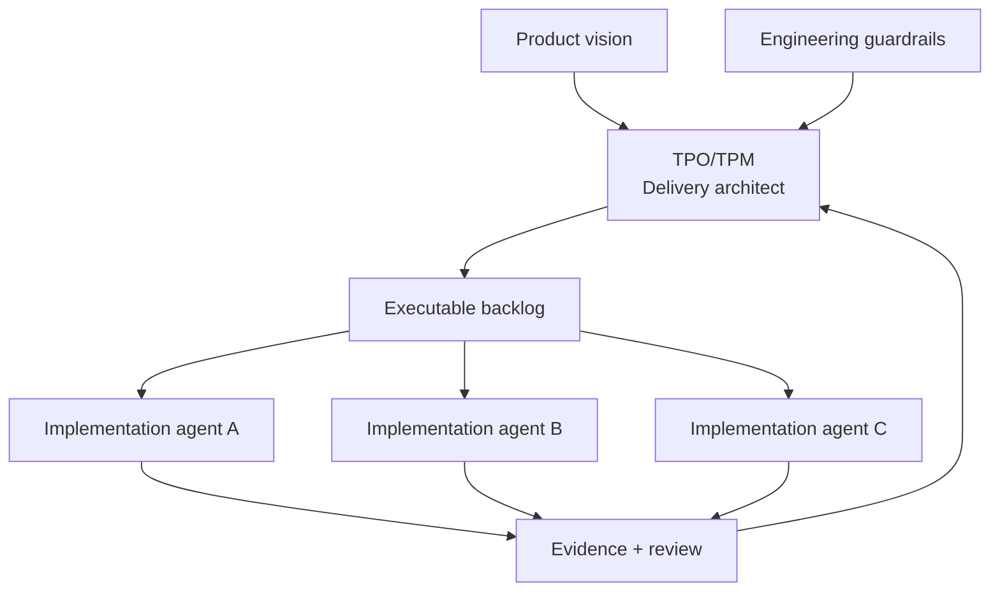
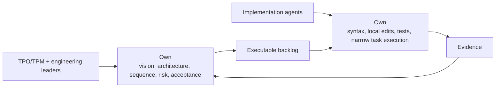

# The Rise Of The Technical Product Owner

<!-- markdownlint-disable MD034 -->

## Series Roadmap

| Status      | #      | Article                                                                                    | Role In Series                                |
| ----------- | ------ | ------------------------------------------------------------------------------------------ | --------------------------------------------- |
|             | 00     | [The Rise Of Technical Product Operations](00-technical-product-operations.md)             | Industry thesis: Technical Product Operations |
|             | 01     | [The Vibe Coding Hangover](01-vibe-coding-hangover.md)                                     | Failure mode: vibe slop and review debt       |
|             | 02     | [Spec-Driven Development Is Necessary But Not Sufficient](02-spec-driven-is-not-enough.md) | Why specs need execution governance           |
| **Current** | **03** | **[The Rise Of The Technical Product Owner](03-technical-product-owner.md)**               | Human operator: TPO/TPM as delivery architect |
|             | 04     | [The Backlog Becomes The Control Plane](04-backlog-as-control-plane.md)                    | Backlog as executable control surface         |
|             | 05     | [The Just-In-Time Planner](05-just-in-time-planner.md)                                     | Progressive decomposition and deep dives      |
|             | 06     | [Context Durability Is A Feature](06-context-durability.md)                                | JIT loading and post-compaction recovery      |
|             | 07     | [Evidence Beats Trust](07-evidence-beats-trust.md)                                         | Evidence gates and auditability               |
|             | 08     | [The Adapter Future](08-adapter-future.md)                                                 | Backlog and agent platform adapters           |

The product owner of the AI era will not win by writing bigger prompts.

They will win by writing better work.

That is the uncomfortable shift. When implementation agents can produce code from issues, the quality of the backlog stops being an administrative concern. It becomes a delivery constraint. A vague story does not merely slow a human team down. It gives an agent fleet room to make plausible but divergent assumptions at machine speed.

Agentic AI does not eliminate product ownership. It raises the technical bar for product ownership.

The emerging role is the **Technical Product Owner** or **Technical Product Manager**: a product-facing delivery architect who can turn product intent into agent-executable backlog items, sequence the work, manage pivots, and verify evidence without pretending to be the person writing every line of code.

## Backlog Quality Becomes Delivery Quality

Traditional product ownership already involves priorities, acceptance criteria, backlog quality, stakeholder alignment, and delivery sequencing. Agentic AI changes the stakes because the backlog becomes executable.

If an implementation agent can pick up an issue and write code, then the issue is no longer a reminder. It is runtime input.

That means every ambiguity in the backlog has a cost:

- unclear scope becomes extra generated code,
- vague acceptance criteria become shallow tests,
- missing dependencies become parallel conflicts,
- hidden architectural assumptions become review debt,
- incomplete verification instructions become misplaced confidence,
- untracked pivots become lost decision history.

The TPO/TPM role shifts from maintaining a list of requests to operating a delivery system.

The TPO/TPM is not controlling every line of code. They are controlling the structure that determines whether generated code can be accepted safely.

## The New Responsibility Set

The technical product role becomes responsible for turning intent into bounded work.

That includes:

- writing feature specifications that are useful to agents and humans,
- decomposing large work into epics, stories, and atomic product backlog items,
- knowing how much planning belongs at each layer of the work breakdown structure,
- identifying dependency order and safe parallelism,
- defining acceptance criteria that can be checked,
- deciding when a task should pause, pivot, switch out, or demote,
- reading evidence instead of accepting status claims,
- managing agent throughput without losing product intent.

This is not ordinary project administration. It is Technical Product Operations applied to a backlog.

The agents become implementation agents in this operating model. They manage syntax, local code structure, framework mechanics, test execution, and narrow task delivery inside bounded assignments. The TPO/TPM works above that layer, combining product vision, architectural literacy, dependency awareness, and delivery governance.

This is also a meaningful role shift for engineers. As agents become better at producing idiomatic code across languages and frameworks, human value moves toward product correctness, architecture, interface design, decomposition, risk control, and review. The engineer does not disappear. The engineer moves up the abstraction stack.

## What The Technical Product Owner Is Not

The Technical Product Owner is not replacing engineering leadership.

Engineering leaders still own architecture standards, maintainability expectations, security posture, code review standards, production readiness, and technical quality bars. The TPO/TPM should not unilaterally decide that a generated implementation is architecturally acceptable because the feature appears to work.

The boundary is collaborative:

- Engineering defines guardrails.
- Product defines intent and priority.
- The TPO/TPM translates both into executable backlog structure.
- Implementation agents execute bounded work.
- Review evidence determines whether the work advances.

This split matters because it avoids two bad extremes.

The first bad extreme is treating product managers as prompt typists who throw requests over the wall to AI. That creates vibe slop.

The second bad extreme is forcing senior engineers to micromanage every generated line in real time. That destroys the leverage the agents were supposed to provide.

The healthier model is a governed division of labor: humans own intent, architecture, sequence, risk, and acceptance; implementation agents own local construction inside bounded tasks.

## Before, During, And After Agent Work

A TPO/TPM operating an agent fleet has responsibilities before, during, and after implementation.

Before work starts, they shape the backlog:

- Does the item express a clear product outcome?
- Is it small enough for bounded execution?
- Are dependencies explicit?
- Is the expected verification clear?
- Does the item need architectural review before development?
- Is this the right item to do next?

During work, they manage flow:

- Is the agent blocked on a real product or technical decision?
- Did the task discover a defect or refactor that should become separate work?
- Does the codebase state require a pivot from the original plan?
- Are parallel agents stepping on shared files or interfaces?
- Should the current task pause, switch out, or demote?

After work, they review evidence:

- Which acceptance criteria were satisfied?
- Which tests or checks were run?
- What changed in the codebase?
- What assumptions did the agent record?
- What risks remain?
- Is the result acceptable, rejected, or ready for engineering review?

The role is not to rubber-stamp agent output. The role is to operate the acceptance system.

## What This Means For Product And Project Managers

This role will be uncomfortable for teams that treat product work as mostly status, prioritization, and stakeholder communication.

Agentic delivery requires a more technical product posture.

The TPO/TPM does not need to be the best programmer on the team. But they do need to understand:

- how systems are decomposed,
- how dependencies create delivery risk,
- how acceptance criteria map to tests,
- how codebase state can invalidate old plans,
- how review burden becomes real cost,
- how evidence differs from explanation.

The product person who can do that becomes much more valuable in an agentic environment.

They can keep the system product-led without letting it become process-blind. They can help engineering leaders scale review discipline. They can decide when an agent should continue, stop, pivot, or split discovered work into a new item.

## AITM And The Role In Practice

In this series, **AITM** means `@kburson/ai-task-manager`: an AI skill and npm package that currently supports GitHub-backed task workflows with Claude Code and Codex.

AITM is a concrete exploration of this Technical Product Operations role.

It gives the TPO/TPM a way to:

- convert specs into epics and child stories,
- sequence work into dependency waves,
- keep early epic and story descriptions intentionally light until the item rises in priority,
- trigger detailed JIT planning only when the smallest executable item is about to enter development,
- track active agent sessions,
- require deep-dive analysis before implementation,
- gate state transitions with evidence,
- capture timing and context burden,
- preserve decision history when context resets.

That makes the backlog an operational interface between product, engineering, and AI execution.

The point is not that every organization must use GitHub Projects forever. The point is that the backlog needs to become durable enough, structured enough, and evidence-aware enough to manage agentic work.

## Adoption Checklist

For a product or project leader preparing for agentic AI-assisted development, the first maturity step is not "write better prompts."

Start with the backlog:

- Are stories thin enough for bounded implementation?
- Do acceptance criteria describe observable outcomes?
- Are dependency relationships explicit?
- Is there a clear path for discovered defects or refactors?
- Is there an evidence requirement before review?
- Can the task be resumed after context loss?
- Does the board state reflect actual delivery state?
- Does a human approve completion?

If the answer is no, the agent fleet will amplify the gap.

## Practical Takeaway

The Technical Product Owner is the person who keeps agentic delivery product-led without letting it become process-blind.

That requires a different kind of product discipline. The TPO/TPM must understand enough architecture to shape safe work, enough delivery mechanics to sequence it, enough verification discipline to read evidence, and enough product judgment to decide whether the result fits.

This is not less product management. It is more technical product ownership because the backlog has become executable.

## Series Link

This article defines the human operator. The next article, [The Backlog Becomes The Control Plane](04-backlog-as-control-plane.md), explains the artifact that operator uses to govern the fleet.

## LinkedIn Article Shape

Opening hook:

> The product owner of the AI era will not win by writing bigger prompts. They will win by writing better work.

Middle:

- Explain how agents turn backlog quality into delivery quality.
- Define the Technical Product Owner or Technical Product Manager.
- Show why this role differs from both project manager and senior engineer.
- Explain the human/agent responsibility split.
- Introduce AITM as a concrete workflow implementation.

Close:

> The Technical Product Owner is the person who can keep agentic delivery product-led without letting it become process-blind.

## Bibliography

- Scaled Agile. "AI-Empowered Product Owners and Product Managers." https://scaledagile.com/blog/ai-empowered-product-owners-and-product-managers/
- Product School. "AI Product Owner." https://productschool.com/blog/artificial-intelligence/ai-product-owner
- Atlassian. "Spec Driven Development with Rovo Dev." https://www.atlassian.com/blog/development/spec-driven-development-with-rovo-dev
- Kiro Docs. "Feature Specs." https://kiro.dev/docs/specs/feature-specs/
- GitHub Blog. "Assigning and completing issues with coding agent in GitHub Copilot." https://github.blog/ai-and-ml/github-copilot/assigning-and-completing-issues-with-coding-agent-in-github-copilot/
- Sayagh, Mohammed. "What Makes a GitHub Issue Ready for Copilot?" https://arxiv.org/abs/2512.21426
- AI Task Manager. "Agentic Development Process." ../introduction/agentic-development-process.md
- AI Task Manager. "Core Workflow." ../introduction/core-workflow.md
- AI Task Manager. "Measurement and ROI." ../introduction/measurement-and-roi.md
- Atlassian. "What is backlog refinement?" https://www.atlassian.com/agile/scrum/backlog-refinement
- Scaled Agile. "Enterprise Backlog Structure and Management." https://framework.scaledagile.com/enterprise-backlog-structure-and-management
