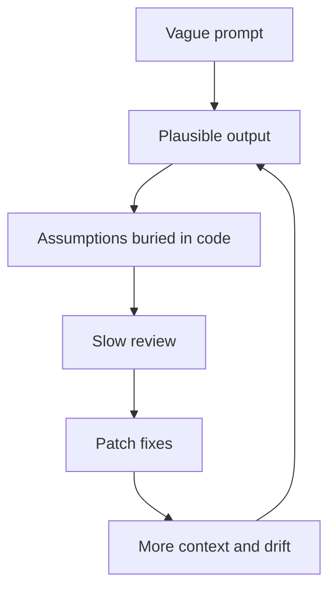
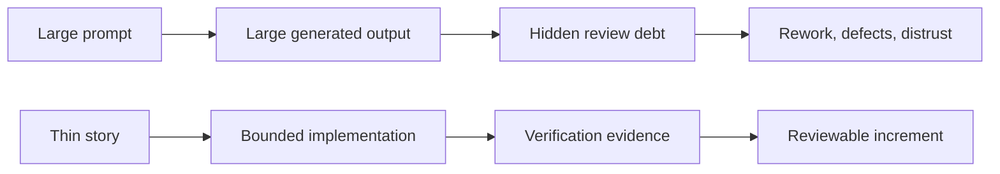

# The Vibe Coding Deficiency

**The Vibe Coding Hangover**

<!-- markdownlint-disable MD034 -->

_Part 3 of a series of articles on succeeding with Agentic Agile Delivery_

We spent the first wave of AI coding asking the wrong question.

The question was: how much can the agent build?

The better question is: how much can the team safely accept?

That distinction is the hangover. AI can generate code quickly. It can produce entire features, migration scripts, test suites, UI components, API handlers, and documentation in a single burst. The output can look confident. It can look complete. It can even pass a few local checks.

But software delivery does not end when code appears. Someone still has to decide whether the generated work is correct, maintainable, secure, aligned with architecture, aligned with product intent, and safe to extend later.

When that review burden is invisible, AI looks more productive than it really is.

The harsh industry term for this flavor of agentic delivery is **vibe slop**.

## What "Vibe Slop" Means

**Vibe slop** is a denigrative term, and it stuck with me because it names something I have lived through directly: AI-generated code that looks shippable on the surface, then turns expensive the moment someone has to maintain, secure, test, extend, or explain it.

Vibe slop is not always obviously bad code, and that is exactly why it worries me. It can compile. It can follow the broad shape of the prompt. It can come wrapped in plausible abstractions and confident-sounding comments. What I keep running into is work that got generated faster than anyone — including the agent — actually understood it.

I think of the term as joining two anxieties I recognize from experience:

- **Vibe coding:** describing the desired behavior and letting the model improvise the implementation.
- **AI slop:** low-effort generated output produced at scale.

Put them together and you get a failure mode where generation outruns governance.

That is why my answer was never "stop using AI." It was to stop treating code generation as the whole delivery system.

> Vibe slop is not caused by AI writing code. It is caused by AI writing code outside a governed delivery system.

## The Hidden Review Debt Loop

I have watched this failure pattern often enough that I can predict it before it happens.

A product person or engineer hands an agent a broad prompt: build the feature, refactor the subsystem, add the workflow, generate the service, fix the UI. The agent comes back with a large result, one that looks plausible enough that everyone wants to believe the work is nearly done.

Then review starts, and I become the one reconstructing intent nobody wrote down. I have to compare the implementation against assumptions nobody stated out loud. I have to check whether the agent respected local architecture, whether it quietly duplicated logic, whether it skipped edge cases, whether the tests actually assert meaningful behavior, and whether the agent's explanation matches the real diff.

When review uncovers problems, the usual move is to send the agent back to patch them. That adds more context, more diffs, more explanation, and more assumptions I now have to re-inspect.

Here is what that loop looks like once I mapped it out:

I call this review debt. It rarely shows up on a dashboard, and it will not show up if the only metric you are tracking is "lines generated" or "minutes until first working demo." I have seen it show up later instead — as rework, reviewer fatigue, shallow approvals, unexplained architecture drift, and defects that a smaller work boundary would have caught in the first place.

## The Evidence Is Already Complicated

When I go looking at the public evidence, I do not find a simple "AI coding works" or "AI coding fails" story.

What I find instead is more useful: AI coding amplifies whatever delivery system is already around it.

**METR**'s 2025 randomized study found experienced open-source developers took longer on selected mature-repository tasks when AI tools were available, even though they expected to be faster. **Stack Overflow**'s 2025 survey showed strong AI tool adoption alongside low trust in AI output accuracy. **GitClear**'s code-quality research raised concerns about churn, duplication, and copy/paste patterns in AI-assisted code. **OWASP**'s LLM guidance highlights risks such as prompt injection, insecure output handling, and excessive agency.

None of that tells me AI coding is a dead end.

What it tells me is that unmanaged AI coding is not automatically productive.

The harder lesson I have taken from it is that generation speed and delivery speed are different things. A team can generate code quickly and still move slowly if acceptance requires extensive human reconstruction. A team can produce a demo quickly and still accumulate maintainability debt. A team can cut typing time while quietly growing review time.

That is the hangover I keep coming back to: speed at the keyboard becomes friction at the gate.

## Why Classic Delivery Practices Come Back Stronger

This is where I found the older disciplines becoming more important, not less.

Work breakdown structures, backlog refinement, acceptance criteria, dependency mapping, test gates, review gates, audit trails — all of it can sound bureaucratic when humans are the ones moving slowly. Under agentic AI, I have watched them turn into control surfaces instead.

An implementation agent earns its keep inside a narrow, explicit work boundary. It can inspect code, make local changes, run tests, and report evidence. But hand it a vague boundary and it will fill the gaps itself — sometimes well, sometimes badly. Either way, I am the one who inherits the cost of discovering which assumptions it made.

My instinct used to be to write bigger, more detailed prompts. That backfired more often than it helped — a larger prompt just creates a larger surface area for drift.

What actually worked was changing the unit of work.

Instead of asking an agent to "build the feature," I ask the delivery system to answer:

- What is the smallest valuable slice?
- What acceptance criteria define success?
- What files or boundaries are likely involved?
- What dependencies block this work?
- What tests or checks will prove the result?
- What should happen if the work discovers a defect?
- What evidence must remain after the agent stops?

Those questions turn AI coding from a generation event into a governed workflow.

## From Vibe Coding To Story-Governed Delivery

My alternative to vibe slop was never a return to manual-coding nostalgia. It was story-governed delivery.

The change that mattered most for me was making the backlog item itself the work contract.

A thin story gives the implementation agent a bounded objective. Acceptance criteria tell it what matters. Dependencies tell it what must already be true. Verification commands tell it what evidence has to exist before anyone believes the work is done. Review gates tell it when generated work is actually ready for human judgment.

That makes agents more useful to me, not less.

An agent handed a giant prompt has to infer the work system on its own. An agent handed a governed story can just operate inside the one I already built.

## Warning Signs For TPOs And TPMs

If you are trying to adopt agentic AI, here are the signals I have learned to watch for:

- Agents regularly receive prompts that describe whole features instead of thin stories.
- Reviewers have to reconstruct acceptance criteria after the code is written.
- Generated tests exist, but nobody knows which product behavior they prove.
- Agents patch defects inside the current task instead of creating explicit discovered work.
- Review discussions happen mostly in chat and are not reflected in the backlog.
- The team measures generation speed but not review burden.
- The agent says "done" before evidence exists outside the chat.

None of these mean AI is useless. What they tell me, every time, is that the delivery system underneath it is under-specified.

## Practical Takeaway

The first AI coding maturity step, in my experience, is not buying a better model. It is reducing the size and ambiguity of the work you hand the model.

Before I ask an implementation agent to build anything, I ask myself whether the backlog item is small enough, clear enough, sequenced enough, and verifiable enough that a reviewer can safely accept or reject the result.

If the answer is no, I am not doing agentic delivery. I am generating review debt for my future self.

The future I want is not less product management. It is product management with sharper technical boundaries, clearer acceptance criteria, and evidence trails strong enough to trust agentic work.

## Series Link

That's the failure mode I want you to recognize: unmanaged agentic delivery, the one I kept running into before I built anything to stop it. Next up: [Spec-Driven Development Is Necessary But Not Sufficient](04-the-spec-driven-insufficiency.md), on why specs improve things but still need story-level execution governance.

## AITM And The Backlog Manager Pattern

I introduced AITM — `@kburson/ai-task-manager` — in the [opening article](02-the-backlog-governance-postulate.md#aitm-and-the-backlog-manager-pattern): the skill I built after hitting the exact wall described above one too many times. The review-debt loop is not an abstraction to me. It is the thing I got tired of debugging by hand.

AITM starts from a simple premise: do not hand the agent a giant wish. Hand it a governed work item.

The work item should carry:

- a narrow outcome,
- acceptance criteria,
- relevant context and dependencies,
- a defined workflow state,
- entry and exit gates,
- required verification evidence,
- a way to pause, pivot, switch, or demote when reality changes.

None of that is hand-authored by the TPO/TPM on every item. AITM ships with scripts that generate these artifacts, drive the agent through the workflow states and gates, and automatically record the evidence, timing, and decisions along the way.

That turns the backlog into a control plane. The implementation agent does not merely generate code into a chat. It works against a durable issue, moves through states, leaves evidence, and stops at review.

The human role also changes. The TPO/TPM is not merely writing prompts. They are shaping the work system. Implementation agents work inside bounded assignments; the TPO/TPM preserves product vision, architectural intent, dependency order, and review discipline.

## Series Roadmap

| Status      | #      | Article                                                                                                            | Role In Series                                       |
| ----------- | ------ | ------------------------------------------------------------------------------------------------------------------ | ---------------------------------------------------- |
|             | 01     | [The Refactoring Bloat Precursor](01-the-refactoring-bloat-precursor.md)                                           | Prequel: history of AI-assisted coding before agents |
|             | 02     | [The Rise Of Technical Product Operations](02-the-backlog-governance-postulate.md)                                 | Industry thesis: Technical Product Operations        |
| **Current** | **03** | **[The Vibe Coding Hangover](03-the-vibe-coding-deficiency.md)**                                                   | Failure mode: vibe slop and review debt              |
|             | 04     | [Spec-Driven Development Is Necessary But Not Sufficient](04-the-spec-driven-insufficiency.md)                     | Why specs need execution governance                  |
|             | 05     | [The Rise Of The Technical Product Owner](05-the-product-owner-escalation.md)                                      | Human operator: TPO/TPM as delivery architect        |
|             | 06     | [The Backlog Becomes The Control Plane](06-the-backlog-control-plane-conjecture.md)                                | Backlog as executable control surface                |
|             | 07     | [The Just-In-Time Planner](07-the-just-in-time-planning-paradox.md)                                                | Progressive decomposition and deep dives             |
|             | 08     | [Context Durability Is A Feature](08-the-context-durability-corollary.md)                                          | JIT loading and post-compaction recovery             |
|             | 09     | [Evidence Beats Trust](09-the-evidence-over-trust-theorem.md)                                                      | Evidence gates and auditability                      |
|             | 10     | [The Adapter Future](10-the-adapter-convergence.md)                                                                | Backlog and agent platform adapters                  |
|             | 11     | [Agentic Concurrency Isn't Free — And "50 Parallel Agents" Is Hyperbole](11-the-agentic-concurrency-deficiency.md) | Concurrency ceiling and coordination cost            |
|             | 12     | [XP's Practices Survived. Their Reasons Did Not.](12-the-xp-survival-anomaly.md)                                   | XP practices under agentic delivery                  |
|             | 13     | [The Diff Isn't Where Your Judgment Lives Anymore](13-the-diff-displacement.md)                                    | Spec review displaces code review                    |
|             | 14     | [It's All About Perspective](14-the-second-reviewer-corollary.md)                                                  | Cross-model review for a genuine second opinion      |

## LinkedIn Article Shape

Opening hook:

> We spent the first wave of AI coding asking, "How much can the agent build?" The better question is, "How much can the team safely accept?"

Middle:

- Define vibe slop as generated output outside governance.
- Explain hidden review debt.
- Summarize the productivity/trust/quality evidence.
- Introduce story-governed delivery as the missing control loop.
- Circle back to AITM (`@kburson/ai-task-manager`) — the skill from article one — as a concrete Backlog Manager Pattern implementation.

Close:

> The future is not less product management. It is product management with sharper technical boundaries, clearer acceptance criteria, and evidence trails strong enough for agentic work.

## Bibliography

- METR. "Measuring the Impact of Early-2025 AI on Experienced Open-Source Developer Productivity." https://metr.org/blog/2025-07-10-early-2025-ai-experienced-os-dev-study/
- Becker, Joel; Rush, Nate; Barnes, Elizabeth; Rein, David. "Measuring the Impact of Early-2025 AI on Experienced Open-Source Developer Productivity." https://arxiv.org/abs/2507.09089
- Stack Overflow. "2025 Developer Survey: AI." https://survey.stackoverflow.co/2025/ai
- Stack Overflow. "Stack Overflow's 2025 Developer Survey Reveals Trust in AI at an All-Time Low." https://stackoverflow.co/company/press/archive/stack-overflow-2025-developer-survey/
- GitClear. "AI Assistant Code Quality 2025." https://www.gitclear.com/ai_assistant_code_quality_2025_research
- The Wall Street Journal. "The AI Superstars Who Say a 'Vibe Slop' Crisis Is Coming." https://www.wsj.com/tech/ai/vibe-coding-slop-ai-tools-e6a99394
- The New Stack. "Vibe slop is the symptom. Context debt is the disease." https://thenewstack.io/vibe-coding-context-debt/
- testRigor. "What Is 'Vibe Slopping'? The Hidden Risk Behind AI-Powered Coding." https://testrigor.com/blog/what-is-vibe-slopping/
- OWASP. "Top 10 for Large Language Model Applications." https://owasp.org/www-project-top-10-for-large-language-model-applications/
- OWASP. "LLM06:2025 Excessive Agency." https://genai.owasp.org/llmrisk/llm06-sensitive-information-disclosure/
- DORA. "State of AI-assisted Software Development 2025." https://dora.dev/dora-report-2025/
