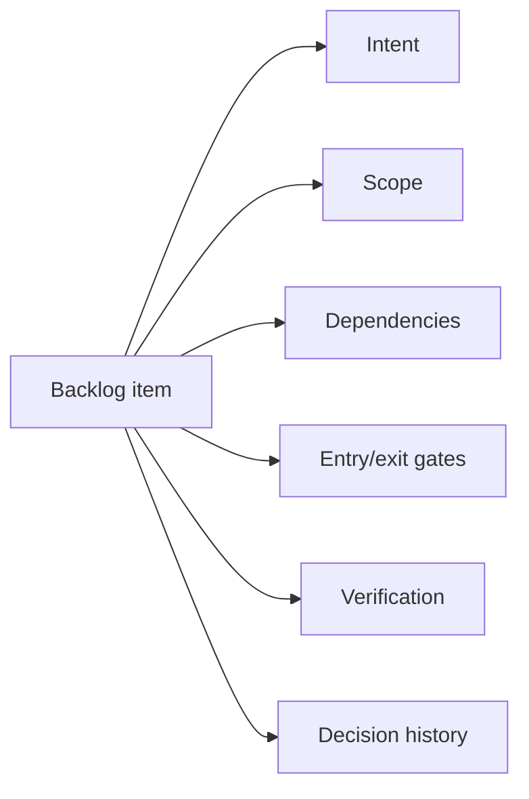

# The Backlog Becomes The Control Plane

<!-- markdownlint-disable MD034 -->

## Series Roadmap

| Status      | #      | Article                                                                                    | Role In Series                                |
| ----------- | ------ | ------------------------------------------------------------------------------------------ | --------------------------------------------- |
|             | 00     | [The Rise Of Technical Product Operations](00-technical-product-operations.md)             | Industry thesis: Technical Product Operations |
|             | 01     | [The Vibe Coding Hangover](01-vibe-coding-hangover.md)                                     | Failure mode: vibe slop and review debt       |
|             | 02     | [Spec-Driven Development Is Necessary But Not Sufficient](02-spec-driven-is-not-enough.md) | Why specs need execution governance           |
|             | 03     | [The Rise Of The Technical Product Owner](03-technical-product-owner.md)                   | Human operator: TPO/TPM as delivery architect |
| **Current** | **04** | **[The Backlog Becomes The Control Plane](04-backlog-as-control-plane.md)**                | Backlog as executable control surface         |
|             | 05     | [The Just-In-Time Planner](05-just-in-time-planner.md)                                     | Progressive decomposition and deep dives      |
|             | 06     | [Context Durability Is A Feature](06-context-durability.md)                                | JIT loading and post-compaction recovery      |
|             | 07     | [Evidence Beats Trust](07-evidence-beats-trust.md)                                         | Evidence gates and auditability               |
|             | 08     | [The Adapter Future](08-adapter-future.md)                                                 | Backlog and agent platform adapters           |

If an AI agent can implement an issue, then the issue is no longer paperwork. It is runtime input.

That single fact changes what a backlog is for. A ticket used to be a reminder: a compressed note that a human would expand with judgment, memory, and a hallway conversation before writing any code. An implementation agent does not have a hallway conversation. It has the issue, and whatever the issue says is the boundary of what it knows to do.

## Why Ambiguity Survives Human Teams But Not Agent Fleets

Human teams can sometimes tolerate a vague ticket because humans ask questions, carry organizational memory, and infer intent from context that never made it into the ticket text. That tolerance is a feature of working with other humans, not a property of good backlog hygiene. It quietly depends on shared context that AI agents do not have.

Implementation agents need sharper boundaries, because they will act on what is written rather than push back on what is missing. That turns every backlog item into a contract that has to answer, explicitly:

- What outcome is requested?
- What context is relevant?
- What files or systems are likely involved?
- What must be true before work starts?
- What must be proven before work leaves a state?
- What dependencies block this task?
- What evidence must be left behind?
- What should happen if the task uncovers a defect or a needed pivot?

## From Planning Artifact To Control Plane

Once backlog items carry that information, the board stops being a status report and starts being executable. Agents can pull work, move it through states, produce evidence, pause for a human decision, and report progress without pushing everything into transient chat context that disappears when the session ends.

The control plane also decides how much detail is allowed to exist at a given moment. Early epics should preserve intent, scope, priority, and dependency order without pretending to know every implementation detail before earlier work has changed the codebase underneath them. As an item rises in stack rank, the backlog decomposes another layer. Only the atomic product backlog item receives the full, current-code deep dive — the plan that is actually safe to build from.

This is also why backlog hygiene becomes a harder requirement under agentic delivery, not a softer one. A human developer who receives an overly broad ticket can usually tell it is too broad and push back before doing damage. An agent, left unconstrained, may simply attempt the work as written. The backlog has to carry more of that operating discipline up front, because there is no guarantee anyone will catch the gap before code gets generated.

## The AITM Pattern

In this series, **AITM** means `@kburson/ai-task-manager`: an AI skill and npm package that currently supports GitHub-backed workflows with Claude Code and Codex.

AITM uses GitHub Projects as its current control plane, largely because GitHub is where a large share of open-source and enterprise engineering work already happens. The same pattern extends to other systems wherever their APIs expose enough issue, field, workflow, and comment control.

AITM's control-plane capabilities today include:

- epics and sub-issues,
- stack-ranked sequence waves,
- state movement with entry and exit gates,
- timing logs,
- context-word tracking,
- pickup directives,
- deep-dive analysis requirements,
- verification markers,
- review and close gates.

The point is not GitHub specifically. The point is that agentic work needs a persistent system of record that lives outside the chat window, survives context resets, and can be audited after the fact.

That system of record is also what lets the TPO/TPM operate at the right altitude. They are not micromanaging every code edit. They are managing the contracts, gates, sequence, and exceptions that keep a fleet of implementation agents from quietly drifting away from product and architectural intent.

## The Adapter Implication

Treating the backlog as a control plane only matters if the pattern can travel. The durable architecture underneath it is adapter-based:

- backlog adapters for GitHub, Jira, GitLab, and Bitbucket,
- agent adapters for Claude Code, Codex, Copilot, Rovo Dev, and whatever comes next,
- evidence adapters for test logs, CI checks, pull requests, review comments, and deployment status.

AITM already points in this direction by keeping task-workflow behavior separate from GitHub-specific integration concerns. That separation is what makes the control-plane idea a pattern rather than a product feature tied to one vendor's issue tracker.

## Practical Takeaway

Before adding another AI coding tool to the stack, audit the backlog it will read from. Does every item in flight carry intent, scope, dependencies, gates, verification expectations, and a place to record decisions? If the answer is no, an agent fleet will not fix that gap. It will execute directly against it, at whatever speed the model allows.

## Series Link

This article explains the backlog as the control surface. The next article, [The Just-In-Time Planner](05-just-in-time-planner.md), explains how that surface decomposes large intent into atomic work at the right time.

## LinkedIn Article Shape

Opening hook:

> If an AI agent can implement an issue, then the issue is no longer paperwork. It is runtime input.

Middle:

- Explain backlog-as-control-plane.
- Show why chat history is insufficient.
- Map the adapter future.

Close:

> The future backlog will not only describe work. It will constrain, dispatch, verify, and audit it.

## Bibliography

- GitHub Docs. "Using the API to manage Projects." https://docs.github.com/en/issues/planning-and-tracking-with-projects/automating-your-project/using-the-api-to-manage-projects
- GitHub Docs. "Projects GraphQL API." https://docs.github.com/en/graphql/guides/using-the-graphql-api-for-projects
- GitHub Docs. "Using Copilot cloud agent on GitHub." https://docs.github.com/en/copilot/how-tos/use-copilot-agents/cloud-agent/use-cloud-agent-on-github
- Atlassian Developer. "Jira Cloud platform REST API v3." https://developer.atlassian.com/cloud/jira/platform/rest/v3/intro/
- Atlassian Developer. "Jira Cloud REST API: Issues." https://developer.atlassian.com/cloud/jira/platform/rest/v3/api-group-issues/
- GitLab Docs. "Issues API." https://docs.gitlab.com/api/issues/
- GitLab Docs. "Project issue boards API." https://docs.gitlab.com/api/boards/
- Atlassian Developer. "Bitbucket Cloud REST API." https://developer.atlassian.com/cloud/bitbucket/rest/
- AI Task Manager. "State Machine." ../architecture/state-machine.md
- AI Task Manager. "Agentic Development Process." ../introduction/agentic-development-process.md
- AI Task Manager. "Core Workflow." ../introduction/core-workflow.md
- AI Task Manager. "State Slug Migration History." ../migration-history.md
