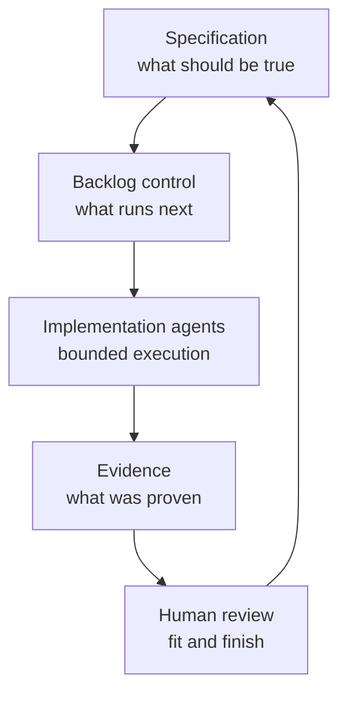

# The Spec-Driven Insufficiency

**Spec-Driven Development Is Necessary But Not Sufficient**

<!-- markdownlint-disable MD034 -->

_Part 4 of a series of articles on succeeding with Agentic Agile Delivery_

Spec-driven development is a major step forward. But once the spec exists, I still have to manage execution.

That is the gap I want to name here. Specs define what should be true. They do not, by themselves, prove how each part became true, who is working which piece, or what to do when a large intent has to be delivered by many small, sometimes parallel, agent sessions.

## The Industry Already Moved Toward Specs

I have watched the market already leave prompt-only development behind. **GitHub Spec Kit** positions spec-driven development as the path beyond vibe coding, turning a product idea into structured requirements before any code is generated. **Atlassian Rovo Dev** runs a _Jira-centered flow_ where work items, acceptance criteria, and pull request review are tied together so an agent has more than a single instruction to act on. **Kiro** formalizes requirements, design, and task files as first-class inputs, treating the spec as a durable artifact rather than a disposable prompt. **GitHub Copilot**'s coding agent can be assigned an issue directly, work in the background, open a pull request, run tests, and ask for review.

None of these products ship "type a prompt, get an app." They ship structure: requirements, designs, tasks, acceptance criteria, linked work items. That convergence is, to me, the strongest signal in the market. Specification engineering is replacing prompt engineering as the entry point for serious AI-assisted delivery.

I give that real credit. It is also incomplete.

## Where Specifications Stop

A specification describes intent. It does not, on its own, govern what happens when that intent meets a live codebase, a fleet of agents, and the ordinary friction of software delivery.

I have watched a specification still fail in execution when:

- the work is too large for one agent session,
- dependencies between pieces of the spec are unclear,
- two parallel tasks touch the same files or interfaces,
- review evidence is scattered across chat transcripts instead of durable artifacts,
- the agent drifts from the process once context grows long,
- nobody can tell, after the fact, which parts were tested, reviewed, paused, or pivoted.

Every one of those failure modes is invisible from the spec itself. I have seen the spec be excellent and the delivery still be ungoverned.

## Specs Define What Should Be True. Stories Prove How Each Part Became True.

Spec-driven development answers one question: what are we trying to build? Story-governed development answers a different, harder question I keep having to answer myself: which small piece is being worked right now, by whom or what, under which gates, with what evidence left behind?

I do not treat those as competing answers. They are sequential layers. The spec sets direction. The backlog of stories underneath it is where that direction gets executed, checked, and proven, one bounded unit at a time.

A team that stops at the spec has documented its intent well and left execution to chance. What I have found is that a team that adds story-level gates and evidence closes the loop: intent flows down into bounded work, and proof flows back up into review.

## The Progressive Elaboration Problem

There is a second gap I keep running into that spec-driven tooling rarely addresses: timing.

A full product specification can be large enough that planning every detail up front becomes waste. Requirements written today may not match the codebase by the time a low-priority feature finally gets picked up. The pattern that has worked for me, familiar from classic work breakdown structure guidance, is progressive elaboration: keep epics and features light until their priority and dependency position justify deeper planning, then perform detailed design at the story or task level, close to execution, when the codebase is current.

Agentic AI did not invent this discipline for me. It raised the cost of skipping it. One vague spec, handed to a human team, produces a round of clarifying questions. The same vague spec, handed to an agent fleet, can fan out into several confident but divergently-interpreted implementations before anyone notices the drift.

## Practical Takeaway

If your team has adopted spec-driven tooling, I would treat that as step one, not the finish line. Ask a second question of every spec: what is the smallest unit of execution, what gate proves each unit is done, and what evidence survives after the agent session ends? A spec without that layer is a well-written wish list, in my experience. A spec with it becomes a governed delivery system.

## Series Link

This article explains why specs need an execution layer underneath them, the layer I had to build for myself. The next article, [The Rise Of The Technical Product Owner](05-the-product-owner-escalation.md), defines the human role that operates that layer.

## The AITM Pattern: Spec To Story To Evidence

I introduced AITM — `@kburson/ai-task-manager` — in the [opening article](02-the-backlog-governance-postulate.md#aitm-and-the-backlog-manager-pattern): the skill I built after hitting the exact wall described above one too many times. This is the piece of AITM that answers the spec-to-story gap directly.

AITM treats the backlog as the execution layer beneath the spec. The spec becomes epics, sub-issues, standalone stories, dependencies, sequence waves, estimates, and acceptance criteria. Each item then moves through a state machine — Backlog, Assigned, Refine, Plan, Develop, Test, Review, Done — and every state carries an entry gate, a state action, and an exit gate.

The just-in-time planner is the bridge I built between the spec and the implementation. It delays detailed design until the smallest useful work item reaches the Plan state, then requires a deep-dive analysis against the actual repository before any code is touched in Develop. That is progressive elaboration enforced structurally rather than left to individual judgment.

This is also where the Technical Product Owner role becomes technical, in my experience. The TPO/TPM is not replacing the architect or the senior engineer, but they need enough architectural literacy and delivery-risk awareness to decide which specifications become epics, which epics become stories, which stories can run in parallel without collision, and which tasks need a deeper plan before an agent is allowed to touch code.

## Series Roadmap

| Status      | #      | Article                                                                                                            | Role In Series                                       |
| ----------- | ------ | ------------------------------------------------------------------------------------------------------------------ | ---------------------------------------------------- |
|             | 01     | [The Refactoring Bloat Precursor](01-the-refactoring-bloat-precursor.md)                                           | Prequel: history of AI-assisted coding before agents |
|             | 02     | [The Rise Of Technical Product Operations](02-the-backlog-governance-postulate.md)                                 | Industry thesis: Technical Product Operations        |
|             | 03     | [The Vibe Coding Hangover](03-the-vibe-coding-deficiency.md)                                                       | Failure mode: vibe slop and review debt              |
| **Current** | **04** | **[Spec-Driven Development Is Necessary But Not Sufficient](04-the-spec-driven-insufficiency.md)**                 | Why specs need execution governance                  |
|             | 05     | [The Rise Of The Technical Product Owner](05-the-product-owner-escalation.md)                                      | Human operator: TPO/TPM as delivery architect        |
|             | 06     | [The Backlog Becomes The Control Plane](06-the-backlog-control-plane-conjecture.md)                                | Backlog as executable control surface                |
|             | 07     | [The Just-In-Time Planner](07-the-just-in-time-planning-paradox.md)                                                | Progressive decomposition and deep dives             |
|             | 08     | [Context Durability Is A Feature](08-the-context-durability-corollary.md)                                          | JIT loading and post-compaction recovery             |
|             | 09     | [Evidence Beats Trust](09-the-evidence-over-trust-theorem.md)                                                      | Evidence gates and auditability                      |
|             | 10     | [The Adapter Future](10-the-adapter-convergence.md)                                                                | Backlog and agent platform adapters                  |
|             | 11     | [Agentic Concurrency Isn't Free — And "50 Parallel Agents" Is Hyperbole](11-the-agentic-concurrency-deficiency.md) | Concurrency ceiling and coordination cost            |
|             | 12     | [XP's Practices Survived. Their Reasons Did Not.](12-the-xp-survival-anomaly.md)                                   | XP practices under agentic delivery                  |
|             | 13     | [The Diff Isn't Where Your Judgment Lives Anymore](13-the-diff-displacement.md)                                    | Spec review displaces code review                    |
|             | 14     | [It's All About Perspective](14-the-second-reviewer-corollary.md)                                                  | Cross-model review for a genuine second opinion      |

## LinkedIn Article Shape

Opening hook:

> Spec-driven development is a major step forward. But once the spec exists, someone still has to manage execution.

Middle:

- Show the vendor trend toward specs.
- Explain where specs stop.
- Introduce the story as the unit of accountability.

Close:

> The winning pattern is not prompt-first or spec-only. It is spec-to-story-to-evidence.

## Bibliography

- GitHub. "GitHub Spec Kit." https://github.com/github/spec-kit
- GitHub Blog. "Spec-driven development with AI: Get started with a new open source toolkit." https://github.blog/ai-and-ml/generative-ai/spec-driven-development-with-ai-get-started-with-a-new-open-source-toolkit/
- Atlassian. "Spec Driven Development with Rovo Dev." https://www.atlassian.com/blog/development/spec-driven-development-with-rovo-dev
- Atlassian. "Rovo Dev in Jira as my Spec Driven executor." https://www.atlassian.com/blog/development/rovo-dev-in-jira-as-my-spec-driven-executor
- Atlassian Support. "Check acceptance criteria in a code review." https://support.atlassian.com/rovo/docs/check-acceptance-criteria-in-a-code-review/
- Kiro Docs. "Specs." https://kiro.dev/docs/specs/
- Kiro Docs. "Feature Specs." https://kiro.dev/docs/specs/feature-specs/
- GitHub Blog. "Assigning and completing issues with coding agent in GitHub Copilot." https://github.blog/ai-and-ml/github-copilot/assigning-and-completing-issues-with-coding-agent-in-github-copilot/
- GitHub Docs. "Using Copilot cloud agent on GitHub." https://docs.github.com/en/copilot/how-tos/use-copilot-agents/cloud-agent/use-cloud-agent-on-github
- Atlassian. "What is backlog refinement?" https://www.atlassian.com/agile/scrum/backlog-refinement
- Project Management Institute. "Applying work breakdown structure to the project lifecycle." https://www.pmi.org/learning/library/applying-work-breakdown-structure-project-lifecycle-6979
