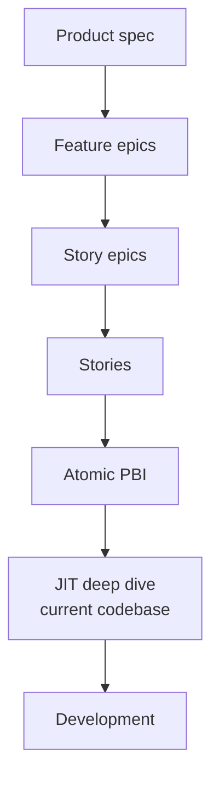
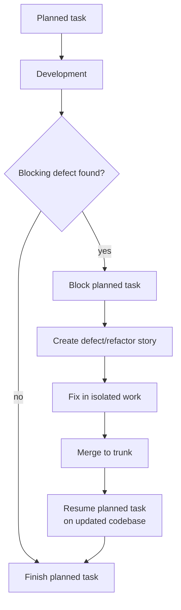

# The Just-In-Time Planner

<!-- markdownlint-disable MD034 -->

_Part 6 of a series of articles on succeeding with Agentic AI Delivery_

## Draft Thesis

The most powerful part of AITM may not be the state machine or the timing log. What I have found is that it is the planning discipline: keep large plans intentionally light, decompose them progressively, and perform detailed design only when the smallest executable work item is ready to be built.

I call that just-in-time planning for agentic software delivery.

## Core Argument

Large product specifications have to describe intent, structure, and expected behavior, in my view. They should not pretend to freeze every implementation decision.

In ordinary project management language, a large spec becomes a work breakdown structure. Product scope breaks into features, features break into epics, epics break into stories, and stories eventually become atomic product backlog items. Agile and project-management practices already recognize pieces of this idea through WBS planning, backlog refinement, progressive elaboration, rolling-wave planning, and the last responsible moment.

I built AITM to apply that discipline to AI agents.

This is the same reason established SDLC patterns matter more to me with agent fleets. A human team can sometimes tolerate premature detail because people remember caveats and renegotiate assumptions. Independent agents need the structure to be explicit and current.

At the top of the backlog, I keep detail deliberately thin:

- Intent.
- Scope.
- Priority.
- Size.
- Dependencies.
- Stack ranking.
- Enough acceptance shape to preserve product meaning.

That avoids spending hours over-designing future work before the codebase has changed. It also prevents the agent from dragging too much stale planning context into execution.

As work moves upward in priority, AITM decomposes another layer. A large product spec may stop at feature epics. A single-feature spec may decompose into story epics and child stories. The top-ranked item is picked up, analyzed for dependency order, and broken down until the backlog reaches an atomic task: a piece of work small enough to finish in a few hours.

Only then does the task move from Refinement into Planning.

## The Deep-Dive Moment

The Plan state is where I have AITM spend detail.

At that point, the agent performs a deep-dive analysis against the codebase as it exists now, not as it existed when the original spec was written. The task definition gets filled in with:

- Files that need to be touched.
- Existing areas that need extension.
- Existing areas that need refactoring.
- New areas that must be created.
- Test additions.
- Verification commands.
- Dependencies and blockers.
- Risks beyond the original scope.

This is the last responsible moment for detailed planning, in my experience. The agent has the product intent, the current repository state, and the immediate task boundary. That combination produces a better plan than either a giant up-front spec or a free-form coding prompt.

## Why This Matters For Agentic AI

AI agents are vulnerable to stale plans, in what I have observed.

If a large feature is fully decomposed and deeply planned too early, every later task inherits assumptions from an older codebase. By the time task seven begins, tasks one through six may have changed the architecture, test layout, helper APIs, or naming conventions.

AITM's JIT planner avoids that trap. Each task designs itself against the latest trunk or current branch state. Sometimes that confirms the original plan. Sometimes it exposes a better path. Sometimes it reveals a defect, missing abstraction, or necessary refactor.

I do not treat that as failure. I treat it as the system learning at the correct time.

## Discovered Work And Blocking Defects

Real implementation uncovers work that planning could not responsibly know about, in my experience.

When a task in Development discovers a blocking defect or necessary refactor, I have AITM create a defect or refactor story, block the current task, switch to the discovered work, fix it in isolation, merge it back, then resume the original task against the updated codebase.

That matters to me because autonomous agents otherwise tend to hide discovered work inside the current branch. The result is scope creep, tangled commits, unclear review boundaries, and unreliable timing data.

I have AITM make discovered work explicit:

- The planned task is blocked for a named reason.
- The discovered work gets its own issue.
- The defect or refactor can be fixed and reviewed independently.
- The original task resumes after the codebase is clean.
- The resumed task rebases onto the updated trunk or branch before continuing.

The workflow preserves both momentum and auditability, in my experience.

## Series Link

This article explains how I have AITM manage planning depth. The next article, [Context Durability Is A Feature](06-context-durability.md), explains how AITM keeps the agent's process rules durable during long-running work.

## AITM Perspective

I introduced AITM — `@kburson/ai-task-manager` — in the [opening article](00-technical-product-operations.md#aitm-and-the-backlog-manager-pattern): the skill I built after hitting the exact wall described above one too many times. Its JIT planner is a practical version of progressive elaboration for agent fleets.

The high-level backlog answers:

- What are we trying to achieve?
- What should be done first?
- What can run in parallel?
- What depends on what?

The task-level deep dive answers:

- What is true in the codebase right now?
- What exact files and tests are involved?
- What is the smallest credible implementation plan?
- What evidence will prove completion?

The difference is the timing. AITM does not burn maximum detail at the top of the WBS. It spends detail where uncertainty is lowest and execution is nearest.

I own that timing decision, as the TPO/TPM. I decide when a feature is still only product intent, when it deserves an epic, when an epic should decompose into stories, and when a story is small enough for an implementation agent to pick up for current-code planning.

## Series Roadmap

| Status      | #      | Article                                                                                    | Role In Series                                |
| ----------- | ------ | ------------------------------------------------------------------------------------------ | --------------------------------------------- |
|             | 00     | [The Rise Of Technical Product Operations](00-technical-product-operations.md)             | Industry thesis: Technical Product Operations |
|             | 01     | [The Vibe Coding Hangover](01-vibe-coding-hangover.md)                                     | Failure mode: vibe slop and review debt       |
|             | 02     | [Spec-Driven Development Is Necessary But Not Sufficient](02-spec-driven-is-not-enough.md) | Why specs need execution governance           |
|             | 03     | [The Rise Of The Technical Product Owner](03-technical-product-owner.md)                   | Human operator: TPO/TPM as delivery architect |
|             | 04     | [The Backlog Becomes The Control Plane](04-backlog-as-control-plane.md)                    | Backlog as executable control surface         |
| **Current** | **05** | **[The Just-In-Time Planner](05-just-in-time-planner.md)**                                 | Progressive decomposition and deep dives      |
|             | 06     | [Context Durability Is A Feature](06-context-durability.md)                                | JIT loading and post-compaction recovery      |
|             | 07     | [Evidence Beats Trust](07-evidence-beats-trust.md)                                         | Evidence gates and auditability               |
|             | 08     | [The Adapter Future](08-adapter-future.md)                                                 | Backlog and agent platform adapters           |

## LinkedIn Article Shape

Opening hook:

> The mistake is not asking AI to plan. The mistake is asking AI to plan everything too early.

Middle:

- Explain WBS and progressive elaboration in plain language.
- Contrast large up-front AI specs with JIT task planning.
- Show how AITM decomposes work layer by layer.
- Explain deep-dive planning against current code.
- Explain discovered work and blocking-defect pivots.

Close:

> The future of AI-assisted delivery is not one massive plan executed blindly. It is a living backlog that keeps intent stable, delays detail until it is useful, and replans each atomic task against the codebase that actually exists.

## Bibliography

- AI Task Manager. "Agentic Development Process." https://github.com/kburson/ai-task-manager/blob/trunk/docs/introduction/agentic-development-process.md
- AI Task Manager. "Core Workflow." https://github.com/kburson/ai-task-manager/blob/trunk/docs/introduction/core-workflow.md
- AI Task Manager. "State Slug Migration History." https://github.com/kburson/ai-task-manager/blob/trunk/docs/migration-history.md
- AI Task Manager. "Blocking-defect isolation dance - design." https://github.com/kburson/ai-task-manager/blob/trunk/docs/superpowers/specs/2026-07-11-blocking-defect-isolation-design.md
- Project Management Institute. "Applying work breakdown structure to the project lifecycle." https://www.pmi.org/learning/library/applying-work-breakdown-structure-project-lifecycle-6979
- Atlassian. "What is backlog refinement?" https://www.atlassian.com/agile/scrum/backlog-refinement
- Scaled Agile. "Enterprise Backlog Structure and Management." https://framework.scaledagile.com/enterprise-backlog-structure-and-management
- Scaled Agile. "Large Solution Refinement: Paving the Super-Highway of Value Delivery." https://scaledagile.com/blog/large-solution-refinement-paving-the-super-highway-of-value-delivery/
- ProjectManagement.com. "Are you doing progressive elaboration or perpetual elaboration?" https://www.projectmanagement.com/blog-post/36710/Are-you-doing-progressive-elaboration-or-perpetual-elaboration-
- Agile For All. "New to agile? Remember one thing: Just enough, just in time." https://agileforall.com/new-to-agile-remember-one-thing-just-enough-just-in-time/
- Jimmie Butler. "How To Make Better Product Decisions By Waiting Until the Last Responsible Moment." https://jimmiebutler.com/the-last-responsible-moment/
