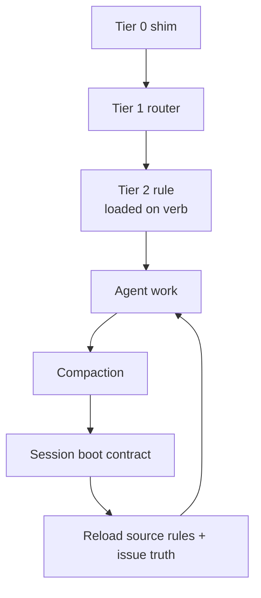
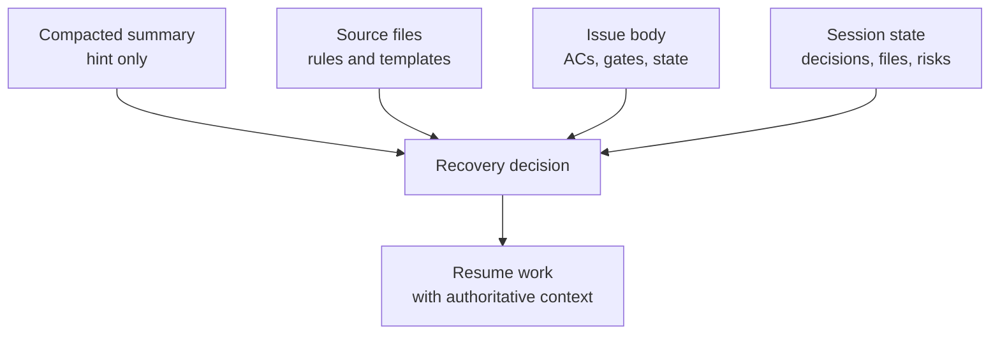

# The Context Durability Corollary

**Context Durability Is A Feature**

<!-- markdownlint-disable MD034 -->

_Part 8 of a series of articles on succeeding with Agentic Agile Delivery_

## Draft Thesis

Long-running agentic development does not only fail because the model writes bad code, in my experience. It also fails because the agent forgets the rules that made the work safe.

I do not treat context management as an optimization detail. I treat it as a product feature.

## Core Argument

Modern AI coding sessions begin with a large amount of inherited context: system instructions, tool schemas, user preferences, project instructions, skills, plugins, memory files, workflow rules, and issue content. Before the agent has written a line of code, the session may already carry tens of thousands of tokens.

That creates two problems I kept running into.

First, eager loading burns context on rules that may never be used. A session that only needs to bind an issue should not pay for parallel-agent fan-out rules, close-gate details, backlog orchestration, config interviews, and every review path.

Second, compaction can weaken the agent's operating discipline. A compacted summary may preserve the story while losing the precise rule. It may remember "close the issue" but drop "never call `gh issue close` directly." It may remember that a review happened but lose the required gate sequence.

That is how I have watched long autonomous sessions drift. Not because the original prompt was weak, but because the operating system was compressed into a lossy narrative.

For agent fleets, I think this is an SDLC problem. A process that depends on a fragile chat transcript is not a process. It is an oral tradition with a token limit.

## Post-Compaction Recovery

The more interesting feature, to me, is what happens after compaction.

Compaction is useful because it makes room for new work. It is also dangerous because it can delete or paraphrase the exact instructions that make the skill enforceable.

I handle this in AITM with sentinels and a post-compaction boot contract.

Frequently loaded files carry version markers. When loaded, they emit live-context sentinels such as `aitm-skill-loaded:router:<version>`. During an ordinary live session, the agent can skip re-reading a file if the matching sentinel is present.

After compaction, I no longer trust those sentinels. The boot contract says to treat old `aitm-skill-loaded:*` markers as expired, reload Tier-1 source files from disk, re-emit fresh sentinels, and only then continue with the selected verb.

That distinction matters to me:

- Live session: sentinels prevent redundant loading.
- Post-compaction session: sentinels are invalidated because the full rule text may have been lost.

The compacted summary becomes a hint. The source files, issue body, config, pickup directive, and session state become authority.

## Why This Matters For Full-Auto Epic Work

The ideal operating model, for me, is one fresh session per task. That keeps context narrow and makes recovery simple.

But real agentic delivery sometimes needs longer runs. In full-auto epic work, an orchestrator may process multiple child stories, coordinate workers, handle defects, pause for pivots, and resume the original path. That kind of session can cross compaction thresholds.

Without context durability, I have watched the agent continue after compaction with a weakened copy of the process. It still knows the goal, but no longer reliably knows the gates.

AITM's context design gives long sessions a recovery path:

- Pause and timing events remain auditable.
- Session boot reloads core rules.
- Active issue bodies reload task truth.
- Pickup directives reload execution discipline.
- Session-state artifacts preserve decisions, active files, verification status, and risks.
- Workers reload source rules instead of inheriting paraphrased orchestrator prompts.

This is what makes the skill durable across multiple compactions, in my experience.

It also keeps me, as the TPO/TPM, from becoming the memory system. I want to decide direction, priorities, and pivots. I should not have to restate the rules of the delivery process after every compaction.

## The Product-Management Angle

For product and project managers, context durability is invisible until it fails, in my experience.

When it fails, the symptoms look like bad AI behavior:

- The agent skips a gate it followed earlier.
- The agent closes work through the wrong path.
- The agent forgets the reason a task was blocked.
- The agent resumes from stale assumptions.
- The agent buries a defect inside the current task instead of filing discovered work.

My answer, in AITM, is to externalize authority. I let the agent forget, but the system has to know how to recover.

That, to me, is the difference between a helpful coding chat and an agentic delivery process.

## Series Link

This article explains how I keep the process surviving long sessions. The next article, [Evidence Beats Trust](09-the-evidence-over-trust-theorem.md), explains why durable process must leave durable proof.

## AITM Perspective

I introduced AITM — `@kburson/ai-task-manager` — in the [opening article](02-the-backlog-governance-postulate.md#aitm-and-the-backlog-manager-pattern): the skill I built after hitting the exact wall described above one too many times. I built it to treat context as a managed resource.

The skill is deliberately carved into three tiers:

- Tier 0: a tiny installed shim.
- Tier 1: a router with universal rules and a verb-to-rule-file table.
- Tier 2: focused rule files loaded only when a specific verb or situation needs them.

The result is not a smaller workflow. It is a shaped workflow. The capability still exists, but the agent only carries the parts that are operationally relevant.

AITM's own measurements show the effect. The old monolithic skill loaded roughly 12,000 tokens on first use. The JIT loader brought the first-invocation path under 3,000 tokens, with realistic active sessions staying under the defined context budgets.

## Series Roadmap

| Status      | #      | Article                                                                                    | Role In Series                                |
| ----------- | ------ | ------------------------------------------------------------------------------------------ | --------------------------------------------- |
|             | 01     | [The Refactoring Bloat Precursor](01-the-refactoring-bloat-precursor.md)                            | Prequel: history of AI-assisted coding before agents |
|             | 02     | [The Rise Of Technical Product Operations](02-the-backlog-governance-postulate.md)             | Industry thesis: Technical Product Operations |
|             | 03     | [The Vibe Coding Hangover](03-the-vibe-coding-deficiency.md)                                     | Failure mode: vibe slop and review debt       |
|             | 04     | [Spec-Driven Development Is Necessary But Not Sufficient](04-the-spec-driven-insufficiency.md) | Why specs need execution governance           |
|             | 05     | [The Rise Of The Technical Product Owner](05-the-product-owner-escalation.md)                   | Human operator: TPO/TPM as delivery architect |
|             | 06     | [The Backlog Becomes The Control Plane](06-the-backlog-control-plane-conjecture.md)                    | Backlog as executable control surface         |
|             | 07     | [The Just-In-Time Planner](07-the-just-in-time-planning-paradox.md)                                     | Progressive decomposition and deep dives      |
| **Current** | **08** | **[Context Durability Is A Feature](08-the-context-durability-corollary.md)**                            | JIT loading and post-compaction recovery      |
|             | 09     | [Evidence Beats Trust](09-the-evidence-over-trust-theorem.md)                                         | Evidence gates and auditability               |
|             | 10     | [The Adapter Future](10-the-adapter-convergence.md)                                                 | Backlog and agent platform adapters           |
|             | 11     | [Agentic Concurrency Isn't Free — And "50 Parallel Agents" Is Hyperbole](11-the-agentic-concurrency-deficiency.md) | Concurrency ceiling and coordination cost |
|             | 12     | [XP's Practices Survived. Their Reasons Did Not.](12-the-xp-survival-anomaly.md)                | XP practices under agentic delivery                          |
|             | 13     | [The Diff Isn't Where Your Judgment Lives Anymore](13-the-diff-displacement.md)                 | Spec review displaces code review                             |
|             | 14     | [It's All About Perspective](14-the-second-reviewer-corollary.md)                               | Cross-model review for a genuine second opinion                |

## LinkedIn Article Shape

Opening hook:

> Your agent does not only hallucinate facts. After compaction, it can hallucinate your process.

Middle:

- Explain context bloat in plain terms.
- Contrast monolithic skill loading with tiered JIT loading.
- Explain why compaction summaries are not authoritative.
- Show how AITM reloads rules from source after compaction.
- Connect this to long-running full-auto epic sessions.

Close:

> Agentic delivery needs more than memory. It needs durable authority outside the chat window.

## Bibliography

- AI Task Manager. "How AI Task Manager Keeps Agent Context Small and Rules Fresh." https://github.com/kburson/ai-task-manager/blob/trunk/docs/introduction/context-management-skill-architecture.md
- AI Task Manager. "Cutting Context Bloat With the Just-In-Time Skill Loader." https://github.com/kburson/ai-task-manager/blob/trunk/docs/jit-loader-results.md
- AI Task Manager. "Design." https://github.com/kburson/ai-task-manager/blob/trunk/docs/DESIGN.md
- AI Task Manager. "Worker Context Contract." https://github.com/kburson/ai-task-manager/blob/trunk/docs/guides/worker-context-contract.md
- AI Task Manager. "Agentic Development Process." https://github.com/kburson/ai-task-manager/blob/trunk/docs/introduction/agentic-development-process.md
- AI Task Manager. "Core Workflow." https://github.com/kburson/ai-task-manager/blob/trunk/docs/introduction/core-workflow.md
