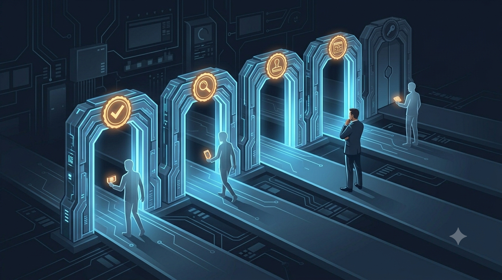
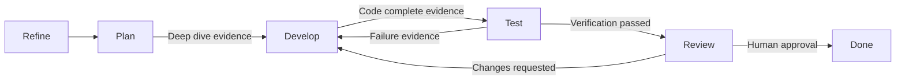

# The Evidence-Over-Trust Theorem

**Evidence Beats Trust**

<!-- markdownlint-disable MD034 -->

_Part 9 of a series of articles on succeeding with Agentic Agile Delivery_

I do not want to trust an AI agent. I want the agent to leave enough evidence that trust is no longer the main control.

That distinction matters more than it sounds. Trust is a feeling one party has about another. Evidence is a property of the work itself: inspectable, reproducible, and independent of how confident the agent's output sounds. I think agentic delivery should be built around the second thing, not the first.

## The Trust Gap Is Not Abstract

The public data on this is unusually direct, and I find it hard to look away from. **Stack Overflow**'s 2025 developer survey found that more developers distrust AI output accuracy than trust it — a striking result given how widely AI coding tools have already been adopted. **METR**'s randomized study of experienced open-source developers found something even sharper: developers believed AI tooling made them faster, while measured task completion time actually increased by 19%. That gap between felt productivity and measured productivity is exactly the kind of thing evidence is supposed to catch and trust alone cannot, in my view.

**OWASP**'s guidance on large language model applications and agentic AI, and **NIST**'s _AI Risk Management Framework_, both converge on the same prescription from the security and governance side: agentic systems need controls, risk management, and disciplined handling of AI behavior, not reassurance about model quality.

The lesson I take from all of it is direct. Confidence without evidence is dangerous, whether the confidence belongs to the model or to the human reviewing its output.

## What Evidence Actually Has To Answer

Agentic delivery needs observable proof, not narrative, in my experience. At minimum, I think a governed workflow should be able to answer:

- What issue was the agent working on?
- What state was the issue in when work started?
- Which acceptance criteria were checked, and how?
- What tests ran, and what was the result?
- What failed, and what changed after the failure?
- What human decision was made, and when?
- How much agent time and human review burden did the task actually consume?

Without answers to those questions, I have watched AI-assisted work become a chain of persuasive narratives — plausible summaries of what happened, standing in for what can actually be verified. That is precisely the failure mode the rest of this series has been building toward since the **vibe coding hangover** I described in [article one](02-the-backlog-governance-postulate.md): fast output that nobody can cheaply confirm is correct.

Traditional SDLC ceremonies already degrade into status theater when the evidence behind them is weak — a standup where "done" means "I said it's done." Agentic AI raises the cost of that weakness sharply, in my experience. If implementation agents are producing work at a pace no human team could match, I need objective signals as the **Technical Product Owner** to decide whether a given piece of work is really ready, blocked, defective, or complete — because there is no longer time to eyeball every line before deciding.

## Evidence Gates Across The State Machine

The strongest version of this idea, to me, is not evidence collected after the fact. It is evidence required as a condition of movement — a gate that a state transition cannot pass without.

Each arrow in that diagram is a claim that has to be backed by something concrete before I let it fire. Plan cannot advance to Develop without a deep-dive analysis against the current codebase. Develop cannot advance to Test without evidence that the code is actually complete against its acceptance criteria. Test cannot advance to Review without verification passing, and can send work back to Develop on failure evidence just as easily as it can send it forward. Review requires a human approval, not merely an agent's assertion that the work is good. The graph does not describe optimism. It describes proof.

## Better Executive Language

It is tempting to oversell this as a trust story. I try to resist it.

I avoid saying:

> This creates more trust than human teams.

I say instead:

> This creates more inspectable evidence than many human workflows currently capture.

The second version is both more defensible and, in my experience, more persuasive to an audience that already distrusts confident AI output — which, per **Stack Overflow**'s own numbers, is most of them.

## Practical Takeaway

Before scaling up agent-assisted delivery, I would inventory what evidence the current workflow actually produces at each state transition. If "the agent said it's done" is the strongest artifact behind a Done column, that is the gap I would close first — before adding more agents, not after.

## Series Link

This article explains the trust mechanism I rely on. The final article, [The Adapter Future](10-the-adapter-convergence.md), explains why backlog systems and AI hosts need APIs that can carry these controls across platforms.

## The AITM Pattern

I introduced AITM — `@kburson/ai-task-manager` — in the [opening article](02-the-backlog-governance-postulate.md#aitm-and-the-backlog-manager-pattern): the skill I built after hitting the exact wall described above one too many times. It treats evidence as a first-class product of the workflow, not an afterthought bolted onto reporting:

- Timing logs record starts, pauses, updates, and closes as durable comment history on the issue itself.
- Context-word counters approximate the human review burden a given task actually consumed.
- Gate checks block premature movement between workflow states rather than trusting a status label.
- Pickup directives make an interrupted task restartable from durable state, not from memory.
- Post-compaction boot rules reload authoritative process files once compressed context can no longer be trusted as a source of truth.
- Deep-dive sections force the agent to inspect the current repository state before writing implementation code.
- Review gates require acceptance-criteria evidence and verification output before a task can be marked complete.

None of this is bureaucracy for its own sake, in my experience. The goal is survivable autonomy: enough structural proof that an agent fleet can move fast without the team losing the ability to tell what actually happened.

Evidence is also what lets me, as the TPO/TPM, supervise at a higher altitude without reading every generated line in real time. It converts agent output from a claim into inspectable delivery state — something I can audit in minutes instead of re-litigating from scratch.

## Series Roadmap

| Status      | #      | Article                                                                                    | Role In Series                                |
| ----------- | ------ | ------------------------------------------------------------------------------------------ | --------------------------------------------- |
|             | 01     | [The Refactoring Bloat Precursor](01-the-refactoring-bloat-precursor.md)                            | Prequel: history of AI-assisted coding before agents |
|             | 02     | [The Rise Of Technical Product Operations](02-the-backlog-governance-postulate.md)             | Industry thesis: Technical Product Operations |
|             | 03     | [The Vibe Coding Hangover](03-the-vibe-coding-deficiency.md)                                     | Failure mode: vibe slop and review debt       |
|             | 04     | [Spec-Driven Development Is Necessary But Not Sufficient](04-the-spec-driven-insufficiency.md) | Why specs need execution governance           |
|             | 05     | [The Rise Of The Technical Product Owner](05-the-product-owner-escalation.md)                   | Human operator: TPO/TPM as delivery architect |
|             | 06     | [The Backlog Becomes The Control Plane](06-the-backlog-control-plane-conjecture.md)                    | Backlog as executable control surface         |
|             | 07     | [The Just-In-Time Planner](07-the-just-in-time-planning-paradox.md)                                     | Progressive decomposition and deep dives      |
|             | 08     | [Context Durability Is A Feature](08-the-context-durability-corollary.md)                                | JIT loading and post-compaction recovery      |
| **Current** | **09** | **[Evidence Beats Trust](09-the-evidence-over-trust-theorem.md)**                                     | Evidence gates and auditability               |
|             | 10     | [The Adapter Future](10-the-adapter-convergence.md)                                                 | Backlog and agent platform adapters           |

## LinkedIn Article Shape

Opening hook:

> I do not want to trust an AI agent. I want the agent to leave enough evidence that trust is no longer the main control.

Middle:

- Present the trust gap.
- Explain why chat logs are weak evidence.
- Show the evidence categories a governed workflow should capture.

Close:

> The mature AI delivery conversation will not be about whether the agent sounded confident. It will be about whether the work left a trail strong enough to review.

## Bibliography

- Stack Overflow. "2025 Developer Survey: AI." https://survey.stackoverflow.co/2025/ai
- Stack Overflow. "Mind the gap: Closing the AI trust gap for developers." https://stackoverflow.blog/2026/02/18/closing-the-developer-ai-trust-gap/
- METR. "Measuring the Impact of Early-2025 AI on Experienced Open-Source Developer Productivity." https://metr.org/blog/2025-07-10-early-2025-ai-experienced-os-dev-study/
- DORA. "State of AI-assisted Software Development 2025." https://dora.dev/dora-report-2025/
- DORA. "ROI of AI-assisted Software Development." https://dora.dev/ai/
- OWASP. "Top 10 for Large Language Model Applications." https://owasp.org/www-project-top-10-for-large-language-model-applications/
- OWASP. "Agentic AI - Threats and Mitigations." https://genai.owasp.org/resource/agentic-ai-threats-and-mitigations/
- NIST. "AI Risk Management Framework." https://www.nist.gov/itl/ai-risk-management-framework
- NIST. "Artificial Intelligence Risk Management Framework: Generative Artificial Intelligence Profile." https://nvlpubs.nist.gov/nistpubs/ai/NIST.AI.600-1.pdf
- AI Task Manager. "Measurement and ROI." https://github.com/kburson/ai-task-manager/blob/trunk/docs/introduction/measurement-and-roi.md
- AI Task Manager. "How AI Task Manager Keeps Agent Context Small and Rules Fresh." https://github.com/kburson/ai-task-manager/blob/trunk/docs/introduction/context-management-skill-architecture.md
