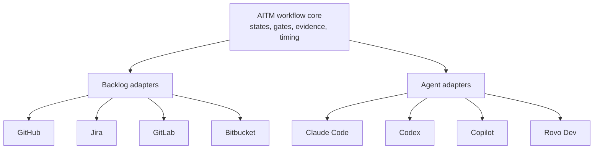

# The Adapter Convergence

**The Adapter Future**

<!-- markdownlint-disable MD034 -->

_Part 10 of a series of articles on succeeding with Agentic Agile Delivery_

The AI coding tool that matters most may not be the one that writes the best function. It may be the one that knows how to work a ticket.

That is a deliberately unglamorous claim to end this series on. But it follows directly from everything I have argued so far: specs need execution governance, the backlog is the control plane, and evidence — not confidence — is what makes agent output trustworthy, to me. None of those patterns are useful if they only work inside one vendor's walled garden.

## Delivery Systems Are Already Fragmented

Software work does not live in one place, in my experience. It lives across:

- GitHub Issues and Projects,
- Jira work items and boards,
- GitLab issues and boards,
- Bitbucket repositories and pull requests,
- CI systems,
- review systems,
- documentation and decision records.

I think AI agents need to operate through those systems, not around them. An agent that can write excellent code but cannot read the acceptance criteria on a Jira ticket, respect a GitLab merge-request gate, or leave evidence somewhere a Bitbucket reviewer will actually see is not integrated into delivery, to me. It is a much faster typist sitting next to the delivery system, disconnected from it.

The first wave of AI coding tools centered on the editor and the chat window. That wave proved the model could write plausible code quickly. What I think the next wave has to do is go deeper: into backlog state, issue hierarchy, acceptance criteria, workflow transitions, pull requests, CI evidence, and review decisions. Everything I have argued throughout this series needs to exist somewhere durable — because a chat transcript is not that place.

## The API Surfaces Already Exist, In Fragments

The good news, as I see it, is that this is not a green-field problem. GitHub Projects exposes automation and GraphQL APIs for issues, fields, and workflow state. Jira exposes issue and transition APIs through its Cloud REST platform. GitLab exposes issue and board APIs. Bitbucket exposes repository and pull request APIs. Each of these systems already has the surface area needed to carry structured work, gates, and evidence.

I do not think the gap is technical impossibility. The gap is productized, portable workflow governance across those systems — a layer that speaks the same operating model (states, gates, evidence, sequencing) regardless of which backlog tool a given team happens to use.

That is a vendor opportunity as much as an engineering one, in my view. The opportunity is not only to expose more code-generation power. It is to expose enough workflow control that TPOs, TPMs, and engineering leaders can manage an agent fleet using SDLC and agile patterns they already recognize, instead of learning a bespoke automation dialect for every tool.

## The Vendor Signal Is Already Here

**GitHub Copilot**'s coding agent and **Atlassian Rovo Dev** both show established vendors moving toward issue- and work-item-centered execution rather than chat-centered execution, in what I have observed. **Kiro** shows a _spec-centered IDE workflow_ built around the same instinct. I do not read these as fringe experiments. I read them as strong signals that the market is converging on structured, backlog-aware agent work as the serious path forward.

The open question I do not think the industry has answered yet is whether platforms will expose enough control for external tools to actually govern agent fleets across systems, or whether each AI host quietly builds its own closed workflow that only talks to itself. The first path produces an ecosystem. The second produces a set of incompatible silos wearing the same "AI coding agent" label.

## Practical Takeaway

When evaluating an AI coding tool or platform, I would not stop at asking how good its generated code is. I would ask what it does with the backlog: can it read structured intent, respect existing gates, write evidence somewhere the team can audit, and hand off cleanly to the review process? A tool that only optimizes the editor is optimizing the smallest part of the problem I have described in this series.

## Series Link

This article closes the series for me by moving from AITM as a local pattern to AITM as an integration argument. Return to the [Research Synopsis](research-synopsis.md) for the evidence map and source taxonomy, or start over at [The Rise Of Technical Product Operations](02-the-backlog-governance-postulate.md).

## The AITM Pattern

I introduced AITM — `@kburson/ai-task-manager` — in the [opening article](02-the-backlog-governance-postulate.md#aitm-and-the-backlog-manager-pattern): the skill I built after hitting the exact wall described above one too many times.

**AITM** currently works through **GitHub** because GitHub was a practical starting point for me: issues, projects, sub-issues, project fields, comments, and pull requests already function as an external system of record without needing anything new to be built. But the pattern I have been describing throughout this series — specs decomposed into governed stories, evidence gates on every state transition, durable timing and review history — should not be GitHub-only by design.

The durable shape I have in mind looks like this:

A workflow core that owns states, gates, evidence, and timing; a backlog adapter for each product-management system a team actually uses; an agent adapter for each AI coding host a team actually runs; a context-management layer that loads detailed rules only when needed and reloads authoritative rules after compaction, as I described in [article eight](08-the-context-durability-corollary.md); and a reporting layer that measures delivery cost, context burden, and acceleration honestly rather than as marketing.

That is how I think agentic AI becomes operationally portable instead of tool-specific. The same role split I have argued throughout this series still applies across every one of those platforms: implementation agents operate inside bounded tasks, the TPO/TPM operates the backlog, sequence, gates, and exceptions, and engineering leaders provide the architecture guardrails and technical standards that bound what "acceptable" means.

## Series Roadmap

| Status      | #      | Article                                                                                    | Role In Series                                |
| ----------- | ------ | ------------------------------------------------------------------------------------------ | --------------------------------------------- |
|             | 01     | [The Refactoring Bloat Precursor](01-the-refactoring-bloat-precursor.md)                            | Prequel: history of AI-assisted coding before agents |
|             | 02     | [The Rise Of Technical Product Operations](02-the-backlog-governance-postulate.md)             | Industry thesis: Technical Product Operations |
|             | 03     | [The Vibe Coding Hangover](03-the-vibe-coding-deficiency.md)                                     | Failure mode: vibe slop and review debt       |
|             | 04     | [Spec-Driven Development Is Necessary But Not Sufficient](04-the-spec-driven-insufficiency.md) | Why specs need execution governance           |
|             | 05     | [The Rise Of The Technical Product Owner](05-the-product-owner-escalation.md)                   | Human operator: TPO/TPM as delivery architect |
|             | 06     | [The Backlog Becomes The Control Plane](06-the-backlog-control-plane-conjecture.md)                    | Backlog as executable control surface         |
|             | 07     | [The Just-In-Time Planner](07-the-just-in-time-planning-paradox.md)                                     | Progressive decomposition and deep dives      |
|             | 08     | [Context Durability Is A Feature](08-the-context-durability-corollary.md)                                | JIT loading and post-compaction recovery      |
|             | 09     | [Evidence Beats Trust](09-the-evidence-over-trust-theorem.md)                                         | Evidence gates and auditability               |
| **Current** | **10** | **[The Adapter Future](10-the-adapter-convergence.md)**                                             | Backlog and agent platform adapters           |
|             | 11     | [Agentic Concurrency Isn't Free — And "50 Parallel Agents" Is Hyperbole](11-the-agentic-concurrency-deficiency.md) | Concurrency ceiling and coordination cost |
|             | 12     | [XP's Practices Survived. Their Reasons Did Not.](12-the-xp-survival-anomaly.md)                | XP practices under agentic delivery                          |
|             | 13     | [The Diff Isn't Where Your Judgment Lives Anymore](13-the-diff-displacement.md)                 | Spec review displaces code review                             |
|             | 14     | [It's All About Perspective](14-the-second-reviewer-corollary.md)                               | Cross-model review for a genuine second opinion                |

## LinkedIn Article Shape

Opening hook:

> The AI coding tool that matters most may not be the one that writes the best function. It may be the one that knows how to work a ticket.

Middle:

- Explain why delivery systems are fragmented.
- Show the existing API surfaces.
- Argue for adapter-based agentic delivery.

Close:

> The future of AI software delivery belongs to tools that can connect intent, work state, agent execution, review evidence, and business reporting across the systems teams already use.

## Bibliography

- GitHub Docs. "Using the API to manage Projects." https://docs.github.com/en/issues/planning-and-tracking-with-projects/automating-your-project/using-the-api-to-manage-projects
- GitHub Docs. "Using Copilot cloud agent on GitHub." https://docs.github.com/en/copilot/how-tos/use-copilot-agents/cloud-agent/use-cloud-agent-on-github
- GitHub Blog. "Assigning and completing issues with coding agent in GitHub Copilot." https://github.blog/ai-and-ml/github-copilot/assigning-and-completing-issues-with-coding-agent-in-github-copilot/
- Atlassian Developer. "Jira Cloud platform REST API v3." https://developer.atlassian.com/cloud/jira/platform/rest/v3/intro/
- Atlassian Developer. "Jira Cloud REST API: Issues." https://developer.atlassian.com/cloud/jira/platform/rest/v3/api-group-issues/
- Atlassian. "Rovo Dev in Jira as my Spec Driven executor." https://www.atlassian.com/blog/development/rovo-dev-in-jira-as-my-spec-driven-executor
- Atlassian Support. "Check acceptance criteria in a code review." https://support.atlassian.com/rovo/docs/check-acceptance-criteria-in-a-code-review/
- GitLab Docs. "REST API resources." https://docs.gitlab.com/api/api_resources/
- GitLab Docs. "Issues API." https://docs.gitlab.com/api/issues/
- GitLab Docs. "Project issue boards API." https://docs.gitlab.com/api/boards/
- Atlassian Developer. "Bitbucket Cloud REST API." https://developer.atlassian.com/cloud/bitbucket/rest/
- Atlassian Developer. "Bitbucket Cloud REST API: Pull requests." https://developer.atlassian.com/cloud/bitbucket/rest/api-group-pullrequests/
- Kiro Docs. "Specs." https://kiro.dev/docs/specs/
