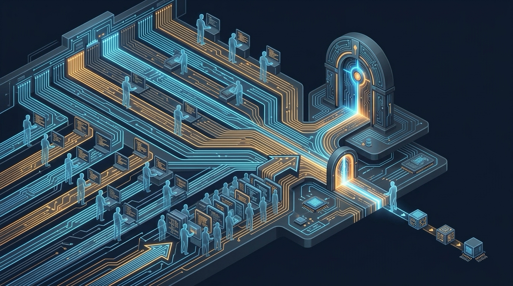
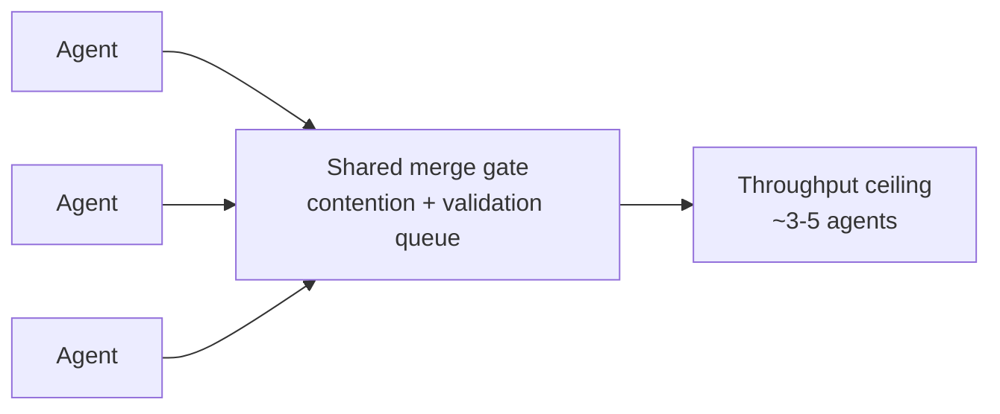
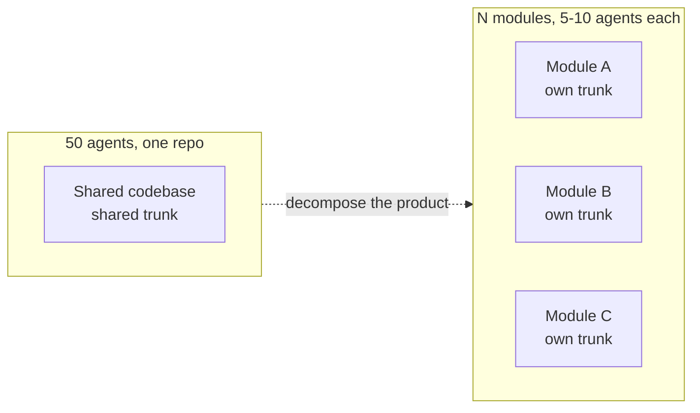

# The Agentic Concurrency Deficiency

**Agentic Concurrency Isn't Free — And "50 Parallel Agents" Is Hyperbole**

<!-- markdownlint-disable MD034 -->

_Part 11 of a series of articles on succeeding with Agentic Agile Delivery_

Scroll through enough AI coding content and you'll find the same promise on repeat: spin up dozens of agents, point them at your codebase, and watch a month of work finish overnight. Fifty parallel agents, one repo, linear speedup. It's a compelling pitch, and it's mostly hyperbole.

Horizontal scaling is real. Agentic development genuinely can move faster by running more work in parallel. But concurrency isn't free, and the cost doesn't scale linearly with the number of agents you add — it scales with the coordination and validation burden those agents create. Past a fairly low ceiling, adding another agent to the same shared codebase doesn't add throughput. It adds contention. The industry is spending 2026 figuring out where that ceiling actually is, and the answer looks nothing like the YouTube demos.

## Why concurrency has a cost curve, not a straight line

Three failure modes show up as soon as you push parallelism past a handful of agents on one codebase, and each one gets worse disproportionately as agent count grows:

**File and state collisions.** Two agents editing the same shared file — a config, a shared route table, a common utility — produce conflicts that neither agent can resolve correctly on its own, because neither has visibility into what the other changed. The fix that's converged across the major agent CLIs this year is strict isolation: every agent gets its own git worktree (or container) against a shared object store, so there's no mutable filesystem to collide over. That solves the _mechanical_ collision problem. It does nothing for the _semantic_ one — two agents can each write code that compiles and passes its own tests, and still contradict each other at runtime. That risk doesn't shrink as you add agents; it compounds, because more agents means more pairwise possibilities for stepping on each other's assumptions.

**Validation load.** Every agent-generated change still has to be proven safe before it merges. Run the full test suite for every parallel change and your CI queue becomes the bottleneck almost immediately — ten agents finishing work simultaneously means ten full validation runs competing for the same pipeline. Teams are answering this with test impact analysis (scoping validation to only what a given diff could have affected) and with distributing runners horizontally, but both of those are themselves engineering investments with real limits, not a switch you flip. The validation phase doesn't scale for free just because the agents did.

**Merge contention.** Even if every individual change is independently valid, a shared trunk can only absorb them one integrated state at a time. This is exactly the classic "many writers, one branch" problem — except agentic development multiplies the write frequency by an order of magnitude compared to a human team. Merge queues and speculative merge-trains exist to manage this, but they have their own throughput ceiling: when a queued change fails, everything behind it in the queue has to be rebuilt and revalidated. More concurrent agents means a longer queue, and a longer queue means each failure costs more, not less.

Put together: the practical ceiling most teams are actually landing on for _supervised parallelism against a shared codebase_ is somewhere around three to five agents before a human reviewing diffs — or the CI pipeline itself — becomes the new bottleneck on how fast work actually ships. Fifty agents on one repo isn't a scaling strategy. It's a demo that hasn't hit its own validation phase yet:

## The pattern that actually works: decompose the product, not just the work

The version of horizontal scaling that's holding up under real usage looks structurally different from "more agents, same repo." It's: decompose the product into independently deployable modules or services, each with its own bounded scope, its own test surface, and its own merge target — and then run five to ten agents _per module_, not fifty agents contending for one shared codebase and one shared trunk.

The difference isn't cosmetic. When the units of work are architecturally independent, the three failure modes above mostly stop compounding across the whole effort:

- File collisions become rare by construction, because agents working on
  different modules aren't touching the same files.
- Validation scopes down naturally, because each module's test suite is
  sized to that module, not the whole product.
- Merge contention gets distributed across multiple trunks instead of
  stacking up against one.

You still get real horizontal throughput — the total number of agents working simultaneously can be just as high, or higher, than the "50 agents, one repo" pitch. The difference is where the boundaries sit. Scale comes from decomposition, not from asking one shared coordination system to absorb more concurrent writers than it was ever designed to handle:

## The honest takeaway

Agentic concurrency has a real ceiling, and it isn't a compute problem — it's a coordination and validation problem, and it gets worse faster than most teams expect once they cross a handful of agents on a shared codebase. The teams getting genuine horizontal gains aren't the ones running the most agents against one repo. They're the ones who did the architectural work to make "more agents" actually mean "more independent units of work," rather than "more contention for the same trunk."

_This is the same principle we're building into AITM, our AI-native task delivery tool: sizing and scoping work into independent units before an agent ever touches it, precisely so that concurrency adds throughput instead of contention. We'll dig into that more in a future piece._

## Series Link

This piece opens a second wave of the series, moving from architecture and adapters into the day-to-day mechanics of running agentic delivery at scale. It follows [The Adapter Future](10-the-adapter-convergence.md) and leads into [The XP Survival Anomaly](12-the-xp-survival-anomaly.md), which asks what's left of Extreme Programming's practices once agents take over the reviewing.

## Series Roadmap

| Status      | #      | Article                                                                                                                | Role In Series                                       |
| ----------- | ------ | ---------------------------------------------------------------------------------------------------------------------- | ---------------------------------------------------- |
|             | 01     | [The Refactoring Bloat Precursor](01-the-refactoring-bloat-precursor.md)                                               | Prequel: history of AI-assisted coding before agents |
|             | 02     | [The Rise Of Technical Product Operations](02-the-backlog-governance-postulate.md)                                     | Industry thesis: Technical Product Operations        |
|             | 03     | [The Vibe Coding Hangover](03-the-vibe-coding-deficiency.md)                                                           | Failure mode: vibe slop and review debt              |
|             | 04     | [Spec-Driven Development Is Necessary But Not Sufficient](04-the-spec-driven-insufficiency.md)                         | Why specs need execution governance                  |
|             | 05     | [The Rise Of The Technical Product Owner](05-the-product-owner-escalation.md)                                          | Human operator: TPO/TPM as delivery architect        |
|             | 06     | [The Backlog Becomes The Control Plane](06-the-backlog-control-plane-conjecture.md)                                    | Backlog as executable control surface                |
|             | 07     | [The Just-In-Time Planner](07-the-just-in-time-planning-paradox.md)                                                    | Progressive decomposition and deep dives             |
|             | 08     | [Context Durability Is A Feature](08-the-context-durability-corollary.md)                                              | JIT loading and post-compaction recovery             |
|             | 09     | [Evidence Beats Trust](09-the-evidence-over-trust-theorem.md)                                                          | Evidence gates and auditability                      |
|             | 10     | [The Adapter Future](10-the-adapter-convergence.md)                                                                    | Backlog and agent platform adapters                  |
| **Current** | **11** | **[Agentic Concurrency Isn't Free — And "50 Parallel Agents" Is Hyperbole](11-the-agentic-concurrency-deficiency.md)** | Concurrency ceiling and coordination cost            |
|             | 12     | [XP's Practices Survived. Their Reasons Did Not.](12-the-xp-survival-anomaly.md)                                       | XP practices under agentic delivery                  |
|             | 13     | [The Diff Isn't Where Your Judgment Lives Anymore](13-the-diff-displacement.md)                                        | Spec review displaces code review                    |
|             | 14     | [It's All About Perspective](14-the-second-reviewer-corollary.md)                                                      | Cross-model review for a genuine second opinion      |

## LinkedIn Article Shape

Opening hook:

> Scroll through enough AI coding content and you'll find the same promise on repeat: spin up dozens of agents, point them at your codebase, and watch a month of work finish overnight.

Middle:

- Explain why concurrency's cost scales with coordination burden, not agent count.
- Walk through the three failure modes: file/state collisions, validation load, merge contention.
- Name the practical ceiling teams are actually landing on — three to five agents against one shared codebase.
- Argue that the real lever is decomposing the product into independent units, not adding more agents to one repo.

Close:

> The teams getting genuine horizontal gains aren't the ones running the most agents against one repo. They're the ones who did the architectural work to make "more agents" actually mean "more independent units of work," rather than "more contention for the same trunk."

## Bibliography

No external sources are cited in this piece — it draws on firsthand experience running parallel agents against a shared codebase, and hitting the ceiling described above, while building AITM.
