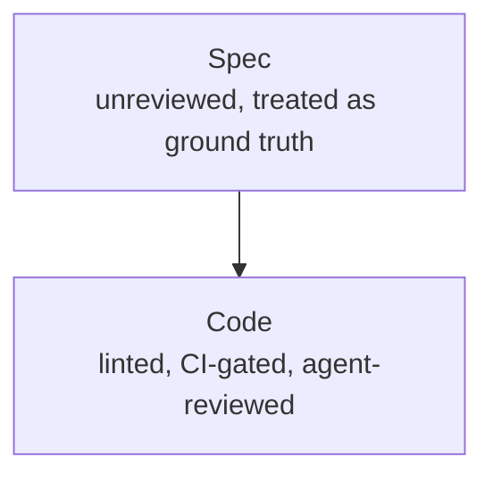

# The Diff Displacement

**The Diff Isn't Where Your Judgment Lives Anymore**

*Code review learned to make judgment calls. The one artifact you actually wrote still isn't getting the same treatment.*

<!-- markdownlint-disable MD034 -->

_Part 13 of a series of articles on succeeding with Agentic Agile Delivery_

Code review started as a checklist — style violations, obvious bugs, missing null checks — and a linter eventually took that whole layer over. What was left for a human was the harder part: does this solve the right problem, in a way that fits how the rest of the system thinks. Agentic code review picked up right where that automation left off, and kept climbing: not just "does this pass the linter" but "should this be three functions instead of one," "does this match the pattern the codebase already committed to." That's real judgment, the kind that used to require a senior engineer, not a script.

Here's where that stops mattering to you, though, if you're actually doing spec-driven development: there's no PR for you to meaningfully review at all. You didn't write the code. You wrote the spec, handed it to the agent, and it iterated the implementation, ran its own tests, and opened — or merged — the PR itself. Reading that diff line by line doesn't tell you whether your intent survived the translation. It only tells you the output looks locally clean, which the agent already checked before you got there.

So the one artifact you actually authored moved up a layer, from code to spec — and the review discipline that just spent a decade climbing the ladder on code hasn't followed it there yet. That gap is where your project's real risk lives now:

## The quiet part

Here's the odd part. Ask a team doing spec-driven development how much scrutiny their code gets, and you'll hear about linting, CI gates, and now an agent doing pattern-level review on top. Ask how much scrutiny their spec gets — the one document in the whole pipeline that's still unambiguously theirs — and the answer gets a lot quieter: "I read it before I sent it," maybe a second pair of eyes if you're lucky, then straight to an agent that treats it as ground truth and starts building.

That's backwards. The code was never the risky part — code is cheap to regenerate, cheap to test, and now it's getting genuinely good automated review. The spec is the expensive part to get wrong, because everything downstream inherits its mistakes: every story in the backlog, every implementation token spent, all of it assumes the spec was right. If code review climbed from "does this compile" to "is this the right pattern," design review is mostly still sitting at "does this look reasonable to a human skimming it once" — for the one artifact where being wrong is the most expensive place to be wrong.

So: if we're going to let an agent judge whether code is well-patterned, why wouldn't we let an agent — or better, more than one — judge whether the spec is sound before a single line gets written against it?

## What one reviewer misses

Handing that job to a single AI reviewer isn't a crazy idea, and it isn't a solved one either. To be fair, a single reviewer — human or AI — has always had the same failure mode: it can approve something it doesn't actually understand well enough to approve. Plenty of human reviewers do this constantly. They check that the diff looks reasonable, that the pattern seems familiar, that nothing jumps out — without actually holding the blast radius of the change in their head. That's not a knock on effort, it's just what happens when review capacity is the bottleneck and everyone's incentivized to keep the queue moving. I've watched that exact failure mode ship things that "passed review" and then needed a rewrite three weeks later, because nobody reviewing it actually understood what they were approving.

Ask an AI reviewer the same question — does this spec actually fit the codebase, or does it just read plausibly — and you run into a version of the same problem. A single model brings a single set of training-data blind spots, applied consistently every time. It doesn't get tired, which is a real advantage over a human reviewer on review five of the day. But it also doesn't have ground truth to check itself against, and it can be confidently, fluently wrong — hallucinate a constraint that isn't there, or miss one that is, and say so with exactly the same tone of voice it uses when it's right.

One reviewer, of either kind, is a bet that one perspective is enough. Sometimes it is. The interesting question is what you do when it isn't.

Which is the obvious next move: get a second reviewer. But a second reviewer only helps if it can actually see something the first one couldn't — and that turns out to depend entirely on who you pick.

## Series Link

[The XP Survival Anomaly](12-the-xp-survival-anomaly.md) argued that XP's reviewing discipline moved without fully replacing itself. This article picks up that gap directly: the spec, not the diff, is where unreviewed risk actually sits now. The next piece, [The Second Reviewer Corollary](14-the-second-reviewer-corollary.md), asks what it takes to review that spec well.

## Series Roadmap

| Status      | #      | Article                                                                                         | Role In Series                                          |
| ----------- | ------ | ------------------------------------------------------------------------------------------------ | --------------------------------------------------------- |
|             | 01     | [The Refactoring Bloat Precursor](01-the-refactoring-bloat-precursor.md)                        | Prequel: history of AI-assisted coding before agents      |
|             | 02     | [The Rise Of Technical Product Operations](02-the-backlog-governance-postulate.md)              | Industry thesis: Technical Product Operations              |
|             | 03     | [The Vibe Coding Hangover](03-the-vibe-coding-deficiency.md)                                    | Failure mode: vibe slop and review debt                    |
|             | 04     | [Spec-Driven Development Is Necessary But Not Sufficient](04-the-spec-driven-insufficiency.md)  | Why specs need execution governance                        |
|             | 05     | [The Rise Of The Technical Product Owner](05-the-product-owner-escalation.md)                   | Human operator: TPO/TPM as delivery architect               |
|             | 06     | [The Backlog Becomes The Control Plane](06-the-backlog-control-plane-conjecture.md)             | Backlog as executable control surface                       |
|             | 07     | [The Just-In-Time Planner](07-the-just-in-time-planning-paradox.md)                             | Progressive decomposition and deep dives                    |
|             | 08     | [Context Durability Is A Feature](08-the-context-durability-corollary.md)                       | JIT loading and post-compaction recovery                     |
|             | 09     | [Evidence Beats Trust](09-the-evidence-over-trust-theorem.md)                                   | Evidence gates and auditability                               |
|             | 10     | [The Adapter Future](10-the-adapter-convergence.md)                                             | Backlog and agent platform adapters                            |
|             | 11     | [Agentic Concurrency Isn't Free — And "50 Parallel Agents" Is Hyperbole](11-the-agentic-concurrency-deficiency.md) | Concurrency ceiling and coordination cost |
|             | 12     | [XP's Practices Survived. Their Reasons Did Not.](12-the-xp-survival-anomaly.md)                | XP practices under agentic delivery                          |
| **Current** | **13** | **[The Diff Isn't Where Your Judgment Lives Anymore](13-the-diff-displacement.md)**               | Spec review displaces code review                             |
|             | 14     | [It's All About Perspective](14-the-second-reviewer-corollary.md)                               | Cross-model review for a genuine second opinion                |

## LinkedIn Article Shape

Opening hook:

> If you're actually doing spec-driven development, there's no PR for you to meaningfully review at all.

Middle:

- Show how code review climbed from linting to real judgment — and kept climbing.
- Explain why reading the diff line by line no longer tells you whether your intent survived.
- Argue the spec, not the code, is now the expensive artifact to get wrong.
- Ask why design review still sits at "does this look reasonable on one skim" while code review kept moving.

Close:

> The code was never the risky part — code is cheap to regenerate, cheap to test, and now it's getting genuinely good automated review. The spec is the expensive part to get wrong, because everything downstream inherits its mistakes.

## Bibliography

No external sources are cited in this piece — it draws on firsthand experience running spec-driven delivery with AITM.
