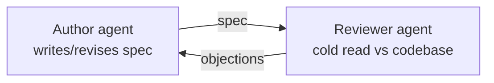

# The Second Reviewer Corollary

**It's All About Perspective**

*A second opinion only counts if it didn't come from the same classroom.*

<!-- markdownlint-disable MD034 -->

_Part 14 of a series of articles on succeeding with Agentic Agile Delivery_

Codex's answer to "get a second reviewer" is to spin up a second instance of itself. Same model, same weights, same training data, reviewing the same spec from a fresh context. And it helps — genuinely, not as a formality. Two independent passes catch things one pass happens to miss, the same way asking a smart person to check their own work twice catches more than asking once. But it's worth being precise about what kind of help that actually is. You're not getting two opinions. You're getting one opinion, sampled twice.

## Same classroom, different classroom

Picture two grad students from the same cohort reviewing your spec — same program, same faculty since undergrad. They'll disagree on details, but the big blind spots survive untouched, because neither was ever trained to see them. Now swap one out for a student from a different school entirely. When those two land on agreement, it means something else: not "one training, confirmed twice," but two independently formed judgments converging anyway. That's the evidence that's actually worth something to you — and it's why a differently trained second reviewer beats a second copy of the first.

Here's what that looks like when it's checking your spec instead of a grad school assignment. One agent (call it the author, or the driver) writes the spec and opens a review request. The other (the reviewer, the navigator) reads it cold, checks it against the real codebase, and comes back with objections. The author doesn't get to just note the feedback and move on — it has to actually work each objection: fold in the ones that hold up, push back with a reason on the ones that don't, and hand the revised spec back. The roles don't swap. The reviewer stays the reviewer — but it isn't just checking off its own prior objections. Each turn it re-reads the updated spec cold against the actual codebase, the same way it did on turn one, so the discrepancy list isn't a checklist being worked down to zero. New issues surface that weren't there before, and old ones the author thought were closed can reappear if a later change reintroduces them. The spec evolves turn by turn — better where the feedback was right, unchanged where the pushback held — until an inspection turns up nothing left either side is willing to contest.

## From copy-paste to a loop that runs itself

That mechanism didn't start as a design. It started as me sitting between two agent windows, copying one's critique out and pasting it into the other, then copying the response back — manually relaying a review that the tools themselves had no way to hand off. The automation came from wanting to get out of the middle: let each agent write its critique and its spec revision to the filesystem, then signal the other agent that it was their turn to read and respond. Once that loop closed, the review itself stopped needing me in it at all.

What that loop produces isn't fixed-length. I've seen it settle in as few as three turns and run as many as twelve, depending on how much the spec actually needed to move. And because every critique and every revision lands on disk as it happens, I don't have to track the length in real time — I can start the loop before bed and read the whole negotiation in the morning: what was raised, what got pushed back on, what changed because of it. The final spec and the full review trail commit into source control together, so the "why" behind the spec isn't a memory I have to reconstruct later — it's already sitting next to the artifact it shaped.

## Agreement isn't automatically evidence

Here's the part worth being honest about, though: agreement isn't automatically evidence of anything. Two reviewers — even two very differently trained ones — can talk themselves into a shared wrong answer, especially over a dozen review turns where both sides are anchoring on the same accumulated back-and-forth. "Cycle until they agree" is satisfiable by the spec actually getting better, or by both sides just getting tired of objecting. Those look identical from the outside.

XP had an answer to a similar risk, a long time before any of this existed: two developers agreeing was never the acceptance criterion. A human with real product authority was. That role doesn't disappear here — it just moves. The moment worth watching for isn't when two reviewers agree, it's when one of them stops objecting. If a reviewer raises a concern early in a turn and ends the turn withdrawing it rather than getting it actually resolved, that's exactly the turn that needs a human to step in and check whether the concern got answered or just got tired out.

None of this is free, obviously. A cross-model review that runs a dozen turns to reach real agreement burns real tokens before a single line of implementation code exists. Which raises the fair objection: doesn't that just move the expense around instead of saving it?

That's not a rhetorical question — it's a testable one, and it's next.

## Series Link

This one continues straight from [The Diff Displacement](13-the-diff-displacement.md): if the spec is where the real risk lives, the next question is who's actually qualified to review it. It's the newest entry in the series — more will follow as the review-loop pattern gets tested further.

## Series Roadmap

| Status      | #      | Article                                                                                         | Role In Series                                          |
| ----------- | ------ | ------------------------------------------------------------------------------------------------ | --------------------------------------------------------- |
|             | 01     | [The Refactoring Bloat Precursor](01-the-refactoring-bloat-precursor.md)                        | Prequel: history of AI-assisted coding before agents      |
|             | 02     | [The Rise Of Technical Product Operations](02-the-backlog-governance-postulate.md)              | Industry thesis: Technical Product Operations              |
|             | 03     | [The Vibe Coding Hangover](03-the-vibe-coding-deficiency.md)                                    | Failure mode: vibe slop and review debt                    |
|             | 04     | [Spec-Driven Development Is Necessary But Not Sufficient](04-the-spec-driven-insufficiency.md)  | Why specs need execution governance                        |
|             | 05     | [The Rise Of The Technical Product Owner](05-the-product-owner-escalation.md)                   | Human operator: TPO/TPM as delivery architect               |
|             | 06     | [The Backlog Becomes The Control Plane](06-the-backlog-control-plane-conjecture.md)             | Backlog as executable control surface                       |
|             | 07     | [The Just-In-Time Planner](07-the-just-in-time-planning-paradox.md)                             | Progressive decomposition and deep dives                    |
|             | 08     | [Context Durability Is A Feature](08-the-context-durability-corollary.md)                       | JIT loading and post-compaction recovery                     |
|             | 09     | [Evidence Beats Trust](09-the-evidence-over-trust-theorem.md)                                   | Evidence gates and auditability                               |
|             | 10     | [The Adapter Future](10-the-adapter-convergence.md)                                             | Backlog and agent platform adapters                            |
|             | 11     | [Agentic Concurrency Isn't Free — And "50 Parallel Agents" Is Hyperbole](11-the-agentic-concurrency-deficiency.md) | Concurrency ceiling and coordination cost |
|             | 12     | [XP's Practices Survived. Their Reasons Did Not.](12-the-xp-survival-anomaly.md)                | XP practices under agentic delivery                          |
|             | 13     | [The Diff Isn't Where Your Judgment Lives Anymore](13-the-diff-displacement.md)                 | Spec review displaces code review                             |
| **Current** | **14** | **[It's All About Perspective](14-the-second-reviewer-corollary.md)**                            | Cross-model review for a genuine second opinion                |

## LinkedIn Article Shape

Opening hook:

> Codex's answer to "get a second reviewer" is to spin up a second instance of itself. Same model, same weights, same training data, reviewing the same spec from a fresh context.

Middle:

- Distinguish "two opinions" from "one opinion, sampled twice."
- Explain why a differently-trained second reviewer catches what a same-model rerun can't.
- Describe the author/reviewer loop that runs itself off the filesystem, no human relaying critiques by hand.
- Warn that agreement isn't automatically evidence — two reviewers can converge on a shared wrong answer.

Close:

> The moment worth watching for isn't when two reviewers agree, it's when one of them stops objecting.

## Bibliography

No external sources are cited in this piece — it draws on firsthand experience running the author/reviewer review loop while building AITM.
