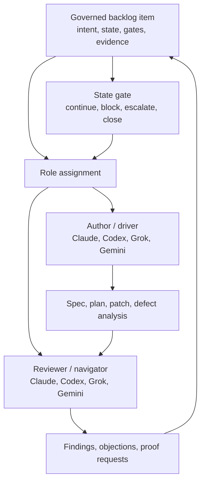

# The Provider-Neutral Orchestration Thesis

**The Work Item Should Own The Workflow**

_A second model is useful. A provider-neutral control plane is the step change._

<!-- markdownlint-disable MD034 -->

_Provisional outline for a future LinkedIn article in the Agentic Agile Delivery series._

## Working Thesis

Most public examples of cross-model coding collaboration still center one provider's runtime: Claude invokes Codex, Codex invokes Claude, or a single framework owns the conversation. That is useful, but it is not the deeper pattern.

The deeper pattern is provider-neutral orchestration: the backlog item owns the workflow, and AI providers occupy interchangeable delivery roles around it. Codex can author while Claude reviews. Claude can author while Codex reviews. Grok can participate. Gemini can be tested later. The system of record is not the chat window, the model provider, or the plugin host. It is the governed work item, its state, its evidence, and its review trail.

## Why This Article Exists

This piece should follow naturally from [The Second Reviewer Corollary](15-the-second-reviewer-corollary.md), but widen the argument:

- Article 15: a differently trained reviewer catches what same-model self-review misses.
- Article 16: the real operating model is not "Claude plus Codex"; it is provider-neutral role assignment over a governed backlog control plane.

The article should avoid sounding like a product announcement. AITM should appear as the concrete proof point for a broader Backlog Manager Pattern.

## Reader Hook

Possible opening:

> The interesting part was not that Claude and Codex could review each other. The interesting part was that neither one owned the process.

Alternate opening:

> A Claude-hosted Codex review is useful. A Codex-hosted Claude review is useful. But the real step forward is when the work item, not either provider, owns the loop.

## Core Argument

1. Cross-model review is becoming common.
   - Public tooling already shows Claude invoking Codex, Codex invoking Claude, and multi-agent frameworks coordinating model conversations.
   - That validates the need, but most examples are still provider-hosted or framework-hosted.

2. Provider-hosted collaboration has a center of gravity.
   - If Claude launches Codex, Claude's runtime tends to be the operating center.
   - If Codex launches Claude, Codex's runtime tends to be the operating center.
   - Those are good integrations, but they still bind the workflow shape to the host.

3. Agentic delivery needs role neutrality.
   - "Author" and "reviewer" should be workflow roles, not vendor identities.
   - The driver/navigator pairing should be assignable to Claude, Codex, Grok, Gemini, or future agents based on task fit.
   - The governance model should survive provider substitution.

4. The backlog becomes the neutral control plane.
   - The issue records intent, scope, state, gates, evidence, timing, defects, and review status.
   - Agents do not need to remember the whole process; they need to comply with the work item's current contract.
   - The durable artifact is the story and its evidence trail, not a transient conversation between tools.

5. This changes the human role.
   - The TPO/TPM or delivery architect is not supervising model personalities.
   - They are designing the delivery system: backlog contracts, provider roles, gates, escalation rules, acceptance standards, and audit evidence.

## Suggested Structure

### Opening: The Wrong Thing To Be Impressed By

Start with the recent experience of watching two frontier coding agents collaborate on defect analysis and a plan. Acknowledge that it feels powerful, then pivot:

- The visible magic is model-to-model collaboration.
- The more important mechanism is provider-neutral governance.
- The work item, not the model, owns the process.

### Section 1: Cross-Model Review Is Becoming Table Stakes

Use the public examples as context, not as the star:

- Claude invoking Codex for review or delegation.
- Codex invoking Claude for review or rescue.
- Tandem-style planner/generator/evaluator loops.
- Agent mail or coordination layers for multiple coding agents.

Point: the industry is discovering that one model should not be the sole judge of its own output.

### Section 2: Provider-Specific Loops Still Have A Gravity Problem

Make the architectural distinction:

- A plugin hosted by one provider is still shaped by that provider's runtime, permissions, context model, and turn mechanics.
- A single-framework multi-agent loop is still shaped by that framework's orchestration assumptions.
- This is not a criticism; it is a boundary.

The article should be careful here. The tone should be "these are useful steps" rather than "these are inferior."

### Section 3: Roles Should Be Portable

Introduce the driver/navigator language:

- Driver: owns the current artifact and implements or revises.
- Navigator: reviews, challenges, asks for proof, and blocks unsafe progress.
- Either role can be occupied by any capable provider.
- The pairing can be changed by task type: architecture, defect analysis, implementation, security review, migration review, docs review.

This is the article's practical center.

### Section 4: The Backlog Is The Neutral Ground

Connect back to the control-plane thesis:

- The backlog item defines the work.
- State gates define what can happen next.
- Evidence records what was proven.
- Review artifacts record what was challenged and resolved.
- Defects discovered during review become governed work, not side-chat.

Possible line:

> The conversation is not the system of record. The story is.

### Section 5: AITM As Proof, Not Protagonist

Use AITM briefly:

- It can coordinate author/reviewer roles across providers.
- It can run the same co-review pattern with Claude, Codex, Grok, and later Gemini.
- It ties collaboration to issue state, evidence, timing, review, and closure gates.
- It treats agent providers as adapters around the work, not owners of the work.

Keep this concise and concrete.

### Section 6: What This Means For Engineering Leaders

Practical takeaways:

- Stop evaluating agent tools only as individual coding assistants.
- Ask whether the workflow survives model substitution.
- Ask where the audit trail lives.
- Ask whether discovered defects become governed backlog work.
- Ask whether human review is tied to evidence, not model agreement.

### Close: The Tip Of The Spear

Possible close:

> The next agentic SDLC will not be won by the tool that hosts the most impressive chat. It will be won by the system that lets the work govern the agents.

Alternate close:

> The provider matters. The model matters. But in a mature agentic delivery system, neither should own the workflow. The work should.

## Mermaid Candidate

## Evidence And Source Candidates To Revisit

- OpenAI Codex plugin for Claude Code: provider-hosted bridge from Claude Code to Codex.
- Sendbird Claude Code plugin for Codex: reverse-direction bridge from Codex to Claude Code.
- TandemKit: planner/generator/evaluator loop pairing Claude and Codex.
- MCP Agent Mail: provider-agnostic messaging and coordination primitives for coding agents.
- ChatDev and AutoGen: broader academic/framework precedent for conversational multi-agent development.

## LinkedIn Article Shape

Opening hook:

> The interesting part was not that Claude and Codex could review each other. The interesting part was that neither one owned the process.

Middle:

- Cross-model review is becoming common.
- Provider-hosted bridges are useful but naturally center the host runtime.
- The next pattern is role-neutral orchestration: author/reviewer as portable roles.
- The backlog becomes the durable control plane that governs the agents.
- AITM is one concrete proof point, not the whole thesis.

Close:

> In mature agentic delivery, the model should not own the workflow. The work should.

## Drafting Notes

- Keep PM/product and engineering leadership audiences first.
- Preserve the skeptical caveat: provider neutrality increases orchestration complexity, review cost, and failure modes.
- Avoid implying all providers are equally good for every role.
- Avoid vendor-war framing.
- Do not overclaim market uniqueness; say "the public examples I found mostly center a provider or framework," not "nobody else is doing this."
- Tie the piece back to story-governed delivery: specifications define intent; stories carry bounded executable work; gates require evidence; humans own fit, sequencing, risk, and acceptance.
