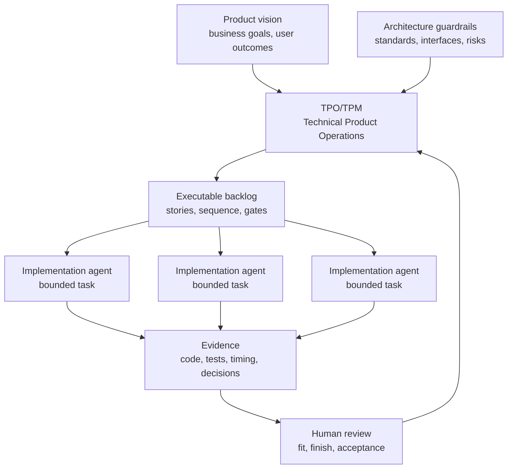
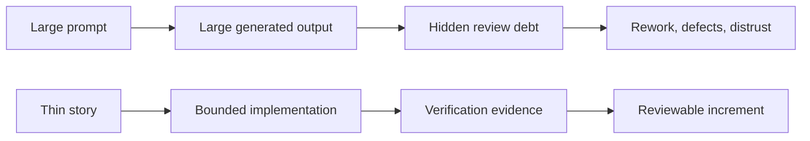
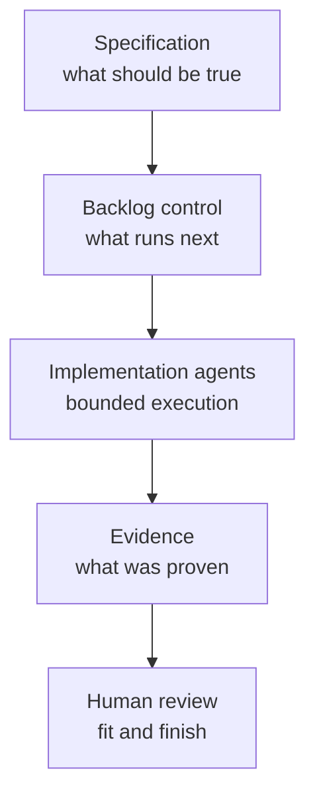
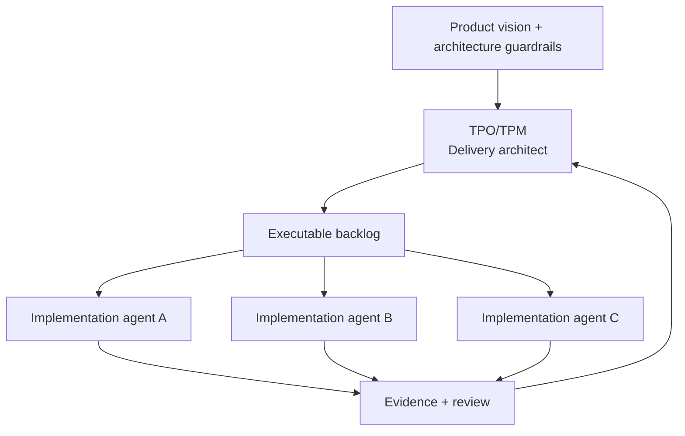
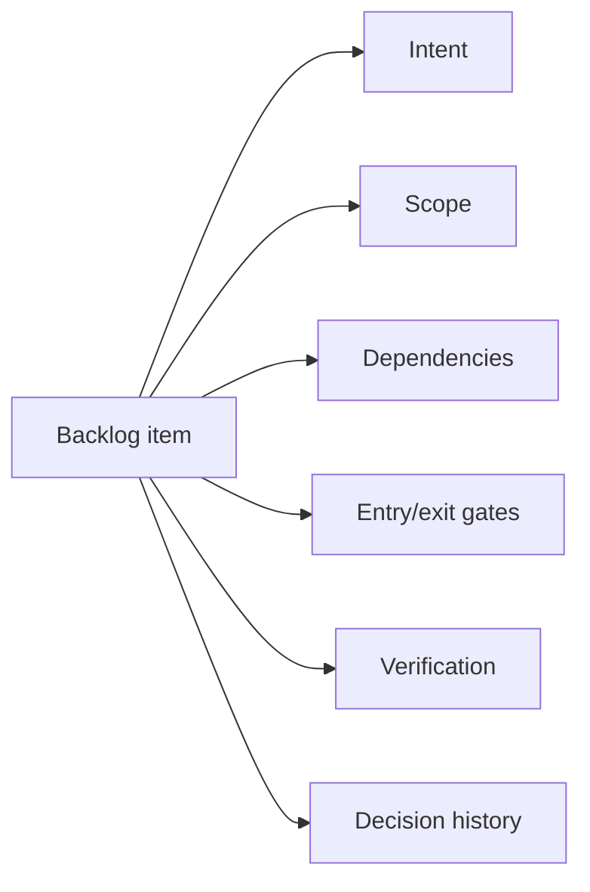
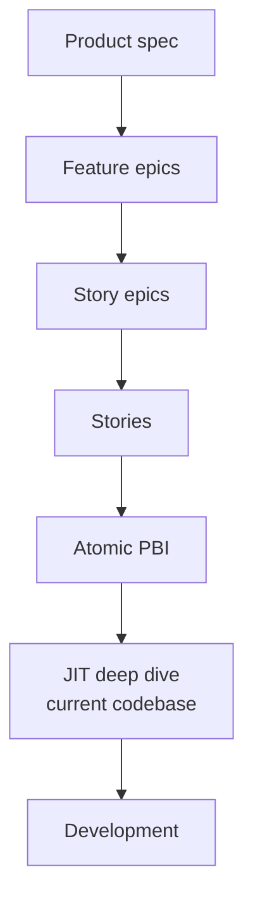
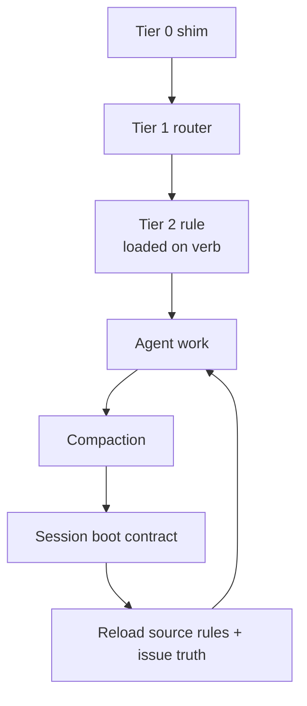
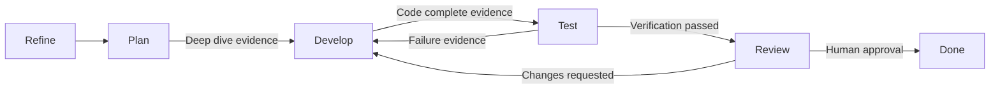
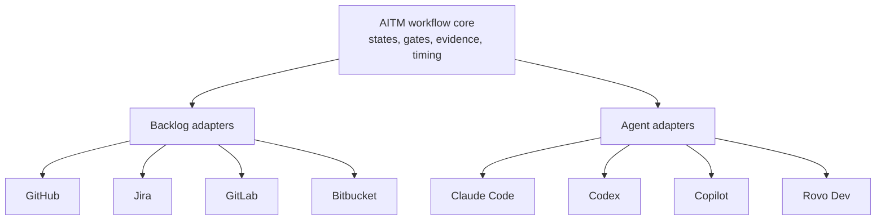

# Article Production Plan

<!-- markdownlint-disable MD034 -->

## Purpose

This plan turns the article stubs into a publishable LinkedIn series with stronger prose, repeatable structure, diagrams, and selective supporting images. The goal is not to promote AI Task Manager as a product brochure. The goal is to use AITM as a concrete research artifact for discussing the next operating model of agentic AI-assisted development.

## Production Strategy

Use Option B, then Option A:

1. Build the shared series kit first: terms, voice, diagram inventory, article template, and argument boundaries.
2. Expand one article at a time into publishable prose.

This keeps the series coherent. Each article can stand alone, but the concepts accumulate: technical product operations -> vibe slop -> specifications -> TPO/TPM role -> backlog control plane -> JIT planning -> context durability -> evidence -> adapters.

## Public Terminology

Avoid terms that sound like AI marketing copy or dismissive hierarchy.

Naming:

- Use `@kburson/ai-task-manager` on first mention in public-facing prose.
- Define **AITM** immediately after that first mention.
- Avoid introducing the project as generic "AI Task Manager" until the scoped package identity is clear.
- Mention only briefly that unrelated packages/projects use similar generic naming; do not turn the article into a naming dispute.

Preferred terms:

- **Implementation agents:** AI agents responsible for local code construction, syntax, framework mechanics, test execution, and narrow task delivery.
- **Agent fleet:** a coordinated set of implementation agents working under backlog, dependency, and evidence controls.
- **Delivery architect:** the human operator role when describing senior engineers, TPOs, or TPMs who own decomposition, sequencing, fit, risk, and review.
- **Story-governed delivery:** the overall AITM pattern: specs become stories; stories carry gates; gates require evidence.
- **Code-construction layer:** the layer where implementation agents operate.

Avoid or use carefully:

- "Tireless implementation technicians" sounds like generic AI prose.
- "Low-level code technicians" may sound dismissive in public articles.
- "All code will be written by AI" is a useful provocative hypothesis, but should be framed as a directional pressure rather than a guaranteed timeline.

Working role model:

> Implementation agents increasingly own syntax and local construction. Engineers, TPOs, and TPMs increasingly own product fit, architecture, decomposition, sequencing, review, and evidence.

## Provocative But Defensible Thesis

The series can safely argue:

- AI will make syntax fluency less central to software delivery.
- Framework and language debates may matter less as agents become instant syntax experts.
- Human engineering value moves toward architecture, interface contracts, product judgment, verification, and system governance.
- Teams may build more specialized internal frameworks because agents reduce the human cost of lower-level implementation.
- SDLC and agile practices become more important because agent fleets multiply ambiguity when work is poorly specified.

Avoid claiming:

- Human engineers become obsolete.
- Framework choices no longer matter today.
- Agents already produce better code than all junior or mid-level developers in all contexts.
- AITM is the only possible solution.

## Article Expansion Template

Each finished article should include:

- **Opening hook:** one sharp claim or scene.
- **Problem frame:** what breaks in unmanaged agentic development.
- **Established pattern:** the SDLC, agile, lean, or project-management idea this maps to.
- **Agentic twist:** why the pattern becomes more important with implementation agents.
- **AITM pattern:** the concrete mechanism AITM uses.
- **Visual:** one diagram or image that explains the concept.
- **Provocation:** one defensible statement that invites discussion.
- **Practical takeaway:** what a TPO/TPM or engineering leader should do differently.
- **References:** tight bibliography, not a link dump.

Target length:

- LinkedIn version: 1,000-1,600 words.
- Repository longform version: 1,500-2,500 words when the topic needs diagrams and deeper evidence.

## Visual System

Prefer simple diagrams over decorative images. The visuals should teach the operating model.

Use Mermaid for:

- workflows,
- control planes,
- state gates,
- decomposition trees,
- adapter architecture.

Use generated or sourced images sparingly for:

- article header images,
- metaphorical opener images,
- social preview cards.

Visual tone:

- restrained,
- technical,
- clean,
- high contrast,
- no stock-photo cliches,
- no decorative gradients as the main asset.

## Diagram Inventory

### Article 0: Technical Product Operations

Diagram: TPO/TPM as delivery architect for an agentic delivery system.

### Article 1: The Vibe Coding Hangover

Diagram: unmanaged prompt flow vs story-governed flow.

### Article 2: Spec-Driven Is Not Enough

Diagram: spec defines intent, backlog governs execution, evidence proves completion.

### Article 3: The Technical Product Owner

Diagram: TPO/TPM as delivery architect above the agent fleet.

### Article 4: Backlog As Control Plane

Diagram: backlog item as operational contract.

### Article 5: Just-In-Time Planner

Diagram: progressive decomposition to atomic PBI.

### Article 6: Context Durability

Diagram: tiered loading and post-compaction recovery.

### Article 7: Evidence Beats Trust

Diagram: state transitions with evidence gates.

### Article 8: Adapter Future

Diagram: AITM core with backlog and agent adapters.

## Image Ideas

Images should support the diagram, not replace it.

- Article 1: messy generated code review desk vs clean evidence board.
- Article 3: command-center view of a TPO/TPM coordinating multiple agent workstreams.
- Article 5: layered blueprint or decomposition tree.
- Article 6: context window compressing, then reloading authoritative rules from source.
- Article 8: integration hub connecting backlog systems and AI hosts.

## Production Order

1. Expand article 0 first because it is the provocative flagship.
2. Expand article 1 second because it defines the pain and introduces "vibe slop."
3. Expand article 3 third because it defines the audience and role shift in detail.
4. Expand article 5 fourth because JIT planning is one of AITM's strongest differentiators.
5. Expand article 6 fifth because context durability is a technical differentiator.
6. Fill articles 2, 4, 7, and 8 after the core narrative is established.

## Article 0 Special Notes: Technical Product Operations

This is the flagship piece.

Definition:

> Technical Product Operations is the discipline of turning product intent, architecture guardrails, and delivery risk into an executable backlog that implementation agents can safely act on.

Position:

- This is not "prompt engineering with a better title."
- This is not product management replacing engineering.
- This is the coordination layer that lets product, architecture, backlog governance, implementation agents, and evidence review operate as one delivery system.

Recommended line:

> Syntax becomes cheaper. Intent, architecture, verification, and fit become more expensive.

## Article 1 Special Notes: Vibe Slop

The article should address "vibe slop" directly and fairly.

Definition:

> Vibe slop is AI-generated code that looks plausible and prompt-compliant, but is expensive to maintain, verify, secure, or extend because it was produced without sufficient constraints, architecture, and evidence.

Position:

- The term is denigrative, but it names a real review burden.
- The answer is not "do not use AI."
- The answer is to move from prompt-led generation to story-governed delivery.

Recommended line:

> Vibe slop is not caused by AI writing code. It is caused by AI writing code outside a governed delivery system.

## Article 3 Special Notes: Future Of Engineering

The article can be bolder about the direction of the industry.

Argument:

- AI agents will increasingly become syntax experts across languages and frameworks.
- Human engineers will care less about memorizing framework APIs and more about product correctness, architecture, interface design, performance, security, and verification.
- Language and framework abstractions were partly built to help humans manage complexity.
- As agents take more of the code-construction burden, teams may choose lower-level or more specialized foundations when they improve fit, performance, cost, or maintainability.

Guardrail:

- Do not overstate this as already true in every context.
- Present it as a pressure vector: the direction software organizations should prepare for.

## Definition Of Done For Each Article

- Clear standalone thesis.
- Links to prior/next article.
- One diagram embedded or linked.
- At least three supporting sources.
- One AITM-specific mechanism explained.
- One concrete takeaway for TPOs/TPMs.
- Markdown lint passes.
