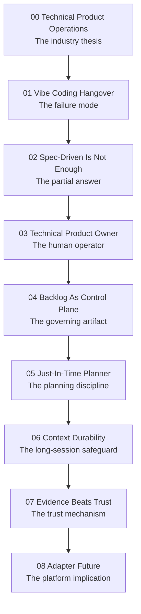
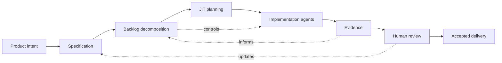

# Series Argument Map

<!-- markdownlint-disable MD034 -->

## Spine

## Core Logic

1. AI coding shifts the bottleneck from code production to safe acceptance of generated work.
2. Unmanaged generation creates vibe slop: plausible output with hidden review and maintenance debt.
3. Specs improve intent quality but do not govern execution by themselves.
4. The TPO/TPM role becomes a delivery-architecture role.
5. The backlog becomes the durable control plane for agent fleets.
6. Planning should be progressive and just-in-time, not exhaustively up front.
7. Long sessions need context durability because compaction can weaken process rules.
8. Trust depends on evidence, not agent confidence.
9. The winning platforms will expose APIs that let these controls operate across backlog systems and AI hosts.

## Article Roles

| Article | Reader Question                     | Series Answer                                                                  |
| ------- | ----------------------------------- | ------------------------------------------------------------------------------ |
| 00      | What is the big industry shift?     | Technical Product Operations becomes the operating layer for agentic delivery. |
| 01      | What goes wrong without governance? | Vibe slop: code produced faster than teams can understand and accept it.       |
| 02      | Aren't specs enough?                | Specs define intent; stories and gates govern execution.                       |
| 03      | Who owns this system?               | The TPO/TPM as delivery architect, with engineering guardrails.                |
| 04      | What artifact controls the fleet?   | The backlog becomes executable control infrastructure.                         |
| 05      | How much planning is enough?        | Decompose progressively; deep dive at the last responsible moment.             |
| 06      | What happens when context compacts? | Reload source rules and task truth from durable artifacts.                     |
| 07      | Why should anyone trust the output? | Evidence gates make progress inspectable.                                      |
| 08      | What should vendors build?          | Adapters between backlog systems, AI hosts, gates, and evidence.               |

## Recurring Claims

- Implementation agents are useful inside narrow, explicit work boundaries.
- The human operator moves up the abstraction stack.
- SDLC and agile practices become operational controls, not ceremonies.
- Backlog quality becomes delivery quality.
- Chat history is not a sufficient system of record.
- Evidence should be externalized into durable artifacts.

## Reader Journey

### Product/Project Manager

Starts with concern about AI delivery chaos. Ends with a concrete role model: manage executable backlog quality, not merely status.

### Engineering Leader

Starts with skepticism about AI productivity. Ends with a governance model for safe adoption: gates, evidence, decomposition, and platform integration.

### Tool Vendor

Starts with product-feature thinking. Ends with an API and integration challenge: expose enough workflow control for external backlog managers and agent hosts to cooperate.

## Proof Chain

## Counterarguments To Address

- "This is just agile with AI." Response: yes, deliberately; the difference is that agent fleets make the old controls more load-bearing and more automatable.
- "This sounds like bureaucracy." Response: unmanaged review debt is bureaucracy too, just later and more expensive.
- "Agents will become good enough to skip this." Response: better agents increase throughput, which makes acceptance, governance, and evidence more important.
- "Frameworks and language expertise still matter." Response: they do, but the value shifts from memorizing syntax to choosing the right foundation and reviewing fit.
