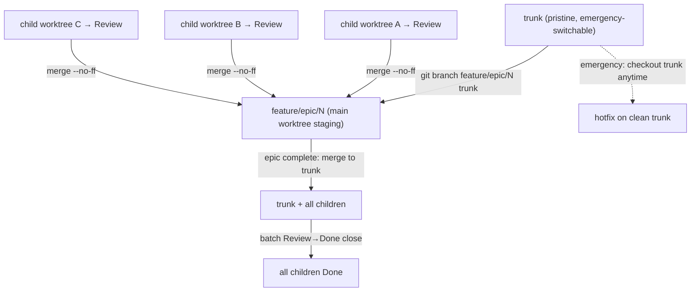

# Local Parallel Development — inline epic-staging branches

How to run an epic's children in isolated worktrees while keeping their results
integrated on a **persistent inline branch in the main working tree**, so you can
switch to `trunk` for an emergency fix at any moment without losing or exposing
epic work-in-progress.

This is the local-only analogue of a long-lived integration branch. It complements
two existing practices:

- [Sub-agent parallel fan-out](parallel-agents.md) — how multiple agents run
  concurrently, each in its own worktree.
- [Blocking-defect isolation dance](workflow.md#blocking-defect-isolation-dance) —
  how a mid-task blocker is isolated on a trunk-rooted worktree.

The staging branch described here is where those isolated worktree results
**land and accumulate** between "child done on the board" and "epic merged to
trunk."

## The problem

An epic's child is developed on its own worktree branch (e.g.
`claude/task-859-baafa2`). When the child reaches Review, its commits live **only**
on that worktree branch:

- They are not on `trunk`, so an emergency fix started from the main worktree
  can't see them — fine.
- But there is also **no single place** that aggregates every child's result. Each
  child branch is a separate island. Reviewing "everything the epic has produced so
  far" means hopping across N worktree branches.
- And nothing on the **main** working tree reflects the epic's progress, so the
  only way to inspect integrated epic state is to check out a worktree branch —
  which you can't do while that worktree has it checked out.

We want: one persistent branch, **on the main working tree**, that every child
merges into as it completes — an inline staging area — while `trunk` stays pristine
and instantly switchable for emergencies.

## The solution — `feature/epic/<N>` on the main worktree

Create a long-lived branch `feature/epic/<N>` off `trunk` in the **main** working
tree, and merge each child's worktree branch into it as the child reaches Review.

```bash
# 1. Create the staging branch off current trunk (ref is shared across worktrees).
#    Run from anywhere; branch refs are global to the repo.
git branch feature/epic/859 trunk

# 2. Check it out in the MAIN working tree (not in a child worktree — the main
#    tree is the staging area and the emergency-switch surface).
git -C <main-repo-root> checkout feature/epic/859

# 3. As each child reaches Review, merge its worktree branch in with --no-ff so
#    every integration is an explicit, greppable commit.
git -C <main-repo-root> merge --no-ff claude/task-859-baafa2 \
  -m "Merge branch 'claude/task-859-baafa2' into feature/epic/859"
```

`--no-ff` is deliberate: it records **which child integrated when**, giving the
staging branch a readable audit trail instead of a flat fast-forward that erases
the integration boundary.

### Why the main worktree

The staging branch is checked out in the **main** repo tree, not a child worktree,
for three reasons:

1. **Emergency switch.** `trunk` is one `git checkout trunk` away in the same tree.
   Because the staging branch is separate from `trunk`, and `trunk` never carries
   epic WIP, switching to it lands you on clean, shippable history immediately.
2. **A branch can only be checked out in one worktree at a time.** Keeping the
   staging branch on the main tree leaves every child worktree free to hold its own
   branch.
3. **Single inspection point.** `git log feature/epic/859` on the main tree shows
   the whole epic's integrated state without touching any worktree.

## Closing children — the trunk-scoped gate

**This is the sharp edge.** The `close` (Review→Done) gate `commitsOnTrunkGate`
([close-gates.mjs](../../scripts/task-tracker/lib/close-gates.mjs)) scopes its
`[#N]` message-attribution check to **`trunkRef`** (resolved as
`cfg.trunkRef` → first of `trunk` / `main` / `master`). A child whose `[#N]`
commit sits only on `feature/epic/<N>` — never merged to `trunk` — **does not**
satisfy the gate. `close` will refuse it. This is the deliberate "the work
actually landed on trunk" invariant (added in #733); a never-merged feature
branch's own commit is not "landed."

The staging model keeps epic WIP off `trunk` on purpose, so it is directly in
tension with per-child `close`. Reconcile it one of three ways:

| Model                         | Cadence                                                                                                                                                                                               | Trade-off                                                                                                                                                                      |
| ----------------------------- | ----------------------------------------------------------------------------------------------------------------------------------------------------------------------------------------------------- | ------------------------------------------------------------------------------------------------------------------------------------------------------------------------------ |
| **A — batch close (default)** | Hold every child at **Review**. Stage all children on `feature/epic/<N>`. When the epic is complete, merge `feature/epic/<N>` → `trunk`, then run the Review→Done `close` for every child in a batch. | `trunk` never carries epic WIP; one clean integration at the end. Children linger at Review until epic close.                                                                  |
| **B — repoint `trunkRef`**    | Set `trunkRef: "feature/epic/<N>"` in `.ai-task-manager/task-tracker.json`. Children `close` as they integrate into staging. Merge staging → real `trunk` at the end.                                 | Children reach Done live. **But** an emergency fix worked on real `trunk` won't satisfy `close` until you flip `trunkRef` back — must be remembered and documented per switch. |
| **C — per-child to trunk**    | Merge each child to real `trunk` when it reaches Done; `feature/epic/<N>` is just an "ahead-of-trunk" integration branch for not-yet-done children.                                                   | `close` passes against real trunk; `trunk` advances per completed child. Loses "nothing touches trunk until the end."                                                          |

**Default to Model A** unless you have a specific reason to want children marked
Done mid-epic. It keeps the trunk-landed invariant honest and avoids the
`trunkRef` flip-back footgun of Model B.

Attribution survives the merge either way: it is
[message-based](workflow.md#commit-attribution), so once `feature/epic/<N>` (with
all its `[#N]` child commits as ancestors) reaches whichever ref is `trunkRef`, the
`close` grep finds every token. `--no-ff` merge commits do not hide the child
commits — the tokens live on the merged-in commits, which remain ancestors.

## Emergency fix while an epic is staged

Because `trunk` is clean and checked out-able in the main tree:

```bash
# Park the staging branch (commit or stash any in-progress integration first).
git -C <main-repo-root> checkout trunk
# ... fix the emergency on trunk (or a fresh hotfix worktree off trunk) ...
# Return to staging when done.
git -C <main-repo-root> checkout feature/epic/859
```

Nothing about the emergency touches `feature/epic/<N>`; nothing about the epic
touches `trunk`. The two histories only converge at the end-of-epic merge.

## Lifecycle summary



## Guardrails

- **Never** check out `feature/epic/<N>` inside a child worktree — it belongs on
  the main tree. A branch checked out in two worktrees is a git error.
- **Commit or stash before switching** the main tree to `trunk` for an emergency;
  an in-progress merge left dirty will block the checkout.
- Merge commits need no `[#N]` token — the subject-line lint gate runs only on the
  task-tracker commit path, and there is no `commit-msg` git hook. Keep the merge
  subject descriptive and greppable instead.
- Under Model A, resist closing children early. The board card sitting at Review is
  correct until the epic's trunk merge; that is the whole point of the model.
