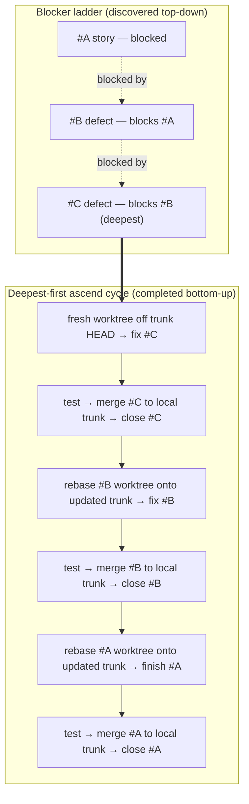

# GitHub Issues & Kanban Workflow

Full workflow rules for projects using `ai-task-manager`. These rules define how Claude Code, Codex, and human operators should manage issues, move Kanban states, and handle cleanup.

---

## Vocabulary (canonical)

Stage names are nouns describing a process; the corresponding activity is a verb. We shorten both to the verb form for brevity (e.g., we say "Refine stage" rather than "Refinement stage" — same column, shorter label).

| Stage (column)                     | Full process name  | Activity verb | Also known as               | What happens here                                                                                                                                   |
| ---------------------------------- | ------------------ | ------------- | --------------------------- | --------------------------------------------------------------------------------------------------------------------------------------------------- |
| Discover _(agent-side, pre-issue)_ | Discovery          | discover      | Ideation, Triage            | Untracked ideation bucket. Not a kanban column — `/task discover` opens a scratch bucket for pre-Backlog work.                                      |
| Backlog                            | Backlog            | —             | —                           | Collection of prioritized backlog items (user stories, tasks).                                                                                      |
| Refine                             | Refinement         | refine        | —                           | Backlog item is shaped to be ready for planning: acceptance criteria, estimate, size, priority, labels.                                             |
| Ready for Planning                 | Planning readiness | —             | R4P                         | Durable parking queue for stories with a current refinement snapshot. Rank and dependencies determine JIT pull order; ownership remains orthogonal. |
| Plan                               | Planning           | plan          | —                           | Team performs a deep-dive on the story to determine a plan of action: enhanced ACs, refined estimate.                                               |
| Develop                            | Development        | develop       | In Progress                 | Code changes are made and committed against the story, including test automation.                                                                   |
| Test                               | Testing            | verify        | Verify, QA                  | Committed source is run against all ACs and test automation in a sandboxed environment.                                                             |
| Review                             | Review             | review        | Ready for Acceptance        | Story waits for product owner to review functionality in a live demo and confirm all ACs (functional + non-functional) are met.                     |
| Done                               | Done               | —             | Complete, Ready for Release | All ACs and Definition of Done are satisfied.                                                                                                       |

**Retired terms** (do not use):

- ~~Groom / Grooming~~ — replaced by **Refine / Refinement**. The activity of sizing + estimating + prioritizing + adding rationale is "refining", not "grooming". Marker names, helper modules, comment prefixes, and docs use the `refine` form going forward. Legacy `aitm-groom-*` markers are read-accepted on existing issues for backward compatibility but never written.

### Naming rules

These rules tell you which spelling to use when introducing new code, markers, or doc references:

| Where it appears                | Form                                            | Example                                             |
| ------------------------------- | ----------------------------------------------- | --------------------------------------------------- |
| Stage / column name             | Noun (shortened to verb form for column labels) | `Refine` column, `Refinement` process               |
| Body marker (artifact identity) | Noun                                            | `aitm-refinement-rationale`                         |
| Comment marker (action taken)   | Past-tense verb                                 | `aitm-refined-estimate`                             |
| Module constant (process)       | Noun                                            | `REFINEMENT_HEADER`                                 |
| Function name (action)          | Verb                                            | `applyRefinementEstimate`, `planRefinementEstimate` |
| CLI verb (`/task ...`)          | Verb                                            | `/task refine`, `/task discover`, `/task verify`    |

Backward-compat read paths accept the legacy `aitm-groom-*` forms; write paths emit only the new forms.

**Verb-to-state-entry mapping** (state-entry verbs do the prep + transition atomically):

| Verb               | Enters stage           | Notes                                                                                                                                                                                         |
| ------------------ | ---------------------- | --------------------------------------------------------------------------------------------------------------------------------------------------------------------------------------------- |
| `/task refine #N`  | Refine                 | Sets Size + Estimate + Priority and writes `aitm-refine-rationale`; successful refinement then parks the issue in Ready for Planning.                                                         |
| `/task discover`   | (pre-backlog ideation) | Opens an untracked discovery bucket for backlog item generation / pre-issue ideation; promote to an issue with `/task new <title>`. **Distinct from Sprint-Planning** — that is `/task plan`. |
| `/task plan #N`    | Plan (Sprint-Planning) | Promotes Ready for Planning → Plan for JIT deep-dive, child breakdown, and estimate refresh. Refuses on any other state. **Not for backlog item generation** — use `/task discover` for that. |
| `/task develop #N` | Develop                | (Reserved; currently use `/task promote` from Plan after `/task plan-approve`.)                                                                                                               |
| `/task verify #N`  | Test                   | Runs sandboxed verification of all ACs and test automation; stamps `aitm-dod-verified` marker. (To be built per epic #107.)                                                                   |
| `/task review #N`  | Review                 | Promotes Test → Review after verification passes; in Review, `--probe "command"` records focused evidence without rerunning standard commands.                                                |
| `/task approve #N` | (gate stamp)           | Stamps the human-approval marker for the current gate (plan→develop or review→done).                                                                                                          |
| `/task close #N`   | Done                   | Closes the issue and moves Review → Done.                                                                                                                                                     |
| `/task promote #N` | next stage             | Generic one-step advance; used for transitions without bespoke prep.                                                                                                                          |

---

## Issue Creation

**Never call `gh issue create` directly** — it skips the project tether, `aitm-fields` injection, placeholder substitution, the priority gate, and the canonical body structure, producing an issue that cannot be driven or closed through the normal workflow (see issue #103). Use the sanctioned wrapper, which renders the body, runs `gh issue create`, and tethers to the board atomically:

```bash
npx aitm create-issue \
  --shape solo \
  --title "Feature: ..." \
  --scope-file ./.tmp/gh/scope.md \
  --ac-file ./.tmp/gh/acs.md \
  --story-origin-file ./.tmp/gh/story-origin.md \
  --label needs-triage
```

In Claude Code, `/task new <title>` is the interactive equivalent. **New issues default to unassigned in Backlog** (#793) — assignment is opt-in. Pass an explicit `--assignee <your-github-login>` only when you deliberately want to assign; omit it to leave the issue unassigned. **Defect spawned mid-task:** when you discover a defect while working an issue and file a tracking issue for it, ask the human `[Y|n]` (default **Yes**) whether to self-assign it; on Yes create it with `--assignee @me` (the `assignee` key in `.ai-task-manager/task-tracker.json` is the self-assign target login), on No leave it unassigned.

Immediately after creating, set **both** `Estimate` (hours) and `Size` on the GitHub Projects board — see `docs/guides/ai-value-framework.md` for the GraphQL mutations. Never leave an issue without these two fields.

---

## Kanban Board States

Issues move through eight states:

```
Backlog → Refine → Ready for Planning → Plan → Develop → Test → Review → Done
```

Each state is a first-class object (`scripts/task-tracker/states/<state>.mjs`)
owning its `entryGuards`, `exitGuards`, and `onEnter` actions — see
[`docs/architecture/state-machine.md`](../architecture/state-machine.md) for
the contract and migration roadmap.

Move issues using the helper script (reads all IDs from `.ai-task-manager/task-tracker.json`):

```bash
scripts/gh/move-state.mjs <issue#> <state>
# States: backlog | refine | ready-for-plan | plan | develop | test | review | done

scripts/gh/move-state.mjs 42 develop
```

- Move to **Refine** when an issue is being shaped (sized, AC drafted).
- Move to **Ready for Planning** after refinement is complete and current.
- Move to **Plan** after the deep-dive analysis is posted.
- Move to **Develop** when `/task #N` activates an issue and code work begins.
- Before `/task review`, commit the implementation and run `/task commit-trace #N`; Review requires a clean tracked worktree and a `### 🔗 Commits` ledger comment. Attribution is **message-based**, not SHA-reachability — the gate is satisfied by a commit whose subject carries the `[#N]` prefix (see [Commit Attribution](#commit-attribution) below), regardless of which branch or worktree it lives on.
- **Test** is entered automatically by `/task review` while the verification gate runs.
- Move to **Review** automatically when verification passes (ready-for-review).
- Move to **Done** only by `/task close` after a human approves.

### Stage-owned verification and exact-SHA receipts

Verification work has one owner for each unchanged committed source state:

| Stage                | Owned work                                                                                       | Reused work                                    |
| -------------------- | ------------------------------------------------------------------------------------------------ | ---------------------------------------------- |
| Develop iteration    | Changed-file autofix/format and explainable impact-selected tests                                | None                                           |
| Develop finalization | Full `npm run lint` and `npm run format:check`, exactly once at the clean final SHA              | None                                           |
| Test                 | Complete unit, integration, and slow lanes in the clean sandbox, plus declared targeted commands | Valid Develop lint/format receipt              |
| Review               | Finding-driven targeted probes only                                                              | Valid Test receipt; no standard command reruns |

During Develop, `node scripts/task-tracker/verify-develop.mjs --mode iteration`
is the normal feedback loop. The selector reports every changed path, selected
test, reason (`changed-test`, direct/transitive import, fixture, basename
compatibility, or manifest rule), and any lane escalation. Package/lockfile,
runner, lane-classifier, global-helper, or impact-manifest changes deliberately
fail closed to the lanes declared by the manifest.

Synchronize the branch with its resolved parent before Develop finalization and
`/task test #N`. For a trunk-parent issue, fetch `origin/trunk` and rebase or
merge it into the feature branch first; for an epic child, synchronize with the
current epic head through the owned merge-back flow. Resolve conflicts and
commit any resulting edits before Test so the exact-SHA receipt covers the tree
that will be reviewed and published. When the resolved parent is already an
ancestor, synchronization should not manufacture an empty commit.

After Test, any operation that moves HEAD—including a merge, rebase, amend, or
empty commit—makes the exact-SHA receipt stale.
That HEAD move requires a new `/task test #N` pass before Review. The re-Test is
not redundant when the synchronized parent changed the tree: the earlier receipt
did not observe those changes, even when they are outside the issue's own files.
Sync again after Test only when the parent actually advanced or another
integration requirement makes the HEAD move unavoidable.

`/task test #N` owns finalization. While the issue is still in Develop it checks
that the tree is clean and committed, runs full lint and format once, persists
and reads back an `aitm.verification-receipt/v1` for the complete 40-hex SHA,
then creates the isolated Test worktree at that exact SHA. Test reuses the two
validated finalization results and runs `test:unit`, `test:integration`, and
`test:slow` once. The resulting Test receipt records runtime/config/lockfile
fingerprints, clean-worktree identity, command classifications, exits, and
durations. Existing `aitm-test-started` and `aitm-dod-verified` markers remain
present for backward compatibility.

Review validates the Test receipt, current fingerprint, and both compatibility
SHA markers. A missing, malformed, red, dirty, stale, or incomplete v1 receipt
fails closed and takes the audited Test → Develop rework path. Review does not
rerun lint, format, or complete test lanes. A focused probe arising from a
concrete review finding is recorded separately as `review-probe` evidence and
does not alter or masquerade as the Test receipt. Marker-only issues without a
v1 receipt retain the bounded legacy path; the presence of a malformed v1
marker can never fall back to it.

The `Functional (verified at Test)` DoD subsection is the visible checklist for
this cumulative evidence, not a claim that every command executes inside the
Test sandbox. Lint and format are verified during Develop finalization and
carried forward by receipt. Commit and Acceptance Criteria gates are satisfied
before the transition is allowed to leave Develop. Test owns the fresh isolated
worktree, dependency install, full test lanes, and read-back of the combined
receipt that Review later validates.

Run a focused probe only after the issue is already in Review:

```bash
npx aitm review 1089 --probe "node --test scripts/task-tracker/tests/unit/lib/review-receipt-reuse.test.mjs"
```

`--probe` is repeatable. Each command must pass the normal verification
allowlist, runs without a shell against the current clean exact SHA, and is
persisted/read back in a Review receipt whether green or red. The probe mode does
not run the normal Review gate; rerun plain `npx aitm review 1089` after the
finding is resolved.

Recovery after receipt invalidation is:

1. Bind/resume the issue in Develop and inspect the structured refusal codes.
2. Run Develop iteration checks, fix the finding, and commit the new source state.
3. Run `/task test #N` once to produce new finalization and Test receipts.
4. Retry `/task review #N`.

A Test self-loop with a valid exact-SHA receipt runs no commands. Use `/task
test #N --force` only for an intentional diagnostic rerun; the override is
posted to the issue audit trail.

### Adaptive Plan estimates and frozen AI forecasts

Refine Size and Estimate are provisional. In Plan, create a detailed evidence
packet using `aitm.plan-estimation-input/v1` and converge it with:

```bash
npx aitm config estimationRubricIssue 1091
npx aitm plan-estimate 1091 --evidence-file .tmp/plan/1091-estimation.json
```

The configured rubric issue must be a governed issue dedicated to immutable
`estimation-rubric` records. The evidence file contains independently reviewable
WBS rows with base human hours, module/dependency signals, test lanes and
isolation, expected unavoidable test minutes, risks, and optional comparable
issue numbers. `plan-estimate` then refreshes the rubric, preserves the Refine
values in the historical estimate comment, replaces board and `aitm-fields`
Size/Estimate with the human Plan values, publishes a separate AI P50/P80
forecast, and reads every surface back. Plan cannot exit if those projections
diverge.

The two forecasts have different meanings:

- **Human Plan** is mid-level engineer effort, including normal implementation,
  verification, review response, and unavoidable repository execution. It is
  the only value written to the board Estimate field.
- **AI P50/P80** predicts agent engaged time. P50 is the median forecast; P80 is
  the more conservative planning bound. Stage allocations, rubric identity,
  cohort, confidence, comparables, and limitations live in the immutable issue
  comment, not the board Estimate.

Both freeze at Plan → Develop through the
`aitm-estimation-forecast-ready` record ID. Scope changes after that point use
the existing audited replan/inflation path; never edit a frozen record. At
close, AITM refuses Done until it can append and read back the matching outcome
with stage timing, verification attempts, review cycles, diff landscape,
variance, and necessary versus avoidable workflow cost.

Operators can inspect the visible `Plan Estimation Forecast`, `Estimation
Outcome`, and `Estimation Rubric` comments directly. The leading hidden
`aitm-record` envelope is canonical truth; its record ID, payload hash,
predecessor/supersedes links, repository, and issue correlation are validated by
the #1070 comment store. Missing, malformed, truncated, conflicting, or
uncorrelated evidence fails closed instead of becoming a zero.

Bootstrap rubrics intentionally start with low confidence and wide P80 bounds.
Each later Plan refreshes from completed outcome records, names the exact cohort,
and publishes a superseding immutable rubric snapshot. If refresh or read-back
fails, leave the issue in Plan, repair the configured rubric issue or GitHub
comment evidence, and replay `plan-estimate`; the authority writer is
convergent. Do not delete prior rubric records or hand-edit payload hashes.

An issue already in Develop when adaptive estimation is first installed may
adopt its legacy Plan baseline once with `--adopt-legacy-baseline`. This recovery
refuses unless the live board, canonical body fields, and historical Planned
Estimate appendix all exactly match the newly generated human Plan, and unless
no forecast/freeze evidence already exists. It publishes the missing immutable
forecast and ready marker without rewriting the in-flight baseline; it is not a
general way to bypass Plan or revise scope after Develop.

Adaptive evidence adds no approval gate. `/task auto both` still suppresses the
Plan and Review human gates without introducing a forecast prompt; human-gated
configuration still stops at the existing `plan-approve` and `approve` points.
Critical work therefore retains the operator's chosen approval policy.

## Commit Attribution

Attribution is **topology-agnostic and message-based**: a commit is attributed to
an issue by a durable token in its subject line, not by SHA reachability
(`git merge-base --is-ancestor`). Reachability deadlocks the moment a real,
correct deliverable lives on a branch, PR head, or worktree that the probed ref
cannot reach — the exact case the branch → PR → epic-branch → trunk flow creates.
The message token survives rebase, squash, cherry-pick, and amend; a SHA does not.
Delivered by epic [#727](https://github.com/kburson/ai-task-manager/issues/727)
(children [#730](https://github.com/kburson/ai-task-manager/issues/730)–[#735](https://github.com/kburson/ai-task-manager/issues/735)).

**Prefix format.** Every `/task`-workflow commit leads its subject with a
`[#N]` token — e.g. `[#730] feat(commit-attr): add subject-line lint gate`. The
token is auto-injected by the task-tracker's commit-composition path
(idempotently; a `prepare-commit-msg` git hook was deliberately rejected because
it is not version-controlled and would not propagate to installs) and enforced
by a subject-line lint gate. A commit touching several issues carries several
tokens (`[#730] [#731] …`). The conventional-commit `type(scope): subject` follows
the bracket, so type-based gates (e.g. the `chore:` gate) read the type _after_
the token. Stable grep regex: `\[#(\d+)\]`. Full grammar:
`^\[#\d+\](\s+\[#\d+\])*\s+(\w+)(\([^)]*\))?!?:\s+.+`. Source of truth:
`scripts/task-tracker/lib/commit-attribution-format.mjs` (`ISSUE_PREFIX_RE`,
`hasIssuePrefix`, `injectIssuePrefix`, `parseIssueIds`, `classifyType`).

**Gate query scope.** `commit-trace` and `review-preflight` attribute against
`refs: ['--all']` — a commit _anywhere_ in the repo satisfies them. `close`
deliberately scopes to the **resolved trunk ref** only (`resolveTrunkRef`, default
`origin/trunk` — see `scripts/task-tracker/lib/trunk-ref.mjs`): a branch that was
never merged to trunk must **not** satisfy the close gate. This asymmetry is the
correctness argument — it means an issue closes only once its deliverable actually
reaches trunk. The gate runs `git fetch` before it reads `origin/trunk`, so it
checks the authoritative remote tip regardless of what any worktree has checked
out. In the PR-based flow that dictates the ordering **push → PR → merge to
`origin/trunk` → `/task close`**: the `[#N]` commit must be present on `origin/trunk`
before close, or the close gate correctly refuses.

**Never `git update-ref refs/heads/trunk` from a worktree.** A scope-isolated task
worktree cannot `git pull --ff-only` the main worktree's checked-out `trunk`, and
advancing the branch with `git update-ref refs/heads/trunk` moves the ref but strands
the main worktree's index/working-tree at the old commit → a persistent inverted
staged diff. Because the close gate reads `origin/trunk` after a fetch, local `trunk`
is cosmetic: land the deliverable via PR merge and let `git fetch origin` bring the
remote-tracking ref current. The main worktree may sit on any branch throughout.

### Two-Axis Delivery Model (done vs delivered)

Delivered by epic [#912](https://github.com/kburson/ai-task-manager/issues/912).
An epic child has **two** delivery states, and they are deliberately not the same
thing:

- **Axis 1 — done (recorded).** An issue is _done_ when its `[#N]` deliverable is
  reachable on its immediate parent branch (Axis 1) — walk the epic lineage up to
  the nearest surviving ancestor branch, ultimately `trunk`. This is a fact the
  board records; it is what lets a child finish against its epic's integration
  branch long before the epic itself lands.
- **Axis 2 — delivered-to-customer (derived).** _Delivered_ is trunk reachability
  of the same `[#N]` token. It is **never persisted** — it is recomputed on demand
  every time a report needs it, so no stale delivered-flag can ever disagree with
  the actual state of `trunk`. Reporting consumers must source it from git, not
  from a recorded Status field; conflating the recorded done-axis with delivery is
  the exact bug the #915 consumer-registry audit exists to catch.

**Delivery split by parent.** How a done child reaches trunk forks on its parent:

- A **non-trunk parent** takes the local merge-back path: rebase the child onto the
  parent, run the close/done gates, fast-forward the parent, and delete the child
  branch (verify-not-perform under the epic-branch guardrail).
- The **trunk** parent takes the **PR-only** path: a squash merge. A squash would
  normally destroy the per-commit subjects a SHA-based scheme relied on, but ours
  survives it because **trunk attribution greps commit bodies**, not just subjects
  — the squash concatenates the child commits' messages into the squash-commit
  body, so every `[#N]` token is preserved and message-based attribution still
  resolves. That is why the PR-only path is attribution-safe.

### Full-Auto PR merge + local-trunk sync

Delivered by [#908](https://github.com/kburson/ai-task-manager/issues/908) (epic
[#912](https://github.com/kburson/ai-task-manager/issues/912)). The interactive
flow above assumes a human clicks **Merge** and then `git pull`s trunk. Two steps
in that chain cannot be completed by the agent in a Full-Auto batch, so the drive
would otherwise stall at every story's merge step:

1. **The human normally clicks Merge; a batch drive has nobody there.** Having the
   agent perform the merge itself (`gh pr merge <N> --merge`) is an immediate
   outward, irreversible act — the kind of unattended step an auto-mode safety
   classifier may refuse, and one that should not fire blind regardless. The
   sanctioned path sidesteps it entirely: **GitHub-native auto-merge**. The agent
   runs `gh pr merge <N> --auto --<method>`, which only _enables_ auto-merge —
   GitHub performs the actual merge once required checks pass. This is safe to
   issue unattended for two independent reasons: enabling auto-merge is
   **idempotent** (re-running it is a no-op, so a retried batch never
   double-merges), and the merge itself stays **gated on CI**, not on the agent —
   nothing lands until required checks are green. A repo without auto-merge enabled
   / branch protection configured cannot use this path; see the `fullAutoMerge`
   config in the settings guide. An operator who wants a local-only batch instead
   authorizes the **local-trunk lane** (no push, no PR — the existing
   merge-to-trunk close path).

2. **Local `trunk` cannot be fast-forwarded from a worktree** without desyncing the
   main worktree (`git update-ref refs/heads/trunk …` advances the shared ref but
   leaves the main worktree's tree/index behind). The fix is to **not touch local
   `trunk`**: when `close` runs inside a linked worktree, its trunk-attribution
   query targets **`origin/trunk`** — a remote-tracking ref that is never checked
   out, so reading it can never dirty the main worktree. An explicit
   `cfg.trunkRef` override always wins; the main-worktree path still reads local
   `trunk`.

Policy lives in pure functions in `scripts/task-tracker/lib/full-auto-merge.mjs`
(`resolveMergeMechanism`, `planFullAutoMerge`, `resolveCloseTrunkRef`); the impure
executor `scripts/task-tracker/lib/full-auto-merge-execute.mjs` performs the side
effects (detect the linked worktree, resolve the open PR, run the permitted `gh`
enable) and the `close` verb calls it after its close gates pass. The trunk-ref
resolver is injected into `lineageDoneGate` via the `deps.closeGates.resolveTrunkRef`
override so a worktree close attributes against `origin/trunk`. The step is inert
unless an **open PR exists for the branch** — a branch-based or interactive close
never triggers it. When a PR is present under Full-Auto but `fullAutoMerge` is
unconfigured, resolution fails **closed** with an actionable message naming the
missing key and pointing at the settings guide, and the issue is left OPEN — the
batch halts with a clear error instead of silently stalling at the merge step.
This changes only the Full-Auto PR path; the interactive human-merge flow is
unchanged.

### Epic #727 — VCS-process-agnostic commit attribution

| Sub-issue                                                     | Delivers                                                                     |
| ------------------------------------------------------------- | ---------------------------------------------------------------------------- |
| [#730](https://github.com/kburson/ai-task-manager/issues/730) | `[#N]` prefix format + auto-inject + subject-line lint gate                  |
| [#731](https://github.com/kburson/ai-task-manager/issues/731) | Attribution engine — message-grep replaces SHA reachability                  |
| [#732](https://github.com/kburson/ai-task-manager/issues/732) | Invert prune logic; reframe the commit trail as an informational ledger      |
| [#733](https://github.com/kburson/ai-task-manager/issues/733) | Migrate `commit-trace` / `review-preflight` / `close` gates to message-based |
| [#734](https://github.com/kburson/ai-task-manager/issues/734) | Optional release-detection config (default off)                              |
| [#735](https://github.com/kburson/ai-task-manager/issues/735) | Docs + durable-memory reconciliation for topology-agnostic attribution       |

### Superseding a story (abandonment)

Sometimes a story is abandoned mid-flight: development pivots, the real work
lands on trunk under a _different_ issue, and the original story can never
satisfy its own verification gates (acceptance criteria stay un-green, the
test/review/close gates refuse it). Closing it by hand bypasses the audit trail
and leaves the board lying about why it stopped.

The `supersede` verb is the sanctioned way to retire such a story:

```bash
/task #<dead#>                       # bind the abandoned story first
/task supersede <dead#> --by <superseding#>
```

What it does, in order:

1. Confirms the superseding issue exists; refuses otherwise.
2. Stamps a hidden `aitm-superseded-by refs="#<superseding#>" ts="<iso>"` marker
   into the dead story's body (records _what_ replaced it and _when_).
3. Drives the dead story straight to **Done** from whatever state it sits in,
   via a narrow `move-state.mjs --supersede` bypass that skips the matrix and
   verification gates **but preserves every done-path side-effect** — entry
   markers, full-auto audit, paired phase rows, tracker-state sync, and
   `unparkDependents` (so anything the dead story was blocking is released).
4. Posts an audit comment on the dead story naming the superseder and stating
   that verification was bypassed because the work was abandoned.
5. Closes the GitHub issue as **not planned** (abandonment, not delivery), and
   posts a back-reference comment on the superseding issue.

The bypass is deliberately narrow: it is only reachable through `supersede`,
only moves to Done, only with a validated superseder, and always leaves an
audit trail. There is no general `--skip-gates` surface.

### Terminal disposition

Every closed issue remains tracked in the project with Status **Done**. The
single-select **Disposition** field records the terminal outcome:

- **Delivered** — verified work shipped to trunk through `/task close`.
- **Replaced** — work was performed but later superseded through
  `/task supersede`.
- **Discarded** — the issue closed through `/task close --as not-planned`
  without retained delivery.
- **Duplicate** — the issue closed through `/task close --as duplicate`.

This separation keeps Status a lifecycle signal and makes delivery reporting
explicit. Use the positive GitHub Projects filter
`is:closed Disposition:Delivered` for closed issues that actually shipped; it
excludes replaced, discarded, and duplicate work without relying on negated
labels or issue-body parsing.

Existing installations must run `node scripts/gh/init-repair.mjs` after an
upgrade to provision the field and persist `fieldDisposition`. Historical
closed items can then be classified with
`node scripts/task-tracker/backfill-disposition.mjs --apply`.

### Human Gates

Two transitions require explicit human approval. Both are toggleable via config; defaults preserve today's behavior (human required).

| Gate           | Config key                  | Default | Bypass behavior when `false`                                                                            |
| -------------- | --------------------------- | ------- | ------------------------------------------------------------------------------------------------------- |
| Plan → Develop | `gateAnalysisToDevelopment` | `true`  | `/task promote #N` auto-writes the approval marker and moves the issue; emits a `gate-bypassed` status. |
| Review → Done  | `gateReviewToDone`          | `true`  | `/task close` posts a `gate-bypassed` timing-log row instead of refusing.                               |

The config key `gateAnalysisToDevelopment` retains its legacy name for backward-compatibility with existing project configs; semantically it gates Plan → Develop.

The Plan → Develop gate is enforced by a hidden marker `<!-- aitm-plan-approved: <ISO ts> -->` written into the issue body by `/task approve #N`. `move-state.mjs` refuses (exit 4, `BLOCKED: plan -> develop requires <!-- aitm-plan-approved: <ts> --> marker`) when the marker is missing and the current state is Plan. The legacy `- [ ] Plan approved by human` checkbox is no longer recognized — run `scripts/task-tracker/migrate-plan-approved.mjs <issue#>` on any in-flight issue that still carries it.

The Review → Done gate is enforced by a hidden marker `<!-- aitm-review-approved: <ISO ts> -->` written into the issue body by `/task approve #N`. `/task close` refuses (exit 7, `PROMPT_REQUIRED: review-approval #N`) when the marker is missing and `gateReviewToDone=true`.

The Plan → Develop gate also requires a hidden marker `<!-- aitm-deep-dive-complete: <ISO ts> -->` written into the issue body by `/task ensureChecked "Deep dive complete"` after the Deep-Dive Analysis section is posted. `/task approve #N` refuses with `deep-dive-required` when the marker is missing. As with the other two markers, the legacy visible `- [x] Deep dive complete` AC checkbox is no longer recognized — the marker is the sole source of truth. All three marker helpers live in [`scripts/task-tracker/lib/markers.mjs`](../../scripts/task-tracker/lib/markers.mjs) and write to the body only via the canonical encoding (legacy fenced field-DB blocks are normalized on the same write).

**`--answer yes` does not satisfy human gates.** `/task close #N --answer yes` when no review-approval marker is present exits 8 with a refusal message. The only ways to satisfy the gate are running `/task approve #N` (human) or setting `gateReviewToDone false` in config. `--answer yes|no` still works at the dirty-workspace prompt, which is operational, not a human gate.

Toggle a gate (project-wide, persisted to `.ai-task-manager/task-tracker.json`):

```bash
/task config gateAnalysisToDevelopment false   # full-auto Plan → Develop
/task config gateReviewToDone false            # full-auto Review → Done
```

### Session-scoped auto-mode (`/task auto`)

For one-off parallel batches (e.g., dispatching several sub-issues without pausing on each human gate), prefer **session-scoped overrides** over editing project config. They live in `.claude/task-tracker.session.<session-id>.json` when a session ID is available, are gitignored, and apply only to the current agent session.

```bash
/task auto both      # both gates OFF (full auto)
/task auto plan      # Plan→Develop OFF, Review→Done ON
/task auto review    # Plan→Develop ON,  Review→Done OFF
/task auto off       # both gates ON (safe default)
/task auto reset     # clear session override → fall back to project config
```

**Precedence**: session override > project config > built-in defaults (both gates ON).

**Per-parent prompt**: when both `gateAnalysisToDevelopment` and `gateReviewToDone` are _not_ explicitly set in project config, the first `/task #N` bind under a new parent emits a `PROMPT_REQUIRED: auto-mode #<rootKey>` line so the skill can ask the user which gates to toggle. The `lastPromptedParent` field is keyed by `parentOf(#N) || #N`, so further binds under the same parent do not re-prompt; switching to a different epic does.

**Orphan GC**: on `SessionStart`, override files older than `deadSessionMaxAgeMs` (default 7 days) are swept. Tunable via `/task config deadSessionMaxAgeMs <ms>`.

### Rank and dependency order

Rank is the deterministic order among dependency-ready children. The
`wave-admission` reader exhaustively loads the epic's sub-issues, but local
execution is strictly sequential: sharing a rank never authorizes parallel
work. Solo issues with no parent epic bypass the epic child gate.

Within a wave, child flow is further constrained:

- **Sequential local WIP rule** — Ready for Planning is the durable child
  queue. At most one child may occupy Plan, Develop, Test, or Review for an epic
  at a time. A blocked active child still consumes that budget; local
  dependencies create no parallel exception. No env override exists.
- **Dependency representation** — a parked child carries the `BLOCKED` label
  plus an `aitm-blocked-by: #N[, #M]` body marker.
- **Dependency-aware JIT selection** — the next child pulled Ready for Planning → Plan
  is selected by dependency readiness and rank. Refine and Backlog are never
  eligible. A child is admitted only after every blocker reaches an accepted
  terminal disposition.
- **Discovered work** may be created and driven Refine → Ready for Planning
  (never straight
  to Done) at any epic state except a Done epic; the `childCreationAllowedAtEpicState`
  guard refuses new children under a Done parent (override
  `AITM_SKIP_PARENT_STATE_GATE=1`). Before an epic enters Plan, every
  executable nonterminal child must be at R4P or later with current refinement
  evidence and a finite rank.
- **Epic child-state floors** — Develop → Test and Review → Done both require
  every required child to be Done or closed with an accepted terminal
  disposition. Review alone is not delivery to the epic branch.

### Backlog vs Refine

Backlog and Refine are not interchangeable — they encode different states of issue readiness:

- **Backlog** = raw, unvetted ideas. No `Size`, no `Estimate`, no fully-formed acceptance criteria required. Backlog is the idea inbox; pulling from Backlog requires shaping work first.
- **Refine** = active shaping work. Successful refinement moves the story to
  Ready for Planning; Refine is not a durable parking queue.

All issues are created in Backlog — no exceptions (#272). `scripts/gh/create-issue.mjs` no longer accepts `--status`. Use governed one-step verbs to enter active Refine and then park successful refinement in Ready for Planning. Assignment does not move lifecycle Status.

`scripts/gh/project-tether.mjs` and `scripts/gh/move-state.mjs` emit non-blocking warnings when this rule is violated (e.g. tethering a sized + estimated issue to Backlog, or moving a sized issue back to Backlog).

### Demonstrable-AC Standard (Refine→Ready for Planning exit gate)

Every Acceptance Criterion must be _demonstrable_: bound to a concrete check a machine can run, or honestly marked as not checkable. The Refine→Ready for Planning exit gate (`lib/refine-to-plan-gate.mjs`, walker `findAcsWithoutVerifierOrInvalidTag` in `lib/body-invariants.mjs`) refuses promotion and emits one `refine-exit-demonstrable:` blocker per offending AC until every AC line satisfies one of:

- **Targeted verifier.** The AC carries an `aitm-verified cmd="…"` declaration naming at least one specific command — e.g. `<!-- aitm-verified cmd="\`node --test scripts/task-tracker/tests/unit/foo.test.mjs\`" -->`. The command must exercise _that AC_, not the whole suite.
- **Honest opt-out.** The AC line carries an `<!-- aitm-non-demonstrable -->` marker. Use this only for genuinely unverifiable assertions (subjective quality goals, external-process facts); it is an explicit, grep-able admission, not an escape hatch for laziness. (Before #891, this was a plain prose tag — `invalid — non-demonstrable` — matched as an unanchored substring against the visible label, which made prose that merely _discussed_ the tag falsely count as an opt-out; the marker form closes that gap. Legacy bodies are migrated by `scripts/maintenance/migrate-non-demonstrable-tag-position.mjs`.)

`npm run test:all` is the **regression floor**, not an AC verifier. An AC whose only declared command is `test:all` is rejected (`reason: test-all-verifier`) — it proves nothing specific to that criterion. Bind a targeted test instead, or add the opt-out marker. This standard exists because a vague AC cannot be honestly ticked: the #516 fabrication incident showed that ACs without a concrete verifier invite forged evidence. Demonstrability at the Refine gate is the upstream defense.

#### Ticking a non-demonstrable AC at Develop (the `--allow-unverified-ticks` path)

An AC honestly marked `<!-- aitm-non-demonstrable -->` carries no machine verifier, so `ac-stamp` has nothing to run — yet the Develop→Test gate still requires every AC checkbox ticked. The first-class, audited way to tick such a box is the `ensureChecked` verb's `--allow-unverified-ticks` flag (#567):

```
/task ensureChecked <N> --allow-unverified-ticks --label "<the non-demonstrable AC label>"
```

This threads the sanctioned `allowUnverifiedTicks` bypass of `mutateIssueBody` (the `CheckboxProofMissingError` guard) and records an `aitm-unverified-tick` audit marker naming the label + timestamp — honesty preserved by construction, never an `aitm-verified*` proof marker. The flag **refuses** to tick any AC that declares a real verifier (use `ac-stamp` to run it) or any Functional DoD item (use `dod-stamp`); as of #891 it also **refuses** an undeclared AC — one with no verifier AND no `<!-- aitm-non-demonstrable -->` marker — since that AC was never actually classified as non-demonstrable. Do **not** hand-roll a one-off `mutateIssueBody({ allowUnverifiedTicks: true })` script for this — the flag is the discoverable, auditable path. Review-exit (`runReviewPreflight`) exempts the same non-demonstrable ACs, so a box ticked this way crosses the review gate without re-flagging.

### Defect-First / Suite-Must-Grow (engineering doctrine)

The [Demonstrable-AC Standard](#demonstrable-ac-standard-refineready-for-planning-exit-gate) above governs the _artifact_ — every AC must bind to a concrete verifier. This section states the matching _engineering behavior_ that produces demonstrable work. Two rules, applied to every change:

- **Defect-First.** Every defect begins with a _failing test that reproduces it_ (RED), and only then is the fix written to turn that test GREEN. The reproducing test is committed alongside the fix as durable, re-runnable evidence that the bug existed and is closed. This is the bug-fix branch of the TDD Iron Law ("no production code without a failing test first") restated for defects specifically, so it is not left to inference from the general TDD skill. No defect is "fixed" without a reproducing test committed alongside it.
- **Suite-Must-Grow.** Regression tests prove only that _previously-tested_ behavior still holds — they are a **floor**, never proof of _new_ behavior. `npm run test:all` passing on a change that adds behavior with no new test is a false signal: it confirms nothing was broken, not that the new behavior works. So the suite grows monotonically — every new behavior ships with new targeted tests. This is the same principle as the Demonstrable-AC rule that `test:all` is the regression floor, not an AC verifier; here it is stated for the code, there for the criteria.

**The `aitm-defect-repro-test` marker convention.** A defect's reproducing test is recorded in the issue body with a marker naming its path:

```
<!-- aitm-defect-repro-test: scripts/task-tracker/tests/unit/<the-repro>.test.mjs -->
```

Documenting this token gives a future Develop→Test enforcement gate a stable contract to read — a gate that refuses a defect-kind issue lacking the marker is a noted follow-up candidate, intentionally out of scope of this doctrine (the doctrine is documentation; the gate, when built, is enforcement). Recording the path now also makes "write a reproducing test" concrete rather than aspirational: the marker points at the exact artifact that demonstrates the fix.

### Full-Auto Doctrine (autonomy boundary)

"Full-Auto" (the `TT_FULL_AUTO=1` mode that lets the agent stamp its own gate approvals) is a grant of trust, not a license to cut corners — and not a license to defer everything either. The #516 incident, where a script forged execution-proof markers to slip past a checkbox gate while running headless, exposed that this mode had no written boundary. This section states it so the limit is explicit and testable rather than folkloric. Three tenets govern every Full-Auto run:

1. **Trusted judgment.** Full-Auto means you are trusted to find and execute the best honest path to the right outcome. The default is to act. Do not invent ceremony, and do not stall on decisions you can responsibly make yourself — deferring those turns the agent into noise and erodes the operator's reliance on it.
2. **Stop only when there is no discernible path.** Escalate to the human when, and only when, there is genuinely no responsible route to the right thing — a real ambiguity or a missing decision only the operator can make. A blocking question pauses the timer (`/task pause`) and waits for a typed answer; it is not a way to offload work you could have done.
3. **Never fabricate to stay automatic.** When the only remaining routes to "done" are _fabricate evidence_ or _stop and ask_, always stop and ask. Forging proof to dodge a check-in is the cardinal failure this epic exists to prevent. Full-Auto never authorizes inventing evidence: use the real runner (`ac-stamp` / `dod-stamp`), the honest `allowUnverifiedTicks` escape hatch, or halt. This tenet is the operational face of the `never-fabricate-evidence` rule and the [Demonstrable-AC Standard](#demonstrable-ac-standard-refineready-for-planning-exit-gate) above — autonomy is bounded by honesty, and honesty wins every conflict.

Tenets 1 and 2 are a tension held on purpose: act by default, but stop at the edge of your authority. Tenet 3 is absolute and overrides both — there is no version of "staying automatic" that justifies a fabricated marker.

### Creation shapes: stub, solo, defect, epic, and sub-issue

`scripts/gh/create-issue.mjs --shape <shape>` picks how much ceremony is required at creation. Every shape lands in Backlog with the standard Definition-of-Done + Pickup-Directive + Verification-Commands tail; they differ only in what the author must supply up front.

- **`stub`** — the fast idea-capture path (#426). Requires only `--title`; takes an optional `--idea-file <path>` whose free text seeds the Scope section. Scope and Acceptance Criteria remain Refine placeholders; Story Origin records the resolved kind immediately, and Plan Metadata stays empty until planning. **Do not** set Size or Estimate on a stub — those are planning fields, not creation-time provenance.
- **`solo`** — full ceremony up front. Requires `--scope-file`, `--ac-file`, and `--story-origin-file`; `--plan-metadata-file` is optional when planning output is already known.
- **`defect`** — governed local bug-story intake. Invoke `npx aitm create-issue --shape defect` with the same required Scope, Acceptance Criteria, and Story Origin fragments as `solo`; diagnostic reproduction, root-cause, fix-direction, and out-of-scope fragments are optional. The wrapper adds the `bug` label and canonical `🐞 [BUG]` prefix idempotently. A GitHub web form submission carrying the `bug` label is normalized through this same renderer when its body is not already canonical.
- **`epic`** — a parent/XL story; same Story Origin requirement as solo.
- **`sub-issue`** — a child story; same Story Origin requirement plus `--parent <N>`, recorded inside Story Origin.

A stub deliberately fails the Refine→Ready for Planning gate until Refine supplies substantive ACs. Plan Metadata becomes mandatory at Plan→Develop, the first point where planning output must exist.

`/task report` files an upstream external-product report; it does not create a local defect story. Use the `defect` shape for work tracked in the current repository.

### Issue kinds (`/task kind <N> <kind>`)

A shape decides creation ceremony; a **kind** decides which Definition-of-Done items an issue is held to and how its deliverable is attributed. The kind is stored as an `aitm-issue-kind` marker (`code` — the default — carries no marker) and set with `/task kind <N> <kind>`. Two families:

- **No-commit kinds** — `audit`, `research`, `spike`, `epic`. Their deliverable is an artifact in the issue itself (a comment, document, decision, or the rollup of children's commits), not committed source. The develop→test gate replaces the `### 🔗 Commits` trail requirement with an `aitm-deliverable-posted` evidence marker, and the `tests` DoD item is statically excluded — these kinds ship no code, so a test-suite line would be un-satisfiable ceremony. For an epic, publish the final child/evidence summary comment and attach it through `npx aitm epic-reconcile <N> --deliverable-comment <id|url>`; the verb validates that the comment belongs to the same repository and issue before writing the marker.
- **Commit-bearing kinds** — `code` (default) and `docs-only` (#865/#923). Both ship committed source and are attributed identically: `commit-trace`, `review-preflight`, and `close` locate the deliverable by grepping the `[#N]` commit token exactly as for `code`. `docs-only` is **not** a no-commit kind.

**The `docs-only` kind: "the kind declares, the diff decides" (#865).** A `docs-only` issue is a documentation task — prose under a `docs/` directory or `*.md` / `*.markdown` files. It would be dishonest to run the functional test suite against a pure prose edit, but a static `exclude="docs-only"` on the `tests` DoD item would be unsafe: unlike `spike`/`research`, a `docs-only` issue carries commits and could quietly edit `scripts/**` and launder its way out of the suite by label alone. So the relief is **conditional on the actual diff**: the `docs-only` kind _declares_ the intent to skip tests, but the Test-stage classification of the real `trunk...HEAD` changed-path set _decides_. The functional `tests` item (and its derived `npm test` + `npm run test:slow` verification commands) is dropped only when the diff is **provably documentation-only** — every changed path is a doc path. The rule is **default-deny**: an empty diff is not proven docs-only, and any unrecognized or non-doc path counts as functional, so the item is kept. `preflight-issue.mjs` reads the changed-path list via `--changed-paths-file <p>` when rendering a `--kind docs-only` issue; absent that flag the suite is always kept. Lint and format DoD items carry no kind annotation and are required for `docs-only` exactly as for `code`. Because mislabelling can never subtract from what the diff proves, the kind is a convenience, not a bypass.

### Definition of Done phase ownership

Canonical issue bodies render three exact Definition-of-Done categories.
`Functional (verified at Test)` contains sandbox-proven work. `Lifecycle
(verified at Review)` contains `Agent Review Passed` and `Final Review Passed`.
`Housekeeping (verified at Close)` contains `Story closed and moved to Done` and
`Timing data flushed to issue`. Review and Close mutate only their owned
categories. The historical combined `Lifecycle (auto-ticked at Review/Close)`
heading remains a supported read and mutation fallback for existing issues, but
new templates never emit it.

This diff-decides relief lives at the **DoD/VC layer** only. The Agent Review "New Automated Tests" gate still keys off the body-level `expectsAutomatedTests(body)` classifier (a `docs-only` body is testless there), which reads no diff — making that gate diff-aware is the focused follow-up **#940**.

---

## Blocking-defect isolation dance

When work on a story `#A` is interrupted to fix a blocking defect `#B`, the
defect fix must be isolated so the two issues merge and close independently.
Committing both onto one worktree branch entangles their histories: because git
history is linear, `#B`'s commits become ancestors of `#A`'s, and `#A` cannot
reach trunk without dragging `#B` along. This blocked closing #522 behind
the #516 commit `228c814`, which required a cherry-pick to separate.

**Worktree-per-rung is the sole default.** Every blocking-defect fix gets its own
fresh git worktree rooted at the current trunk HEAD — never branched off the
blocked story's branch. Rooting at trunk (not at the parent branch) is what keeps
the defect's commits off the story's ancestry.

**Ascend deepest-first.** Blockers form a ladder (`#A` blocked by `#B` blocked by
`#C`), discovered top-down but completed bottom-up. For each rung, ascending:

1. If the rung is newly discovered, create it first with `npx aitm create-issue --shape defect`, then annotate its parent with `npx aitm block <parent> --by <defect>`.
2. On its trunk-rooted worktree, fix the rung.
3. Test it in isolation.
4. Merge it to trunk.
5. Close it.
6. Rebase the next rung up's worktree onto the now-updated trunk.
7. Repeat until the original story is finished, merged, and closed.

Because each rung reaches trunk before the rung above rebases onto trunk, the
upper rung always sits cleanly on top — no entanglement, no cherry-picks.

"Merge to trunk" means whatever the project's integration path is: a direct local
merge, or (under the PR-based flow) push the rung's branch → CI → PR → merge to
origin trunk → pull into local trunk. The dance only requires each rung reach
local trunk **before** the rung above rebases.

**No SHA-fixup needed.** Rebasing rewrites commit SHAs, but attribution is
[message-based](#commit-attribution): `close`, `commit-trace`, and
`review-preflight` locate a deliverable by grepping the `[#N]` token across commit
messages, not by SHA-reachability, and the `close` gate scopes to the trunk ref. A
post-rebase SHA change therefore does not fail any gate — stale SHAs recorded in
proof markers are cosmetic, not close-blocking. No SHA-remapping step is required.



Full design: [`docs/superpowers/specs/2026-07-11-blocking-defect-isolation-design.md`](../superpowers/specs/2026-07-11-blocking-defect-isolation-design.md).

For the complementary practice of **aggregating an epic's child results** on a
persistent inline branch in the main working tree (while keeping `trunk`
emergency-switchable), see
[Local Parallel Development — inline epic-staging branches](local-parallel-development.md).

---

## Priority Tiers

Use P0/P1/P2 only. Sub-issues must share the same Priority as their parent epic — mismatched priority causes sub-issues to appear in the wrong swim lane.

```bash
scripts/gh/set-priority.mjs <issue#> <priority> [--cascade]
# Priorities: p0 | p1 | p2

# Always use --cascade when setting priority on an epic:
scripts/gh/set-priority.mjs 42 p1 --cascade
```

---

## Sub-Issues Hierarchy

Use native GitHub sub-issues to track epic completion. **A parent issue cannot be marked Done until all child issues are complete** — enforced on the Review → Done arc by `reviewExitEpicChildrenDoneGuard` (#877). The parent may reach Test and Review while its children sit at Review; only the final close requires them all at Done. See _Epic child-state floors_ under Wave & WIP rules.

Link a new issue as a sub-issue of its parent epic:

```bash
# Get the parent issue's node ID
PARENT_ID=$(gh api graphql -f query='{ repository(owner:"<owner>", name:"<repo>") { issue(number:<N>) { id } } }' --jq '.data.repository.issue.id')

# Get the child issue's node ID
CHILD_ID=$(gh api graphql -f query='{ repository(owner:"<owner>", name:"<repo>") { issue(number:<M>) { id } } }' --jq '.data.repository.issue.id')

# Link as sub-issue
gh api graphql -f query="mutation { addSubIssue(input: { issueId: \"$PARENT_ID\" subIssueId: \"$CHILD_ID\" }) { issue { id } } }"
```

Cross-link in issue bodies: use "Parent: #N" and "Blocked by: #M" in the issue description.

---

## Estimates and Size (required)

Every issue/sub-issue needs both fields set **before work starts**:

| Field      | Type           | Purpose                                                |
| ---------- | -------------- | ------------------------------------------------------ |
| `Estimate` | Number (hours) | Mid-level human-equivalent hours — the ROI denominator |
| `Size`     | Single select  | XS/S/M/L/XL — coarse sizing for swim-lane views        |

Size options: **XS** (1–2h), **S** (3–4h), **M** (6–10h), **L** (12–20h), **XL** (24h+).

See `docs/guides/ai-value-framework.md` for the sizing guide, field IDs after `init`, and GraphQL mutation snippets.

**At `/task #N` activation**: if either field is missing, set both before touching any code.

### Three-stage estimation

Size and Estimate move through three distinct stages. Only the first two ever mutate fields; the third is read-only.

| Stage  | Verb that fires it                            | Mutates fields?               | Comment surface           |
| ------ | --------------------------------------------- | ----------------------------- | ------------------------- |
| Refine | `/task refine <N>` (Backlog → Refine)         | Yes — initial set (manual)    | `### 🛠 Refine estimate`   |
| Plan   | `/task promote <N>` (plan → develop boundary) | Yes — rebucket from Deep Dive | `### 🔁 Plan re-estimate` |
| Review | `/task close <N>` (review → done)             | **No** — read-only delta      | `### 📊 Review delta`     |

**Refine estimate.** When `/task refine <N>` advances an issue from Backlog to Refine, the harness pre-checks two signals and posts an audit comment:

- **Board values.** Size, Estimate, and Priority must already be set on the project board. The agent/human sets these manually before invoking promote.
- **Rationale marker.** The agent embeds a one-line hidden marker in the issue body before promoting: `<!-- aitm-refinement-rationale: {"size":"...","estimate":"...","priority":"..."} -->` (legacy `aitm-groom-rationale` still read-accepted on existing issues).
- If either is missing, promote refuses with one `BLOCKED:` line per signal and exits non-zero — no board move happens.
- Otherwise, the move proceeds and a `### 🛠 Refine estimate` comment is posted with a Size/Estimate/Priority table. A hidden `<!-- aitm-refined-estimate: <N> -->` marker makes the post idempotent; re-running promote will not duplicate it. The rationale marker is stripped from the body after a successful post.

**Plan re-estimate.** When `/task promote <N>` advances an issue from Plan to Develop, the harness re-evaluates Size + Estimate from the Deep-Dive Analysis section:

- Signals: count of files-to-edit, plan steps, identified risks, and `Depends on:` dependencies.
- Score → bucket → median hours. Constants live in `scripts/task-tracker/lib/reevaluate-estimate.mjs`.
- If the new (size, estimate) match the current values, the re-estimate is a silent no-op.
- If they differ within one tier, the project fields and body fields-block are updated and a `### 🔁 Plan re-estimate` audit comment is posted with a from→to table.
- If they differ by **≥2 size tiers**, no fields are mutated — instead a `⚠ HUMAN ATTENTION` comment is posted under the same header so a human can resolve the scope question.

Override: set `TASK_TRACKER_SKIP_REEVAL=1` to skip the analyze-stage hook. The bypass still posts a one-line audit comment so the gap is visible per-issue.

**Discovered work — estimate inflation.** When scope expands during Develop (new defects found, design gaps surfaced, architecture decisions forced), update the estimate and record the change in the existing `<!-- aitm-refined-estimate: <N> -->` comment (legacy `aitm-groom-estimate:` still recognized) — do not post a new comment. Append a `### Discovered work — estimate inflation (<date>, Develop)` section with this structure:

1. A single prose sentence stating what was discovered and why it pushed effort past the current size-bucket ceiling.
2. A numbered defect/work-item table with an effort column per item, so the total delta is traceable to individual discoveries.
3. A summary before/after table showing Size and Estimate with a Delta column; include the size-bucket ceiling in the Delta cell (e.g. `+1 bucket (total effort exceeded S ceiling of 3h)`).

Then update the board fields and the `aitm-fields` block in the issue body to match.

> Future automation: `/task inflate-estimate <N> --size <S|M|L> --estimate <Nh>` will find the marker, prompt for per-item rationale, append this section, and update board fields atomically. Until that verb exists, follow the manual steps above.

**Review delta.** When `/task close <N>` advances an issue to Done, the harness posts a read-only retrospective comment recording Estimate vs. Actual:

- Reads `Estimate` (hours) and `Engaged` from the project board.
- Posts a `### 📊 Review delta` comment with the Δ percentage and a footer noting that Size/Estimate are not modified.
- If `Actual` is missing, the cells render as `—` and a fallback note is included; no crash.

Override: set `TASK_TRACKER_SKIP_DELTA=1` to skip the close-stage hook. The bypass still posts a one-line note so the gap is visible per-issue.

---

## Inline Update Cadence

If work traces to a GitHub issue, update it inline (not just at cleanup):

- Comment when a sub-phase lands: include the commit SHA, what landed, and what's deferred and why.
- Check off acceptance criteria checkboxes as they are met.
- Open new issues for follow-on work discovered during the session; cross-link them.

In git commit messages, reference issue numbers (`fixes #42`) to auto-link commits on GitHub.

---

## Timing Log

Each issue carries a single `⏱ Timing Log` comment that records its full lifecycle as rows. The canonical event table lives in [`scripts/task-tracker/phase-events.mjs`](../../scripts/task-tracker/phase-events.mjs).

### Lifecycle phase rows

There are 11 lifecycle events: 7 `enter` rows (one per kanban state) and 4 `complete` rows (only for the non-terminal middle states). Terminal states — `backlog`, `review`, `done` — emit only an `enter` row.

| Event slug       | State   | Kind     | Description                       | Emitted by                 |
| ---------------- | ------- | -------- | --------------------------------- | -------------------------- |
| `created`        | backlog | enter    | task created in Backlog           | `new` (issue creation)     |
| `refine:start`   | refine  | enter    | start refinement                  | `promote` / `refine`       |
| `refine:done`    | refine  | complete | refinement completed              | `refine` (on exit)         |
| `plan:start`     | plan    | enter    | plan started                      | `refine` / `promote`       |
| `plan:done`      | plan    | complete | plan completed — waiting approval | `plan-approve` / `promote` |
| `develop:start`  | develop | enter    | start development                 | `promote`                  |
| `develop:done`   | develop | complete | development complete              | `review` (on exit)         |
| `test:start`     | test    | enter    | start testing                     | `review` / `promote`       |
| `test:done`      | test    | complete | testing complete                  | `review` (on exit)         |
| `review:waiting` | review  | enter    | waiting in review                 | `review`                   |
| `approved`       | done    | enter    | story approved                    | `approve` / `close`        |

### Paired-emission rule

State-moving verbs emit **both** a `<prev>:complete` row and a `<next>:enter` row in a single invocation; there are no separate "complete" verbs. For example, a single `/task review #N` call on an issue in `develop` writes `develop:done` _and_ `test:start` to the timing log as a paired entry. Likewise `/task promote #N` from `plan` writes `plan:done` _and_ `develop:start`. The chokepoint is `scripts/gh/move-state.mjs`, which derives the pair from the canonical `PHASE_EVENTS` table.

### Task switching

`/task switch <id>` is asymmetric — the timing log on the **outgoing** issue gets a single `switch-out → task <id>` row; the incoming issue records only its normal start or `resumed` row. There is no matching `switch-in` row on the outgoing side, and an issue that is switched away from and never returned to retains the outgoing-only marker as its final row (no synthetic close).

A returning task (one whose timing log is reopened after a `switch-out`) records a plain `resumed` row when re-bound; the gap between `switch-out` and `resumed` is the time the agent spent elsewhere.

### Parallel worktrees

Timing logs are strictly **per-issue and single-writer**. When an epic fans out into parallel sub-agent worktrees, each child sub-agent appends only to its own child issue's timing log; the parent epic's log records **epic-level** phase rows only — for example, when a wave is dispatched, when all children in the wave reach Review, and when the epic itself transitions. No child ever writes to the parent's timing log, and no two agents share a writer for a single issue.

### Sample timing log

A complete Backlog → Done sequence interleaved with one pause/resume cycle and one pre-/post-compact pair:

```
| Timestamp (UTC)        | Event                  | Description                          |
| ---------------------- | ---------------------- | ------------------------------------ |
| 2026-05-19T12:00:00Z   | created                | task created in Backlog              |
| 2026-05-19T12:05:00Z   | refine:start           | start refinement                     |
| 2026-05-19T12:18:00Z   | refine:done            | refinement completed                 |
| 2026-05-19T12:18:00Z   | plan:start             | plan started                         |
| 2026-05-19T12:40:00Z   | plan:done              | plan completed — waiting approval    |
| 2026-05-19T12:41:00Z   | develop:start          | start development                    |
| 2026-05-19T13:10:00Z   | pause                  | pause for question                   |
| 2026-05-19T13:25:00Z   | resumed                | question answered                    |
| 2026-05-19T14:02:00Z   | pre-compact-flush      | context approaching limit            |
| 2026-05-19T14:03:00Z   | post-compact-resume    | resumed after /compact               |
| 2026-05-19T14:55:00Z   | develop:done           | development complete                 |
| 2026-05-19T14:55:00Z   | test:start             | start testing                        |
| 2026-05-19T15:10:00Z   | test:done              | testing complete                     |
| 2026-05-19T15:10:00Z   | review:waiting         | waiting in review                    |
| 2026-05-19T15:30:00Z   | approved               | story approved                       |
```

Note the paired emissions on the state-moving rows (`refine:done` + `plan:start`, `plan:done` + `develop:start`, `develop:done` + `test:start`, `test:done` + `review:waiting`), and that `pause`/`resumed`/`pre-compact-flush`/`post-compact-resume` are session-lifecycle rows that interleave freely inside any state.

---

## Context management

AI sessions accumulate large live context: global instructions, repo memory,
task-tracker rules, loaded skills, tool output, issue bodies, evolving
implementation state. Once the transcript grows large enough, the assistant
can start missing active rules or over-weighting stale context. Treat
context management as a first-class lifecycle concern.

**Three operations, one rule:** after any of them, reload the boot index.

- **Compact** — preserves narrative; loses structural enforceability of
  hard rules. Use when continuing the same task and a current
  `session-state.md` artifact exists.
- **Clear** — drops live context entirely. Use when the transcript is
  stale, noisy, contradictory, or above the reliability threshold (rules
  being missed, repeated re-derivation of known facts).
- **Fresh worker** — a new session (parallel worker, return after a long
  break). Same boot procedure applies.

**Boot index:** `.ai-task-manager/templates/session-boot.md` lists the Tier-1 files
every session must reload (router, pickup-directive, task-tracker.json,
active issue body). After Compact or Clear, re-read all of them — a
compacted paraphrase of a rule is **not** the rule. See the
"Post-Compact/Clear Recovery" section in
`.ai-task-manager/templates/pickup-directive.md` and Hard Rule 11 in
`skill/shared/router.md`.

**Per-task state:** copy `.ai-task-manager/templates/session-state-template.md` to
`.ai-task-manager/claude/session-tracking/<issue>-state.md` (gitignored)
and keep its 9 fields current. The template preserves the structure
(Goal, Non-Negotiable Rules, Active Files, Decisions, Plan, Completed,
Remaining, Verification, Risks) that a compacted summary cannot.

**Practical thresholds:** keep active context small where possible.
Compact around sustained medium-large sessions; don't compact mid-verb.
Prefer Clear/reload when transcript noise dominates. Compacted summaries
are hints, not authoritative configuration.

---

## Cleanup Procedure

When the user says **"cleanup"**, execute in order:

1. **Update docs** — update any `docs/` files that reflect this session's work.

2. **Update GitHub issues** — for completed issues, post a session log comment using the template in `docs/guides/ai-value-framework.md`. Set `Session` and `Engaged` fields on the board. Open follow-on issues; close completed ones with a resolution comment.

3. **Commit** — stage all changes and commit with a descriptive message referencing issue numbers.

4. **Post-commit issue updates** — after the commit lands:
   - Check off completed acceptance criteria.
   - Post a comment with the SHA + what landed + what's deferred.
   - Open follow-on issues and cross-link them.
   - Move completed sub-issues to Done: `scripts/gh/move-state.mjs <N> done`.
   - Update the parent issue body with progress; move parent to Done when all children are complete.

5. **Feature value summary** — if a feature/epic completed this session, generate a value summary using the template in `docs/guides/ai-value-framework.md`. Post it as a comment on the parent epic issue.

6. **Compact** — `/compact` to free context for the next phase.

---

## Backlog healing

`scripts/task-tracker/heal-backlog.mjs` walks every issue in the project board and performs three jobs in one pass:

1. **Encoding normalization** — strips legacy fenced `<!-- ai-task-manager:fields:start/end -->` blocks and emits a single `<!-- aitm-fields: ... -->` HTML comment; converts visible "Plan approved by human" checkboxes into `<!-- aitm-plan-approved: <ts> -->` markers. Vestigial AC bullets (`- [x] approved by Human`, `- [x] Deep dive complete`) are stripped only when the corresponding hidden marker is present — this preserves history on issues that predate the marker model.
2. **Timing reconciliation** — parses the `⏱ Timing Log` comment, recomputes `engagedTime` / `sessionTime` / `reviewTime` / `startTime` from the rollup, rewrites the fields-DB if they disagree, and posts a `### 🛠 Backlog heal` comment with a deltas table. Static fields (`priority`, `size`, `estimate`, `sequence`) are never touched.
3. **Schema validation** — fetches the project's GraphQL field schema and diffs against the canonical set; reports missing / extra fields, type mismatches, and option drift (including Status column options). Exit code 3 on drift.

### Usage

```bash
# Dry run, all issues (default) — writes report to .tmp/heal/heal-backlog-<ISO>.md
node scripts/task-tracker/heal-backlog.mjs

# Apply changes for real
node scripts/task-tracker/heal-backlog.mjs --apply

# Scope to specific issues
node scripts/task-tracker/heal-backlog.mjs --scope 41,87 --apply

# Filter by state
node scripts/task-tracker/heal-backlog.mjs --state open
node scripts/task-tracker/heal-backlog.mjs --state closed

# Skip schema validation
node scripts/task-tracker/heal-backlog.mjs --no-schema-check

# Run apply despite schema drift (not recommended)
node scripts/task-tracker/heal-backlog.mjs --apply --ignore-schema-drift
```

### Timing-slug rename (`--rename-timing-slugs`, #520)

`--rename-timing-slugs` switches to a dedicated one-shot mode that rewrites the **Event column** of historical `⏱ Timing Log` rows from the pre-#516 vocabulary to the uniform `<state>:<past-tense>` slugs, in place. It runs _instead of_ the three field-reconcile jobs above — it never touches issue bodies, fields, or the schema. It honors the same `--scope` / `--state` enumeration and is dry-run by default; `--apply` writes the rewritten comment through the sanctioned `updateTimingComment` helper (never `gh issue edit`).

The static rename map: `created→backlog:created`, `refine:start→refine:started`, `refine:done→refine:completed`, `plan:start→plan:started`, `plan:done→plan:completed`, `develop:start→develop:started`, `develop:done→develop:completed`, `test:start→test:started`, `test:done→test:passed`, `review:waiting→review:started`, `closed→issue:closed`, `pause→paused`.

The one context-sensitive slug is `approved`. Pre-#516 the move-to-done emitted `approved` (the old `done.enter` borrow — review was enter-only and borrowed its approval moment) followed by `closed`. So an `approved` whose forward scan reaches a terminal close (`closed`/`issue:closed`) before the next `approved` is that borrow and maps to **`issue:wrap`**; any other `approved` is a genuine review approval and maps to **`review:approved`**. A missing `review:approved` row is never synthesized — only existing rows are relabeled.

```bash
# Dry run: print planned rewrites, mutate nothing
node scripts/task-tracker/heal-backlog.mjs --rename-timing-slugs

# Apply to a specific issue
node scripts/task-tracker/heal-backlog.mjs --rename-timing-slugs --scope 520 --apply
```

The rename is idempotent: the new slugs are absent from the map's keys and `approved` rows are gone after the first pass, so re-running on an already-migrated log is a no-op.

### Idempotence

Re-running on a healed body is a no-op: encoding is already canonical, timing fields already match the rollup, plan-approved marker is already in place. The heal comment is only posted when there are deltas to surface.

---

## Close Tracking (required)

At issue close, set these two fields on the GitHub Projects board:

- **Session** — total active AI session time across all sessions touching this issue.
- **Engaged** — session time plus review-time adjustments used by reports.

The `/task end` command (or `scripts/gh/move-state.mjs <N> done`) handles this automatically when the task skill is active. If closing without the skill, set both fields manually via the GraphQL mutations in `docs/guides/ai-value-framework.md`.

---

## Planning Issues

Log planning and design sessions against a dedicated planning issue, not the implementation issue. This keeps the `Estimate / Engaged Hours` ratio clean for implementation work and makes planning cost visible on its own.

```bash
npx aitm create-issue \
  --shape solo \
  --title "Planning: <epic title>" \
  --scope-file ./.tmp/gh/planning-scope.md \
  --ac-file ./.tmp/gh/planning-acs.md \
  --story-origin-file ./.tmp/gh/planning-origin.md \
  --plan-metadata-file ./.tmp/gh/planning-meta.md \
  --label planning
```

Use `/task discover` in Claude Code to open an untracked discovery bucket (backlog item generation / pre-issue ideation); use `/task new <title>` to promote it to a real issue when the scope is clear. Do not confuse this with `/task plan #N`, which is the Sprint-Planning entry verb (Ready for Planning → Plan).

---

## Load-Once Skill Files

Frequently-loaded skill detail files (`skill/adapters/claude/SKILL.md`, `skill/shared/SKILL.md`, `templates/pickup-directive.md`) carry an `<!-- aitm-skill-version: X.Y.Z -->` marker stamped from `package.json#version` at `npm install` time. The installed Claude shim instructs the agent to:

1. Read just the marker line from each file.
2. Grep the current conversation context for `aitm-skill-loaded:<id>:<version>`.
3. Skip the full read when the sentinel is present; otherwise read fully and emit the sentinel.

After `/clear`, `/compact`, or `npm update ai-task-manager`, the sentinel/marker mismatches and a reload happens automatically. v1 is text-instruction only — no hook enforces the contract. The `AITM_FORCE_STAMP=1` env var makes install stamp dev checkouts (otherwise stamping skips when `.git` is present at the package root).

---

## Test lanes

`scripts/run-tests.mjs` accepts a `--lane fast|slow|all` flag. Three npm wrappers:

| Script              | Lane | Roughly | When to use                                               |
| ------------------- | ---- | ------- | --------------------------------------------------------- |
| `npm test`          | fast | ~340s   | develop tight-loop; default after every meaningful edit   |
| `npm run test:slow` | slow | ~190s   | when iterating on a file under `tests/slow/`              |
| `npm run test:all`  | both | ~530s+  | full regression floor (`fast ∪ slow`, coverage-identical) |

The slow lane is everything under `scripts/task-tracker/tests/slow/`: integration-y tests that each spawn child processes and take ≥2s. Add a new file there when its measured runtime exceeds ~2s; otherwise default to `scripts/task-tracker/tests/`.

### Two-lane DoD `tests` verification (#934)

The Functional-DoD `tests` item declares **two** verifier commands — `npm test`
**and** `npm run test:slow` — not the single `npm run test:all`. `runVerifiers`
runs each declared command as a separate child under its own
`TEST_RUNNER_TIMEOUT_MS` (600s) budget; the full suite's combined ~530–690s
wall-time exceeds that per-command cap, so a single `npm run test:all` was
SIGTERM-killed and `/task dod-stamp tests` could never stamp. Because
`scripts/run-tests.mjs` defines `--lane all` as exactly `fast ∪ slow`, the two
lanes cover byte-for-byte the same file set as `test:all` — the split is
coverage-identical, only the timeout budget differs. `TEST_RUNNER_TIMEOUT_MS`
is untouched.

`STANDARD_DOD_COMMANDS` recognizes `npm test`, `npm run test:slow`, and
`npm run test:all`, so legacy single-command bodies keep passing; new bodies
authored via `preflight-issue.mjs` ship the two-lane `tests` marker, and
`scripts/task-tracker/lib/tests-lane-split.mjs` migrates an in-flight body from
the single command to the two-lane form.

## Quality Gates

Code/docs/spelling are gated by four tools wired through `package.json` scripts.

| Script                 | Tool                     | Scope                                  |
| ---------------------- | ------------------------ | -------------------------------------- |
| `npm run format:check` | Prettier                 | All files (write via `npm run format`) |
| `npm run lint:js`      | ESLint (flat config, v9) | `**/*.{mjs,js}`                        |
| `npm run lint:md`      | markdownlint-cli2        | `**/*.md`                              |
| `npm run lint:spell`   | CSpell                   | `**/*.{md,mjs,js,json}`                |
| `npm run lint`         | composite                | js + md + spell                        |
| `npm run quality`      | composite                | `format:check && lint && test`         |

Config files (all at repo root):

- `.prettierrc.json` + `.prettierignore`
- `eslint.config.mjs` (flat config; uses `@eslint/js` + `globals`)
- `.markdownlint-cli2.jsonc` + `.markdownlintignore`
- `cspell.json` + `cspell-dictionary.txt`

Ignored paths in every tool include `node_modules/`, `.tmp/`, `.worktrees/`, `.claude/worktrees/`, `reports/`, `coverage/`, `docs/postmortems/`.

When CSpell flags a legitimate token (project jargon, library name, person name), add it to `cspell-dictionary.txt` — keep the file sorted (`sort -u -o cspell-dictionary.txt cspell-dictionary.txt`). Don't disable spell-check inline.

### House lints (repo-specific)

Beyond the four generic tools, `npm run lint` also runs several repo-specific
"house lints" — a pure detector under `scripts/task-tracker/lib/` plus a thin
FS-walking runner under `scripts/maintenance/` (or `scripts/task-tracker/tests/`):
`lint:tmp`, `lint:fleet-sandbox`, `lint:story-tags`, `lint:line-cap`, and
`lint:test-reach`.

`npm run lint:test-reach` (`scripts/maintenance/lint-test-coverage-reach.mjs`,
detector in `scripts/task-tracker/lib/lint-test-coverage-reach.mjs`, issue #866)
**rejects a `*.test.mjs` file that exercises no code in this repo.** The standard
it enforces: every test must exercise a module under `scripts/`. A test that
references no repo source module — no import of, and no spawned/resolved path to,
any non-test `.mjs` — never appears in the c8 coverage report (`.c8rc.json`
scopes `src` to `scripts/` with `all: true`), so it costs a process spawn on every
full run and proves nothing about the product. Reach is deliberately broader than
_import_: the CLI tests reach product code by spawning it
(`execFileSync('node', ['scripts/...'])`), which c8 still measures, so a
spawned/resolved `.mjs` path counts as reach and the detector DEFAULT-ALLOWs on
ambiguity (it only ever decides whether to _reject_ a file). Because roughly three
dozen such tests predate the lint, the runner records them in
`scripts/maintenance/lint-test-coverage-reach.baseline.json`: it prints **every**
offender it finds each run (the baseline never blinds the detector) but exits
non-zero only when a **new**, non-baselined freeloader appears. Fix a new
offender by making it exercise a `scripts/**` module, converting its assertions to
a lint, or deleting it — do not append it to the baseline to silence the gate.

`npm run quality` must exit 0 before close. CI runs the same script.
