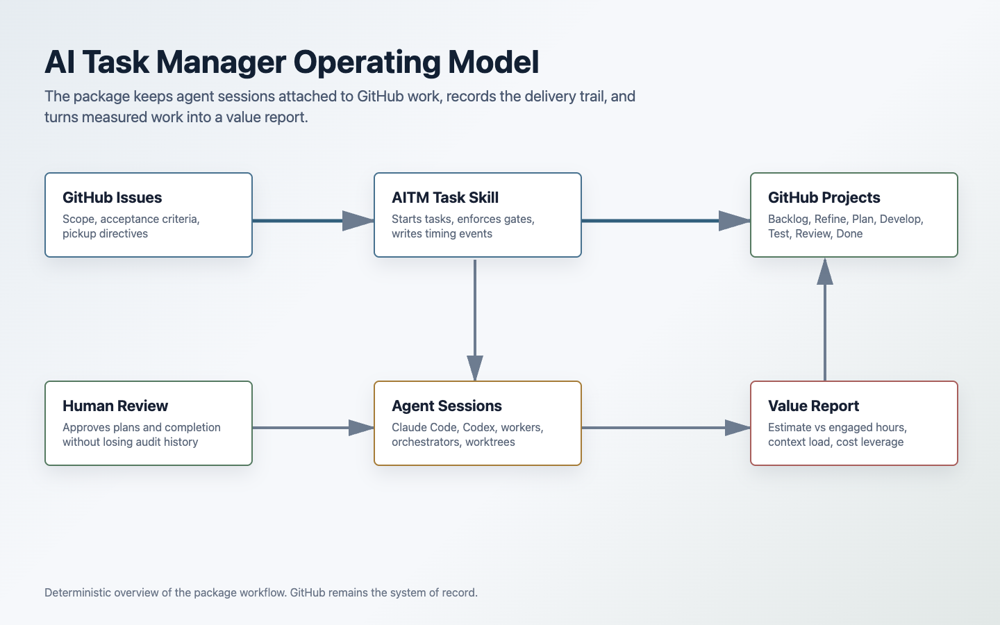
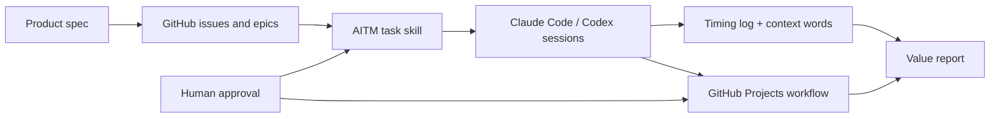

# AI Task Manager Introduction

AI Task Manager turns agentic coding sessions into managed engineering work. It installs a task skill for Claude Code and Codex, binds each AI session to a GitHub issue, keeps GitHub Projects state in sync, records time and context, and gives teams a repeatable way to move from product intent to backlog, implementation, review, and ROI reporting.

If you are adopting AI coding agents in a real project, this package gives you the missing operating layer: issues remain the source of truth, agent work is auditable, humans keep approval authority, and stakeholders get a measurable record of what was shipped.



## Quickstart

Prerequisites:

- Node.js 22 or newer
- GitHub CLI authenticated with `gh auth login`
- `jq`
- A GitHub repository and a GitHub Projects V2 board, or permission to create one during setup
- Claude Code, Codex, or another local agent that can follow the installed skill instructions and run shell commands

Install and authenticate the GitHub CLI before initializing AI Task Manager:

```bash
# macOS
brew install gh

# Windows
winget install --id GitHub.cli

# Then authenticate
gh auth login
gh auth status
```

For Linux and other package managers, use the official GitHub CLI install docs:

- [macOS install options](https://github.com/cli/cli/blob/trunk/docs/install_macos.md)
- [Windows install options](https://github.com/cli/cli/blob/trunk/docs/install_windows.md)
- [Linux and BSD install options](https://github.com/cli/cli/blob/trunk/docs/install_linux.md)
- [GitHub CLI manual](https://cli.github.com/manual/)

Install AI Task Manager in your project:

```bash
npx ai-task-manager install
npx ai-task-manager init
git add .ai-task-manager/ .github/ISSUE_TEMPLATE/ .claude/settings.json .claude/commands/task.md .claude/skills/task/SKILL.md .codex/hooks.json .agents/ AGENTS.md CLAUDE.md
git commit -m "chore: add ai-task-manager"
```

Use `--agent` if you only want one agent target:

```bash
npx ai-task-manager install --agent claude
npx ai-task-manager install --agent codex
```

Start a tracked task:

```text
/task #42
```

The skill starts timing, reads the issue, moves the project card into the active workflow, and tells the agent to follow the issue's Pickup Directive before changing code.

Checkpoint during work:

```text
/task update "implemented parser path"
```

Move completed work into review:

```text
/task review #42
```

After human approval, close it:

```text
/task approve #42
/task close #42
```

In Codex, use natural language:

```text
Use the task skill to start issue #42.
```

## What You Get

AI Task Manager provides three connected capabilities:

| Capability               | What it does                                                                                               | Why it matters                                                   |
| ------------------------ | ---------------------------------------------------------------------------------------------------------- | ---------------------------------------------------------------- |
| Session tracking         | Binds every agent session to one GitHub issue and logs active time, idle time, and context words           | Makes AI work measurable instead of anecdotal                    |
| Workflow control         | Moves issues through Backlog, Refine, Ready for Planning, Plan, Develop, Test, Review, and Done with gates | Prevents agents from skipping analysis, tests, or human approval |
| Backlog orchestration    | Creates epics, sub-issues, labels, estimates, priorities, sequences, and pickup directives from a spec     | Turns product plans into agent-ready execution queues            |
| Multi-agent coordination | Keeps orchestrators on epics and workers on child issues, with fleet visibility across worktrees           | Lets parallel AI work stay traceable and recoverable             |
| ROI reporting            | Compares estimated human effort with measured AI-engaged effort and review burden                          | Gives leadership a credible cost and leverage story              |



## Recommended Reading Path

1. [Install and Setup](./install-and-setup.md) covers prerequisites, install targets, generated files, project configuration, and publish-time package expectations.
2. [Core Workflow](./core-workflow.md) explains the daily task loop, state transitions, checkboxes, timing logs, and human gates.
3. [Agentic Development Process](./agentic-development-process.md) shows how specs become backlogs, how epics fan out to workers, and how Pickup Directives make issues restartable.
4. [Measurement and ROI](./measurement-and-roi.md) explains time tracking, context-word accounting, estimates, actuals, and the value report.
5. [Adoption Guide](./adoption-guide.md) gives a pragmatic rollout path for solo developers, small teams, and organizations.
6. [Solving the Bus Number Problem](./bus-factor-executive-brief.md) is a non-technical executive brief on how AI Task Manager makes the loss of a key engineer a survivable event.
7. [Context Management and Skill Architecture](./context-management-skill-architecture.md) explains how the installed skill keeps agent context small and workflow rules fresh via tiered, just-in-time loading.

## Positioning

Most agent tools optimize the conversation. AI Task Manager optimizes the project system around the conversation.

Without a workflow layer, agentic development can become difficult to inspect: work happens in chat, context resets erase decisions, parallel agents drift, and finished code may not map cleanly back to business value. AI Task Manager keeps the familiar engineering artifacts in charge. GitHub issues hold the scope. GitHub Projects holds state and prioritization. The installed skill tells agents exactly how to start, analyze, implement, verify, and stop. The timing log and project fields preserve the operational record.

That makes AI-assisted engineering easier to trust. Developers can resume work after a reset. Leads can see what is active. Reviewers can tell whether acceptance criteria and verification commands were actually checked. Stakeholders can compare planned effort to measured engaged effort.

## When To Use It

Use AI Task Manager when:

- AI agents are doing real implementation work, not just answering questions.
- You need GitHub issues and project boards to stay accurate while agents work.
- You want a repeatable path from product spec to agent-ready backlog.
- Multiple agent sessions or worktrees may run in parallel.
- You need to explain AI delivery cost, leverage, and throughput to non-engineering stakeholders.

It is intentionally heavier than a simple prompt template. The benefit comes from making agentic development observable, recoverable, and measurable.

## Key Commands

| Command                            | Purpose                                                                                                                                        |
| ---------------------------------- | ---------------------------------------------------------------------------------------------------------------------------------------------- |
| `npx ai-task-manager install`      | Install agent skills, hooks, templates, and local runtime files                                                                                |
| `npx ai-task-manager init`         | Configure GitHub repo, project board, fields, and workflow IDs                                                                                 |
| `/task #N`                         | Start or switch to issue `#N`                                                                                                                  |
| `/task plan`                       | Open an untracked planning bucket before issues exist                                                                                          |
| `/task new [title]`                | Create a new issue and start tracking it; the installed skill can orchestrate backlog creation before invoking this command while in plan mode |
| `/task update [message]`           | Flush timing and leave the task active                                                                                                         |
| `/task review #N`                  | Run the review gate, flush actuals, and move ready work to Review                                                                              |
| `/task approve #N`                 | Record explicit human approval                                                                                                                 |
| `/task close #N`                   | Close approved work and move it to Done                                                                                                        |
| `/task fleet`                      | Show active tracked work across parallel sessions                                                                                              |
| `npx github-project-report --html` | Generate an ROI/value report                                                                                                                   |

## Mental Model

Treat AI Task Manager as the operating system for agentic project work:

- GitHub issues define the work.
- GitHub Projects defines the workflow.
- The task skill defines the agent contract.
- The Pickup Directive defines the per-issue recovery plan.
- The timing log defines the delivery record.
- The value report defines the business narrative.

The result is not just faster coding. It is AI-assisted development that can survive resets, scale across agents, and produce evidence.
