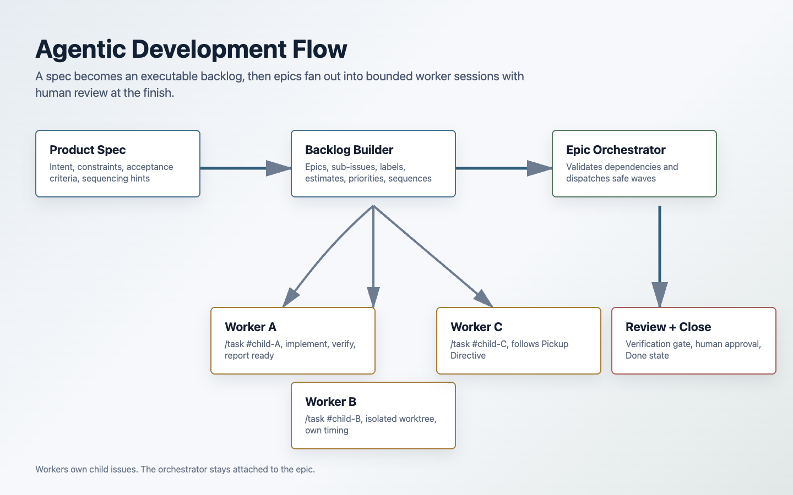
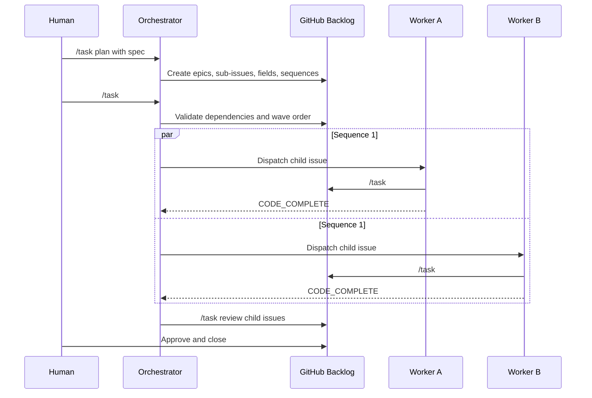

# Agentic Development Process

AI Task Manager is designed for work that goes beyond a single prompt. It supports a project rhythm where agents can help plan, decompose, implement, verify, and report without losing the thread of accountability.



## From Spec To Backlog

Start with planning mode:

```text
/task plan
```

Load or discuss the product spec with the agent. When the spec is ready:

```text
/task new My Feature Backlog
```

If the agent sees a usable spec in context, it can create a structured backlog instead of one blank issue.

That orchestration is skill-level behavior: the installed task skill detects the plan-mode context, asks whether to build the full backlog, and then uses the package's GitHub helper scripts. The raw `/task new` CLI verb itself creates a single issue and starts tracking it.

A generated backlog can include:

- Plan labels such as `plan:<slug>`
- Purpose labels such as `backend`, `client`, `infrastructure`, `security`, `data`, `test`, and `dx`
- Epic issues
- Native GitHub sub-issues
- Standalone tasks
- Priority values
- Size buckets
- Estimate hours
- Sequence values for parallel waves
- Pickup Directives
- Definition of Done checklists

The goal is not just issue creation. The goal is to produce work items that another agent can pick up cold and execute safely.

## Pickup Directives

A Pickup Directive makes an issue restartable. It tells the next agent what process to follow before making changes.

The installed template normally requires the agent to:

- Start the task timer with `/task #N`.
- Read the issue and current repository state.
- Append a Deep-Dive Analysis to the issue body.
- Identify files to edit.
- Write a step-by-step implementation plan.
- Add or confirm verification commands.
- Record dependencies and blockers.
- Mark the deep dive complete.
- Implement only after the analysis checkpoint is satisfied.

This is what lets teams survive context resets, machine switches, and multi-agent handoffs.

## Epics, Sub-Issues, And Waves

AI Task Manager uses GitHub's issue hierarchy to represent larger bodies of work.

An epic owns the broader goal. Sub-issues own implementation slices. Sequence values define fan-out waves:

```text
Sequence 1: can run now
Sequence 2: waits until all Sequence 1 siblings are complete
Sequence 3: waits until all Sequence 2 siblings are complete
```

Sub-issues with the same sequence can run in parallel when they do not share blocking dependencies.

Before dispatching workers under an epic, the orchestrator should validate the dependency map against the codebase. If the planned sequence is wrong, the project board should be corrected before fan-out.



## Orchestrator And Worker Boundaries

Parallel agent work only stays clean when each session has one active task.

| Session type                              | Active task         |
| ----------------------------------------- | ------------------- |
| Orchestrator managing an epic             | The epic issue      |
| Worker implementing a child issue         | The child sub-issue |
| Main thread directly implementing a child | The child sub-issue |
| Main thread returning to coordination     | The epic issue      |

The orchestrator should not switch its active task to a child issue while managing the epic. Each worker starts its own child issue in its own session or worktree.

This avoids corrupted timing data and makes the fleet view meaningful.

## Fleet Visibility

Use:

```text
/task fleet
```

The fleet view shows active tasks across parallel sessions. It helps the orchestrator answer:

- Which workers are active?
- Which issue is each worker responsible for?
- Which worktree owns the session?
- Which tasks appear stale or abandoned?

This is especially useful when a plan fans out several same-sequence sub-issues.

## Review Loop

A worker should end implementation by reporting readiness, not by closing the issue.

Typical worker terminal path:

```text
/task ensureChecked "Acceptance criteria met"
/task ensureChecked "`npm test`"
/task ensureChecked "`npm run lint`"
/task ensureChecked "`npm run format:check`"
/task review #42
```

The review command flushes timing, runs gates, and moves the issue toward Review if checks pass. If verification fails, the issue returns to development and the agent should fix the specific failed items.

The human or orchestrator can then approve, reject, or request changes:

```text
/task approve #42 --human
/task close #42
```

or:

```text
/task reject #42 --reason "Missing retry-path coverage"
```

## Process Benefits

AI Task Manager gives agentic development a shared operating cadence:

- Agents stop starting from vague prompts and start from scoped issues.
- Deep dives become visible project artifacts.
- Parallel work has explicit dependency boundaries.
- Human review remains part of the workflow instead of an afterthought.
- Context resets become manageable because the issue body carries the recovery state.
- Project metrics reflect actual agent engagement and review burden.

The result is a system where agents can move quickly without making the project harder to govern.
