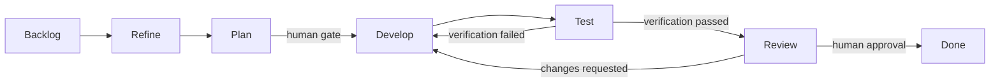

# Core Workflow

AI Task Manager is built around one rule: an agent session should always know which GitHub issue it is working on.

That active issue is the anchor for timing, context-word counting, board movement, checkboxes, review gates, and final reporting.

## The Daily Loop

Start work:

```text
/task #42
```

The task skill starts the timer, loads the issue, and makes sure the board state matches active work.

Do the deep dive:

```text
/task ensureChecked "Deep dive complete"
```

The agent should inspect the current codebase, identify files to edit, write a short plan, list verification commands, record dependencies, and only then mark the deep dive complete.

Checkpoint during long work:

```text
/task update "authentication tests passing"
```

This flushes timing and context-word deltas without ending the task.

Move to review:

```text
/task commit-trace #42
/task review #42
```

`/task commit-trace` creates or updates the canonical `### 🔗 Commits` comment from the current `HEAD`. Review refuses if tracked changes are still uncommitted or if that canonical comment does not contain `HEAD`. Then review runs the verification gate, flushes measured actuals, and moves the issue toward human review if every required checkbox is complete.

Approve and close after human review:

```text
/task approve #42 --human
/task close #42
```

Closing is intentionally a human-approved step. Passing tests and checked
boxes mean the issue is ready for review, not automatically done. Human
approval given in chat or a terminal is recorded with `--human`; close also
requires current Test-SHA and Agent Review proof for the latest Review epoch.

## Workflow States

AI Task Manager uses a seven-state flow:



| State   | Meaning                                                     |
| ------- | ----------------------------------------------------------- |
| Backlog | Raw or planned work that is not yet ready to pick up        |
| Refine  | Acceptance criteria, priority, size, and estimate are ready |
| Plan    | Deep-dive analysis is complete or awaiting approval         |
| Develop | Implementation work is active                               |
| Test    | Verification gate is running                                |
| Review  | Work is ready for human approval                            |
| Done    | Human-approved work is closed                               |

Use `/task promote`, `/task demote`, and `/task reconcile` for state transitions when you need explicit workflow movement. Use `/task review` and `/task close` for the review and completion paths because those commands also flush timing, write project fields, and enforce gates.

## Human Gates

Two transitions can require explicit human approval:

| Gate            | Default                 | Purpose                                                       |
| --------------- | ----------------------- | ------------------------------------------------------------- |
| Plan -> Develop | Human approval required | Prevents implementation before the deep-dive plan is accepted |
| Review -> Done  | Human approval required | Prevents agents from closing their own work                   |

The approval command writes a hidden marker that binds truthful provenance to
the current Review epoch and verified proof. Historical marker presence alone
does not satisfy the gate.

```text
/task approve #42 --human
```

For controlled automation batches, teams can use session-scoped auto mode rather than changing project defaults:

```text
/task auto both
/task auto off
```

Use auto mode deliberately. It is useful for well-bounded parallel work, but human approval is the safer default for ordinary team adoption.

## Checkboxes Are Contract Points

Issues created through AI Task Manager include a Definition of Done and a Pickup Directive. Agents must not treat these as decorative text.

Typical required checks include:

- Acceptance criteria met.
- `npm test`.
- `npm run lint`.
- `npm run format:check`.
- Issue body checkboxes are ticked.
- Deep dive is complete.
- Issue-specific verification commands were run successfully.

The close and review gates inspect issue checkboxes. If unchecked items remain, the command refuses to proceed unless an audited abandonment path is explicitly used.

## Timing Logs

Task commands append timing rows to a `Timing Log` comment on the GitHub issue. The log records events such as start, update, pause, review, and close.

Tracked values include:

- Active minutes
- Idle minutes
- Review pause time
- Session minutes
- Context-word deltas
- Word-count baselines
- Optional descriptions from update or pause messages

This gives teams a durable record of how much human-agent engagement each issue required.

## Context Words

AI Task Manager treats visible chat words as a proxy for human review burden. Long agent responses cost human attention even when code generation is fast. Context-word tracking helps value reports account for that review work instead of pretending all agent output is free.

## Pause Before Blocking Questions

If the agent must stop for a blocking user answer, pause the task first:

```text
/task pause "pause for question"
```

After the answer:

```text
/task resume
```

This keeps the ledger honest. Human-away time should not inflate active engineering time.

## Common Commands

| Command                          | Action                                                |
| -------------------------------- | ----------------------------------------------------- |
| `/task`                          | Show active task, elapsed time, and word delta        |
| `/task #N`                       | Start or switch to issue `#N`                         |
| `/task plan`                     | Open an untracked planning bucket                     |
| `/task new [title]`              | Create a new issue and start tracking it              |
| `/task resume [#N]`              | Resume the last paused task or a specific issue       |
| `/task pause [reason]`           | Flush timing and pause active work                    |
| `/task update [message]`         | Flush timing and continue                             |
| `/task ensureChecked "label"`    | Ensure an exact checkbox label is ticked (idempotent) |
| `/task review #N`                | Move ready work through verification into Review      |
| `/task approve #N --human`       | Record actual human approval for current Review proof |
| `/task reject #N --reason "..."` | Reject review work back to Develop                    |
| `/task close #N`                 | Close human-approved work                             |
| `/task fleet`                    | Show active work across parallel worktrees            |
| `/task config`                   | Show configuration values                             |

## The Safety Pattern

The workflow is intentionally strict:

1. Start the task before touching files.
2. Do the deep dive before implementation.
3. Check acceptance criteria with evidence.
4. Run verification commands before marking checks complete.
5. Move to Review before Done.
6. Let a human approve completion.

That discipline is what makes agentic development recoverable after context resets and credible when reported to stakeholders.
