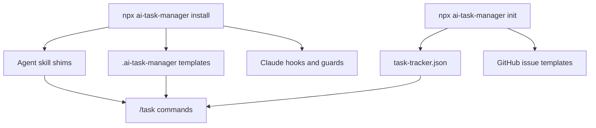

# Install and Setup

This guide gets AI Task Manager running inside a local project and explains what the installer adds.

## Prerequisites

Install these before running the package:

- Node.js 22 or newer
- GitHub CLI, authenticated with `gh auth login`
- `jq`
- Git
- Access to the GitHub repository you want agents to work in
- Access to a GitHub Projects V2 board, or permission for setup to create/configure one
- Claude Code and/or Codex, depending on which agent experience you want to use

## Install GitHub CLI

AI Task Manager uses the GitHub CLI for issue, project, and GraphQL operations. Install `gh` first, then authenticate before running `npx ai-task-manager init`.

Recommended official install paths:

| Platform      | Command                             | Notes                                                                     |
| ------------- | ----------------------------------- | ------------------------------------------------------------------------- |
| macOS         | `brew install gh`                   | Official GitHub CLI docs list Homebrew as the recommended macOS path      |
| Windows       | `winget install --id GitHub.cli`    | Open a new Windows Terminal window after install so PATH changes apply    |
| Linux and BSD | See the official Linux instructions | Package setup differs by distribution and signed repository configuration |

After installation:

```bash
gh --version
gh auth login
gh auth status
```

Useful official references:

- [Installing `gh` on macOS](https://github.com/cli/cli/blob/trunk/docs/install_macos.md)
- [Installing `gh` on Windows](https://github.com/cli/cli/blob/trunk/docs/install_windows.md)
- [Installing `gh` on Linux and BSD](https://github.com/cli/cli/blob/trunk/docs/install_linux.md)
- [GitHub CLI manual](https://cli.github.com/manual/)

## Install

From the root of your project:

```bash
npx ai-task-manager install
```

By default, this installs support for both Claude Code and Codex. To install only one adapter:

```bash
npx ai-task-manager install --agent claude
npx ai-task-manager install --agent codex
```

The installer writes stable, project-local files so every developer and agent in the repository shares the same workflow contract.

Common generated paths:

| Path                           | Purpose                                                                                        |
| ------------------------------ | ---------------------------------------------------------------------------------------------- |
| `.ai-task-manager/`            | Project config, runtime templates, Pickup Directive, and Definition of Done                    |
| `.claude/skills/task/SKILL.md` | Claude Code task skill shim                                                                    |
| `.agents/skills/task/SKILL.md` | Codex task skill shim                                                                          |
| `.claude/settings.json`        | Claude Code hook and allow-rule configuration when applicable                                  |
| `.claude/hooks/`               | Optional project-local helper hooks; timing and commit trail use direct Node settings commands |



The `init` command adds GitHub project configuration and issue templates:

| Path                                 | Purpose                                                       |
| ------------------------------------ | ------------------------------------------------------------- |
| `.ai-task-manager/task-tracker.json` | GitHub repo, project, field, workflow, and user configuration |
| `.github/ISSUE_TEMPLATE/`            | Issue form support                                            |

Commit the generated project files:

```bash
git add .ai-task-manager/ .github/ISSUE_TEMPLATE/ .claude/ .agents/
git commit -m "chore: add ai-task-manager"
```

Review the diff before committing. If your repository does not use both Claude Code and Codex, only stage the adapter folder you installed.

## Initialize GitHub Project Integration

Run:

```bash
npx ai-task-manager init
```

The initializer connects the local project to GitHub and stores the board IDs needed by the task workflow. It can use an existing linked project, link an existing user or organization project, or create/configure a compatible project board.

The important output is `.ai-task-manager/task-tracker.json`, which records values such as:

- GitHub repo name
- GitHub Projects V2 project ID
- Status field ID and option IDs
- Size, Estimate, Priority, Sequence, and timing field IDs
- User-level workflow preferences

These IDs are intentionally stored in project config so future task commands do not require manual GraphQL setup.

## Optional Codex Superpowers Bootstrap

If your team uses Claude Code Superpowers and wants Codex to follow similar workflow discipline, run:

```bash
npx ai-task-manager install --codex-superpowers
```

This mirrors supported Superpowers skills into `~/.codex/skills` when a local Claude Code Superpowers cache is available, then writes a managed bootstrap block to the repo `AGENTS.md`. The AITM task skill remains separate at `.agents/skills/task/SKILL.md`.

Use the global variant only when you intentionally want global Codex instructions:

```bash
npx ai-task-manager install --codex-superpowers-global
```

## Verify The Install

Run the task command help from an agent session:

```text
/task help
```

Or through the package CLI:

```bash
npx ai-task-manager --help
```

Then start with a real issue:

```text
/task #42
```

A successful start should:

- Register issue `#42` as the active task.
- Start or resume the timing baseline.
- Let the installed skill read the issue title and body for context.
- Let the installed skill enforce the current workflow state and gate requirements before implementation.
- Preserve timing state under `.ai-task-manager/`.

## Package Publishing Note

When publishing this package to npm, include the introduction docs in `package.json#files`. The package should ship:

- `docs/introduction/`
- `docs/guides/`
- `skill/`
- `scripts/`
- `hooks/` for legacy compatibility assets
- `templates/`
- `config/`

That ensures users installing from npm can read the same onboarding material locally under `node_modules/ai-task-manager/docs/`.

## Common Setup Problems

`gh: command not found`
: Install the GitHub CLI and authenticate with `gh auth login`.

`jq: command not found`
: Install `jq` with your platform package manager.

`task-tracker not configured`
: Run `npx ai-task-manager init` from the project root.

Project field errors
: Re-run `npx ai-task-manager init` and confirm the configured GitHub Project board has the expected Status, Size, Estimate, Priority, Sequence, and timing fields.

Timing data missing after a reset
: Make sure agent hooks were installed and avoid clearing a session without pausing first. Before a destructive context reset, run `/task pause`.
