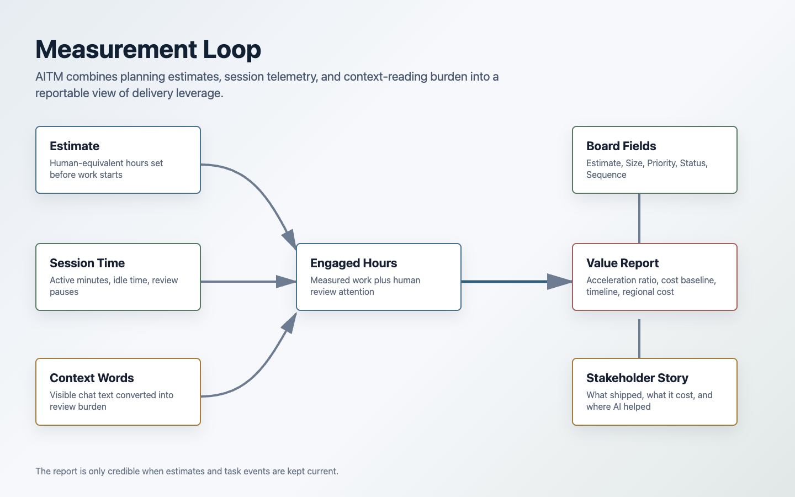
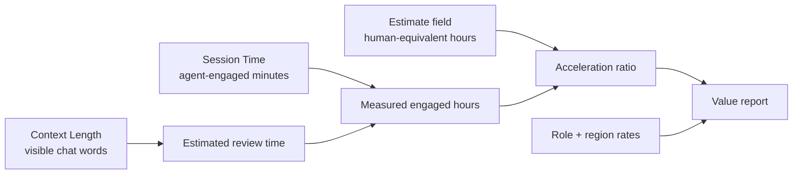

# Measurement and ROI

AI Task Manager measures agentic development at the issue level so teams can explain both delivery speed and human engagement cost.



## What Gets Measured

Each tracked issue can accumulate:

- Estimated human-equivalent hours
- Active agent-session minutes
- Idle minutes
- Review pause minutes
- Session wall-clock time
- Context words visible to the human
- Start and end timestamps
- Review and close events

The task workflow writes these values to issue comments and GitHub Projects fields, making them available for board views, rollups, and reports.

## Why Context Words Matter

AI work still costs human attention. A model can produce thousands of words of plans, diffs, explanations, and verification notes. Someone has to read enough of that output to steer, approve, or reject the work.

AI Task Manager tracks visible chat words as a practical proxy for review burden. Value reports can convert those words into estimated reading time using a configurable words-per-minute rate.

This avoids a common reporting mistake: counting only wall-clock agent time while ignoring the human effort required to supervise the agent.

## Estimates And Actuals

AI Task Manager treats `Estimate` as the human-equivalent baseline. It answers: how many hours would this issue likely take without agent acceleration?

Actuals come from measured session activity:

- Session time from task events.
- Engaged time from active work plus relevant review time.
- Context time from visible chat words.

Together, these values support an acceleration comparison:

```text
Acceleration = estimated human hours / measured engaged hours
```

The exact report model can include role, region, reading speed, review overlap, and date filters.



## Value Report

Generate an HTML report:

```bash
npx github-project-report --html
```

Generate a PDF report when your project has PDF dependencies available:

```bash
npx github-project-report
```

Useful filters:

```bash
npx github-project-report --html --state closed
npx github-project-report --html --from 2026-01-01 --to 2026-03-31
npx github-project-report --html --issues 10,11,12
npx github-project-report --html --region national --role senior
```

## Report Sections

The value report is designed for engineering and business audiences.

It can include:

- Executive summary
- Human engineering cost baseline
- AI-assisted actual cost
- Agentic AI acceleration comparison
- Product backlog table
- Issue-level estimates, actuals, context words, and acceleration ratios
- Regional cost tables
- Timeline analysis
- Methodology notes

The point is to move the conversation from "we used AI" to "this work represented X estimated hours, required Y measured engaged hours, and produced Z delivery leverage."

## Operational Benefits

Measurement changes agentic development behavior:

- Developers are more likely to keep issues scoped.
- Agents are less likely to run untracked side quests.
- Managers can compare planned work to actual agent engagement.
- Reviewers can see which issues consumed unusually high context.
- Teams can identify where agent work is accelerating delivery and where supervision cost is high.

## Reporting Hygiene

For credible reports:

- Set Size and Estimate before work starts.
- Keep one active task per session.
- Use `/task update` during long sessions.
- Pause before long blocking questions.
- Run `/task review` when implementation is ready.
- Close only after human approval.
- Avoid force-closing real work.

The report is only as trustworthy as the workflow discipline behind it.

## Methodology Reference

For the deeper financial model, see the package guide:

- [`../guides/ai-value-framework.md`](../guides/ai-value-framework.md)

That guide explains cost baselines, reading speed, engaged hours, regional rates, and interpretation of acceleration ratios.
