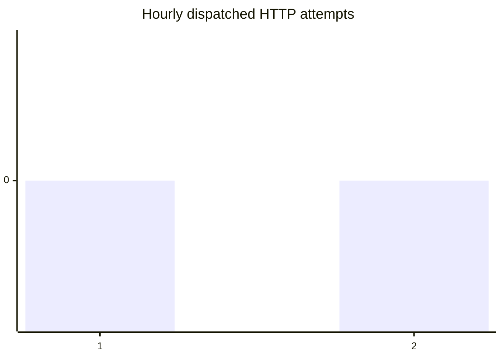
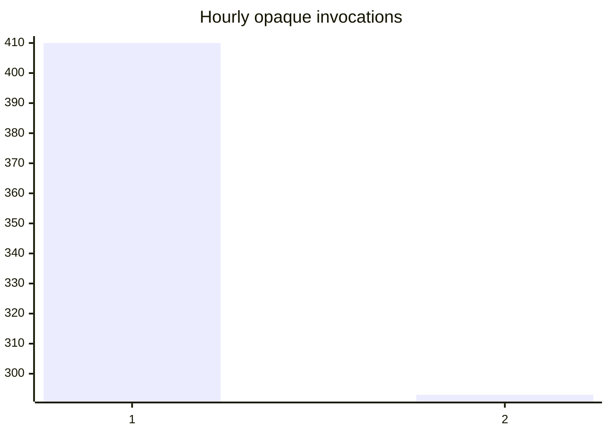
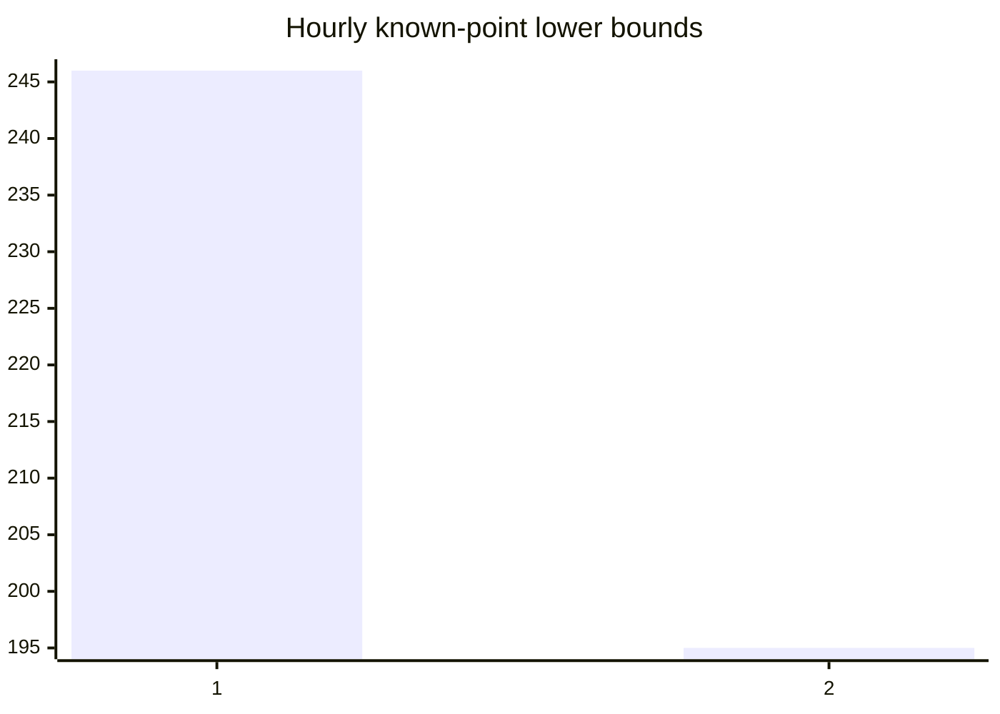
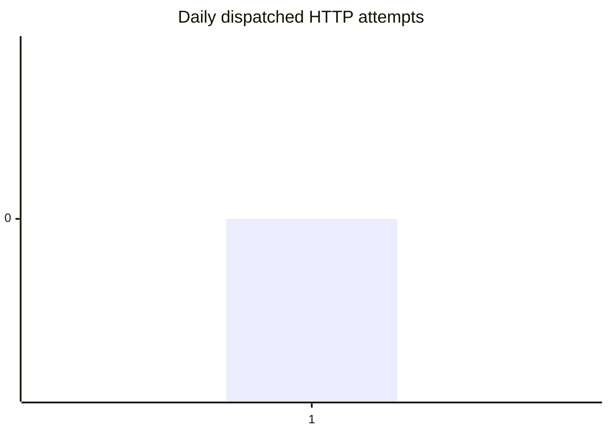
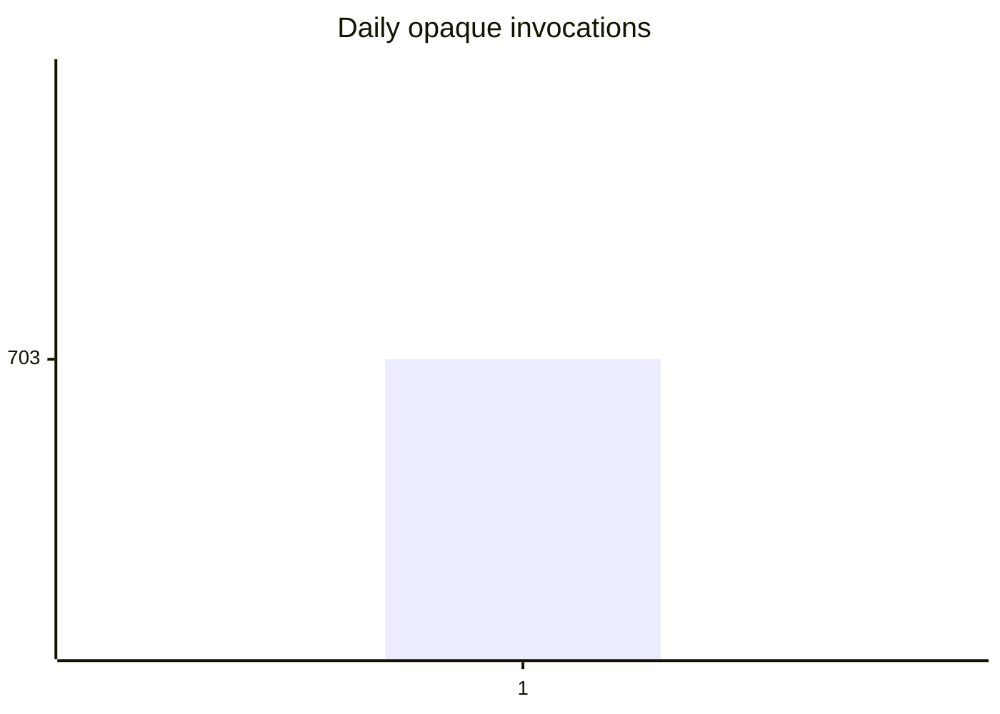
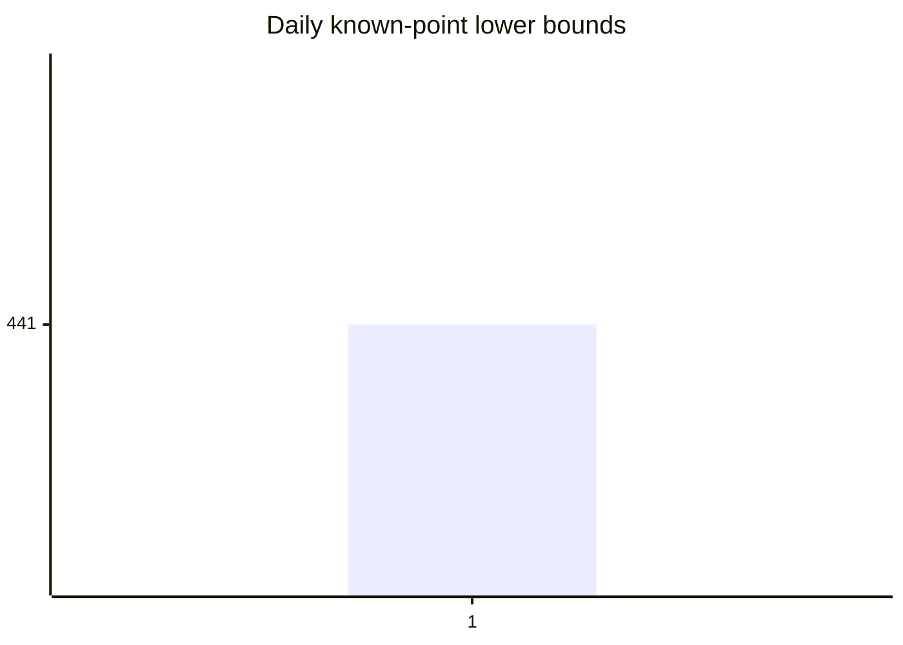

<!-- cspell:words xychart -->

# GraphQL usage report

Common root: sha256:382ab54c044e6cdce14ad2a15c2f662a79b7e90ad6a556272de78fef3042aba2. Interval: 2026-10-05T04:29:35.298Z ≤ start < 2026-10-05T05:29:40.298Z. Display zone: America/Chicago.

Known-point subtotals are lower bounds unless a declared group passes its complete-cost gate. This report does not qualify a real baseline.

Fleet: lower-bound. Observed activity is a lower bound; enrollment rows alone do not prove intended fleet size or enabled duration.

| Observations | HTTP dispatched | HTTP uncertain | HTTP not sent | Opaque invocations | Known-point subtotal | Unknown costs | Incomplete costs | Retries | Failures |
| --- | --- | --- | --- | --- | --- | --- | --- | --- | --- |
| 703 | 0 | 0 | 0 | 703 | 441 | 430 | 703 | 0 | 0 |

## Decision sufficiency

| Group | Scope | Signal | Status | Observed denominator | Point finding | Coverage limitations |
| --- | --- | --- | --- | --- | --- | --- |
| native-query-invocations | predeclared-participant-sample | opaque-invocation-volume | volume-ranking | 533 | total-point prioritization insufficient |  |
| native-mutation-invocations | predeclared-participant-sample | opaque-invocation-volume | volume-ranking | 169 | total-point prioritization insufficient |  |

Baseline qualification (real workflow, enrolled overlap, matched workload): not assessed by this offline report.

## Hourly

Only nonempty UTC buckets are shown; absent buckets do not prove collection coverage.

Bucket indices follow the UTC bucket table (2/2 shown).

Bucket indices follow the UTC bucket table (2/2 shown).

Bucket indices follow the UTC bucket table (2/2 shown).

| Local start with offset | UTC start | HTTP sent | HTTP uncertain | HTTP not sent | Opaque | Known-point subtotal | Unknown costs | Incomplete costs |
| --- | --- | --- | --- | --- | --- | --- | --- | --- |
| 2026-10-04 23:00 -05:00 | 2026-10-05T04:00:00.000Z | 0 | 0 | 0 | 410 | 246 | 248 | 410 |
| 2026-10-05 00:00 -05:00 | 2026-10-05T05:00:00.000Z | 0 | 0 | 0 | 293 | 195 | 182 | 293 |

## Daily

Only nonempty UTC buckets are shown; absent buckets do not prove collection coverage.

Bucket indices follow the UTC bucket table (1/1 shown).

Bucket indices follow the UTC bucket table (1/1 shown).

Bucket indices follow the UTC bucket table (1/1 shown).

| Local start with offset | UTC start | HTTP sent | HTTP uncertain | HTTP not sent | Opaque | Known-point subtotal | Unknown costs | Incomplete costs |
| --- | --- | --- | --- | --- | --- | --- | --- | --- |
| 2026-10-04 19:00 -05:00 | 2026-10-05T00:00:00.000Z | 0 | 0 | 0 | 703 | 441 | 430 | 703 |

## Rolling 60-minute peaks

Windows use (t − 60 minutes, t] at observation start times; simultaneous starts are counted together.

| Signal | Peak | Window end UTC |
| --- | --- | --- |
| HTTP attempts | 0 | unknown |
| Opaque invocations | 703 | 2026-10-05T05:02:03.398Z |
| Known-point subtotal (lower bound) | 441 | 2026-10-05T05:01:59.738Z |

## By operation

| Value | HTTP sent | Opaque | Known-point subtotal | Unknown costs | Incomplete costs | Retries | Failures |
| --- | --- | --- | --- | --- | --- | --- | --- |
| anonymous.0564fa374bca2f7779514ced2dbbb3fe8ce4a36067b12adbe05af2d66e8536e7 | 0 | 28 | 28 | 0 | 28 | 0 | 0 |
| anonymous.0a09de4dc0c3072fa1bffa3c9d52090ba6de709e96569dbaa94614e5cfdb252b | 0 | 8 | 8 | 0 | 8 | 0 | 0 |
| anonymous.2a108f03695f1a3a168dc11c6d75923edcd55dcc5ea3f7599049b62759094c83 | 0 | 4 | 0 | 4 | 4 | 0 | 0 |
| anonymous.31353da88c3c53547e2202b7c8c5d75bc259b05c156527ba1ddd933285dcdb43 | 0 | 30 | 30 | 0 | 30 | 0 | 0 |
| anonymous.32ecad6249ae0c14e4090a0e5f8a98bdebbec4e8332fde2807fe2d48ad9e4f81 | 0 | 32 | 0 | 32 | 32 | 0 | 0 |
| anonymous.5947c36c187a469f79ab955f1eb875572b63c5d4b7a7cd53b0e3921e257ad39e | 0 | 8 | 8 | 0 | 8 | 0 | 0 |
| anonymous.6766c3aeb2177999ad33fc9f4ca542e70bd9f0046b35db2bea0033e0276c918f | 0 | 4 | 0 | 4 | 4 | 0 | 0 |
| anonymous.6773602e4af4f1abddadb9da4afd3d35a25e14980b1c5b3f0884da11730d312c | 0 | 12 | 0 | 12 | 12 | 0 | 0 |
| anonymous.6e738cbdb4bd0d44c4a01ca0d81f8fa0348800f4dc296173a88ea8333220bcf7 | 0 | 8 | 8 | 0 | 8 | 0 | 0 |
| anonymous.75e7745a753dcc6e7bb172d6d311cdc26f24a188d33d50171c519b8e521043a8 | 0 | 4 | 4 | 0 | 4 | 0 | 0 |
| anonymous.806cfcd7bad1aacf2c22ecc3d433b5c16d0c947f0d37272e1276782b3d4e4350 | 0 | 14 | 14 | 0 | 14 | 0 | 0 |
| anonymous.80ddd956a1d9fa7237935ab4cfbc39d6fc13c89d4763e8831fafd045418a5512 | 0 | 16 | 0 | 16 | 16 | 0 | 0 |
| anonymous.8535a7bb9f9e05cae75f39571b3cb6d7da857e583e87682df848c4deabc142a1 | 0 | 1 | 0 | 1 | 1 | 0 | 0 |
| anonymous.a014cc2aaca3fbe84458a73fe515a579e6094c88053337b28c2db11050b6ebf9 | 0 | 4 | 4 | 0 | 4 | 0 | 0 |
| anonymous.b2ea38f9b2b4ebe5107b7877ff3aaf76a634ace6dad36d9164ef3eb134d67cd1 | 0 | 44 | 44 | 0 | 44 | 0 | 0 |
| anonymous.bddfdc412573bfcc8558eba33c15f1223649fd07508197f3d973ed99763d9d46 | 0 | 8 | 8 | 0 | 8 | 0 | 0 |
| anonymous.c0be66beb033fc51e89587293fafb7ee3382d0fb3dbb7bdd89f7a9753227d926 | 0 | 25 | 0 | 25 | 25 | 0 | 0 |
| anonymous.c5c67459578b61e62839b31a93bde9e289768e55b7c7daace9629c295c299580 | 0 | 8 | 176 | 0 | 8 | 0 | 0 |
| anonymous.cc1b2bb952a095c716c4ca1e75acbf1fecc2fcb04d41b6c96ea80078af476f96 | 0 | 20 | 20 | 0 | 20 | 0 | 0 |
| anonymous.cf1d97f59243f1991a8ca4b9b4c343c88023dc66f9b7701a65eaae7b2a8d1dc4 | 0 | 48 | 48 | 0 | 48 | 0 | 0 |
| anonymous.d7be73df600a5d9a53fdbaca2210859554c85e453556fd61cd2d506c1009e459 | 0 | 9 | 9 | 0 | 9 | 0 | 0 |
| anonymous.e3c4a0d5483dd621339200e6205da9ade77448a1e869864d37ce74fdf73aefd1 | 0 | 16 | 16 | 0 | 16 | 0 | 0 |
| anonymous.f0f493b51a8dac9be39ef648a0ee405ba5e46cda3926bf86b175973b54080a1b | 0 | 16 | 16 | 0 | 16 | 0 | 0 |
| anonymous.ff0fe7b2e4472490bcf64ede1f2294284949c8f594bc90380291abfe561b6250 | 0 | 40 | 0 | 40 | 40 | 0 | 0 |
| gh.issue.comment | 0 | 8 | 0 | 8 | 8 | 0 | 0 |
| gh.issue.create | 0 | 4 | 0 | 4 | 4 | 0 | 0 |
| gh.issue.edit | 0 | 52 | 0 | 52 | 52 | 0 | 0 |
| gh.issue.view | 0 | 220 | 0 | 220 | 220 | 0 | 0 |
| gh.project.item-edit | 0 | 12 | 0 | 12 | 12 | 0 | 0 |

## By kind

| Value | HTTP sent | Opaque | Known-point subtotal | Unknown costs | Incomplete costs | Retries | Failures |
| --- | --- | --- | --- | --- | --- | --- | --- |
| mutation | 0 | 170 | 0 | 170 | 170 | 0 | 0 |
| query | 0 | 533 | 441 | 260 | 533 | 0 | 0 |

## By stage

| Value | HTTP sent | Opaque | Known-point subtotal | Unknown costs | Incomplete costs | Retries | Failures |
| --- | --- | --- | --- | --- | --- | --- | --- |
| backlog | 0 | 280 | 91 | 189 | 280 | 0 | 0 |
| plan | 0 | 28 | 8 | 20 | 28 | 0 | 0 |
| ready-for-plan | 0 | 171 | 254 | 85 | 171 | 0 | 0 |
| refine | 0 | 224 | 88 | 136 | 224 | 0 | 0 |

## By issue

| Value | HTTP sent | Opaque | Known-point subtotal | Unknown costs | Incomplete costs | Retries | Failures |
| --- | --- | --- | --- | --- | --- | --- | --- |
| 7 | 0 | 175 | 113 | 104 | 175 | 0 | 0 |
| 8 | 0 | 168 | 108 | 102 | 168 | 0 | 0 |
| 9 | 0 | 168 | 108 | 102 | 168 | 0 | 0 |
| 10 | 0 | 168 | 108 | 102 | 168 | 0 | 0 |
| unknown | 0 | 24 | 4 | 20 | 24 | 0 | 0 |

## By worktree

| Value | HTTP sent | Opaque | Known-point subtotal | Unknown costs | Incomplete costs | Retries | Failures |
| --- | --- | --- | --- | --- | --- | --- | --- |
| sha256:0c1d44121cff84af1b349d756730227dc073814d164be0dc909794abce504e3b | 0 | 355 | 223 | 216 | 355 | 0 | 0 |
| sha256:a06ec9e759b148f79a3716520b117eb8d965195118afcdcb7ab82fe91e0b3b76 | 0 | 348 | 218 | 214 | 348 | 0 | 0 |

## By session

| Value | HTTP sent | Opaque | Known-point subtotal | Unknown costs | Incomplete costs | Retries | Failures |
| --- | --- | --- | --- | --- | --- | --- | --- |
| sha256:bc6becef757b38bd49291d71a0e9d6d6bd25195f1fe5567437388ba682f6b799 | 0 | 355 | 223 | 216 | 355 | 0 | 0 |
| sha256:f6dc574d350806fa2c5878318a8b012ec155befd83e97c2399c3c51a518fd51b | 0 | 348 | 218 | 214 | 348 | 0 | 0 |

## Operation distributions

Known-cost samples include visible-response-only costs; they do not imply complete observation cost. P95 uses nearest rank; an even-sample median averages the two middle samples.

| Operation | Distribution | Samples | Mean | Median | P95 |
| --- | --- | --- | --- | --- | --- |
| anonymous.0564fa374bca2f7779514ced2dbbb3fe8ce4a36067b12adbe05af2d66e8536e7 | pointCost | 28 | 1 | 1 | 1 |
| anonymous.0564fa374bca2f7779514ced2dbbb3fe8ce4a36067b12adbe05af2d66e8536e7 | httpLatencyMs | 0 | unknown | unknown | unknown |
| anonymous.0564fa374bca2f7779514ced2dbbb3fe8ce4a36067b12adbe05af2d66e8536e7 | cliLatencyMs | 28 | 508.5 | 464.5 | 834 |
| anonymous.0a09de4dc0c3072fa1bffa3c9d52090ba6de709e96569dbaa94614e5cfdb252b | pointCost | 8 | 1 | 1 | 1 |
| anonymous.0a09de4dc0c3072fa1bffa3c9d52090ba6de709e96569dbaa94614e5cfdb252b | httpLatencyMs | 0 | unknown | unknown | unknown |
| anonymous.0a09de4dc0c3072fa1bffa3c9d52090ba6de709e96569dbaa94614e5cfdb252b | cliLatencyMs | 8 | 413.25 | 415.5 | 467 |
| anonymous.2a108f03695f1a3a168dc11c6d75923edcd55dcc5ea3f7599049b62759094c83 | pointCost | 0 | unknown | unknown | unknown |
| anonymous.2a108f03695f1a3a168dc11c6d75923edcd55dcc5ea3f7599049b62759094c83 | httpLatencyMs | 0 | unknown | unknown | unknown |
| anonymous.2a108f03695f1a3a168dc11c6d75923edcd55dcc5ea3f7599049b62759094c83 | cliLatencyMs | 4 | 464 | 465 | 523 |
| anonymous.31353da88c3c53547e2202b7c8c5d75bc259b05c156527ba1ddd933285dcdb43 | pointCost | 30 | 1 | 1 | 1 |
| anonymous.31353da88c3c53547e2202b7c8c5d75bc259b05c156527ba1ddd933285dcdb43 | httpLatencyMs | 0 | unknown | unknown | unknown |
| anonymous.31353da88c3c53547e2202b7c8c5d75bc259b05c156527ba1ddd933285dcdb43 | cliLatencyMs | 30 | 533.3333333333334 | 511.5 | 730 |
| anonymous.32ecad6249ae0c14e4090a0e5f8a98bdebbec4e8332fde2807fe2d48ad9e4f81 | pointCost | 0 | unknown | unknown | unknown |
| anonymous.32ecad6249ae0c14e4090a0e5f8a98bdebbec4e8332fde2807fe2d48ad9e4f81 | httpLatencyMs | 0 | unknown | unknown | unknown |
| anonymous.32ecad6249ae0c14e4090a0e5f8a98bdebbec4e8332fde2807fe2d48ad9e4f81 | cliLatencyMs | 32 | 871.59375 | 850.5 | 1185 |
| anonymous.5947c36c187a469f79ab955f1eb875572b63c5d4b7a7cd53b0e3921e257ad39e | pointCost | 8 | 1 | 1 | 1 |
| anonymous.5947c36c187a469f79ab955f1eb875572b63c5d4b7a7cd53b0e3921e257ad39e | httpLatencyMs | 0 | unknown | unknown | unknown |
| anonymous.5947c36c187a469f79ab955f1eb875572b63c5d4b7a7cd53b0e3921e257ad39e | cliLatencyMs | 8 | 585 | 439 | 1387 |
| anonymous.6766c3aeb2177999ad33fc9f4ca542e70bd9f0046b35db2bea0033e0276c918f | pointCost | 0 | unknown | unknown | unknown |
| anonymous.6766c3aeb2177999ad33fc9f4ca542e70bd9f0046b35db2bea0033e0276c918f | httpLatencyMs | 0 | unknown | unknown | unknown |
| anonymous.6766c3aeb2177999ad33fc9f4ca542e70bd9f0046b35db2bea0033e0276c918f | cliLatencyMs | 4 | 609 | 630.5 | 677 |
| anonymous.6773602e4af4f1abddadb9da4afd3d35a25e14980b1c5b3f0884da11730d312c | pointCost | 0 | unknown | unknown | unknown |
| anonymous.6773602e4af4f1abddadb9da4afd3d35a25e14980b1c5b3f0884da11730d312c | httpLatencyMs | 0 | unknown | unknown | unknown |
| anonymous.6773602e4af4f1abddadb9da4afd3d35a25e14980b1c5b3f0884da11730d312c | cliLatencyMs | 12 | 498 | 466.5 | 788 |
| anonymous.6e738cbdb4bd0d44c4a01ca0d81f8fa0348800f4dc296173a88ea8333220bcf7 | pointCost | 8 | 1 | 1 | 1 |
| anonymous.6e738cbdb4bd0d44c4a01ca0d81f8fa0348800f4dc296173a88ea8333220bcf7 | httpLatencyMs | 0 | unknown | unknown | unknown |
| anonymous.6e738cbdb4bd0d44c4a01ca0d81f8fa0348800f4dc296173a88ea8333220bcf7 | cliLatencyMs | 8 | 505.25 | 440 | 873 |
| anonymous.75e7745a753dcc6e7bb172d6d311cdc26f24a188d33d50171c519b8e521043a8 | pointCost | 4 | 1 | 1 | 1 |
| anonymous.75e7745a753dcc6e7bb172d6d311cdc26f24a188d33d50171c519b8e521043a8 | httpLatencyMs | 0 | unknown | unknown | unknown |
| anonymous.75e7745a753dcc6e7bb172d6d311cdc26f24a188d33d50171c519b8e521043a8 | cliLatencyMs | 4 | 689.5 | 703.5 | 779 |
| anonymous.806cfcd7bad1aacf2c22ecc3d433b5c16d0c947f0d37272e1276782b3d4e4350 | pointCost | 14 | 1 | 1 | 1 |
| anonymous.806cfcd7bad1aacf2c22ecc3d433b5c16d0c947f0d37272e1276782b3d4e4350 | httpLatencyMs | 0 | unknown | unknown | unknown |
| anonymous.806cfcd7bad1aacf2c22ecc3d433b5c16d0c947f0d37272e1276782b3d4e4350 | cliLatencyMs | 14 | 490.42857142857144 | 455 | 774 |
| anonymous.80ddd956a1d9fa7237935ab4cfbc39d6fc13c89d4763e8831fafd045418a5512 | pointCost | 0 | unknown | unknown | unknown |
| anonymous.80ddd956a1d9fa7237935ab4cfbc39d6fc13c89d4763e8831fafd045418a5512 | httpLatencyMs | 0 | unknown | unknown | unknown |
| anonymous.80ddd956a1d9fa7237935ab4cfbc39d6fc13c89d4763e8831fafd045418a5512 | cliLatencyMs | 16 | 523.875 | 492 | 772 |
| anonymous.8535a7bb9f9e05cae75f39571b3cb6d7da857e583e87682df848c4deabc142a1 | pointCost | 0 | unknown | unknown | unknown |
| anonymous.8535a7bb9f9e05cae75f39571b3cb6d7da857e583e87682df848c4deabc142a1 | httpLatencyMs | 0 | unknown | unknown | unknown |
| anonymous.8535a7bb9f9e05cae75f39571b3cb6d7da857e583e87682df848c4deabc142a1 | cliLatencyMs | 1 | 510 | 510 | 510 |
| anonymous.a014cc2aaca3fbe84458a73fe515a579e6094c88053337b28c2db11050b6ebf9 | pointCost | 4 | 1 | 1 | 1 |
| anonymous.a014cc2aaca3fbe84458a73fe515a579e6094c88053337b28c2db11050b6ebf9 | httpLatencyMs | 0 | unknown | unknown | unknown |
| anonymous.a014cc2aaca3fbe84458a73fe515a579e6094c88053337b28c2db11050b6ebf9 | cliLatencyMs | 4 | 513.75 | 527.5 | 559 |
| anonymous.b2ea38f9b2b4ebe5107b7877ff3aaf76a634ace6dad36d9164ef3eb134d67cd1 | pointCost | 44 | 1 | 1 | 1 |
| anonymous.b2ea38f9b2b4ebe5107b7877ff3aaf76a634ace6dad36d9164ef3eb134d67cd1 | httpLatencyMs | 0 | unknown | unknown | unknown |
| anonymous.b2ea38f9b2b4ebe5107b7877ff3aaf76a634ace6dad36d9164ef3eb134d67cd1 | cliLatencyMs | 44 | 434.25 | 404 | 618 |
| anonymous.bddfdc412573bfcc8558eba33c15f1223649fd07508197f3d973ed99763d9d46 | pointCost | 8 | 1 | 1 | 1 |
| anonymous.bddfdc412573bfcc8558eba33c15f1223649fd07508197f3d973ed99763d9d46 | httpLatencyMs | 0 | unknown | unknown | unknown |
| anonymous.bddfdc412573bfcc8558eba33c15f1223649fd07508197f3d973ed99763d9d46 | cliLatencyMs | 8 | 578.375 | 520.5 | 757 |
| anonymous.c0be66beb033fc51e89587293fafb7ee3382d0fb3dbb7bdd89f7a9753227d926 | pointCost | 0 | unknown | unknown | unknown |
| anonymous.c0be66beb033fc51e89587293fafb7ee3382d0fb3dbb7bdd89f7a9753227d926 | httpLatencyMs | 0 | unknown | unknown | unknown |
| anonymous.c0be66beb033fc51e89587293fafb7ee3382d0fb3dbb7bdd89f7a9753227d926 | cliLatencyMs | 25 | 498.8 | 459 | 714 |
| anonymous.c5c67459578b61e62839b31a93bde9e289768e55b7c7daace9629c295c299580 | pointCost | 8 | 22 | 22 | 22 |
| anonymous.c5c67459578b61e62839b31a93bde9e289768e55b7c7daace9629c295c299580 | httpLatencyMs | 0 | unknown | unknown | unknown |
| anonymous.c5c67459578b61e62839b31a93bde9e289768e55b7c7daace9629c295c299580 | cliLatencyMs | 8 | 454.25 | 432 | 730 |
| anonymous.cc1b2bb952a095c716c4ca1e75acbf1fecc2fcb04d41b6c96ea80078af476f96 | pointCost | 20 | 1 | 1 | 1 |
| anonymous.cc1b2bb952a095c716c4ca1e75acbf1fecc2fcb04d41b6c96ea80078af476f96 | httpLatencyMs | 0 | unknown | unknown | unknown |
| anonymous.cc1b2bb952a095c716c4ca1e75acbf1fecc2fcb04d41b6c96ea80078af476f96 | cliLatencyMs | 20 | 520.2 | 485 | 659 |
| anonymous.cf1d97f59243f1991a8ca4b9b4c343c88023dc66f9b7701a65eaae7b2a8d1dc4 | pointCost | 48 | 1 | 1 | 1 |
| anonymous.cf1d97f59243f1991a8ca4b9b4c343c88023dc66f9b7701a65eaae7b2a8d1dc4 | httpLatencyMs | 0 | unknown | unknown | unknown |
| anonymous.cf1d97f59243f1991a8ca4b9b4c343c88023dc66f9b7701a65eaae7b2a8d1dc4 | cliLatencyMs | 48 | 410.5833333333333 | 400.5 | 514 |
| anonymous.d7be73df600a5d9a53fdbaca2210859554c85e453556fd61cd2d506c1009e459 | pointCost | 9 | 1 | 1 | 1 |
| anonymous.d7be73df600a5d9a53fdbaca2210859554c85e453556fd61cd2d506c1009e459 | httpLatencyMs | 0 | unknown | unknown | unknown |
| anonymous.d7be73df600a5d9a53fdbaca2210859554c85e453556fd61cd2d506c1009e459 | cliLatencyMs | 9 | 555.1111111111111 | 431 | 1030 |
| anonymous.e3c4a0d5483dd621339200e6205da9ade77448a1e869864d37ce74fdf73aefd1 | pointCost | 16 | 1 | 1 | 1 |
| anonymous.e3c4a0d5483dd621339200e6205da9ade77448a1e869864d37ce74fdf73aefd1 | httpLatencyMs | 0 | unknown | unknown | unknown |
| anonymous.e3c4a0d5483dd621339200e6205da9ade77448a1e869864d37ce74fdf73aefd1 | cliLatencyMs | 16 | 490.875 | 463 | 796 |
| anonymous.f0f493b51a8dac9be39ef648a0ee405ba5e46cda3926bf86b175973b54080a1b | pointCost | 16 | 1 | 1 | 1 |
| anonymous.f0f493b51a8dac9be39ef648a0ee405ba5e46cda3926bf86b175973b54080a1b | httpLatencyMs | 0 | unknown | unknown | unknown |
| anonymous.f0f493b51a8dac9be39ef648a0ee405ba5e46cda3926bf86b175973b54080a1b | cliLatencyMs | 16 | 507.4375 | 488.5 | 713 |
| anonymous.ff0fe7b2e4472490bcf64ede1f2294284949c8f594bc90380291abfe561b6250 | pointCost | 0 | unknown | unknown | unknown |
| anonymous.ff0fe7b2e4472490bcf64ede1f2294284949c8f594bc90380291abfe561b6250 | httpLatencyMs | 0 | unknown | unknown | unknown |
| anonymous.ff0fe7b2e4472490bcf64ede1f2294284949c8f594bc90380291abfe561b6250 | cliLatencyMs | 40 | 450.125 | 435 | 613 |
| gh.issue.comment | pointCost | 0 | unknown | unknown | unknown |
| gh.issue.comment | httpLatencyMs | 0 | unknown | unknown | unknown |
| gh.issue.comment | cliLatencyMs | 8 | 1197.125 | 1047.5 | 1849 |
| gh.issue.create | pointCost | 0 | unknown | unknown | unknown |
| gh.issue.create | httpLatencyMs | 0 | unknown | unknown | unknown |
| gh.issue.create | cliLatencyMs | 4 | 2648.75 | 2563 | 3116 |
| gh.issue.edit | pointCost | 0 | unknown | unknown | unknown |
| gh.issue.edit | httpLatencyMs | 0 | unknown | unknown | unknown |
| gh.issue.edit | cliLatencyMs | 52 | 1119.25 | 1070.5 | 1527 |
| gh.issue.view | pointCost | 0 | unknown | unknown | unknown |
| gh.issue.view | httpLatencyMs | 0 | unknown | unknown | unknown |
| gh.issue.view | cliLatencyMs | 220 | 583.8590909090909 | 420 | 628 |
| gh.project.item-edit | pointCost | 0 | unknown | unknown | unknown |
| gh.project.item-edit | httpLatencyMs | 0 | unknown | unknown | unknown |
| gh.project.item-edit | cliLatencyMs | 12 | 697.3333333333334 | 694 | 913 |

## Account-budget context

These are response header snapshots of shared account budgets, not AITM-attributed consumption. Unknown scope remains separate. Shim-only transport-unavailable data is unavailable, not zero.

| Endpoint | Scope | Observation time | limit | remaining | used | reset | resource | Unavailable reason / count |
| --- | --- | --- | --- | --- | --- | --- | --- | --- |
| api.github.com | unknown | unavailable | unavailable | unavailable | unavailable | unavailable | unavailable | transport-unavailable: 703 |

## Coverage and read diagnostics

| Diagnostic | Value |
| --- | --- |
| rootMismatchObservations | 0 |
| outOfRootParticipants | 0 |
| deniedParticipants | 0 |
| unknownEnrollmentParticipants | 0 |
| observedWorktrees | 2 |
| observedSessions | 2 |
| mixedCollectorVersions | false |
| unknownAttributionObservations | 0 |
| malformedLines | 0 |
| unreadableFiles | 0 |
| unsupportedVersions | 0 |
| partialLines | 0 |
| identicalDuplicates | 0 |
| conflictingDuplicates | 0 |
| activeOrUncleanWriters | 2 |
| fleetCompleteness | lower-bound |
| fleetFinding | Observed activity is a lower bound; enrollment rows alone do not prove intended fleet size or enabled duration. |

| Collector versions | Denial classes | Storage gaps | Collection diagnostics |
| --- | --- | --- | --- |
| ["v1"] | {} | [] | Full metadata diagnostics are retained in [report.json](report.json) |

Usage-file opens: 1628; read elapsed milliseconds: 295.1423329999998; aggregation milliseconds: 39.888124999999945. Active or unclean writers are coverage uncertainty, not a measured lost-call count.

| Hashed file identity | Snapshotted readable bytes | Bytes read |
| --- | --- | --- |
| sha256:57c28cd8898fca087c03c00bdec1c6bdc5886c355169e45cfc148cd1a78426d7 | 567 | 567 |
| sha256:0bc2762020a9448d9fe1f303223b838d4d0c0e292779b5b8bed6ee59657bfa5f | 567 | 567 |
| sha256:d8f99195308d8223bd212baf1f1ce1586fa3bdce6fe004141fa22b60205191bc | 567 | 567 |
| sha256:b761cf54087ed554b6714fc6ea65491270ecafe366e34c4e16b743d3dd9ad034 | 567 | 567 |
| sha256:87190003129ab5e8fcf8b3d080a4c45c89b0f9ab79cab5f2e0df7573e0bb325e | 567 | 567 |
| sha256:3145cc2c5f3063b7cd467949dd6631e0d551003c5a99679994a97aef7da3f38a | 567 | 567 |
| sha256:03b2c2cde11df12afb27c175ce8576311ebc8a201bd5a36c9d98f482a1ac740e | 567 | 567 |
| sha256:e8e5f90a064c51ab9ba9289076514f438388767b1ba4629207e9ed79e998ab92 | 567 | 567 |
| sha256:25840a13308b6a9d4bf013dd71eb57da1b21a697672df4e4fc5cc2a6e97962d8 | 567 | 567 |
| sha256:d08e44971027a4188d559b81c309e95e677f58b05d65e69abc33ab3c3eccb89a | 567 | 567 |
| sha256:129dd046a700b995e23a775695c8d2b3694a5900698b6bdfaecfa4f265cb729d | 567 | 567 |
| sha256:79579a06fc009ea01c6130b5cce71c697c1135450b6598f1859fcd43a854c628 | 567 | 567 |
| sha256:40c2ff7ee21d534f1ccaaee5cbc7a42e1a4e752c8ea31319419bf042440ad8bd | 567 | 567 |
| sha256:f7fb86c256b57446ef64f700ff852bd258d495919ff71a81eda6bbac06b4f47f | 567 | 567 |
| sha256:5e7e0e41cad0d5fa8547dfeabbe72614117082fb17f4665b46779daae8ceb157 | 548 | 548 |
| sha256:c1c74d2a0beb3eca7523cfbbb090b2ebb9e7afc04fc449edcf055052a584939a | 548 | 548 |
| sha256:cb8a8b366a66a311eaece28738bcc193b89db50b2b65b77fcbbd4866fbb27dc4 | 567 | 567 |
| sha256:d164636d2fcaec68f715b2fb486b54d26c53038fb2c565e9a2101d108084151b | 567 | 567 |
| sha256:09106849273b13595f0cd302c0297a3c240f2d402f852c099f1a27d3c842a52f | 567 | 567 |
| sha256:4eb377bf7c62c9393720067772fb6304c5b78eb74642f5acf4c96f90c6dae5ec | 567 | 567 |
| sha256:584df4f09adf93dd397f4d131e34aca84311df053995f1f86af68efe4b29d2cf | 567 | 567 |
| sha256:28ba5ba5d1eba8acb50079fa044784bb30996aa62b1b519796502e9bb7ed42a8 | 548 | 548 |
| sha256:f1c7049446e1ad604abb8b7c129e2fb6179c8ba19b8027d8d05cd751cb2c8f0d | 567 | 567 |
| sha256:bc7203ec50b96b51c98fb82968ee14bf04b007bd29a6023bbce2478e79175e1a | 567 | 567 |
| sha256:79ef1bfc93c0784d0a64b52355706679fc72170893b18b46bc245263cf40d9a2 | 567 | 567 |
| sha256:8170d036a5c529d77016a0e240f52bffdb6db89f6ec16625c0fc9fcf86111c9e | 567 | 567 |
| sha256:bbb2944af2e75d9900eb0b45a4d69b99486b022b2b92e19320a014693e16931d | 567 | 567 |
| sha256:ba9416c571cb7f8f3c4126b1b390342b63e19b64b1af18809414e3c104d4b465 | 567 | 567 |
| sha256:d55bf0df36059441bef9a70b1c7f5890d6e11306b9dd43499e71658fdb2c1f55 | 567 | 567 |
| sha256:fa9c1a7aedb7dd71610eb9602f78b2a7a1fb058873d27f08492406421c63a622 | 567 | 567 |
| sha256:8e70eace1413bb938f20401661d43426a0475bae0ed3e22e48bc17942b1dd2f2 | 567 | 567 |
| sha256:05aac6fd810dcd4a6292816d1d121b3d3b45f170c066eebcc573cdf91cce001b | 567 | 567 |
| sha256:ff46c46045a26f88792f2ed65d7c4f4f0bdfbe270b666aa47798845ea71c9f04 | 567 | 567 |
| sha256:948d4a404713a1ec55ddabf29cd102f1f1cc68b7980415a1cb4f9a86d3d59ddc | 567 | 567 |
| sha256:6d50f1144517db61c9170b651b48b61a7a48aabbe245ad57be6b3b8b81d73f77 | 567 | 567 |
| sha256:12436f695927b7cf1d2c760756cd64b98e1e9606554cd86ed87039cb6f9db035 | 567 | 567 |
| sha256:0a3b06d20c9c4be0d555b7f5d20ca4a19d2c30846b4a4f0775f82841194b81b9 | 567 | 567 |
| sha256:8d2d753e4e3e74c8c32d4bd424704d65637e81fa6e093bd0788f1b0b74cd40f4 | 567 | 567 |
| sha256:9f8acd9149119be2daebb954ad0c3b31f295bbeb66fec493e1f8640b640b89bd | 567 | 567 |
| sha256:bc0a99eb78047ad1be95170630e39d4227490c9e30752c287cbe2a73e38e3216 | 567 | 567 |
| sha256:0afeffb50616781fd0a61e7461746c1a5085043bac4dd91bda17e79be0bd2812 | 567 | 567 |
| sha256:cb5047fa92f542d164bc0471ed530aa2581c010f65e651d03a1382579a05cba2 | 567 | 567 |
| sha256:60ec43788968db31718735c35ee17162857c8aa3f46c25fbd9ac0e86b1a7ad2d | 567 | 567 |
| sha256:f70786bdc22ba09e8aa19f090f6851391e09ca9e8e244a944413c40847d485dd | 567 | 567 |
| sha256:5832059e697b221fb438519cfe5670f3995017626e9ca602de96ed61e97f56c0 | 567 | 567 |
| sha256:43a7b2e18ad21c6a0248206b5f02e93c5cad05ebcd59ab4c3209283238b80a30 | 567 | 567 |
| sha256:af1a1ceceb02f59e0333ebf30e5dbd3c998172648d36dac41513d03b7508d6e8 | 567 | 567 |
| sha256:80051c58882a1fd41f5016007e68693a24fb466c8d4d68c6171470292956db23 | 548 | 548 |
| sha256:1a6a66206172ed7afa51921f1ce4e6f9945ee0184e9e302e8c9e879a63d3e58b | 567 | 567 |
| sha256:d35b41a0725aad63b1d98b7a050c75a1a40d8273620abfba0b034b3e408662a7 | 567 | 567 |
| sha256:31491f556521f2f2228aac4e477d7ec2a7650aec1edde0d5d66b19350e3a953f | 567 | 567 |
| sha256:a3d839e4f8cc1da911fe64cb51a9fa67a6ef2866d389f9fd50fe56f18e37b5c8 | 567 | 567 |
| sha256:d02cbb1d9d191334772ed50657b4568ff4c45db88e8c2c1e5bb550de84332029 | 567 | 567 |
| sha256:51510bd2ea3583448329ff4a39b182d92c5b3690be46b3015d61606e2f3b71e0 | 548 | 548 |
| sha256:29b6164a5895a9417a0ac2b213f3bf44df61c3da649aafcf921af35c49d2c6b0 | 567 | 567 |
| sha256:52c7426437e7fccb5915c4e87f6210e09b103a26d0ac38c11563f2df7678cc41 | 567 | 567 |
| sha256:12e1d3b8e321bf4c9ae954626d77b4e4e81125993653ba3e2ab6cee5c16f4e47 | 567 | 567 |
| sha256:670d53711ccdc8b933316edb4be02e0a73d9238c08fa1e441151f154709e98de | 567 | 567 |
| sha256:a09833ae4a74868e9f30f48987d9b6006ed48d1f5bf965177c69c390deb47b38 | 567 | 567 |
| sha256:5a30f4dff8897f1f749e802e82a6ccc55b77ee6d9f2e5c78948da66c8e235a89 | 567 | 567 |
| sha256:fcd4703f1150e4cf15f4f144656f738550307db0bbef731113b32fa851901451 | 548 | 548 |
| sha256:d686e90bda2f8aa789600b17f3ebcaf85cb3bf4654c93107772181b6a7289368 | 567 | 567 |
| sha256:7f7931856b4b57f3b3fdffa4dcb2f7f275726f247de1fb3ee5976df9e5da697c | 567 | 567 |
| sha256:229b6699acb4be166a9139baddd2c07ef6c9694a07a4964eebf8847476598c38 | 567 | 567 |
| sha256:ea0c2709bf5ebeb942044037e7651b9e91a51ae3e8ffc30eea7e3f3336a1217d | 567 | 567 |
| sha256:789b9cf6bbfe33b2b3d0c6ef7528cdde661518964d34e7bc01c50a5d98fd2728 | 567 | 567 |
| sha256:68b11ddf5ab21367ad5028fe91b9a888e1a370dd64bfce3604329beaf60b6879 | 567 | 567 |
| sha256:0128131399806632eb584f24e3a672529a87c9889edeece08c7999a2da4672a3 | 567 | 567 |
| sha256:954cc7b72e84018c1989ac8cbb2b1f0fcece828c5791c46610950a57af6c159a | 567 | 567 |
| sha256:b7ddbad888e658a3a85ae5ee14414fc2ecfac5e34f5f9b7ac73cbb7a9bebff90 | 567 | 567 |
| sha256:6e872ba5c243cfbef71e229d91442a607f481288fc02368c44348a88f3c90601 | 567 | 567 |
| sha256:fa85f8b00f99b5afa13236c9daf09c4efa55a1f462a5ab717d3fc39213fc56be | 567 | 567 |
| sha256:59b66dbf20fd9067dd5e41bd23977c9abb01b8295816d831f42267ef541eedc8 | 567 | 567 |
| sha256:4c185c3f4193aa1db54e3ba36242474815a176a40c8d1872a82787048e0ad2df | 567 | 567 |
| sha256:3ed4585c0a8066512b5626e45d6a9fa5db436b1271ddbc132b0989bfd7ff7c14 | 567 | 567 |
| sha256:a43f3aefc4a7163eb47debd5ba7d9abfda5664226204943fec70a7b57f67934a | 567 | 567 |
| sha256:598d7133ff3fbc923f7d26ffe5b012106bcee699bb952c890cfb2200a3b17dd0 | 567 | 567 |
| sha256:f0b182e0e1e9b891193e66cc6ab757e9acf68af6b64a6b56ea7fd795abf047d0 | 567 | 567 |
| sha256:ebc4eaa2a8e5e013dba59f1b45948a7fb4e1fda7d7d659b82023f37dad26d8b5 | 567 | 567 |
| sha256:b99f343a6f17853994a94ccbf28dbb613341069a5855155187e3d6b4db8b0326 | 567 | 567 |
| sha256:0815aff2d97c393ba2af82f8105c4cf0ac82c471bc16f7022cecf8499771d601 | 567 | 567 |
| sha256:71e20798ee2c8c0c11f46dc9f1ddffba2f9dfc79d2303af9561ae4705235ca6a | 567 | 567 |
| sha256:b58371422a811a3f481918efac82289623b5649c411b3cde0d6c49c2ce3094ca | 567 | 567 |
| sha256:dbd051cd336f3e435638f19333a68097564617a4fed2a519fd9532fe150416a6 | 567 | 567 |
| sha256:828abdde0ac0073f26eee74d7ee54cee5ef8ea391437e7240af1a639a854371a | 567 | 567 |
| sha256:a381a59ee0b0f88100203b33926dbcc0387832bad97878edb51376bf38c6ea7f | 567 | 567 |
| sha256:588c730247d2d0f5f53965bc0b40b18e2a83351eea153f81d7880031ef2b5948 | 567 | 567 |
| sha256:6cfcb1f2515efc44df48a56a0906fd9b0cfb035804ffc5c9a5cabe5eaf18d0c9 | 567 | 567 |
| sha256:4a649e7049b1b8d2b5b34b28181e95219ffe1073b64198a14a8582a42351d214 | 567 | 567 |
| sha256:dc26842c24d8b909548cb6308701b4c5d5f7414ed5063c71e84b01467113b018 | 567 | 567 |
| sha256:cebdce6e2eca6eee5dc1b46c383e6beadd597cd87e2b1adfb0458ab7f05f2518 | 567 | 567 |
| sha256:f7b263e99e79641eedc07c31b4bab6b480e25857e2583d07b8f700abf9010f38 | 567 | 567 |
| sha256:9d94897540c348d8a551b11b9de353cbaa1e80c97033cf656d12ff9480c836f3 | 567 | 567 |
| sha256:207a0f94ddd48157c82be2bb9e96e8d65dfb3c26eb25f9d4bd098ec8d89c3700 | 567 | 567 |
| sha256:1cf20f914414ddfcf5265340cf6e9f532a5c8f5ce0b24c6c0221236d410070d3 | 567 | 567 |
| sha256:be8126160c85d23ffeb473f44d6bdc2363d617d281e5ae79381f04dd52b81ae2 | 567 | 567 |
| sha256:5011e9c33d6703c3c1b2819e2bfc39de66a31598c99f8eee4a5be5492aa60488 | 567 | 567 |
| sha256:9fad2ba3a6b7c9076ba37b42af4e369d6186112bb00c83ee058f1dd7a28c6d3b | 567 | 567 |
| sha256:5ca4ab6d2cc7c572289041d396c1ad33fe18c8e6d4cc8ef9c0746c8df81434f9 | 567 | 567 |
| sha256:eaebe2ff0a665667c9ffa518479546d98ed01d47f8791158594dcafaaa933356 | 567 | 567 |
| sha256:4aefe581d2256125bf5a65255662531229462755c0d14fd2b09d238e7c50d9b2 | 567 | 567 |
| sha256:fd6f9bc533d85b7dff4a33a1a28611aa3b7def95efdbb8a0d4f74ea3da911662 | 567 | 567 |
| sha256:bda370088fd5a9ea38df2c9f2bdee3eb428e78a8a29f79f42e43e8b1373384f3 | 567 | 567 |
| sha256:498db1477c539c07505558b8bc9ccaec8ccf53f6e85546dfeda057b9e3e83c36 | 567 | 567 |
| sha256:9ad11da74417e2df3c8f3e2cb6ff8be7e50d973f16e0601b179ac58901a5edaa | 548 | 548 |
| sha256:32b81360e80f1e3e1e39645874b6442f881b890d93e75e6cb5557410ef2ecd23 | 567 | 567 |
| sha256:afa16f4ef36bb71e9b4d5d33d8d6152b8372cb559a02f02920305d6031d7952a | 567 | 567 |
| sha256:14a5cc89da6a514a843f6948f25d856974e83e9911c0a58122742a3ef5b82d7c | 567 | 567 |
| sha256:936a9d7c525ac626d7f3f60e82e95634b3b4fcbbd702c178580b08f31ed212f6 | 567 | 567 |
| sha256:f79b16e9b2a5ff52041dded5af09a20a8be4dae329c82939d08e65dc685ddc16 | 567 | 567 |
| sha256:ad0f9f56a9e97517bcafa25a54c30854c04b8dd95310d48db0441ffa72043b10 | 548 | 548 |
| sha256:9649320c9a1da357ce1a2439c9ee31f105993c21d7c7ab61789b1f783f89ff65 | 567 | 567 |
| sha256:278eeb56e424fa4663f963f1a1466ef15c6778d718cf31bbfd1b56d00e3e15d1 | 567 | 567 |
| sha256:55f068ed25b6155d28a5a2b54f455b3e5c47a44c99289a9e09ba533c9ea6c372 | 548 | 548 |
| sha256:0abaee5bfd984d04425e6510e46f179b100a0b9bde722138d9b2ee359805618e | 567 | 567 |
| sha256:efe14e9e28abdf7953407e2b8b13092c18197bb46b3841a60b4ba3446ddd75ab | 567 | 567 |
| sha256:6f9f0112ab31b88d1e07e238c8c472caf8229a1061e3f2cef6c01a9a58b3ce6e | 567 | 567 |
| sha256:427f53f56ca8a48fc4722014879a4a39f2674837e8bffb27cbf1d645860981cd | 567 | 567 |
| sha256:927c38df7ed2040811bdcb6897c086a42e9d873483890191c49ea82a42b4419b | 567 | 567 |
| sha256:b55aaa1894293bd1a7c13be0db4e655eba08c4214686b570dcab7b382f946f68 | 567 | 567 |
| sha256:97baf3898f90ba98f60081dc727aa125cbc587396ccf8f7f2fbd44f58319ba9f | 567 | 567 |
| sha256:aed4318821750c0ea96b7071ef9fcf7e8fd59bcfab6d643fb306745e0c00ed03 | 567 | 567 |
| sha256:238c06bf2292ddf281640b89f6e8de39add07aa7358d6ab4bff5021d78a0dd9b | 548 | 548 |
| sha256:da2d357c6dba1f84e929793ae1adba62098d592bc8f04b0b0d341df717145f2c | 567 | 567 |
| sha256:21e7d59f07c3b10d5d41d90e251db8c7bc3239aa6dc1be16520a365361fd70b6 | 548 | 548 |
| sha256:3b7eb1cd5839b1dee12bbb10be14b64b6054fd6fc465b421a438c1dca83e4f7f | 567 | 567 |
| sha256:8cce7e9b806d99c5af2c80e35eba1c297cffd55c8ace4cf4b623b351b9973300 | 567 | 567 |
| sha256:de6d2ff0007aac9f33717586618b0a3f2a699303f5f5615a076607c760394495 | 548 | 548 |
| sha256:f76f5245a62ea0fcbb8345a417ffce058edca99f1865b770cf4ca0d42a17fb1a | 567 | 567 |
| sha256:e9dcf03db4afe0bd5b3fb651cd4f433c1a7f6cb407bfb407ab85418e4edf39d9 | 567 | 567 |
| sha256:9dae20130b64e5b1b8f873076015d7afa4cc7a67235cb39887e65aee93b26463 | 567 | 567 |
| sha256:e12dd88def52a26c78078b349ae5eed72e4c19c63037f77d6855b8a28946d521 | 567 | 567 |
| sha256:84cc5cfa79011012be4bd2f7ca0643a6a218675139d6d3e2b5a9641c417c7baf | 567 | 567 |
| sha256:f449119d3c8037976060f48c6a9e16ecc73b89d0e52d3b1beb984da91b4781e3 | 567 | 567 |
| sha256:b36b687b8876d83a91314d3b79f9abec00caef28e481d19337410dadcc976817 | 567 | 567 |
| sha256:f493ac8fc51caa61816b0f7f99e96641f77b6342d0c9b03673514963ecc92535 | 567 | 567 |
| sha256:723d58a939969610da19a9d2616f1d3c813a0a16c9d4f264e984011c6bc2d694 | 567 | 567 |
| sha256:06849e8d85b56acbb06aebc06983fcf95be7d6bd28a8dbf1f08146adfabdf0a2 | 567 | 567 |
| sha256:e9a692fd23fcdb38c9a0cc9ec546ddaaaf646f2eb0f23322bf89d37bdb4982da | 567 | 567 |
| sha256:950f5759f3345795ec2150dfe3ae3a94f79674e80b8b2723ba39c12d31fe50dc | 567 | 567 |
| sha256:f0761465eb17c873492992a340d220baca7cc98db0b9a2774b71843e3cd19197 | 567 | 567 |
| sha256:aa2d8feee775a21e82b7d4cc88f1bdb7b7ea65a06613e44ac88342d9d104e37d | 548 | 548 |
| sha256:77c66d5d57df1827c1164df8d99288279ba3481084de7b95dfa5b6437492afa9 | 567 | 567 |
| sha256:b106292539eab21841f435b3d053725dd392960e3688dd77ff10bb91fb58a36b | 567 | 567 |
| sha256:314a7c23dca5bf013ef5c27d42e139361095e8866bdb5aa3496b8bf4cf4c885a | 567 | 567 |
| sha256:2542966bd8224b7d890efd4c3248e0958345eaa7d42f78f79e40fab44255f1e4 | 567 | 567 |
| sha256:351ecee1f5fa3346aba9af623cd313351aa73f4de498719d5eb1149df5bc4f49 | 567 | 567 |
| sha256:7ab810955c94877b74d7b1e48968e71f3d24c84a019f10824025a3f136fedb31 | 548 | 548 |
| sha256:d696f14cfc4d1ff17d9146bc62342d17088d8eccb43b2506c22d4eda39935376 | 567 | 567 |
| sha256:e1b902230c6fcb24fc83407564e947fd7fc2efb498d9f46774a055864f907592 | 567 | 567 |
| sha256:2aff13a948ed209b2ff5843db22522ac6e7772bb2418410daaa7f2bcd2660e5c | 567 | 567 |
| sha256:32e3c0bdfde475062695f75515eddc639f837a49fdc6db85aab500b4094bd9f1 | 567 | 567 |
| sha256:3e2b508f3ed8e96abeeaffac9e3be268cdeb8332e14dccd606ab77e99638f2e0 | 567 | 567 |
| sha256:855a1ddb1730ee77db01772fd81726e161fdf47e0d5d146f70133e3873ff0994 | 567 | 567 |
| sha256:4e72b9168272f52b63c3ff87cf1fa74d5272b573530a9d7eb6ddddbeb98e6e99 | 567 | 567 |
| sha256:057db5716ffb1b39081789f905408b6d9affd81e3379c4f0b2fc966623663687 | 567 | 567 |
| sha256:808fa7115457362444b6f671ad1883514663248235f8be98b28a2a311a74fb2e | 567 | 567 |
| sha256:dea031553c24f4e8c4e0c3f67d67ba1edf87200a403cfd5d140ace303b3d05cd | 567 | 567 |
| sha256:85518e5d584db983a3b63d54dfa1c9758068c0b56146fe15f912a49cc64b172d | 567 | 567 |
| sha256:2470f08d40a3a9af7984bb1908eb3a0a37ace9cb335e494c3fe496c7b4b47b30 | 567 | 567 |
| sha256:52255c1281e8f6ae42cebcdc385580594cdcb4e6b41a92bcb11c1d58ddc3b289 | 567 | 567 |
| sha256:e9107d61794f9b2907d424190d595ccb6a63d109356ef32b64690dffac526de4 | 567 | 567 |
| sha256:3f479ac6b76d879819be5d64e5d642429a824e17c8b4bdbced7a5d46cf95e4f2 | 567 | 567 |
| sha256:dcd45ee271c0805efb98f25f14d90febd2979a78c78143f0427ce136a2549d60 | 567 | 567 |
| sha256:30284deaa209d6cb6695e8361b61814a48acad5b1da00a1a0e7209c51515eedf | 567 | 567 |
| sha256:6f744a834c75e3b67f723c8b83fd7469ab0b287f3727b91d3752202c6b0edff7 | 567 | 567 |
| sha256:20ce2d96c02374790bf3e86184c8d416a9edf9ab9bfc44094490360a968ce524 | 567 | 567 |
| sha256:450849e4f9b56407d346c8ffa09a83db41629b115880894a02394de1516bb469 | 567 | 567 |
| sha256:3bb2e897e3ca0237b8756341e8471f37a33579c31354e9104d1943ba927fa682 | 567 | 567 |
| sha256:a3a4ecac42818eabe44a5aa6e97843b639d14dcdf9e92aa73f5931aa0b4d8595 | 567 | 567 |
| sha256:e98fd16561b1775718a6d2c3eced25867d04a9b853d0b4d6e8a3f34ae5068b74 | 548 | 548 |
| sha256:ba2a3ac9db26615beb7a4070515d76afbd60031a4ee3cb81ac6286643681a6c2 | 567 | 567 |
| sha256:18cf7dff2bcd00e82e9887e0fe2ce54b2c95a14961225e7bc70101464b436503 | 567 | 567 |
| sha256:b9030a176f80b39e9836576b0301b02658d5e1803c5effd23147345bb469fc63 | 567 | 567 |
| sha256:c9a3d58720f64627fe419a4f290eec6b71c2d9b47f95713e1d049ac6db82244d | 567 | 567 |
| sha256:d009308678e5eedae694e05683ea7f316f524fd2d8a1d7ccec7e0f1071ef3dec | 567 | 567 |
| sha256:2f6c00ec92ed44c5b2e957530d846280139ab8e34f558f1914f0a14ed6a156f9 | 567 | 567 |
| sha256:44795d43c4e140f4f16cf4f4d0b17a97465f9d3f53cae1b2faddfa0532260f7b | 567 | 567 |
| sha256:aa01c86fc8753c6514573094b27d6782bf3451b0407437eda6be6e5e1d159931 | 567 | 567 |
| sha256:9f5eced412b4e406993ed99caf14967a5050b842a95f296ea511209f7606d18e | 567 | 567 |
| sha256:5accb4c50b5f25f68b35f5d51295518f7eebfcfc0744cdc13d0a04a1d26d8278 | 567 | 567 |
| sha256:da8e2a1469ffe02c1530a02cdde82b4dff9b4749e725e09fc8536f5bb84adc00 | 567 | 567 |
| sha256:b047da83c2b05b22f00c24bc22f32f3867a3b179abdb23d320bf7ee6e3b7cb11 | 567 | 567 |
| sha256:6ef23ef45de380eb7ffadc856c5e4aef6506f8a7fcd48639bb18bbbbb58e5b7b | 567 | 567 |
| sha256:da78e53ed8e9937fe0333a7b502101d22d6d9bb20e95c4d9da7224f60fc60b1e | 567 | 567 |
| sha256:546bb8f6c0646c78ddb32917085a3fb9f7cffdc2d9300ec4fe36f63bb19df100 | 567 | 567 |
| sha256:c86c2891f5ca807bfefb4612857adebf78ad823e4f8e3231088661fa22e0248a | 567 | 567 |
| sha256:f69524a12f09115b68bd496c1c574b51c4f57ba1f003376286e8f58f7af5a338 | 567 | 567 |
| sha256:7826bf52dac73e8f8def8320b3234681aaa78991516e8939bea3125d62f9dab7 | 548 | 548 |
| sha256:3d42513041554e595bf78a06ae3f985a15d26b2ec09b22e72b430d438778c1a0 | 567 | 567 |
| sha256:48416e6110d437a0464dcf91578a447d50b471773fc4c5fa249f5cd3e4ccedac | 567 | 567 |
| sha256:9b6f01f0afe1f211620d5028af7442ab275c9dd17962f20d8224d52fea0cd488 | 567 | 567 |
| sha256:ebadf11f0ee42a8faf4c0a9239e02eca23ccf3e3f26b9f0b175498d2d0c9db9d | 567 | 567 |
| sha256:2ebe7eb7593997ec0b4465af88ed73b69c01e8fce2be623c849c6575557935ab | 567 | 567 |
| sha256:b9530c177a0ce2a1f02922ec8a54d603dbfb980aa91b66214a44e693bbbb8c1a | 567 | 567 |
| sha256:6a256e014c2076e45709762d8a0eb7e27be33d0b2f8f4935818227a96966aeed | 567 | 567 |
| sha256:f1d27acb25c98c4c5c8d25fa50974778082cb24bdb27982b80825dd155c15a16 | 567 | 567 |
| sha256:9e7b84f712a920565c3cbfb23b27b81b5b0c2a4355b52537f2b380a743de2864 | 567 | 567 |
| sha256:6b8f92c55ef4b8fb75378245cc3731f384cb02cd184dba265eeb810ee620feb6 | 567 | 567 |
| sha256:fe30b452c36c8bc087c0f1f800be9b0567717986f11e0941fd5136b2fbe149ef | 548 | 548 |
| sha256:707f361818301b973607b0e1eef1ae01f8a66c55e977c21061550d2950ae9eee | 567 | 567 |
| sha256:71f26286ada444b38aa3aac86fda3fb387e0677078b933785bad1f40c35fbb17 | 567 | 567 |
| sha256:ecaaeb8c8daadb0a5c805cc332043e8eea59e47a5514fc4ebcc500af689623e3 | 567 | 567 |
| sha256:7e0179aab4954e4dc7443d3bcc006cc6cf288bcc7472fe3498f3a45210ade548 | 567 | 567 |
| sha256:2f9af66d944185194e0dd8b770252e64408c7a6c6719610b027623db16fd1a92 | 567 | 567 |
| sha256:243fbfc7502f65d836651934a621df893f4859389d4a30742ec0f5279e52def1 | 567 | 567 |
| sha256:1c30f03c841523884c57edabf64c3a6ef9ffca9fe115f1e3ff5f90c83319a3c6 | 567 | 567 |
| sha256:345c00e63f51334ae6024655af23e4dde887f9bf6ec649e888091842259a3947 | 567 | 567 |
| sha256:33bd065ae069606bd426c29b0801f5d3edffe8f539805be94c093ac410634350 | 567 | 567 |
| sha256:56e5bda5430effa7f6de52522a690c145512d9f93aaaff4af444a243d587b281 | 567 | 567 |
| sha256:bd9a7ccbc68b89a2f2d915b0baa12930d8e4f7f4f802011bb20e6c2015f1ef25 | 567 | 567 |
| sha256:9c2e8f94dc08c5141b153e1f51551d17a08b10e6b281f27a1059999f2d9e3543 | 567 | 567 |
| sha256:6f0289a46bf2b90372f49d602dfb60f533b81de9236a4f5e9c9f50e95e255147 | 567 | 567 |
| sha256:51649ae7d57ad310d60dafa1e0558e57f9db725bf8c4d241afb1345541d5f441 | 567 | 567 |
| sha256:add7809c957eba191cd2a6769c17e0981543dbc3032ae241e4f90ccb33898faf | 548 | 548 |
| sha256:226140e0117d27621aa2e7f81a88aa9ee97432ff1ba2e64d30a21efb127bb6ff | 567 | 567 |
| sha256:8db5f669bef599221b888542d97ba6dc6def227b1a1c73f50c9b3db47a84dab0 | 567 | 567 |
| sha256:b8680bdac80c6b84bc1c2c242745954ebd03b8827112060299029bc44d75e5a9 | 567 | 567 |
| sha256:4dd05239390c5a80b9168f3d3bd64b42a7f89135e98e4439b7d8ce286dd1b926 | 567 | 567 |
| sha256:3985581e1777742fc4ca9a1086610bec10669876791542502a2516e4347e28c5 | 548 | 548 |
| sha256:dc8d9386e67c594d674a32cb6b5b16d12dd4e47b58f4eb774ed165dac7f4fca2 | 567 | 567 |
| sha256:8b75c8e90c07cdd2c50475b55a8275de75bd01c8844a52513618fe4f8af7631b | 567 | 567 |
| sha256:4c387ea2abbdd5a97216d1a3196610d7c3419a7986a391642b9feb2de6c95289 | 567 | 567 |
| sha256:6a85b3d4e34c5a4b5ef204a1e6b1b28495d89df452b0f01eb56e77de57fc12e8 | 567 | 567 |
| sha256:7eb15f5e52c0204d9657af43042404c9b4d09457f7d8ff3cb3636995ca668a16 | 567 | 567 |
| sha256:de9f1c66bcfa45f9e47c6f0e7cb43620021c25580b39a597e08a6dc2a9613934 | 567 | 567 |
| sha256:314167b39f81b5ec18f844e0826f4284bc37d9a52c39f24d719edb99f4031b9b | 548 | 548 |
| sha256:bf99d12c8975137589a3b0dbc3bd74b4c1ec74333f51e4769ca01178efc40f7a | 567 | 567 |
| sha256:f71747f451187e87d64c5e52340ecb43c39d926fb2d6c0441c41d36d50a6c22b | 567 | 567 |
| sha256:c87466211a7439a93dc37a42c82950bd58fa68c7aa3c488655a2a32b8cfe1f33 | 2290 | 2290 |
| sha256:d0037749c55c3b239c31bc4e83756adc724c8795176e2108f3b9b6fc017faa5c | 2226 | 2226 |
| sha256:e92a218a5c2e3d75b1be937b8527fde01e091b165302a3a247fa037f3a086ca3 | 2234 | 2234 |
| sha256:fbd956a387645cc4faa49b1f2ed80683a8a791002be2bc69dbc4de3cc3455639 | 387 | 387 |
| sha256:a631478262512a39a97bd32d314aa039be746e01071f6f9e47253d667343e995 | 2338 | 2338 |
| sha256:305145cefe6afe5cd7d2221bd3fc6d78453e101439f32cd72c13a565899c6424 | 2363 | 2363 |
| sha256:6a9d3b920c10d7e2629a8abddededb6ecb0caf634dea7a729dcbe4d6694c9abd | 2364 | 2364 |
| sha256:37d0f8984ce62982065c9f03ca77f3289489056a6e7aa24a1e299bfcc9a24c97 | 2363 | 2363 |
| sha256:6df3ede96c4515ae9f1ca6bd787ab393f9489c2221e986f8d99d442b39398cc7 | 2363 | 2363 |
| sha256:c7955ddf8a79f8e1c564b5b5d73d1c4d1fecc220bb75264cafda60d1d7577f12 | 2208 | 2208 |
| sha256:ce2c6f07d6103b31786df4064fc080bfd36f517c65248160ada22fb752981d7b | 2364 | 2364 |
| sha256:c3b674e6888f84f482fdf22032b57e1d028ec9682877400f2c1e3b1be7b8dc65 | 2363 | 2363 |
| sha256:8868ad2adf29cdb805a5448b29a4ae29d71bb769de855901f2f5c36ed585162c | 2208 | 2208 |
| sha256:925003dfbce99f9cb3fedb89b59aad40c14caacfe1c8f9b502080661703247fc | 2208 | 2208 |
| sha256:c1484e300b9565345506d56c2e8f113ca8bd2255fc86c90247f540ca2d77739e | 2227 | 2227 |
| sha256:48ee75bacffd2040cb94f029ad80fe86a86fa6c32a5496b287f74b9d9cea9129 | 2357 | 2357 |
| sha256:58c89e78d42f6e01457c6af1a2341c2f018a941a4a32e988e75478d14d5d8bd1 | 2356 | 2356 |
| sha256:db481c33823127f5ca98afb2d21874e7041d5286d03e7fef4f45ee2bf441ae99 | 2338 | 2338 |
| sha256:22eb6619e0335f80ccca545d292bfc46a55ebc744d890c5260b7a39f8788e262 | 2227 | 2227 |
| sha256:615932e3a37ce7bf99fe5266d6997fb7c0ff38b05fcfcb84fdd17995db11ce98 | 2363 | 2363 |
| sha256:a44a3f109fd42a300ce3aee1796711779f749786f608af855a341afd6cb449d5 | 2227 | 2227 |
| sha256:2ab6ffc081a9d52402574b0030b02af72379725157033328c92b721f66b7ce1b | 2356 | 2356 |
| sha256:be1c9338fc60173e01e439949d5c6275b1179cf59445b7c4ffe99b90a5aa563a | 2208 | 2208 |
| sha256:55596b4f22c2329b4e2f8d139f6aad83bbf4af6f1873587ecf15935174f5205f | 2208 | 2208 |
| sha256:aeb722e6031850719e7d3edc30c3e5de73bc03d1513b34b5cd2186bf16c4d96d | 2356 | 2356 |
| sha256:da7ca14787d76d00730e01b413d387907b351843d8f145d6b3ddbe15d8ca70ff | 2356 | 2356 |
| sha256:881fbd967b57b2a230e548d73c5d7b6cf9f8512497a1f49a4a70aa2e7ed4e1f3 | 2237 | 2237 |
| sha256:7f952d06ddd02017f7f8599a145c4f3f96625938f7e1005ec23eb2c57ed586f8 | 2208 | 2208 |
| sha256:546052cf7446876eca95a8439413afa01f7124d0d2d06df266c87d0eeb63a97f | 2208 | 2208 |
| sha256:eea642137930464040def026483ccd5dbb3fbd2f83ddf1d152a63d1c1f81e3d0 | 2338 | 2338 |
| sha256:92b9d9f06c0a8a01f2cf168396c59a9daaa1cd097dad91098169bf3e4dbbedc2 | 2363 | 2363 |
| sha256:851020e628a34a89cee88a3eba3ddb5a93a2a2aff2ac18a73b218168a5f1c0f6 | 2208 | 2208 |
| sha256:63f268c0c80af8483f8688b000e7333fefe7d09fd0d686de6b904a1b05835f70 | 2208 | 2208 |
| sha256:d0b70204557a3a73039ac1e6a871a3c494fb165f5857cb2ef18bcf0e7425ef58 | 2363 | 2363 |
| sha256:d62a24c8c27b6f37d49167ff31976b11267de625cf3b71c95f53cee2d435a81f | 2208 | 2208 |
| sha256:90e0877bd2eb463145b9397f3de96d0025a1661c4984aafa17326b6b144bf006 | 2227 | 2227 |
| sha256:52012653b3ddbc5ae4441ca49ff75c4d46d2d8b063e6f956b4ae558e57420431 | 2208 | 2208 |
| sha256:3e04893a6b961b6bb2efc18e07b596f03a5d71ad8360c9c29a7b3e0f202b229e | 2227 | 2227 |
| sha256:f1e8640e0fd7e6cd79e1c3b1868fff829ddb8d0517e0bdef31fb7989c04f0d04 | 2363 | 2363 |
| sha256:f8888654100293101206636241f7e3546af22a5515c577597369b48adb1a86cb | 2208 | 2208 |
| sha256:09bcfb3e48f50cd590d0e983ed534764fbe6f2f09192252c7d7155942d133471 | 2363 | 2363 |
| sha256:2a3f8a002a5db55010e13ee7188bf93a18088270f5d1304ae01404ce38078261 | 2363 | 2363 |
| sha256:662ac2157357dee944381492b8ad7b41c7fdb6dc5608d2f9ca2b24cc1b461269 | 2364 | 2364 |
| sha256:594000d6229d227efa407ed45827f3866e7c80648eaeb76530547e05db21f7b7 | 2363 | 2363 |
| sha256:5769b64c1d7683f0325c55c53fea79f686190b18363d82acaf141071ad49ba22 | 2338 | 2338 |
| sha256:76bf03c6308ced9e19255e6dc3f97ef1bc91c66d1094129096cc0c930b1a8a28 | 2208 | 2208 |
| sha256:cac3a17ce02f9c1f6d558cee8113cb551239c2ee3b524ba9637104abcf46cc33 | 2208 | 2208 |
| sha256:6214457517254cbad8d4874724c3589fcde6369189ce3a83222485e1dd1ff967 | 2208 | 2208 |
| sha256:9919714c05149313b83cc51cabb7cd870ae710fd1e95f1b7328a12006dedc322 | 2208 | 2208 |
| sha256:52e3d4f7d27acea38bc700858b933f9f00e36858b9018fdcd57b4866b47c9be6 | 2363 | 2363 |
| sha256:fe6d933fe1b7c839333ab9c66bc5f6c1716ada9e1059fb355bf0dd06bd08c6af | 2363 | 2363 |
| sha256:eed2760cae632a070fbf123fc36352205cf202eef4ce665b64ab43634808164b | 2208 | 2208 |
| sha256:1ef4999f69b6f47bd0a3f5532775a3b1c55fc4437b02028090bfa2251b850dac | 2363 | 2363 |
| sha256:dc95e18371692b63699bc9207501585f5b66f8c8aaa19fd37b4f89edc186b519 | 2363 | 2363 |
| sha256:77afeaaa10d2738774cf61b1afccea12383a2bb7eb002d0f83ed19ab4c74c586 | 2371 | 2371 |
| sha256:7b8c8988f0205452076fd5325c6c2998fb255aa37fbc479a323c0b189e5feed8 | 2208 | 2208 |
| sha256:4325b6c99261da30697a9ae628ed7306e3ad2e89d837ede44ecbd2af40e9a92a | 2356 | 2356 |
| sha256:c52090da27ef80e029b571677871dc560e92aa9e9c4feefad096f5aa0038b1d3 | 2208 | 2208 |
| sha256:c11e34f2cf48e1260ff082a5e51ac935b933e563a7535094f15b6cf791684f50 | 2363 | 2363 |
| sha256:bdc28b57155ce69454d15b76300505a44c7353fb410ca643f60ce966dbb5f773 | 2208 | 2208 |
| sha256:35d2e4975097bbbe293ebd7acfdd9df62520e34f068265cac0f740146575e882 | 2363 | 2363 |
| sha256:e12b8696dd7c3e9c2c721abbdf89edba78936093caaf83546121fdb498ff1e7f | 2356 | 2356 |
| sha256:fb2aa65f000c589fab6f697c59293a426faf417a9fcb12c77171135104593fac | 2364 | 2364 |
| sha256:a83611394d2195cdc3ddd81b975b7f693615008f32c3c4592596e5fb7c2d2c29 | 2208 | 2208 |
| sha256:2484ff9db8afd0ea12d1a46838562a336bc927c411e4e7f53d266b01f0afe5e0 | 2229 | 2229 |
| sha256:e116b919c6a786d4a1923d28333789f25e7c7d3a9608745c96a935e6c645df00 | 2363 | 2363 |
| sha256:ef9b4229e02f3119bcadd04546d33f4d88928b682e6dd681ec80d970ca00779f | 2363 | 2363 |
| sha256:0eee88e18f1b194235dcafc93a2cea42071a729113e9f2c29331aa56fbcec576 | 2356 | 2356 |
| sha256:ebb2a6d6797c1d7bebfc430071bfb138f3ade0882d5b43b1269cfcd1030e5149 | 2363 | 2363 |
| sha256:96fa6507bf8cbabb959fcdca0e75aeedccc7d60eaf0d57987ab583cb24b14084 | 2208 | 2208 |
| sha256:d1d6b6d3c151e1b7aa1de48ab3716a28cfb1686887867bd2cc44878fb2607fe9 | 2208 | 2208 |
| sha256:266f44f21ed64fd585d3fca97c39388b9378555aa396a76ee9bd81ec166681bd | 2362 | 2362 |
| sha256:3a87a1765d99b2442080a053bf9ecd3db52a9ad85efd36a95b09a3237fefcbd2 | 2370 | 2370 |
| sha256:a99d364e3b404f9be9f094992c4bec662885b71419bb7e1c827def098e7c75da | 2208 | 2208 |
| sha256:e163ea9e77e727c730b74cac20ea5b14a0f863d386fd9717d730e16b39cd7176 | 2207 | 2207 |
| sha256:30188e04f037f772ce561031fbe565bb728b375fba0ccc140d697cf23bc46db3 | 2371 | 2371 |
| sha256:f6ef798fe5355ae681c1ea6183224f36fd649cc2ec9a310c68deebd9891d2337 | 2370 | 2370 |
| sha256:397c64480fec3d46075068cd3d6cc897568da3c4c20d71f0276eaf4dfbae85fd | 2205 | 2205 |
| sha256:58ced3b01de5bc7c048c5efec0713d2053cc8f9abfab0b9e531ac3baaaf39b49 | 2225 | 2225 |
| sha256:fbc78febb11cadaebf88ddf72fe54c0732c5d61959c4d9d15215c915204d785e | 2207 | 2207 |
| sha256:58a760d8d264ef9ebc0c89c9e6c72abc2f8008906c1ebe27b02f9e705aef2200 | 2362 | 2362 |
| sha256:9da270a56fdf53688e20fca29965e2826ff2708a428f05fc6a15c32eff7c9345 | 2208 | 2208 |
| sha256:bb0181b16932785fd24f948a1024c58581a3afea7ff677b01c9f46e56ab7d81c | 2226 | 2226 |
| sha256:734fa679a6b7c198fb992bd59ef44accd635013aa66bf126d718bb42c121117d | 2355 | 2355 |
| sha256:f7512a48a063b4673348a67a4b188e64223c0445a5d4a4315fec3fae778f5970 | 2207 | 2207 |
| sha256:bb7ade4aa1f695aa9bc12d4e77f7c0154b8b80435d786ed12209d9f90833c5cb | 2362 | 2362 |
| sha256:bf1b1240b927da8d6f73dde9a6a7368ce69c658a37df3223e01fff62690a9d9b | 2370 | 2370 |
| sha256:6e10c75b0f09abdb04c0bc6be4840b38ce65d2a09eef7dd78988753ac83a3ca0 | 2205 | 2205 |
| sha256:41bc4e262c8f27783eec66e2a00f2980fe59153c8aff7ef9af3cd3d02113befe | 2214 | 2214 |
| sha256:b7b55c076433aae2d35d4be6e87954d560f505236ea7cc64650daf3f8ae5f722 | 2363 | 2363 |
| sha256:e4bb643a8e16614fa3067b9c26762b4af7a384801d622a86334468041ecdb81e | 2356 | 2356 |
| sha256:506300e6ff9eec546eefa41f0bae3f5695e616fff18de9bf9d7421a627415276 | 2205 | 2205 |
| sha256:3d8fb2f38afe8f665f8963097b3117205a18e7e14483c551e08e725826b4e668 | 2363 | 2363 |
| sha256:3ed47c5e2e48421408841eebe276f523cd6bf7fc84c81cbcc64929c6d804b10a | 2370 | 2370 |
| sha256:3daaaeb2de280b42017a30b3522c6c0f0ea7d3f280d871e74e6572f8a80db294 | 2207 | 2207 |
| sha256:75c9234802baee26302740d20265336aeb2665a88b09047aade38fe56b58527a | 2204 | 2204 |
| sha256:6038d7541859ee126ea8d6eb65c7da010473243a50e438116a13d9b118024aa5 | 2356 | 2356 |
| sha256:95847f527aa2e09c4bde9001fe4a3651364d7dafe27603ba473743ded32ba7bb | 2337 | 2337 |
| sha256:be0a085cea9ef249f0eb15351921e51d382483eb13f6be50970db99ce5957ded | 2370 | 2370 |
| sha256:687c37b9774e8684baefc29f87f81bdf427d42b501826e2859b5114726e8b1d6 | 2205 | 2205 |
| sha256:1c47dbad0119c03f90506f1d085caa99850686c241279a335303110ca591d876 | 2204 | 2204 |
| sha256:7dbb58d178f4ed27b0eb86a6eece38fb864a4d85bf3216bb391d06199f730251 | 2362 | 2362 |
| sha256:1241d90a0e31d20332dc804082aad6941915fd5d20b90e592e84298e0052d93f | 2207 | 2207 |
| sha256:2b3eced6e319e1e3365453e7ea0184c01793f94211991b5dc57e357af4a4326d | 2370 | 2370 |
| sha256:59d3f8532e861f0bb94a6b0aa4ace1c18ac67872a5d3a10302764b7693998bbb | 2205 | 2205 |
| sha256:74a8bbbf54c3b8d5f784febcaf489b46096aa832602df2313ca61e8ff5941132 | 2338 | 2338 |
| sha256:719b6b60b091c21fe003bd1129bedcdc8e74dee215b3a6a2765ed73768f92218 | 2208 | 2208 |
| sha256:9927d980b92ef25c748bfbee0c7adebb134f9ba57268acd71e754940798c41c4 | 2356 | 2356 |
| sha256:727086847f2b493afc6ca675000d5d94275bc06b2cfabab5930699187fce0b7d | 2370 | 2370 |
| sha256:0f6568aef801ecdcbc4cd94b40a6afe1ce49935195bbac9dced4c9e53b975277 | 2362 | 2362 |
| sha256:2aaf00043eea6735bce53c26f9e3f5e745fad13824d32f96da2d19fd80573d3d | 2337 | 2337 |
| sha256:980c7b90efd7bc19632cf1a1feb4dde6be08974977fe2c309565d95c8df8041c | 2208 | 2208 |
| sha256:d5feff967bead80e9b303310bfad8b6e7c1c3977add4496eb156beea2950db21 | 2207 | 2207 |
| sha256:073ce17d3aea88fd41c4295b4b4988f321b3dd4445b165e8e85aaa43aa4299aa | 2370 | 2370 |
| sha256:b523637c46dd2e8cbba2a76246e9c7b4d536183f9eb1202667c510cf40c1947e | 2362 | 2362 |
| sha256:d3b8b43da21971510ad5920e7fa4575829cc3e07381a7725716527d12215d12d | 2362 | 2362 |
| sha256:3cf71d36c7d41b199ed2f9055f251bc4f97e760f285625adedd7062c5d18cfe5 | 2363 | 2363 |
| sha256:79dc175be6889fda1440cdce5ae8ef319df17dc61c15ad12d45ef714c7bd2e9f | 2370 | 2370 |
| sha256:317edccf9ae51573699d66bdf4b3074942c3d748b2bc76803ccac1e845f75fec | 2355 | 2355 |
| sha256:a1596bd58351656c43141b7403a3a16049ef94b60c8af000abe1049e5b408be2 | 2205 | 2205 |
| sha256:b8c54a193e17caa4553492acfca465dee5c3fe386e879f9bc92bfdfc590d7d81 | 2345 | 2345 |
| sha256:c1dd1a34c7e3a47176091583b7e43ea768152b64363c8262705a1d0f41155f0e | 2337 | 2337 |
| sha256:2015152abe3431027165c8b665b5e46cb3f6f4a07fadf8f988870e1ed2b48c59 | 2205 | 2205 |
| sha256:f170a5374cf63361bed8e862924de1ec481cec830f45cd0cf1873c96a2d2d952 | 2362 | 2362 |
| sha256:950907f844fbd33969f769d698b9a856fbbb4cbda25adea8344af45c19844e26 | 2370 | 2370 |
| sha256:ed7a07897420e2c48900623961ce16a4d68bb0c8cd00327b4a64d92adfee0ad7 | 2356 | 2356 |
| sha256:50e7154f25328854a1a9b86413f5ef43605e13f3f7a08cf4c0c56e417e0a8a1f | 2215 | 2215 |
| sha256:2b0e50b3ff0108111dc411fcee7c89a678d992357b5fe86ecedea068d79c73fd | 2205 | 2205 |
| sha256:2121226b95f68d44b61391d799a9cd7e4ba075b63d5d9f9822dbf705e1e7b20d | 2355 | 2355 |
| sha256:b9f39cc625c66f7783396f5fac784676b3e915bac36aac316feab652af1931b8 | 2205 | 2205 |
| sha256:0b04c63f2731a7f31068e6092454728bac10c5f2a106e77ab7bd320817c689e0 | 2345 | 2345 |
| sha256:ffc6c0f2b82c18e90edc4d07378cbb051ade7c739c5131162b7dfb3ae842e384 | 2338 | 2338 |
| sha256:587c92f234d9a639298c68abbbc672ba3b45ec5c4944f74cf0ee59f40f0424b1 | 2205 | 2205 |
| sha256:309f70c0c066bc284c347f7168fc070833322d0475bcbbd63f64d2c1f71a1ed3 | 2362 | 2362 |
| sha256:fb86879317955f1cce5f51663435999e317110638863e64e85ec51c08b8c7c2e | 2363 | 2363 |
| sha256:f83a86a00dc672a36e839d8434b2b3fdcf4f82d5729f17d1229376438d2e622b | 2226 | 2226 |
| sha256:2843016f503f1d5ff21cfedaf1a1725d439a300b7ce197f3f964f43b23736ac8 | 2362 | 2362 |
| sha256:3ff0939cdc3eb0489105fc53e8fae1bedc33b8c7b9624d95ec52ec405c7bd13b | 2362 | 2362 |
| sha256:a9e8a047f5d7a1628253d4e60c0f6985c3cd12db2e4036ff56984c39b2b024c3 | 2362 | 2362 |
| sha256:e64d2f396121ea51ec662adc2e2f1f45de5b893e6588fd137b63cc3ee206bdd2 | 2215 | 2215 |
| sha256:09be29d7ea9e4da97f4abcdc1b6b8712513a50f13fcf13a9d12e0ceca44bd01f | 2362 | 2362 |
| sha256:43121f9674b9249f846f354918f8f454ea48123872bdeae6147e8be086bc9d53 | 2362 | 2362 |
| sha256:b0ef070a380930c27ad52a5ac9b544e65a896471e68bb7c7ed381232a9bfaf97 | 2208 | 2208 |
| sha256:42df22e338be16117896965d45a6cdb8ecec3a4aa96d3b6773691f76fe59e972 | 2205 | 2205 |
| sha256:9a0ab291c0c6961e912b6c08984851c812eb72f48cd85f6eb96ce6d411f079c4 | 2362 | 2362 |
| sha256:df985a709d71a25565f9a18704e59adc510079492967e2e3ab0a20e533c65789 | 2207 | 2207 |
| sha256:481baba474060cf19f36093e07131d51644f0938f8dfb30ba0f3b4e6b75ae8fc | 2205 | 2205 |
| sha256:47190ec17e8d7734b60bff26d5e758b0d2b39a291b99cdee4565a90eb2d5fc3a | 2225 | 2225 |
| sha256:1da7df1479e9861d971460659cacffea3a31d8ad48d4edba5eccca6c9dd16bdc | 2363 | 2363 |
| sha256:2891f4a30ae6ee22775f32f8652ecd704b0b502ee3077237c8089738ee80560d | 2358 | 2358 |
| sha256:69ef2308abf598f6f4df878e5c98423369f22c159e2fec4e8f9a373761adaa62 | 2362 | 2362 |
| sha256:1f525fde602a2aa0e048214768b6fea3219a49918f96ec3457721e7b3525825a | 2362 | 2362 |
| sha256:125b1fabfee35896b0b5a571926eb28e089356bffe5cf8651febd32e7c4a6940 | 2362 | 2362 |
| sha256:926c41563cb38509d7a655ff3230af17685efcd5570b64962ea7485020f65256 | 2207 | 2207 |
| sha256:549a17345e04e1c5692de0fc877c16806e8e48ddbfe122a09563b83f5e044441 | 2205 | 2205 |
| sha256:24bffa6a11d634e89cf2d8cbac91712bb738feed81600784a9b24eea0833477a | 2207 | 2207 |
| sha256:d7e5045017a81757a0bf7942d4944b782cf6d94c4c2ebfd56fed0beab5621d7c | 2362 | 2362 |
| sha256:5236cf40b11a7f5f12d6ef41f0b545c57ace313b436fb9e6247438f72644586e | 2363 | 2363 |
| sha256:6603e9105a2c5e4011867425612cbe4ddd6a5561e9f84fd9dc9d00ffb3f9d9ad | 2205 | 2205 |
| sha256:e2409af5e74f0909c0a5495193723c351ba528d40d80987d969dc9662cae3746 | 2370 | 2370 |
| sha256:75b8c1c6789d2715038934fd3f75f5ed981385dc2ad3851767698e893f723395 | 2363 | 2363 |
| sha256:d1c25dde6413304d1df56131263d9ba8f61c7b7fad917c03a552b94ee4aa7052 | 2362 | 2362 |
| sha256:da1ebd211c3c795f36981a9d9333b2bb0faa32eb6c6329dd5ff6f6312f3a33d4 | 2355 | 2355 |
| sha256:68311c7fbe50ddf3d163000e53243dc9ba0b9c172f45af3e2f0739d8cd7c1c3a | 2233 | 2233 |
| sha256:1dad64da522ff9cec312ec6b1eea470cea393d654f8f65f2b7212ebefeb64cc2 | 2234 | 2234 |
| sha256:0062d426fa4cd4a3a13833323f9a01ab14519fe6194d34283bb9a265fd3f767e | 2358 | 2358 |
| sha256:04a9025bd54bdf70f9d2e0b65ea5044a137f728e50ad257075120ff741007476 | 2355 | 2355 |
| sha256:a1ac8d5620f17485d5f2e48369362d1b37056a04508018072c4d1432052ba768 | 2205 | 2205 |
| sha256:0ca36a2cdada73b6e7e55e0023849a748ec61033b96647003317909f0369c209 | 2362 | 2362 |
| sha256:24d84644196a819e8a0ec2cc620095f64deae01f81c6a86aafd528f6128e09e8 | 2205 | 2205 |
| sha256:dd43b54eb455dc412bb489c4d5d6667d715690ce3ee11f01446e7dfd6349460c | 2363 | 2363 |
| sha256:3cf4be360cdfb1982c13db9b40fc690753ad17d580939d3d37e79207d7df6154 | 2226 | 2226 |
| sha256:c17a8ee9e8714043f0d1cd47552a62647dee43996a0f41ae6dd3c3b40ca09277 | 2362 | 2362 |
| sha256:302b38fdb291bfb36ff9ed5c56e5848722c9cdf432dc6dbf93acaa7892e55559 | 2362 | 2362 |
| sha256:ef55eb0d722e28598b56af5e43b9b0afe8dff9c5857eca8569436f47aabca34d | 2362 | 2362 |
| sha256:fedfb5eaeb54c101a578c34b6d14b4d674aed2e2d813915527e3c4a7678e744f | 2362 | 2362 |
| sha256:71af1d8b72c0f9b38f98451686f6859a127b76be4e7d1873fb9d0dd83e2aa66a | 2205 | 2205 |
| sha256:71fdd6c0dfd45ffc8601cdcfc97b016d39c34e1d81a44d6414ec97b5e81da859 | 2207 | 2207 |
| sha256:930eeca303503ad39b9fab629a316ae15d0d1a8a1341db6d8c437af7e28dd66b | 2215 | 2215 |
| sha256:1ba48c47cd16bf69155b51803af9058ccfd5b8612c3efe7a5c835236017d9b37 | 2362 | 2362 |
| sha256:78fde8d3fd9edb79a88c076d1ba56b8db3abcdf5f5765ce833cbccb9e098a89f | 2370 | 2370 |
| sha256:c60f2891509287e18bc0bf3db52b545e01ad3a0a23686409c1a5dcbaafa5d429 | 2207 | 2207 |
| sha256:f2c7d0a615fa785fd4de7b872b929ab92f3af1ccde4a1d5efba2d6466c71de95 | 2364 | 2364 |
| sha256:044dc037edc0196f69f77e35e8c367d48e50e5d2f58d50857b186577fd2ccf15 | 2206 | 2206 |
| sha256:d6a4ff58dc52828fac5ff38bf5aea3d9018228cb1dd2c916a5561f8068c3128d | 2353 | 2353 |
| sha256:f907fe6f385f05ee44080eecbe97b4937c3079677e7f93291820bc7e197cedc7 | 2371 | 2371 |
| sha256:2d8d40e192d111d186fe85dc6f41de95d58815089f8935d0b09de27c8ea5ac83 | 2355 | 2355 |
| sha256:a9d5b3bd0a054797288aa65fb6adf95c33740def1d507cce08843d7cac4c59e2 | 2370 | 2370 |
| sha256:d05704e8fde0e3b88e699a05013462b6d2f9ed8c55a3567cfd4d39e1a76a91de | 2228 | 2228 |
| sha256:4e5227af490a5a240e96036eb04c4d1d3eae3ee9e11d7e2ad81dc51a6d9f7bf3 | 2362 | 2362 |
| sha256:af578c9f892e2469376fab176b886e0268db6ae3a7a9836532abfdf60c547bf8 | 2355 | 2355 |
| sha256:84916099735d26c6ed3a31a68a230288d5b7985990fb68035ff1423e8fcaf0ae | 2363 | 2363 |
| sha256:ef17322ba46c6cdfaf7fdee7939b1c381cf68f53749af3340dd57896d3794f9d | 2215 | 2215 |
| sha256:2615d0a847c97117baebffe912a612d7b985aa5422110a36646f2726f766a2ad | 2227 | 2227 |
| sha256:df932dd97fc0fd031adcb00a42482d1e8b4d60a0fd3cb147cec1b6182add1a55 | 2205 | 2205 |
| sha256:fb0bf7c70d7afce94c40fddeeaf3c5be84c8a5394b010491922332920ad61925 | 2355 | 2355 |
| sha256:f8d4cc7b0b899178131af4d23bbb6e527e45e95b62fc70f8b27916f50b979254 | 2355 | 2355 |
| sha256:354f4a584fab440a1eb653bfcbbd16ff9ebe0575119ac77c34845264c9d27c94 | 2215 | 2215 |
| sha256:2dad5ce4b4d83ed59142af0be52b96fc6e4fe6d276da432bffb7c8e3ce531b20 | 2356 | 2356 |
| sha256:e94ea11f21bd9720238dee2714285fac84164e513ba5207e51c766d8e590eb98 | 2205 | 2205 |
| sha256:4be0d630be16a37434be8c838298b9e0586a63c5246b72cd0e0918bc110ce384 | 2362 | 2362 |
| sha256:b672e67ef96819d5f811672f26e0ce2bdeaa8f1c66b2e507639e09bc27568d6b | 2356 | 2356 |
| sha256:58da87fef29fa991c2f35700d0e64b743c5c627976322b07358fd6c955ad461e | 2358 | 2358 |
| sha256:2c7dbb71022024decc13ea8fff5d4dee977ff309a8a03ec1e9f67d42c445ee15 | 2208 | 2208 |
| sha256:754055979e5e373dd3e59002b0af9a927de665e1ed6fcfd9a08c7aaee7cce0c1 | 2362 | 2362 |
| sha256:9307bb2242bce03c546552789f00a0313a678b4fbda9b0fd6c8c33fe2ddd7895 | 2362 | 2362 |
| sha256:d3a64e6a42844b9320d053a90d2a53c59a8e5adb86f2ef596e771dfdca384b9c | 2205 | 2205 |
| sha256:fd544a2f80da8de1b9da0cf71f02727330ded22eab56011e751c14cd6f8e83ca | 2226 | 2226 |
| sha256:cf080e6dfbc444bb5a3f1e6c9351ad390764ad2caa933febe194990fe322dd59 | 2228 | 2228 |
| sha256:ee839e211b5e7c575b7ad460ab44f6ccc071ef32cfe169e98baac2fbdda6cf9f | 2362 | 2362 |
| sha256:df7bb8793a1386e9c95c2d4d66d2a50afe517a457e43b58b4167c566a098565f | 2362 | 2362 |
| sha256:f9858bba3c37fdf4fb66f06db670631411d10ad2560374d38d29456194600281 | 2356 | 2356 |
| sha256:ef55951b729d3cddf7dcd9ef0ab81ca15640223bd346d5fdc899d80daf4dff66 | 2205 | 2205 |
| sha256:de5651d820dcd95e063047488aecf56c11b257c054b3fe0edf5d2b0bbc127226 | 2370 | 2370 |
| sha256:a8b4cbbaddb3ee6ff72e108831f70ff685243dec57375c0e4aa7ecd1e7344487 | 2360 | 2360 |
| sha256:325885311d011d0dc512968c0f8e3646ee37a0069607db6b803f4333dba7d13c | 2355 | 2355 |
| sha256:a1a5366faf6f99831ea5fd9177d8001b748b218a143fb404ebefb74c016ea2b5 | 2355 | 2355 |
| sha256:c25de06eac6986ecb3dba94155b8c2e19d6f1654bffd313f2f305279c90abc77 | 2205 | 2205 |
| sha256:52f2602ce18075a4cd8311001d9cebcc1a6ec4d451b4ebac5f355175ca5c6774 | 2207 | 2207 |
| sha256:f920e3c92151cb518c16e89bd47efb0a883b00c0eadb5e20ee2f6d4672ab3225 | 2215 | 2215 |
| sha256:e402bafa93624f3a778184c6f94008b9ca81d2572e5c106e63e5de1a78ee4cf3 | 2355 | 2355 |
| sha256:2d1982e2ac89bba58758e79f2eb2de2868fb558f73eba29761a29e9d8a7ff242 | 2362 | 2362 |
| sha256:f701c799247a50cfb9c39dc8f95f5c5e1e4905b54d9b6f9ed5649fdeb518037c | 2227 | 2227 |
| sha256:5b69d29085529ee69de92008370ec8bdfe617ba4629256839211c55b5fac2789 | 2205 | 2205 |
| sha256:b68c642064958144270602238241b247b961c0b9fe2b639930029e882d0ddabf | 2360 | 2360 |
| sha256:013bd6fa0b6c6e37fa477606374cac989ce0fdbde26235b35a100fe75d08b101 | 2363 | 2363 |
| sha256:a9ed6f3b8dc0fafed2a5d662126817f5ccf9209fc7087673a37382d9c6b498d4 | 2205 | 2205 |
| sha256:677cadaf7d61ae9356e678b56e23e78d0d6b4f6a1c9290701f977de506967604 | 2205 | 2205 |
| sha256:9acb74e8595dd5517ffad86fff633216528d2410f374e41bac4c06e73d040541 | 2362 | 2362 |
| sha256:d47a70a542d000612522520515af58c6059a088a6f279507e418745c66b8da20 | 2362 | 2362 |
| sha256:b2f39ff9f55a3bfcd05b24bd06d3722da50841540b11f054befdbed3c3141677 | 2362 | 2362 |
| sha256:a07aad34eefcfc52308219a39a81b9302a7a8f170a392932c0aba5a9a6378146 | 2207 | 2207 |
| sha256:ed8041a06b1765be2f47eecdc0b57231e37cac2dd87f79b1e47cec0a5a186b2d | 2362 | 2362 |
| sha256:4ef00bf77b3b5602e308157c23c92e0499936b6c47ea38f5ef19b7a2a63fa8bc | 2337 | 2337 |
| sha256:8840a48351c55576c505d54b77dd4a296881a6246b539daef4d68d92a2522da2 | 2362 | 2362 |
| sha256:2e7588e0f6e8724a971f22afa9a47f89fd0636903403613b18dcd749ee22bada | 2335 | 2335 |
| sha256:caa0f8abd824f6b257b93df4de8d9999d72a5033768f2f8fdfffb730105a3e73 | 2363 | 2363 |
| sha256:070618100dcceac845b42fa188663321bcc61a865fbbc3ff7e75ef647a941457 | 2363 | 2363 |
| sha256:0baf812c2e4e2d77259a482a85c2e7cd817d25158819f1289a269e2d7d1ab4bb | 2207 | 2207 |
| sha256:a5e63a4021a7ec31638dea8c575e286d1e529f8b6e93e93d32dc343aeb1dab63 | 2362 | 2362 |
| sha256:19293c4596dbcbee15ea77d7b468034f570eba5574b6e2b0f76a8380f8e24278 | 2365 | 2365 |
| sha256:9f6dc003a4d7c86da941b04d58b8997c6cb4803430e89f50d4aaa8908f2561ea | 2370 | 2370 |
| sha256:f5de265ff7b448c01d360cf15f02229ffa0ee155a051bf3dfcff755ecf0d6e0b | 2363 | 2363 |
| sha256:cdda1f782e6f53cd733b832b5f267c5eb5b12b24fa48fac647df7a897f05eb05 | 2231 | 2231 |
| sha256:4706c77af54810188b6b89b9cb80b2d2f0122bf53e716583979d029788fcdceb | 2362 | 2362 |
| sha256:b0028dd33a75a9db2e48043e837974ccd5b5278deed354828a29b7d9865e8a2e | 2362 | 2362 |
| sha256:a1058615e172e10f486a8fd4e2733538dc6259d3f7f566d1167e957d4817bfa8 | 2207 | 2207 |
| sha256:98b33be1c45c5528691bab11b1deb2cc4fa1c23f1daac5afb2c53a41ea99b437 | 2356 | 2356 |
| sha256:315380612f1f1f68a710e57224912555c427e7ffc472cb23d4fdc4d7dc536f42 | 2207 | 2207 |
| sha256:fe85a9495a55cb4a0f90745bd9edc08c1008e9fd97a8b36814152b1827bba81b | 2370 | 2370 |
| sha256:a7e03dc815a569c51fd3669df7c32d729fadb86f6afcd3875930c43baf53f098 | 2362 | 2362 |
| sha256:2191a4eb469220543fc77ce7feaadc0bf79b366bcc646557f11c311fc8648bd0 | 2335 | 2335 |
| sha256:b0a392de75acf2b0932df7e0440da0e0511ba98b9d1b94b7cf3b44f5b11653c2 | 2362 | 2362 |
| sha256:ec5c1328ca3c621de78c03d19f52b592ddc97502d69fcf0100fd110523de137c | 2208 | 2208 |
| sha256:99379f2f400cf91d09bab750e76d3b3e02fd8285f2a5f17dde177b22a9d43daf | 2215 | 2215 |
| sha256:a92d725c548b8d8e61882f57df7ef85264ae83fb43df391cfd7216d50aba566e | 2207 | 2207 |
| sha256:f49e5e24df99b3b2f2839ccdf2c41638d38f57594046c78bae7462f30f6a98af | 2370 | 2370 |
| sha256:79f806bd5d691a490bc622ec97094f59ca7808e49a3696c0e94d3dfe12c8004b | 2358 | 2358 |
| sha256:d8273188acbd46c590edb478de4ce7c599dab347993e1d0da47f64c1cc2add34 | 2370 | 2370 |
| sha256:53524955c5ce82d71b74079f5a599386b42d55312264bd7324fbcf71291147c4 | 2362 | 2362 |
| sha256:d78bbf7b84eb1b160cd2b74901ffcb43ee7b663d99442c6d437685a2ad70152c | 2205 | 2205 |
| sha256:637ad07d5bb2d65f712d7fed28514adcfd59eca4850ce3acd72a71ed9831ec60 | 2355 | 2355 |
| sha256:38bad9ce8c29faf70fcbec5fe4208560c3d3cc63695d3307d57236c26049fc27 | 2226 | 2226 |
| sha256:afffeb2908dca39e532eb2308d4f78f0b0e49a678eab2795e13aca004edb5e7f | 2370 | 2370 |
| sha256:3bd4563dd331116eda70eb17c06d819c310b39b6c18cb1e315de9e26a22ade7b | 2226 | 2226 |
| sha256:b69f6e62d6b621988a23d40382ee0ae3fac39ff1ffcdbbad1c0fe10faf3e46e5 | 2233 | 2233 |
| sha256:a658c44b1dcc15970f5153ea13876a6fdd38f81ccbd7d1bc145bf5a3311647f0 | 2215 | 2215 |
| sha256:35f33f97c3030f175e6ebc0343eb05025624f65e6ad663f9f14e07aec04b445e | 2363 | 2363 |
| sha256:bed6deed47b5845bedc8e10cd137a5d0101618e3070f55bd8bdb27077721978d | 2205 | 2205 |
| sha256:4a62d817e4a0120602ea76d6b9886d2760b99807a793b8ef2d4d375fec1d4403 | 2356 | 2356 |
| sha256:6065bdbcee0f1f1cf1a2461b821cc334c3ebb6ddbae865ccae7625b3cae8d122 | 2208 | 2208 |
| sha256:36206501a5f4ede4a5d716f6d88409ea1dec35dc56e5e90ec01f7182605e6dcf | 2356 | 2356 |
| sha256:3acc0e2bb3db1c0e7524093e2640171b039aca2ff7ab23f4a300fb558ac3ee21 | 2356 | 2356 |
| sha256:767e73c2dafbd2c1065400821975fe56edee5b63ee9c1871452b517eb3e4bfc3 | 2207 | 2207 |
| sha256:4290cca8b6231bffac2648e7b51e1064acb21a5c0a4cd5fd0e1b976f98f324b2 | 2337 | 2337 |
| sha256:441a483b9bd0cafe536820ff46325c59b96d22b9cee281fbe685b1289500b6fd | 2207 | 2207 |
| sha256:a31e24e1678071205e44421384a0b8915d916ba9982245acb9f2f1d5a5a604f6 | 2363 | 2363 |
| sha256:12e3c8222ffb3b5268afcaf5b178a9871467d98950cc5af5217b054a651b82c7 | 2355 | 2355 |
| sha256:372e53d71dc866640b8b7c0c8fa2793fbff54b1f2fbf974b1f2d92b81bc58556 | 2338 | 2338 |
| sha256:a891b12122f678f21b61ae79db976241bd3e4ca032c7c3a36f7d9b31fc41e206 | 2370 | 2370 |
| sha256:f5ea1b9426a03c7c7f166540f9459c9a9ab0ddc05360a4e92739a8c6f2ec5a26 | 2362 | 2362 |
| sha256:90cec37ee7605152710f38e4564d7b2ebf4c833a914ef2805a048668422f766c | 2215 | 2215 |
| sha256:ffa6075baef8869d24c5e497b34979e851170cb9716869f4e16203f2d23a4a65 | 2363 | 2363 |
| sha256:40e2ed392a33ec8360a21c3f2f5e3776813a8bdcfffe953ad2bcc57c9d84784e | 2215 | 2215 |
| sha256:675610ec5bc519e7b32202e6928217122736c0caa95b12ec5f860ec1c9012410 | 2371 | 2371 |
| sha256:ee057cf3e5997dad42bf504da4e7b6447d6dbb3fb08b36caf8384a724fda8836 | 2233 | 2233 |
| sha256:f903d159e3972700b7b3987fbed6d6fa336a4cbc3ee70b03cdc6b63eb0df95d3 | 2208 | 2208 |
| sha256:f42106d0301d7a83470b5e672800797630381889b36b8bdd89b4fd084765cb21 | 2227 | 2227 |
| sha256:f3d3b731e6509d78260213dc7973ab544dd99ba116482ea282bd61fa44e55064 | 2215 | 2215 |
| sha256:5b2256524fbe26145ecda2e8bed4674032dbb59a76686745cd40089579a093a5 | 2207 | 2207 |
| sha256:f4b42db9f011e2088912e4dba1a6c7658ec1dae18e45297207d7e55ae33f083c | 2363 | 2363 |
| sha256:28be1720f96a34eab66a2b690f8f563bb2e543727992af85df6a562e63b70c21 | 2362 | 2362 |
| sha256:d0625fc279b90426478f7e86e5fc6237fe03269d3234b6704c1ef0aec6f0b006 | 2362 | 2362 |
| sha256:c4fdb6d7a058cf773f8f0e344cae164380eb51f7a8fa235ea1b887f810d6278d | 2337 | 2337 |
| sha256:155fd61dd9209156f810c4dd75c87f2d8c6f791287b8bebacec5dc26d460db92 | 2208 | 2208 |
| sha256:1f33b0413cf0e4ce47bd5daaba75e64529a91968ae17daf59c5b54eaa5614388 | 2370 | 2370 |
| sha256:f805508eed823608a28be9509fd553d32a8bfeabf5acf4e168be84f28633e64e | 2233 | 2233 |
| sha256:13221afd5eae2f692d5f8a53714759133817ca02da731e88612510e8e8afdb19 | 2363 | 2363 |
| sha256:3e3a7ddd59e4ac160eb4b61c0b9a425769a0398e0550136c22d780511d88053a | 2215 | 2215 |
| sha256:6fc29db7ddb78e4ca558eca93b984a8dbd1d5a8be2f38ebef25935e3f83940cf | 2363 | 2363 |
| sha256:a9cd41e725573333442afa0b98930687d380562cebf8237fe3681bfaf0c2dc7e | 2208 | 2208 |
| sha256:2852565409c3d7ba1fb042055c9bcb55ff4a643d76530b07d883dc1e9bcef1a2 | 2356 | 2356 |
| sha256:a2ee63c0ca2618d2f8046bcde6d90a540afb7b9a1ed76849ce46e0cc705fb83d | 2370 | 2370 |
| sha256:cf26ac3972327ae1a30d514f189538bef15d9662831d324f907ed0c39f24df35 | 2226 | 2226 |
| sha256:fbb8c83760befbd35ed1cdf8e0bbafeeb2778de53929d585b5ee05e6d1b5781e | 2362 | 2362 |
| sha256:2e9fad106b07967528e494ed78cef6b24fa07b94696d0a99316d62393c8eaf99 | 2208 | 2208 |
| sha256:074366dd7bbb2f6db6032d34d48d2d968bd47c559f77e8df69226a617492d174 | 2207 | 2207 |
| sha256:3444c1be7294e3a13a1132565bfbd290fe748781fba9681662e82c1851b8afaa | 2364 | 2364 |
| sha256:07e3917173b39d4a432fe0758a86fb84060076b38c43527323d907dc6ba79fc2 | 2208 | 2208 |
| sha256:4f1de5acfcc253ab69b94ca521f1b3a46bf9cea6edc5397ae77a28af568ac68e | 2362 | 2362 |
| sha256:ea9c4b405095a82e82ae243d6876762f8f952710f34d9bb7fdcc040c827a33e8 | 2355 | 2355 |
| sha256:36cd328d17fb219c5afa81845072595c2684be343a282b76af62f968aff4a613 | 2362 | 2362 |
| sha256:a3b370b3d9015cd570e05d905f4671ea496d077a46909bb297666a85f8bab774 | 2362 | 2362 |
| sha256:749f1c195d7772787261eb63530f0b7bb9361bdb4dd3fa4fded71c7a3443c510 | 2356 | 2356 |
| sha256:a8e33b1e21cad9a528bd1d19f78bb05503a3263abba7499751ba465d6c84308b | 2363 | 2363 |
| sha256:5b8c9adc0dcd9738dd1148397758043408013389ea6b7002e9a92b28d3f8782f | 2345 | 2345 |
| sha256:74ac7780e7315e40c8cabd32f52187cb5910f800bf69a31271900244cb978119 | 2363 | 2363 |
| sha256:a9ac78431d7b6cdd30c29218e378a9c48f3445fd3a6648aed884233522ff8ba0 | 2208 | 2208 |
| sha256:90ad5beb66be87fea3611acbae366c379a349bfb87d394ba75f82ca40439287d | 2370 | 2370 |
| sha256:d6e12b74b64e5d759f6f0911f0b5126773e51c916610bebfa53b0e06a5a90c3e | 2338 | 2338 |
| sha256:1536e39286c75dca3c119d86e4a4366f720c1db21b48a7098d526603d413bbce | 2363 | 2363 |
| sha256:267e202449f1f571dff5c53d6265e7d3be246866e617656f503627b66d6937b7 | 2370 | 2370 |
| sha256:eac0001b8d303b6885393a7d2bd0cc6335a9d66ee4378acbc44fb969c262f82a | 2208 | 2208 |
| sha256:e1185399317766d30403c9c2be6b033a489be075daba164caccc490335050fcc | 2207 | 2207 |
| sha256:d6823d34431236d2031d8b04606cb774eb0fedb54c08667a02c699086a774698 | 2362 | 2362 |
| sha256:e0e3cfad7e642da379ab1a537f2b9d9130b4098afd1fab8640e0d7e274ecba7c | 2362 | 2362 |
| sha256:96fef3d6d0a36e272ed2902d8c8f39a37a859b4a459c10ec1a95d38036cc1335 | 2226 | 2226 |
| sha256:e2c0084444eee4faa7e7223fc1304b74c69b40c52dd1ccb892fc2225ce9b6e30 | 2363 | 2363 |
| sha256:a97e2f6ffc15565cae023cc6d130e48ff23b405c0b0042e755a3fc7c5bd2f71e | 2362 | 2362 |
| sha256:39709ed9269cd4085c38ded7813553494ffb4d27489feef6e8613332f9368cac | 2363 | 2363 |
| sha256:b1633cd43438379f216951e3b667dde34a23723c578f5696f5462e5a261ffdb7 | 2207 | 2207 |
| sha256:d84fa7f04841b8d95618ff56a717c56a6881268a98710004f912d5888b3bd9d1 | 2363 | 2363 |
| sha256:7173c4cc8fa58077b4886efb9db0783dea15354e86a89d174578f9bc671f9c31 | 2215 | 2215 |
| sha256:33ec3b8e5469b124874fe82befa541434544472d861775a3472f702ed3fee367 | 2370 | 2370 |
| sha256:bf6205602e67bc805a4721727d4f5010874f4fd516e556b5fbffd85f724db4cd | 2207 | 2207 |
| sha256:22420e5e12024adc1e52d4895d3a97846c942feb0eb48970010ebff2c63a81c6 | 2356 | 2356 |
| sha256:bb51aa898fff6fb98a84073e6268f1acf38bc5eaa66d8bcda5792a55ca0ed105 | 2207 | 2207 |
| sha256:55399a818415f31cc659854e7e91f94f804710dd7f35e27197e35f30e8ca2fe3 | 2208 | 2208 |
| sha256:d61483490a1158f88fca9359a87dd2da47c563c984d40212d26431b607a18a64 | 2227 | 2227 |
| sha256:852d1f0cb23dfb2de48f4b81bbd9a57210fe1d6786b80e4030d68e43f87f6aca | 2229 | 2229 |
| sha256:d3eb191ce59532ec91e9c8a84e88b231657f184a1231becba82b76bfb0d0dd1d | 2364 | 2364 |
| sha256:b40c9d779d318e64a92284bd409e5e7af608e5cb83d8912fad5436adc89641ba | 2362 | 2362 |
| sha256:1d4467b0ce89f68085392c91feffdb738ef82ca74853b304d4ef402bf9de1f2f | 2363 | 2363 |
| sha256:4524ea471dc3f5b51a9dc824ef04bec4f79302b03858fe4437f01f210ee98841 | 2370 | 2370 |
| sha256:63b1b1ef9feb1b6f4c962cdb23028cc3f74d82951c3d62287ec8b3300f427b44 | 2227 | 2227 |
| sha256:a7cec5a10070bb5d4224939e8e9e57c5551ad0ff73a00d50296df504d8caf1e4 | 2363 | 2363 |
| sha256:8e568e45127610a37b5d94877d6f3ad2b57234e12dd2b68d5b796b298a01592c | 2229 | 2229 |
| sha256:2490bc7a5e863514d1c99487973c49391ee9b3d90fb5f88c7a3c36d4a136696e | 2207 | 2207 |
| sha256:b31cebd28f83a1b8b66ca1d976f8fb5bbbbdd373a2df75b5c1b30cfa885fd640 | 2207 | 2207 |
| sha256:e41fcebaebb36ca9c02d838c6ab5fc6625302ca9c5685e64ea56b84484de89e3 | 2226 | 2226 |
| sha256:e8aded4b4dffa157536015eadf3d96c6f10990852039ffd57faa6994bf5c3211 | 2363 | 2363 |
| sha256:1092bbc71e9110d0f44f2a475e22a5cb3db36d4abbfafc33239a14abd0352ff9 | 2208 | 2208 |
| sha256:095fe25828d283d7151b3bad4630b68c7614823862c5471585272fdc6a640f6e | 2363 | 2363 |
| sha256:4e69bbb7d337fd767a346d83e05c31c787ae4c27ea376296fd3e06c9634bd56c | 2362 | 2362 |
| sha256:5aacc466fe4a491c64b5eab51fb17faeb609b448f833acc1bbd7051e8a03d2d4 | 2207 | 2207 |
| sha256:f301f2b41a4fd0a82e987d75546f6ff3f46a932fc9d086cde70b60d76f4d27b1 | 2335 | 2335 |
| sha256:748cfc5ce9ed694ad2d777cfd7ce59f71883f266667e670fe9f164814fe286ed | 2233 | 2233 |
| sha256:2215fca3ff7037829ff84ea96b0eb3a20057285c54103d6ece5c7b746dc9c821 | 2362 | 2362 |
| sha256:ae7307df8b35c85bdeebf149e15cdd896a7331ca7a16934398f7f74ed1706bac | 2345 | 2345 |
| sha256:c5d86e8a0a9126b97cf6d7bc3b7e8f0d401180cdba4b0e6c585173bcbdc9a82c | 2215 | 2215 |
| sha256:f31f4950359a1c601f357f8f7d8b74a5b667c36b6005310d9c786ec9e7810561 | 2208 | 2208 |
| sha256:fe5e3bfdfee5ccf857dafadc3d9ada4fdc9f99bb21d358475dd3af27b181097b | 2338 | 2338 |
| sha256:346cc22b11c9e076c83f4af7052f64fa31f07497443010fb730e203dd9635d32 | 2370 | 2370 |
| sha256:8d26c9b57853311bbb636a7c02a64b8ded57f3dcf85048df3db10cd50523f6e6 | 2208 | 2208 |
| sha256:1ed76e1ed435dffc56641c02f0df7477209672056104988298e51941456873cb | 2226 | 2226 |
| sha256:405d2ebfbaf032932795a3809a5558a33f085e4e37a1c4279b40580601fcdeee | 2207 | 2207 |
| sha256:a5927c972138ab1f970ad0e9c3c5b9573f2070430f0626d18a66d443fcdca4c3 | 2370 | 2370 |
| sha256:d1fc313cea3953a972a06a6d4fa0b5ed9e9c5c681e92bb8ffc00a8481b449750 | 2207 | 2207 |
| sha256:bd4b76a9ee7327433dfe230c50ca684ad3bb90cf6f858771ed8a1d492bf0276b | 2208 | 2208 |
| sha256:dc2c69dbaea4d53ecccb8a59cea4d3dec4e410c31f6ef54d0c271b4af55ef883 | 2370 | 2370 |
| sha256:e628195d0ba78f3e2a71443dcae0b94b58aaf67bd481f7bbfa66be46ffab8d0c | 2362 | 2362 |
| sha256:0048543588eb346cea462c5d4820ddff61979a24a9c9d12a18c52b84d50e13cd | 2363 | 2363 |
| sha256:6cfa85c1416af2cbccfca96eefdf66d52c0e77c2a248ae00c8f9f925c2779084 | 2360 | 2360 |
| sha256:ef90b3508b09bb79fd53df8a58441d942fa730a6ed586ce74777df4ebdacb296 | 2363 | 2363 |
| sha256:1d60cfb1502be2192c8acbdf0b806d1f98c422d2c1775d3ee79e447c435e7b0d | 2207 | 2207 |
| sha256:59f6c0b9644621cac4e87315a01cfca85dff60985b01aaea8b9fcc2fcb035857 | 2215 | 2215 |
| sha256:d6c410d835652d35c4ef20b93717f68e089ae799be0100821f7b152f9050bb52 | 2370 | 2370 |
| sha256:9c79b2023dc670783bf1159e6bb08d9c5b838cbea6665b8fd04210e97664f246 | 2226 | 2226 |
| sha256:cc78e79882d21d7406f8d0f4e180fb59f49e8ae89c15ff3dbfd16150f48a32f3 | 2207 | 2207 |
| sha256:63a18ce9242d9cdcb1df19d796ac8b1d40ad64e0f8876893b8cdac0b9fd8837e | 2363 | 2363 |
| sha256:b1988ed309443d17799403cbe54b5a8b95f93da69a08354a4725f059979684ce | 2362 | 2362 |
| sha256:5a664a9559c8be9c52963e2df26d4554a674a569022107d670c7a43f00636e87 | 2363 | 2363 |
| sha256:9c496ed4c7d92533b55b3234f904966e42efa6c56b87cae810ca30f5633b8105 | 2228 | 2228 |
| sha256:384600531880d8e4f4745d065978133830b50a608e08857bb7cc3f5413a46097 | 2208 | 2208 |
| sha256:fa6041c78c98e5d9f5d7597e70582ddd2e8b557b0fbeb602e552a34b2fd27d21 | 2362 | 2362 |
| sha256:be31e45b33ae490f7a55cc3f3500f9f5f09c84e05fca88a38d424a51f3711994 | 2207 | 2207 |
| sha256:ff839f836c067c83c1776c15c29cdb63d8c8cd501095a0503e43e9ca62abd605 | 2362 | 2362 |
| sha256:864c5b704ac3d4ca89ba4f253c4d4f0e93f2e4149f83c6fdc963853a73c8c09b | 2363 | 2363 |
| sha256:475bf5f60d9aa9bb19dbd140490cd290c7fd82a5ec788b4b97af1b161f0316a6 | 2363 | 2363 |
| sha256:7f1dd10d947a903af35a7cc0ca81ee580bf5d7288a430ae8add808b5a83b56a1 | 2226 | 2226 |
| sha256:e48c2425e21d5b3353bcd4189d373e432ea720ec054b8f6b887d4977ed06bae4 | 2356 | 2356 |
| sha256:a2e02ba77f2629d8ad8b0cb0ba7f27be29cf7bdd2918d288dc8b742ac09fa575 | 2208 | 2208 |
| sha256:9842f5349269759ac8c1f71db4b8982e4eb6e1878160a3df501daa77f42e3a5d | 2356 | 2356 |
| sha256:082fb14e548317947ff2f7dad8fa7d00b3c64a4d9cc2ad9a2dee54d311474d09 | 2356 | 2356 |
| sha256:52f0ef1d6722c0f8a07f9ef981bdb25d55d049369e95661fd13e5bf127f2a83c | 2237 | 2237 |
| sha256:33fbbc6c288bfc8d30d5b1f9da64006cb7a7e7e6f25b70c2d5570771481af6ac | 2363 | 2363 |
| sha256:d87e6bd7e002387330584f28eb16af1c207aed801dd96ac869f5d80abcdefc34 | 2362 | 2362 |
| sha256:94259f7f703c9d488394e35524ac1e380b6d9bf2c40f7768856dd5232a2858e2 | 2363 | 2363 |
| sha256:ac8dc24c39485949322dc55f78a12b9bc761aedcb1c36685dd5af286a0b9ea90 | 2207 | 2207 |
| sha256:80c3dc962d3d01216d2220d20e267860be7055e4cd5a9639c1717057c024e2ae | 2207 | 2207 |
| sha256:2e204c6cf368589e6885a76c8392269c3f829bda16f68d535e5d781468e999df | 2363 | 2363 |
| sha256:ac5c60817537127eeb524e8533b7f7d133b6fe28f78f304ea10ce08d4deff095 | 2215 | 2215 |
| sha256:5d72360b4e4c198b47be07c8c8fda430d79d05e0b4c0af43d7904f16f39d622e | 2363 | 2363 |
| sha256:1f508f5497fcec1faa040a4c8bf94368665bbb4c0e15f45eab5ad37828b21159 | 2363 | 2363 |
| sha256:fe62b068c5e1c28fe1e93c54f140c8f025fc6f1b2dd1b5d62e44e3e7bd17b04b | 2229 | 2229 |
| sha256:b1be913f064400c572f9b31c82b195d31ae07152c7bcb358405b3c01c18f6f3d | 2370 | 2370 |
| sha256:7d7e5d9218ed8ad62162c3486f599bc782224e7d5e1df7b16f28d6bca60e9d28 | 2208 | 2208 |
| sha256:bc01ff44987dd340aa01a6c9c8ba1bc7334150b1a8881d86f97cdff475eb7069 | 2208 | 2208 |
| sha256:07c73748ba933346b5292a7bd9499187f699abb98061bf9b87087df0fcf011c9 | 2363 | 2363 |
| sha256:0a934cc0400f5e5a91025af00b57309e915db6989cc64f2a0a7fbd3350425010 | 2208 | 2208 |
| sha256:443ef1b92e653597b3f790cc67cfaeaa45d4c7f17f98a997350ec2c047127c54 | 2207 | 2207 |
| sha256:b9ed5455acc81431d2941373bc68eb979f8da8f775d691206cc1d720063dd27d | 2370 | 2370 |
| sha256:6ed8f5dd5b2780fd92451291a91fb4aebeca9a7f3bab5f394466921f6ff6e633 | 2208 | 2208 |
| sha256:9cf9010bd6fdfdcce09d37567f6439b657e709c823dd76ebe016e17c25940c1f | 2208 | 2208 |
| sha256:4732b7e14254b09777579bd6a56ee915bf32cf0ecfa08d68fc381e504aec188f | 2225 | 2225 |
| sha256:b2ec3270ee256cf5c67342ce6d1de8c75d41289c8f2a54533d69d90d6317e461 | 2208 | 2208 |
| sha256:0cd27b19aa2a0e0a7b7b60b47ef6ad366f7c1c3f31c1e06692f54eddde7d015e | 2208 | 2208 |
| sha256:cc401d05b82611e30be61548f6cd087ffaa113d65e380b408c2a7688f898d925 | 2362 | 2362 |
| sha256:2dd7e2dda91aa74e29ef032d7e817eb1e8490975c787b7e4281e845ce9150a01 | 2233 | 2233 |
| sha256:9f270033afb712a7e1d8bf36f15c0b4e51ff040687293285127b2fd01f6f0de5 | 2360 | 2360 |
| sha256:98dbb5cdb20f514a15a5c85ba41476cac28ff8679c135ca46d89c5b834946882 | 2207 | 2207 |
| sha256:42fd4487ae055f4283f9c09d6ae2b462a158097dc726ae92bceac3575e37392e | 2364 | 2364 |
| sha256:ab2d02f25f0adac7375713b1db89762d28ef14dc9afe97308a23ad2fde0f5e0d | 2370 | 2370 |
| sha256:ad59a1d28afccd8f8574acb7d8720c670a25bb85c4f702657b9016cd87984190 | 2362 | 2362 |
| sha256:2a91961885d2f10bff4dc4db1c4883be453c3f7a5a896d4fdd8756211b8400d4 | 2338 | 2338 |
| sha256:6a23d61fd69fe8797e097f318bca94d14fe82fd3e1d26d9066fef4d0fe090a0f | 2362 | 2362 |
| sha256:314134aadf8abe38874fdecdec3506c4ebea1d51a4541640873f033884c66164 | 2370 | 2370 |
| sha256:08cac6942faa213e853970e7a067a082794286eb1ed70d3f8cb4c14bd26203cc | 2355 | 2355 |
| sha256:e1d0e5827ec7076004610abb8e4c2cfe531d4aa3b363d036fccd9c7bf809ca12 | 2364 | 2364 |
| sha256:30ed9cc13d1d026ccaa012ae82ccf1bb448f9a9ad950fe30f9c52bdcfc809138 | 2215 | 2215 |
| sha256:823b9ac2695d37f4deb02b0fc9ca75efec06e5c95df18ba28f8d19db3d38f473 | 2215 | 2215 |
| sha256:38e23d31299b12d53bc51733421ec7efd9fc359d992cdacf8bf91d0cde195486 | 2362 | 2362 |
| sha256:9b4bf6dff8f17dee734e21e55656ff95ff3cfbf69ff89977860c631282f3a6fa | 2237 | 2237 |
| sha256:f9da0235c272377f626d8044742e66a92a69a97631bfed9ae32221c6acf0f168 | 2338 | 2338 |
| sha256:5a362b115f323962977d58ccbfaae6492d924c3c8623c9e83a249a63e4c5759c | 2363 | 2363 |
| sha256:5b41b24f9970b747844a66cda74672d6424f236214bb840cc577b8ce20d94194 | 2215 | 2215 |
| sha256:8975980e90a7d3d450dbc4700d94f3f461c072e3de554d50b775c956de1f1610 | 2356 | 2356 |
| sha256:8fda94590c40b92f35ec7fc9c83eebce5231404c03a7159870e63a563c0bcc74 | 2215 | 2215 |
| sha256:071ea81829058f374c6df97c58b78e48ff466c06f521a320189c3f4c1deed654 | 2335 | 2335 |
| sha256:a27a9cd943902701917ad602be7dd6e87a6715fb9df463a21917d99cb279f96d | 2215 | 2215 |
| sha256:798b2cb5a3b1628ce6fffe686e4c85f0555a8565a8cb3773c5ea1e4a972fe3a4 | 2227 | 2227 |
| sha256:8c602d70b87c11b2d14f7978e257a213321a3fd8713defc2dd0be2ea8033afa2 | 2225 | 2225 |
| sha256:5d320cd2d1596556318665ee3d248161a37b833dc7f00fc37befea8f47e9380d | 2370 | 2370 |
| sha256:0c1b30e4f84d173e40440297783f49e145500869e4baac1fabe853bdbac918bd | 2364 | 2364 |
| sha256:c2c292f2010c78e871fd37dc474e33a2f150bec1616fb5db66b12a4296e8bdb3 | 2355 | 2355 |
| sha256:8fa80f01660e573301da6cc35956e936dd69a98d3e9b3ba04caec960b7835b56 | 2356 | 2356 |
| sha256:e3233a17bed048ea5cc106a2415aec51fe7b0774742e3a79a3756cae54788742 | 2353 | 2353 |
| sha256:bccb2f6abf38b93d27863a46a8cb91ba9eb121735f529aca63f1e2662347152a | 2335 | 2335 |
| sha256:9f0bd1314976a77313a7c110dd4b3ab4397e3cc5f836f4565ad4b1cc7bfd1453 | 2207 | 2207 |
| sha256:a6a841bd838d0f4d85785a555086a4f2cf64c1704cd7cbb4fd3093da44f285de | 2208 | 2208 |
| sha256:b1fa7b02748c1c900a22160b09286436a19c015a35c1d2d69f62ddcd65a201a1 | 2363 | 2363 |
| sha256:2ef4de1fe5b36d0a18f1ae58286977fab70e13b50ee6d7590fdf844585abac24 | 2355 | 2355 |
| sha256:ca5d92eda9e66d83437111f86de5c57dcc42f75cb4420133395100748aabdd38 | 2363 | 2363 |
| sha256:beaa9821ba6c48d9fcab371079df8bf47f8b1096a0f214218161424c8a7c71d1 | 2208 | 2208 |
| sha256:1b0565b27d2a8661aa630804ee237605ac66a42c6348fdd8885b58c9e7419e1d | 2363 | 2363 |
| sha256:66b481371953a2dfedf3799b7fd30b0fc575d5397b58efe38e7029c9c605ed39 | 2371 | 2371 |
| sha256:6e4605b8dd98f2d5083ee9bac79e7ca5cc5b60af57bb861d9c792575d2161b5d | 2208 | 2208 |
| sha256:28ef8303a63d0704225e53d93e9273e7d4b1b64e2fb14028c5f25cd3a0be2846 | 2207 | 2207 |
| sha256:ca759947aac1bc86a141e2fc4d5fc881ed49e58ed4b4821a8a6929d601e49636 | 2362 | 2362 |
| sha256:9969e5a5606485910dcd9154d08226828548baba95ac37b8a6eadfa55f557f8f | 2362 | 2362 |
| sha256:c40f19814f50f3d9f9a6cadad89c9c9ad2b02b2d575bfec323ef60e2224c4fcd | 2363 | 2363 |
| sha256:14a3ebc29db964a1f9ebce1afd5936e3dc0315dfa706b1edd590160b281df08f | 2345 | 2345 |
| sha256:8bc988af28ea610e2ff21ec7d5f5d58d944b7639beddf5f25718e0fb0144e581 | 2207 | 2207 |
| sha256:065674f3200cd7c7452eb912346b806821e4955f5835d54d4c76d4cfd28f9928 | 2362 | 2362 |
| sha256:306d9096a755cbb6d0398d8ae05fa226fed86664bcb6db6303d44de0a3665657 | 2356 | 2356 |
| sha256:f4dacb16aea8dd6be10130fac5b52e67c8afa12b525cf663632edeb18124fcf6 | 2208 | 2208 |
| sha256:8c0e82bda99c2d74fb2114610249477184307763bf67f24e1bb8fac36d706646 | 2370 | 2370 |
| sha256:a1cc1ceacdf9c6792c8082fd6e189d46ede5bfd21e59aa3526302d26e99ce386 | 2208 | 2208 |
| sha256:efe425a98f8d4c6ff892f982c71b79883cbaa2b9f9513e0a1d97a5d8f390f26f | 2215 | 2215 |
| sha256:0c57ad1a346758c2d160b43bfa775d21943e7e5ff276449b79e9a64e3a2e1a9e | 2227 | 2227 |
| sha256:1cda36bca25137849d9f78171d66ff40c4081f23ea34c6d5b4a1818968d43ba3 | 2240 | 2240 |
| sha256:6ae3dc78d54284c9b3f184f1f85bd509dbb7b8595e6a153d71b2242990c9ba0a | 2208 | 2208 |
| sha256:4584e9d3272d85c53e009502d54393c1fd928a7f54326abfe77165310bfbf42c | 2355 | 2355 |
| sha256:ec0f726118b3165e4809d406710e11a8fabb18dd16d4f4f8d0ba6e39c5be0005 | 2362 | 2362 |
| sha256:f029d76ef1ba9d7d22a0b67f4c73d20357594170203d504084824ab846903e7c | 2208 | 2208 |
| sha256:36d3c4c8524d0d5e713e48ade7247f929329acc202a8d2821687bec7eb5beb8f | 2370 | 2370 |
| sha256:5a32dc4159907967f172cc27aea8f398655a2dd6b9fb71351fff1997889ba372 | 2207 | 2207 |
| sha256:df7588d1be6c8143e347650ad4b0f32ced73d382c71ef1deedfb6a8d330b8ea0 | 2370 | 2370 |
| sha256:324fce92e624a8b811cd1beec139ad84754b531442fc8a80ac2c2cfd8210b7c8 | 2207 | 2207 |
| sha256:046c762745f5132d3e3fc086b82c0a8cbb014bd9376951c5760780ef5c0df61e | 2234 | 2234 |
| sha256:cbb69fb3c744fae7846e953568c77dbf87e81240d9bbccb0e372ec81ef3f662b | 2345 | 2345 |
| sha256:1f0e069d988b85592b29ac1487140a3e782cb7cc2efefcf3249470f1e34fd7b6 | 2362 | 2362 |
| sha256:bac8e000ba4884c7b2336790c9b28e5368f06aca172ad0f0372bc7344a03fd8b | 2362 | 2362 |
| sha256:7d3146e952d38d39abfe0f71d9dc81ee061882a42eec7b2dea70b355743890ef | 2362 | 2362 |
| sha256:f135c000b643c5b5b9b50a4bb574b0954af19600af26f75de58fdc1753b5f3ec | 2370 | 2370 |
| sha256:2e66766bc84ab7f78f51f0862e1f2881e5490af0b84d76c9b88d4ab8e47a04c1 | 2363 | 2363 |
| sha256:28bb5cd73fbf1a74252102d2ceeb8867512e80f7de6e6033c0d00470c08c1789 | 2370 | 2370 |
| sha256:c93cc026053743413ca09d8317f5082e40d66ab026eadaa0e9c9841a3547167c | 2371 | 2371 |
| sha256:3c4299f2921d3ccaa589afcba5c26a6d325a5414a752e7b199f28633ddd3ad7a | 2337 | 2337 |
| sha256:ba5239bf45f24a8a1f7f9fd8795eb3313ad243bc92e6df70699b0f1cc3669679 | 2337 | 2337 |
| sha256:d6f1b87308889a858d44966b6f24afd2038e7a4e75747efea9436864fc2d3522 | 2215 | 2215 |
| sha256:0c23afeb3498035aa1a61ad3976e2f1ff1acfa599eaa983e5a6999ae7ebcaacd | 2370 | 2370 |
| sha256:64fc37621d89e8a22746059017684dcbf8288a3a7f41ec6ce373c6d716278e76 | 2207 | 2207 |
| sha256:33b6f8a6af0363bdddcdf7faa211fdea3f41c8622ede3b61f42fe232256b69a4 | 2363 | 2363 |
| sha256:fa460949937e96d4734e08d50969c02442677374d7a6a1bdece7c762860249a3 | 2208 | 2208 |
| sha256:48371ad3fcb13d7f5bc26428e77e9d74a015d4606f98bf354d5ce1df0a2d201d | 2362 | 2362 |
| sha256:5863ac2ea0bac34c37b5dd2724afdbd8c7cce863f2eed4cc05761c26aa625592 | 2233 | 2233 |
| sha256:b2d83991ed675b822652aaa9c1a1e17f286c14db3d08be785a9ee79ec0a4568a | 2208 | 2208 |
| sha256:2352082a8c3db415f3d24b0ea5c9e8aa9bb83e25cfc6737bf21053b5e713c0c0 | 2215 | 2215 |
| sha256:a7edff4a9a9dc938675f69918f574e20d361066be3ab470a96b874f65ce89040 | 2356 | 2356 |
| sha256:0d07c4fd197669379609eff585b80c4943eeca1a29b0ca77f7d4b5715910555f | 2370 | 2370 |
| sha256:18206ebb0770c79f052e50c96b6fa799b2d570816c000e5b6ee0f89287cd2d08 | 2371 | 2371 |
| sha256:af1d5358ca9d19d0920d86af3dd9231f8bde11b21d12f4ad921c79de4deb0c62 | 2364 | 2364 |
| sha256:d992a794cba4e2727c161731fad276d0945a83b47bc9a2b31a323b7e6d8cc8f1 | 2355 | 2355 |
| sha256:9b8bef5eff8586d2ac0c3fa6d8e6a015cd2dc8d18e7db31473a42c2700b4d013 | 2362 | 2362 |
| sha256:ad6059af091c9367bdfee0ac6d975e2866b74b523756eefd0ab3bb00c8599aa4 | 2208 | 2208 |
| sha256:ee744d6704ccdc30dc9fd05be39eebad781a46e329143dab4d2eb8f195b92dd1 | 2362 | 2362 |
| sha256:7315e93b9a9a1cc9974778ba864fa1197a4a1751d5cadf8a8f527ff4ed66152e | 2355 | 2355 |
| sha256:8e00f6f437bb0e388b8884745fc975a92fcdff5262a63b79a2f20fac725ee129 | 2371 | 2371 |
| sha256:567f8435519ec8cc24f0ba2a1ff68b0e5c4822c6d4138a5e9b2662972bd0efff | 2234 | 2234 |
| sha256:db7dc0882c41b20801d50dc9d8e2d1068f3cd83beb69788556eb9d20c08c30a1 | 2207 | 2207 |
| sha256:dc5416eae720400f4d2a2c14a0a9b0a8da122bf2a39206e095ea92202ddedecf | 2362 | 2362 |
| sha256:f63d32347c53c24465adee63237bc3ce3df4b51e41ed08d71c5c086b82f91e36 | 2371 | 2371 |
| sha256:554f79644891e516902e9c7700fdf12b0fbf6ab7e5cb36b679c334a69ec50307 | 2207 | 2207 |
| sha256:42754fdc409fe108037f7064f410a80344c8e3684ffadb1042eba1d7fa518f38 | 2226 | 2226 |
| sha256:530b1f139f587a3960b2c191b7c078f6cf81a99c54aa597926bbbad7e5d4273a | 2335 | 2335 |
| sha256:a72e936a94db099e364909c79b3fbbfe6124310b6dc8345fca6a4e33566a8c3c | 2362 | 2362 |
| sha256:2c23ca70f710fd16588468f395b1adbfec289b1da4ba938546a13c6c04ed9e04 | 2370 | 2370 |
| sha256:d931d64fcd88ed1d53d803fcf5ded51cd81998fdf6e97f4c0771a6f20cdc96d2 | 2215 | 2215 |
| sha256:13fdca9bced75d508893a7cd86f637454c413295daabbbb99ee780efd4e30969 | 2208 | 2208 |
| sha256:25db56645dc7e7d14a087146c5a4643ed1d1ee1b9291041fbc4af88019270e04 | 2363 | 2363 |
| sha256:a16eb80350148dfe100da2df9e03050f20056893aff86a549dcf9577c897501e | 2215 | 2215 |
| sha256:8e72607267970dc243c5943a5797dbb3a106080a54f361e2a715ba0049fb2274 | 2240 | 2240 |
| sha256:de83a9baf26b925299c5d6b2dfca334dd9c1c6a7bd1eb9a03dfa9e212708e3b3 | 2215 | 2215 |
| sha256:96a393c4f7c9188049d561484c5fdf013c4850734ede2979b992e1befad276c8 | 2208 | 2208 |
| sha256:1bb0c446a4627394fb7a036d47a52a9726cbce2827aa1274fd2726ece04b886c | 2205 | 2205 |
| sha256:c2d29439f71f290155831d90979df959f9c42493beb79f3dc51781bfd3ff394f | 2355 | 2355 |
| sha256:b8b4f51272e559e010a732911d6b9cfb8b1ed82c5248cf098eea53ba0f643746 | 2227 | 2227 |
| sha256:77821e1dfa4203195cbeb1a9bc72072fc956ff9ff45d00c7340194d1ab68c1c3 | 2208 | 2208 |
| sha256:bcfe359bc243a2a3bc9bcaa51c0494c996b16900b2782eb34ee7d2bed15ca0b4 | 2370 | 2370 |
| sha256:c1e9485c14477d7d6f7beb4bfb6a63bd6e3cee116e7a804f9480f22e6f8b381d | 2205 | 2205 |
| sha256:162ad8f4991122f5f47db27c5ed7672756a464d2948bbfff5fcddb7257cf67e9 | 2362 | 2362 |
| sha256:0ea2b728fd53283bf560555b5eeef407e6d2bd65057017b4be8da49fa41e6cdd | 2370 | 2370 |
| sha256:42e4338c589e36303d24fd175ba6c0497ee197bf89915322a29a0c4b556c929a | 2370 | 2370 |
| sha256:91a9b4218c6fff38d6a68d39943e94b3fa0c6bda7d25cad18040e96e9f7b1e09 | 2364 | 2364 |
| sha256:9f9df794e6f84b0f2cefdcb5ab7c08bc2f62922bd7d2b03e24625c400e37c6a5 | 2370 | 2370 |
| sha256:73b2ff3b591f7d13fb16d39f28c7a77903c5118443869f8e882cfa0640474d21 | 2355 | 2355 |
| sha256:01dd5a66f6c5fa4c336c5995426f51627a6282ec07a7c7fe7ab584fbb8c1cc0a | 2208 | 2208 |
| sha256:1f57517aa85145ceed78d7e58a84191f2a4ea07d9bcc4e736f530b7f89a5e89c | 2208 | 2208 |
| sha256:e3505aa5a8f2369394d9beb49a121c2a533d3a7148f72d8a721225d79b4d35ab | 2208 | 2208 |
| sha256:2cdbe2f269d51ad6d1d9f78a5f0bb10e5c1531c92c760d1b5e2a4dcfedd89536 | 2370 | 2370 |
| sha256:4b93ca6a95634505aaf1ce5bc006e02fefcca009fce672d09477c8fc0657186d | 2370 | 2370 |
| sha256:8ccc05d64d2cf4ff47c640478ebe58ea11c691c81f073295e55ffc58e73c923e | 2356 | 2356 |
| sha256:308337cc3296b1c62cfb6a7be03aef748f893e4e9cf9d99f9bf5ad881c4e9fcb | 2226 | 2226 |
| sha256:11fe4164ca81a72147b25084493743306ddaf36245eabb7808cda397c34d797c | 2364 | 2364 |
| sha256:8f9f7c876401efb70a31628f4e0bcf2e7c1294aeb7b114c9ff49d656868ac7bf | 2227 | 2227 |
| sha256:1cb91b8c3c3e8e5260606e3cc7a8af350ed75e9b83c114d5dd793575b836a746 | 2362 | 2362 |
| sha256:32fd5593370b1b7bc57e8f2c63e8a05f9a30f2195ed6550b0f06c238ad627c42 | 2208 | 2208 |
| sha256:03978219efa73851a5f9456e3114483f9bac0643b521ef3f6be70cd1a6ddded4 | 2363 | 2363 |
| sha256:4d7334d32f7d3605c57c24d964c05660ea3cb6f1dc7774cd2211b42457c931b4 | 2355 | 2355 |
| sha256:b5f24df347b62fdcf3df099950469f4d79fbadc388ba22d4737f5b407a4a1550 | 2363 | 2363 |
| sha256:5e775caa0ea2d6c133dfa812b61c0f05266d273a7634cb6e4421633a30de97ac | 2338 | 2338 |
| sha256:b3a39e42957eb96f04b2c5e70313b9f892a94c36f639e1ea180025faab0cdba2 | 2234 | 2234 |
| sha256:038e1b328d8a229cc137754d1345052c741548ae0662ac279ad14f1e95fc21e2 | 2356 | 2356 |
| sha256:e425c013160f1d12914a714fab31dc01a57faf422374e8e5b4b35eabc20d70c4 | 2215 | 2215 |
| sha256:7bed20f35e85eb9bf3526c366e243dee04f03ea37599da3054c2c9fb54a68f2b | 2207 | 2207 |
| sha256:f0d933ab73966a17e666600e4a675c11afde0a25421e9bcccb0dd6f1b6aa2fd4 | 2207 | 2207 |
| sha256:0911a21caf68ae1c3c0c72dd6b0498a3b8065ba364f65bc6b2914056ffeabbb6 | 2207 | 2207 |
| sha256:cd229772f8ae75986e5d7f9f3de95b787c3e02693fbbab24b8511949b9338139 | 2363 | 2363 |
| sha256:a1c8e72fcfa25db318e9700553510a3df6b7b8937575fce1c17723c88d0f3d35 | 2360 | 2360 |
| sha256:86ab9a34a56fb9ee7d4e3abc0d911cafd3611f756c4e0d2296f1f7a2282f0b6d | 2205 | 2205 |
| sha256:e9615dbaf3f6741bef661eb0364eae1d13a544f148def98e8bb2f5982136b6af | 2232 | 2232 |
| sha256:4230472d1072835b9305476676a8a22609c44ad548351ba95be0b8662271db38 | 2360 | 2360 |
| sha256:324a19dee944c217ab4db20a99977ee0b80b30e946f6346a48fc0d31f1e627df | 2362 | 2362 |
| sha256:f45ce6d3783689c7d26c2039253ea13c239ed8a7e8499f6a36fb99ce4913b0f0 | 2355 | 2355 |
| sha256:9113a75e7e707238ae8ae3ce2b738e9d073740c66db47e8ca678cbc9222ed2fa | 2208 | 2208 |
| sha256:607bfdddb784e4bd91ac1919b381a93c4e684bf4166941527e1961f9a40e22ca | 2362 | 2362 |
| sha256:33c53054b544afeefc174f4deebb25edb69a13f9aae3d10e49b9eaf7cc22ece1 | 2363 | 2363 |
| sha256:17cb74a1633a668e03aeaed18bbc842fba2047a83bd21b8e9d463fcdf82aae63 | 2370 | 2370 |
| sha256:f8a53f299ecae2ab9707f72807d38c5f1f68b58664022c50ab001f27a2f6a0e6 | 2355 | 2355 |
| sha256:06a7933b0ff9d74d087729922a4aae9461062dc703299f11f101e127b7758d0c | 2215 | 2215 |
| sha256:6e49fc003e6e8c163799cd724a818f4d8512927d94cb3bcbba89c61a081bdb59 | 2363 | 2363 |
| sha256:fa517ab69803f7c7c44064227ec5042fa11e7443bf4b6caacae458d22c2efc36 | 2207 | 2207 |
| sha256:b9325705e0de346cb58c0b8e0ff5e21adebfffe72ffb8a8c34d38a066a604d91 | 2215 | 2215 |
| sha256:524f974acdeb03cad88683b5fd347a17a7ca0381a8fc0a381ca44ae9980e9fae | 2363 | 2363 |
| sha256:4998e5610ce47323d7af29f41f9fdf78b869dc5709397a86d60dca03bd6efe98 | 2215 | 2215 |
| sha256:16ccd2fac5cb5fa419dc250ca46451def729d37c06e6bded0736c7abdf185246 | 2338 | 2338 |
| sha256:7c95a294642a6ebf8b1ffc6dac6d63f7c705ae7c0569e43a3051d174696e5a2d | 2215 | 2215 |
| sha256:bb5da938e5f3ad2321e3cd1db253356059d454cfc6ecfd41e538102ba5358ead | 2362 | 2362 |
| sha256:b74dc5c37c1d08e3f67ac8643af60f517e413193d39a29d9d2438965d97a8788 | 2364 | 2364 |
| sha256:626e1b3be05c66bda01a74247c3b202e563d9052c7a985f65dd9305d05c0b45e | 2207 | 2207 |
| sha256:ab38407e7a54d8ff665f17a6856d9b79a5d47927cb0707d4223c89324ed95bc1 | 2370 | 2370 |
| sha256:7d22f4c50350c76e20a9503b71d33dc388485a2bb8f9934a039c36632e4703b6 | 2208 | 2208 |
| sha256:d1cb724e8ddd95d4617d93923598e154ebe4417212ed6bced75527a34a039db2 | 2363 | 2363 |
| sha256:77f0eee3f34701b317af7153d4e18a12b7af93bbfa1b570273a3917de57cdade | 2370 | 2370 |
| sha256:09e34bcb4c5b429e1c38e984362bfc1414fce7b02ec67369b8e8e60e96ed9e6f | 2356 | 2356 |
| sha256:1e4aa6d015d520933481823dee73df75f44f94239b44deb45cfcca51fcb7b04c | 2353 | 2353 |
| sha256:3127deaa064aea8346d83654062b27fe649ee8095ea63ed87fc4f526e121fb5f | 2208 | 2208 |
| sha256:1c769430aa39a208608d9866a3ed78ec34d49a985268adc8c7bf7f64aae31ad7 | 2215 | 2215 |
| sha256:c255152652a9f8485a83573587764d5ab9a00b3ad7cec7b33f5a47f8644ad236 | 2371 | 2371 |
| sha256:da63e1574fbc40f687e50f5b95d8a8df8d13970739c39f6b9d0d59ea5263c5ad | 2355 | 2355 |
| sha256:303cad736926228c6ee5e6548c53168c0398d6a2c34886aa1191fd167fefa18c | 2362 | 2362 |
| sha256:c6c055f4b35dc4fcc5e41ae4df2cf73aa3d521014172dc33c842255b18f8f6af | 2362 | 2362 |
| sha256:b995ca99b316c4d110d23c6ff7fdf129805f7919064eb80e25d0e06d89f0b635 | 2370 | 2370 |
| sha256:45b1a4363a6ffe21524c2fc2714d0325af94b4fb375c3199cad91988d776fdf1 | 2207 | 2207 |
| sha256:f38e3a84f3979b4d6cee5cbf3197ad5e2227552449f429a3ee7907fd799cdb28 | 2208 | 2208 |
| sha256:6daf9fdf23f1809d17b882c0657286049a08033a96d40e1354512ee0418bf58b | 2226 | 2226 |
| sha256:6d3515dafbb91a14cd9e99cd2c6f4946efa78438a4c91195aa70da0aeb7991cf | 2363 | 2363 |
| sha256:982275f81f01b2916ebe6d439c74a4353d009988b4fbf2f5720fd1d94ac0c05b | 2370 | 2370 |
| sha256:74cc295bbccaef80ceea5d578eb384c8ca7281559bbf280c07a05ca4e974c3a1 | 2363 | 2363 |
| sha256:a3199f139de6f3e61fb987293c4eb9e89c9e6201625f58f05ceec92fa33cf348 | 2363 | 2363 |
| sha256:ede15257c085279e00f957c87cd116a090a7655a28c2cb4444b75405351ebe05 | 2370 | 2370 |
| sha256:b62dddb42c5b8beafc53949aea8064a242d0ee91df02682454ed62f622d72f53 | 2355 | 2355 |
| sha256:1b97a22864bb475f5c7fd688b8d7c1fb1349bdc8104f5ecf5f082262d7c11248 | 2227 | 2227 |
| sha256:99f6a4514f838fc4dec659b798b66de71f56fc9449d046b2d4a125bb5ae06386 | 2207 | 2207 |
| sha256:211a8d55c4657751011823ffc8f8444080fee4050e718dd575114ed754b71399 | 2227 | 2227 |
| sha256:5ccf2e3ed457ea55c4f75de46c1d3b4e4f957ecb40d0a46a30ba126dcedc0a39 | 2362 | 2362 |
| sha256:63cb6d97b6a1ba1da39b154ed51fa08232cabca5b08fd9a6b8b97247e693207e | 2215 | 2215 |
| sha256:5d395f2478751e5143ae4c0d4f747b86532d279f06a3933987c2b5f75b800205 | 2232 | 2232 |
| sha256:ac43516d1587abbf8bf15b6179d8848263c47d9459d75814ebd0e376fb67fbe9 | 2207 | 2207 |
| sha256:09a62150e4ff52f0382062e1cb5cc4b5913e4e952bbc8e01367a2f73a2e65d05 | 2338 | 2338 |
| sha256:03d41654dab91840dc0f2b57657954219e02f53f7ae9980978bae0291b195e48 | 2370 | 2370 |
| sha256:81261010e673fbd5e22b40d6acef085bcbec316ad3edc86245d26be923791ac4 | 2355 | 2355 |
| sha256:39ed08edae12377feb8b712c18359d337167f3263d4d92271096448129ceb80f | 2208 | 2208 |
| sha256:f195b72f671e5fffd7871a80220fb6df2867903f75d04eaa35a64c841df7ca69 | 2362 | 2362 |
| sha256:59dea6e834ddf75017000e50aba5b40452ff59cb0bb36e538f38c70de7289c52 | 2362 | 2362 |
| sha256:431cd308d80f40e3e1bc209f697b6ee6a5bd419da487d576e014dd9d32f0faec | 2353 | 2353 |
| sha256:03b27df349fd129037080a61d38c0387e085d02407990166262d03ae253841ac | 2350 | 2350 |
| sha256:d1527a4cc991e34d63cebf8f7214b60e0130abe7ed76b0a3215368b5799743fe | 2350 | 2350 |
| sha256:266f7969ea3c91d99342a6f7226527799a3926465ba3533df5235429ccafe5b7 | 2363 | 2363 |
| sha256:3aff13d2a8128ed9fa9f92308f5fe0a0c55b565ee76acf1327b7406541c2bbd1 | 2208 | 2208 |
| sha256:ec0d9d590ba9984336998bd975ade2e16fd85c1bec9303c126afdf8a2d2a0796 | 2363 | 2363 |
| sha256:b5a1b8f57ffb43a79f983886409745cd9d9d4cb0d2fc00b502d25a470293b2b6 | 2363 | 2363 |
| sha256:5c242814f419222dd02b4c8b09bd855dac79456178ffd9d29b2fc1477b68b25e | 2356 | 2356 |
| sha256:eff150715c8b11b0d9fba3d337af567f74403626a2df81a2c50638fb6d596c42 | 2233 | 2233 |
| sha256:a6b0fd1fc05b572d0cc59b9b5e939b57f9a735a1553b2cc019a60e47f44bf6f6 | 2363 | 2363 |
| sha256:113e47ce34450aa5ea51fc2e7d7ea8d6c32f3de1a404e95e3e1308982f0b927d | 2227 | 2227 |
| sha256:cd7d2090c5cf86beb91c6d54094a2a7ddbc4911aa91c083a9e5ed6ea30a7800a | 2356 | 2356 |
| sha256:4d97a25ce96fa042e6b6575ba66d028536e27a1d50a63ebf26faa10d2dd24f7c | 2208 | 2208 |
| sha256:8e635c6df16727d109fb7f43c5875db24af4d8930dfce8aba37839210267dcdf | 2356 | 2356 |
| sha256:b50bf39d0993103973e05aba28e040639ff3f5b28f59133413dec36f3fcdf0ed | 2208 | 2208 |
| sha256:c3ba32a61a0cd57970b4165c80427d8e932c61605d4b569ba7b4001b125a1bd8 | 2208 | 2208 |
| sha256:21252970c3bfca4a2dca34895fa173bc207b0a7852ea4f466e9e9b39fdb27381 | 2363 | 2363 |
| sha256:9dfb2a5b160fecb21f0753427eb68dc84ed6c0d29ec1c1037cd82106f1ca6eb8 | 2363 | 2363 |
| sha256:f5529706dcacdd1658c0979b32f590568c769874a364f3a0915ece31caf7f0b1 | 2226 | 2226 |
| sha256:a62162f6191c8f9a2e56c46beec92c866bb41c9c034da45c9d397714731f3eeb | 2208 | 2208 |
| sha256:5295797882f4479f02924f9c25a5f2c24568aa632072dbcc2470cb7d8a8b6e1d | 2208 | 2208 |
| sha256:6cb125a50da7c47eb8cbf800e3993c5c1063c083f8822d373b8532147a200016 | 2356 | 2356 |
| sha256:b7b11f15984e4322a1a3736594d5b6eaec7848c884ab00d4a532227f9a69e132 | 2363 | 2363 |
| sha256:2de9ed64007f712374835728bba2ae68891d7c83657f4ab9d1120916796e7a4f | 2356 | 2356 |
| sha256:3b84f244af218a7fb07290a4dbb025389a0c4dc6b7624d22fd5b3784baae9299 | 2363 | 2363 |
| sha256:a6a1bcc924ec39b4f94f0fe31a4348bdcef5902713144bca86535232ebf2b5e3 | 2208 | 2208 |
| sha256:e06fb143f5aabe189fa885ab56429f625e7e9ad6f566f45a8dca8ba154739075 | 2363 | 2363 |
| sha256:ce4e3c109c4125b31784cf0c76d163cd418759906c0e6592a4dc464660f62bea | 2363 | 2363 |
| sha256:f9589dc1ff061ead0bb2cfdc0a762e0ec86cfa2cd9d55fc2570755c4ff2cff11 | 2363 | 2363 |
| sha256:94d234a3089e8b1c69254375c12c714bf2d1d39af561769465c1316065a402d1 | 2356 | 2356 |
| sha256:787c6b308339436477462476abea85cb14ab428dac806a6e19ee94113611b8f8 | 2208 | 2208 |
| sha256:4a5d7039045be2c1a036dd952dc4a55810cd91ccc2052467c695aaa8f8e101bb | 2208 | 2208 |
| sha256:900475e3522ba8d4e790a417f06f25dbfd161ff4776bb4943b0f13681398dc58 | 2363 | 2363 |
| sha256:61cc2f1413d87ca40136ca395e1efa651d52dd6dcb0e9247ff9d2af30098e711 | 2363 | 2363 |
| sha256:0fd4b95d5d0297414084645832bf4b5cbb6a33841b812d668a9a31f24929de97 | 2364 | 2364 |
| sha256:ea0e7772ed20b7a267e3ad2238d7e6b4d2a18c9d0599070ccba8d9dbf234d0f8 | 2237 | 2237 |
| sha256:8b0430c907777954ebe7f1e33647c3f03dba51c50148e188de93ee7aa8b407e5 | 2364 | 2364 |
| sha256:b13acc137dfc6902310098a4fe0373140093481a838a47e7a884007365e8935e | 2208 | 2208 |
| sha256:7fafe9c686538f6ed14f68cd445f8bc8ada59f9cb84914901990704268e2dd05 | 2208 | 2208 |
| sha256:bc9a8b25efab7b618746218b533038790f41c5a9d4874ea41ff9c7b4bc7e44bd | 2208 | 2208 |
| sha256:4d8d05426d61e772d3c9487ef701de32b1d01d9d967c99c2a56260039b367f53 | 2208 | 2208 |
| sha256:92e7a9625df2c03fd000a4da3a86eb8a9cc3f901922baf260a2e44fb16dd086e | 2356 | 2356 |
| sha256:7a3464b0abfbc37cf9f847eb8a22d05f872f79a74d49f9bafd91555f382eedb7 | 2226 | 2226 |
| sha256:823f9dafcd588ad686aac8db9b47bc594f37444b8987049eadde2a1bc22a768a | 2226 | 2226 |
| sha256:d23bbd960b98cf31be0bfca7b4473527395c67ed36a8ca247ac867a95d6e1a52 | 2208 | 2208 |
| sha256:e02aea4a7a28ad395c699df53e6f796ce51f57e9a7c1a33953903417351de42b | 2226 | 2226 |
| sha256:d11c813e214cc5cc0a9c2e43a3fa0b4694172629c91d92b75ac848b7da7f41a9 | 2364 | 2364 |
| sha256:ba02b925998df9d90e6a3de07e88a9749000bf4a88282786a3b50a37225db4a3 | 2363 | 2363 |
| sha256:160db4bcb6438e0172127f05ef1cf55ac9040b9f071e57bf36dd6fcb5d36e4f6 | 2208 | 2208 |
| sha256:d31998afca418fffeed62e48d5f54ec8596775ae78f4ae005dc44c935c4fae9b | 2229 | 2229 |
| sha256:ed525d9a277a973a26ea4909b2cd52597ce79fa13ca5c8d2ba827c5df3641687 | 2363 | 2363 |
| sha256:07061e961f6c2465990d88efc66b93d3045bbf5997fdf35fe849fd8fd6ab4fde | 2356 | 2356 |
| sha256:b9a6c81c40bcddced5621399a26b637fd5db9fe5e0f58ccd60ba9078ab09a8df | 2208 | 2208 |
| sha256:f12ab0891acdbd7815cb77ef63cc6bc21cea807ddb5c17c0a91a7a5f5fd85d9f | 2364 | 2364 |
| sha256:410f2f2ac88531d3ce02cfe2247513a2a604039b59367ccb2b81d74e4698374e | 2338 | 2338 |
| sha256:25d0bd951e81c1dd7ffc717210d48fafa5fddd2a0b631358e7367a3ae81893e4 | 2338 | 2338 |
| sha256:87bf7c77cf4dbc8107604fd72cb88502764e2ae4fb55d0e43e6ccd65bb08b07c | 2208 | 2208 |
| sha256:8f02920cb8e4e903c51a5329c51f8b1130ba814e80aff0c845899371d61b6b73 | 2208 | 2208 |
| sha256:6a088c953859b136982cc0da2f8566e4f4038c1d24ff307e59c5c957b2bdee4e | 2363 | 2363 |
| sha256:a269e7bc1118d38172988e4844867a67ca6d977be263e25b19039730a770f60f | 2363 | 2363 |
| sha256:c94d72432ee20f77423241fe4ce66dd41c9578c7f62020da9b8e6fb5c4c5aa6c | 2371 | 2371 |
| sha256:6dd1be0c60a55561c2db63700d3693df4f64b186026814eefc956b2b8eb885be | 2363 | 2363 |
| sha256:2a610002c4c3d6595ebc0ad42d5f8fffdfb00f5e2e2ac55dfcdbb09905ea8c4c | 387 | 387 |
| sha256:f06c396410271bb535e3b5d8833f53d96cdad61bf7560259337d0853c1c07eef | 2208 | 2208 |
| sha256:ed8c192d498afabee3baa398390187762f2695f94b41c9e62d9a7a4e327b113f | 2338 | 2338 |
| sha256:e87387cf8282e4a76fb79d0bfcdb4db3760b782c8d9af754153137944ae410d3 | 2363 | 2363 |
| sha256:e603c006924729c27f43a9e64cdbf84fbd70dbcc096e3f81355ea3547b45b56c | 2226 | 2226 |
| sha256:1ee7978c0d47d8dc9ccc976d99f4d6f8ac55355de248d228f50780cf8d6b69e7 | 2208 | 2208 |
| sha256:8a4eb146b1b29be425343915f92c292f8a8ac79babfa23fb343d5a7034cb65bc | 2208 | 2208 |
| sha256:25266fa18b708156b6f8cdcc450cb52f577e3ed5600e9f878ececeeb011560ea | 2338 | 2338 |
| sha256:21881a5128d1c6f58943d326d0fb49d9e0b3a92ebce31d3df04f46d948e23e40 | 2208 | 2208 |
| sha256:6599c57bf73cd237c9a2978010f27ed2ec9fa12ebbcef61d50b1549854aa0755 | 2363 | 2363 |
| sha256:9125e3cd024e5011c6aa2b7349e63b821a687ca28a11d6253b58a4d943f85a56 | 2370 | 2370 |
| sha256:cf78f3547633637e80751830c2d971a2b0807d3943684e2404ad9a94c3f19ce0 | 2370 | 2370 |
| sha256:3b1130bdf3ae3b93ec0fe10041087080995b8aadefcfbdb5478d49fb3d17a8d0 | 2234 | 2234 |
| sha256:e87ae1530db203a1bde252cfd64ffad8a8530dcd5b51c174bc6ba68d47b57aaa | 2360 | 2360 |
| sha256:52b48c1ad2475bdcb19ca8a7dc5df09d7bb81c61f7250acd22ba4b3a64e6b04a | 2335 | 2335 |
| sha256:52a253f57942eec743d7245c96ae0346d981442f06ea02d6dd5edd1adbc0b761 | 2338 | 2338 |
| sha256:63fe03741ee82fd955d09020a1e033afd4d13d06bc703418b024b4f5b4b9e6e5 | 2355 | 2355 |
| sha256:50f661359e0ffd3d982b96fe027f2c3941b7669d5189d756926f740885517d99 | 2369 | 2369 |
| sha256:825b4da3ae9de45150f953ffa40441e67abcce5b335e22e923fc76fdd6ad19dc | 2205 | 2205 |
| sha256:c7586a5c600df57f4905ebb89ef975d64c6ced21ef046e780cf1bf500cc31ba1 | 2363 | 2363 |
| sha256:74b96e085da30f1739942d1779cc67c1d915e7e2640442010a4899838ea06221 | 2208 | 2208 |
| sha256:ae57969fe7f34d7fad14e672b8d3371b06b62ed7f71a010a705c618630448a65 | 2370 | 2370 |
| sha256:4b7e49128dfc7efdad1d12c3f06715c51e6478b162bff00fe73751b8593035c2 | 2226 | 2226 |
| sha256:bb8552c73ee55e7b286baecd46b1ccf6f428e4d8232acc7c69966faaffdf0f0b | 2207 | 2207 |
| sha256:1df690a2af7fc9c4d4ebd5e62cbb2b726cdb733d312e7020588988d9df1c56b2 | 2363 | 2363 |
| sha256:5f202eaab84d597e911ed5923165ba145ba6c6a611d3e66c23392abeb0136a59 | 2362 | 2362 |
| sha256:caef9d5976ff0b96de24a52642777f9eb5b90bbdc1de2218fe39dd8ae864e379 | 2363 | 2363 |
| sha256:495f0b4c2ceca991408a06fffd934f2c1e1f648e98da8f30a3c8e680d5c42496 | 2362 | 2362 |
| sha256:16bd1400f87f8328504d58d74b3024733984ab149360d39bd1cd1aad756ffaef | 2362 | 2362 |
| sha256:1a213a91b7e4ea02768de2342fb8ff8f15676907b6862ad690ee42e58e6760b1 | 2362 | 2362 |
| sha256:f460a258ab4ac2a4815aec9e7468cd6b9f8ee98596c4d4ddba834061666d36c4 | 2370 | 2370 |
| sha256:2ce4e71425a5a022094f8ceb61332a662450ccca616f7629d123a0de51c82e7a | 2226 | 2226 |
| sha256:e845dcc81affe85927fb24685e2cc0eed2ffb0c87f9d56db04885eef47fc6b3c | 2234 | 2234 |
| sha256:4551686f4eabc2529eb13ee4605997bac2d99610f3f49951669e088cf088007a | 2362 | 2362 |
| sha256:62359956eefc824f1d0f709c7af61f390dc2dbb1db9d1ab0f922efe2d7b2de85 | 2207 | 2207 |
| sha256:6691d2569ec00f23a5f75af48541ddc59c856f35b06f0622fe5525019ff3c9d8 | 2229 | 2229 |
| sha256:b1198f9a8e2bb420bff3d22c96256c11bb8927b69ff96631c11516d17a302957 | 2226 | 2226 |
| sha256:d374a7bf58f1f7b00cfb852dff5fe635b4de8ef3735e8b695b1c327b7acf5d04 | 2208 | 2208 |
| sha256:0cb499f16aefc9f74dd38826c452cead6cae60a9ece7258f8fc981d8db567033 | 2205 | 2205 |
| sha256:38596afa5777c36efac42f7d5ef4b3aac8fdbf8393f127575c8dd7ae3d3ee2b5 | 2205 | 2205 |
| sha256:b64c0a163d7c5db0d6e4a5ac2917940863b877b60c54dcbe034c33669599272e | 2370 | 2370 |
| sha256:8fb555ee89f8d2f2feec3a780caba799fb6ded7c52fd8ddaac09da6b2eda579d | 2338 | 2338 |
| sha256:0bd8054788368e945991d6eac4e735b58e6b87e408561f2f1c8a59ec2b0d73d1 | 2215 | 2215 |
| sha256:429abbd3d6c6652f06d8c807ee32c31bb4e2cb80cdc4fe6575773ba711fbaa0a | 2205 | 2205 |
| sha256:e2ddb254d49fc2718a23b7fac228e01698cc71ea153abceb753e542dad71aa15 | 2208 | 2208 |
| sha256:2ae2119992d3e869d91f2993372dfbc9e82370e7d314a4b418523795f811eef0 | 2226 | 2226 |
| sha256:cf263700ab87f4812386396e681ed5cad1042228a714a7f79409ed55dee107d8 | 2363 | 2363 |
| sha256:88ef1f34998e1f5d5adec04b9435fc68dd496a7cd7698b4b3670bd2dc14d2cd7 | 2205 | 2205 |
| sha256:c11b73feb1db28f6c88ad5b7d84e6e815d31527116dff5dad69eae7c45b62063 | 2208 | 2208 |
| sha256:9c80db855269e7b2625fa7e6f9b5668d5938864f628fb441176a6b02a2c2165c | 2205 | 2205 |
| sha256:f4cf021ae148664e76d9d1cf5383014cb6925148b6bfea93c9d34c826904eb00 | 2361 | 2361 |
| sha256:e645b3ac4e1e4a57f7d56106019ea7e63a52b48f826565f1b91fbd8e6c8e6523 | 2363 | 2363 |
| sha256:c85ddbe21b2810f6e29ed3fe32619278d54958e62ff0eba31e58e191fc607c7a | 2205 | 2205 |
| sha256:7d1258cef66e1de70526a208ccd6d897acaf38048b541514c2897e00414de2da | 2362 | 2362 |
| sha256:784eeb7b5748ad6c4a19720a3fcfe154b4dcc3a9d385770d8bf38d839e4c9a2b | 2362 | 2362 |
| sha256:0277bab80b36a4e508af0364d07a9089b48708da9667146c2cb22dd8077dbe8c | 2205 | 2205 |
| sha256:77e198ea4b43657e503dd22405703effbec482a094ad18535a8f4b640d22a3e6 | 2208 | 2208 |
| sha256:d1d0db01356b19b7516c3819e86cd673f9c075230cb943ccaf2013e0cb88a8d3 | 2362 | 2362 |
| sha256:7d4de2975c365821d2342390d1f3aa6fca9292ccbfd4aa144079d5627797cfb2 | 2205 | 2205 |
| sha256:a4b08977a748bb1986e3b8fafa9990429a6135b1c3d20ba125224a85eb0e4929 | 2363 | 2363 |
| sha256:27cc109b5ff0d0fb2450307e8f65e2c2d0dbff06713c74308ee9684c012cfff3 | 2363 | 2363 |
| sha256:5bf9bd290ea4e1313e6c1c874136e82f48589af67ebfabf2897f341f6fb35f40 | 2208 | 2208 |
| sha256:ec82a8c11da07caf13b62499bd76f1a1f7a21e1e70b9e935465f7cfe8ab68162 | 2205 | 2205 |
| sha256:4857f801dcf0d8de6059a97bcfac3c1c267205e9c18f7935d869c131bcc2d993 | 2362 | 2362 |
| sha256:c57f29b7a89065874386aa967627b5549e51117ce546d9262dc9511d129680b5 | 2215 | 2215 |
| sha256:c3d752d30d1cb1a2cc7dd9c7935ea104e50eae8761be3d0b311badd93442fbe3 | 2370 | 2370 |
| sha256:5f40a56eab6e5067b6df7fc2554169099767c2f52e92f6f7d525be0fd9110d09 | 2362 | 2362 |
| sha256:d740f4b9f890196762bf09fbe38e9dc874b5d338be340703a144df21288583fc | 2208 | 2208 |
| sha256:65b88e4d0abd6f7473218645c504d282d89bbf4be188e4869602193afcddcdcb | 2339 | 2339 |
| sha256:a445836fc96ab3d9144583c4139d62787c05bb2a399fc1eced31da49ed1442c4 | 2205 | 2205 |
| sha256:5a4b656d4ba7a6704a3c3cb461f0732adba4bba686fb99162b47a913b561f3f6 | 2370 | 2370 |
| sha256:f3ccebe9e76c29ad890f29ddecdc512ae12c8de073ff698ee859d42bb20495df | 2205 | 2205 |
| sha256:86b661a938bc36811d56d5c9def53f27d9c5364330e20570cd80770a1b64a33a | 2208 | 2208 |
| sha256:52ee2a73056e9c05b42c644c3820a7710385ff74372542117ded362670cd3f1e | 2227 | 2227 |
| sha256:5ef3a872cf7595237391848de72120ca841875909b350ad53a254abb59299009 | 2215 | 2215 |
| sha256:e4367337893a7a36644ff97fa8fd6cabb283359620911df7c7c408f0a9bca52b | 2355 | 2355 |
| sha256:943cbaf142ffcb645828bd34de51f6c3af54edebb2f118ad3ea17a4a2cece30d | 2363 | 2363 |
| sha256:235ed32705b4ca2f9c2fe89aeed217c9496dcf4730f1c703da98d720072ac204 | 2207 | 2207 |
| sha256:50921cc2119ef0950b5f725b48888908c2da516bceb112b399b6ef61ac347464 | 2363 | 2363 |
| sha256:ae407b61fa7efa4b02368d6bffd66ea427d69150d9876b0378fe2b6d9fbb70f5 | 2363 | 2363 |
| sha256:94bdd6d5c6d2b84fab9898d188a0b8dfb4a2aff19606e00d7b6680c21fd173b4 | 2370 | 2370 |
| sha256:8ac82334a4eaaf8c5b0dcc82515390f3f8d6fd56773d1bbea24d84f1e606d9c3 | 2353 | 2353 |
| sha256:76cea8c0b8b8605e8aeb45742989a871a6718b21968d85cdf3564c184791a943 | 2370 | 2370 |
| sha256:9983290757b8afa8b1079d495dbb602c9b5c1f5a211f73cc7b4888e1a437bf80 | 2362 | 2362 |
| sha256:9d432ceced4d120ecb25b45fd957a980d2ca69594d6861687df46edb07aa66a1 | 2371 | 2371 |
| sha256:3ffb07aa0f654b020394bcc1f1382cfbec8046b7d2e40cb61943877443dcea19 | 2225 | 2225 |
| sha256:8d151af896e7cad2161b610fb421e876568b2b7f0f269948fd5e04b2d25b3896 | 2205 | 2205 |
| sha256:56492ca58bf8e7d32dc88f8e73669cf190a8649713a3effc06a2f0d39ef68445 | 2206 | 2206 |
| sha256:b7df803b680ef94edfb343c2b796d58997413ef01851ea542c9d66619e59378d | 2362 | 2362 |
| sha256:eb0ed5f6f39f7ee83a01936130fbb73c56c23da0dee6a970eed9db7bfdab9c06 | 2228 | 2228 |
| sha256:69543f66632f88c9653463a8803210454eddb931a5ba89e57b0f8b0557373e5b | 2207 | 2207 |
| sha256:b036172ca5402701b8d222e84eeb297896db9f887e060ac0492235c70bbbbd96 | 2206 | 2206 |
| sha256:8212b04894253ffa898d7ebef66649cac92cfa919d27ee9a1b0073a0e00a083c | 2215 | 2215 |
| sha256:9d4c1cb8acc68311604f4783df50f609cbb61e5d284c82cc1b53887f99bf234c | 2335 | 2335 |
| sha256:735c4221f683f2c686c49d830c3025cd61b575d434aa18ae35d550be68db639d | 2356 | 2356 |
| sha256:9664093d16bda770efb11bb1293830fdca27eccbae714828cf945053bad34e15 | 2355 | 2355 |
| sha256:26c16c502c4638f56b4167dd7072515525c8eb1fbccd200b6fccb22e7952f9f6 | 2235 | 2235 |
| sha256:dc70dcd39db3faab113220b4c8877fc8cc985f7763eebf2f65cfe09e9bddf018 | 2363 | 2363 |
| sha256:99c2e777cbdcb29bb8450fd63be5589ba802eb6c035f43f5e2c39ac9852e69b1 | 2362 | 2362 |
| sha256:60d35186c6c4122798ea9e2d034de1b02d0259d91fdf3ee80ea8cdaf553a96e7 | 2355 | 2355 |
| sha256:6f2c99268b19566c958ff695970c3078f8cb9f7446cbbd8fac165b8230801d4d | 2227 | 2227 |
| sha256:a594f2462a8d60de78e5df0ee4e60354d98363466864a6a393c7d2b2e5e8a6c6 | 2215 | 2215 |
| sha256:50be5df9bdc32157b7ebb2223b42a7f24fa445a257fc682d67f724edae38b5cb | 2363 | 2363 |
| sha256:90aec4749a3fe0f44d6669a5c91b5797a6c739e07499a6a5e807c5934be07e9e | 2356 | 2356 |
| sha256:f7ebb141de919392a5c3091887b87840a31f601ea79dbfd055e9056dd806dd14 | 2207 | 2207 |
| sha256:88e968f30f419bf7e8d1edf0f344c95626c267ef4cb8ce039ceaa29283caee57 | 2362 | 2362 |
| sha256:5a90931367109f4ce2d667e01fc9c38475e1f8911d99477aac75690113ab63a5 | 2345 | 2345 |
| sha256:b2395352ad8baefb5dabefdf685915342ae6cf13a2045c9d9534bf9e29b9a56c | 2370 | 2370 |
| sha256:8f1e27e5af807b38054203f4e0880e07cb7ec425f93bb2c5720adf088f266ba1 | 2208 | 2208 |
| sha256:b282f3f957e2ef475907464acb41f52f4deb99f77e17cee607c29befe8e16338 | 2362 | 2362 |
| sha256:5367a76ef809e8466bf4b102b88833c0e6474c860a61f6c07adec222fa3fef8d | 2362 | 2362 |
| sha256:acae68ac43f9bb75cecea4efe86a66c1ff769fe57af414c65d10259ec08ea807 | 2207 | 2207 |
| sha256:70b73810f7447a4395429d8494da9cd9e598ecc22bc8e9544595bd2655d9355c | 2362 | 2362 |
| sha256:c1d5cd077f3a600f756f1ff339ddbda3d9f6272d147fc64f91f24ffe930dd46a | 2205 | 2205 |
| sha256:95f16c8bcf1691bee3663bbdec88767e2de0fe90ed5c273e8746c6709afeb293 | 2370 | 2370 |
| sha256:0e06b8b4c7af825eaecda90ef976c3716a71c39c5463cbce7198e3e54aa17f0e | 2362 | 2362 |
| sha256:230fcc277e7bd9e011e4f2bc1d14199f93feb6f57fa2f4599989fba40049e130 | 2205 | 2205 |
| sha256:8a2290f33aefee6cdabf3a04eea335db66beb63698245150305d7c7a5eb72c1e | 2355 | 2355 |
| sha256:f15c27265e08edda8291dada5cc1dd3c3c27f6bfe9d8b356fbeb27cc388cfb79 | 2205 | 2205 |
| sha256:5ed2e4ddfeb97fcd735c8335c1cbdb9beb4bdaa34056bf3b7dc2629976bb9b86 | 2370 | 2370 |
| sha256:7c3805d3a6e065c0933df2e529f732ffb1dcb61b4a78c83d4af5775e54b5e272 | 2362 | 2362 |
| sha256:2ea894360a6caaed4f6a2905030272e6a91924790334cef6ef95b0c9b31f6cfc | 2362 | 2362 |
| sha256:8432efde0b0d90f90b6b96314a2fc3b2813017ab6f6467f4410ab603499c170a | 2207 | 2207 |
| sha256:e2c1121b27ba28fd75cece7b08ab99a99ef812d968019e65f3f090c33eb98f5f | 2338 | 2338 |
| sha256:e9a1604024405479390decf944ede182273420ae82129a89652ae3fa3a1b9afb | 2337 | 2337 |
| sha256:786ce7e6a7a5f91316d1d72a56d54e03c806bb9a10f9d3fed3d5c07dcad697c0 | 2371 | 2371 |
| sha256:a2fbdb009ec0c5a61c97f16a5b7faeccbb4e1d72790c7929d2d9531d2076ee2d | 2207 | 2207 |
| sha256:85725503d81987cfc15f3052a11a3804531452ce79f6704a032fd19bafbfc9bb | 2363 | 2363 |
| sha256:594e2a3c205a8b5a1e3f8efbc6c11d00061eb2aa14201057cd3a1298973bd7f1 | 2208 | 2208 |
| sha256:5d99dc870794e69dd0847d0e37a4c37dbd743f5ee88f95274baba9ddeec6aa8a | 2355 | 2355 |
| sha256:dca68539df87e14ec830221aca4902829432742cc892a6b293f3dd5a8ac903d3 | 2226 | 2226 |
| sha256:d1cd59414f15678dcf85334784c0157cd30bd997d3bd25c050bd85898880ab02 | 2362 | 2362 |
| sha256:b8d73beb4404aac61beef03ac4cf1c2d99ad6686fe048c971488fc10a04ff305 | 2356 | 2356 |
| sha256:4ca0ee9a401520af217cb10e00e40a1fe2c5c645d102fcd70076bc706caff414 | 2371 | 2371 |
| sha256:3b97541f6ddd3b2db848bca3ca2b9757e52f50aab98225744e4aa91a840dd0e8 | 2337 | 2337 |
| sha256:a221f83915e817c2eec7be88d68c8b4fb73efcbad6af0e42b512f9cfb97a66dc | 2362 | 2362 |
| sha256:8e14f7f305a5e57f6067157d9873f1cb07f0dae5789e0f3cc4ef4a03ed61bbbc | 2363 | 2363 |
| sha256:c3b66997cf2bcfe4928bd799f361f8029196026fdb382d9620b7a5bafb53c945 | 2205 | 2205 |
| sha256:b4ddbe974cba818b3553e34c79170af4c595e48bb0e5b023933630fd7cc68fb5 | 2363 | 2363 |
| sha256:932aa0643b1cfd70d5d43fd089d50f7c4000c7334e1ee76d5b1f76e87dc980d6 | 2363 | 2363 |
| sha256:e37b6b709dee090669fab676ed8a97681da1c8270ca92e3b8d25e12d0943f3c7 | 2356 | 2356 |
| sha256:c99220fc998ca0ad9e2aa5d3c3728f8e8d21ceee9e1440bd687e4c6155cb6fe8 | 2370 | 2370 |
| sha256:e77b2e5e08b8a5612ae091243cb83b6109df0ae96c369f983c2dc05dc1db16a1 | 2370 | 2370 |
| sha256:7611bf5da472b26cdb9c2b15f850493c4970405e6769cc423dff3a6ee29f78bb | 2205 | 2205 |
| sha256:f4a40e904b050d996cdddc2585c733094be16b5c3064c30253ecc6b54aa0e4b9 | 2205 | 2205 |
| sha256:fd435562dd021f3a154a76a529ae0c0dd8e90038173f86d29432bda0da9094f7 | 2370 | 2370 |
| sha256:a946b1c0ede801dc8b42eecffdcb4aa826ae616385d4b063b9945b4c0f3450e4 | 2227 | 2227 |
| sha256:8a24ef57b5ec84e06912110bad4bf706a4a91410541549be6e67dc625d47ac1b | 2362 | 2362 |
| sha256:11d802f08b14f24e16111d5bf8043b8c35ce1839e24bbe97df834507fcd6c06e | 2205 | 2205 |
| sha256:7c5c51d65aaf9c7fa75700afdbe5c94436242b57392049bce5f74abb54cce037 | 2214 | 2214 |
| sha256:fda805536272ee68a4a3bb75a2f13880998bef978d62869f458858ababe7b831 | 2363 | 2363 |
| sha256:122486f561c115e2cb0b1a8a3c7b47eace7c5e147a256e4688fcf40d0fda30ee | 2370 | 2370 |
| sha256:a1ae5c1e22e779344b5cde4dde2c3f5f679edd2798fb5a77d4afca5a21acc5e7 | 2234 | 2234 |
| sha256:d73047f7ac5583da4e7d4e9dd2f35dd29abdb065e33b7b421648db16ece817e4 | 2355 | 2355 |
| sha256:dbbcdf76fb6a71c3de6752d2b6f55ef48278a730cf0bae493602181043d8bc76 | 2207 | 2207 |
| sha256:13970a417861ae735602f57da1ce47368512afb085a675109995f5595701a2ea | 2363 | 2363 |
| sha256:af806b0da8d95d9f1b7ff7fbe06b999f932beca59fde7d2fbb696577bb1f1fdb | 2362 | 2362 |
| sha256:5523af393de600fea0c7130d1925bd9625d642e1c0b92c4b7f817d21bb5409a4 | 2356 | 2356 |
| sha256:7905306ba0822985c63fb57c7579e190c6e9d2577d542ab64a40ae3bb297ddc6 | 2363 | 2363 |
| sha256:039d554024446d969089758291badc701963dec3f5cb97fe7cc6f148327b6eae | 2371 | 2371 |
| sha256:2f0cce73eadbc007f2ae37d062b7b242020571df558aed6332a06acbfb5aa640 | 2363 | 2363 |
| sha256:58bf2c469b83c72aee876978a11689d119933a249d35b2aff626419f66a81e88 | 2370 | 2370 |
| sha256:b11d09593db856fb895a6d91c9b7c0c5116cbe2ca9d899150b4f805d1dfa2851 | 2362 | 2362 |
| sha256:4205aa9708854cee576685233a81d3ddf7f745fc707eadc8ef54c0a96844e79c | 2362 | 2362 |
| sha256:d4abc7ab49c1414e8ab7bbe659e84f9b5cc8e21db58c48656bcc2bfded2c04fb | 2205 | 2205 |
| sha256:cc36e6317ff52e502c5ea423e5ee7daaf17ec0e5f5affd629743f923c2d537f7 | 2363 | 2363 |
| sha256:d9ce6154af573644ad66421b6e92b1dfdfe25317743169dada1a92428d7caceb | 2215 | 2215 |
| sha256:b2f36e4e58ef1fb41068d5131fa055a6c57465d8d9463768b30eb239b87946dd | 2215 | 2215 |
| sha256:f91e08cebe6c601996cafed33c36ef6d50fd1afef80bef6c193bfbb32f343d45 | 2205 | 2205 |
| sha256:40854ea1fb6500fc3950aff70ba402a7cf4b9e97d4ea13a36e8850155b0fb88b | 2215 | 2215 |
| sha256:61a646f94bdcfba8218750834f371597c6e0b114c22a27f93c7c3b6305a499a3 | 2356 | 2356 |
| sha256:21f011463c03ae1f296d586f028d971474e9ca5799f699a49864ac775d4958e8 | 2363 | 2363 |
| sha256:bd2dcfed04ba3a19f90fc1bb53e849d0d7648953842ab9052068f421cca99cf4 | 2205 | 2205 |
| sha256:b40abe621be30bb69a084ee30943f327d7bf77bb74b6b7cd19bd7aea50fc061b | 2356 | 2356 |
| sha256:b5d48f7d9cac9477906232516f3b9548e0d3999c7cb429d457085b7f2d68bea6 | 2205 | 2205 |
| sha256:f97f1839f8b892a0c550c0f7f560bb943d89f70b551be90ca754d0f1c0d9ed79 | 2363 | 2363 |
| sha256:a43aacf496353d78071721f22e796e434385a106e0a58c8e060d8715758d3fd8 | 2205 | 2205 |
| sha256:fca83df071c8932daf7fd690383c2e23a7deb58bfd4d2a1641a195ea4cc6ba96 | 2225 | 2225 |
| sha256:64dcb3af56f77bfe8f4cd96910920b3fb389b6824d0f00683d21ee2dfdd9c1e3 | 2208 | 2208 |
| sha256:75c49bfbb8a29e9009f3817c49292c2079d17dc2f1ad829d882185525397321d | 2345 | 2345 |
| sha256:154bc798a2d84522344915b382161bc4aa098d44dd63338b5c1043cd7a4cbc5c | 2356 | 2356 |
| sha256:30117a362446be130682a23044af0861cb560310cb2998fea365b3b6346cb88f | 2208 | 2208 |
| sha256:e62a4067c3172734732d9b927c6f08ec3c8c13b99ff4c4a8679b0df789191ae0 | 2355 | 2355 |
| sha256:f3b8a6c3d258e710cda77cd916f6e9ea99772148c193605e2a880a7d6b82b1d2 | 2205 | 2205 |
| sha256:2dc6d7b946ec26a581c7fbffae3a0fb762b688293f755068d3e83f9ed0d95740 | 2371 | 2371 |
| sha256:546909774c0adf13e333e8aaf1e714420adfe27ad2d0c5c489cc4fec7d3e4ecc | 2362 | 2362 |
| sha256:6884231c69930cb42d56b5901f16337fb93e506fff090bf7c273471a6ff459e9 | 2226 | 2226 |
| sha256:82a3c85066a0b7d78f5c11618a3ce14a63a30aea337af362ff9351fd26d24600 | 2356 | 2356 |
| sha256:44d7f338d822b404e46d6de9cd47c5125be175cab01c0fdd1eca7e838f9d41e2 | 2362 | 2362 |
| sha256:49c381b1c1aaf10a85275a4b8d36f9c58608bc8bf0583f65273b408c43d097ed | 2363 | 2363 |
| sha256:5abc861fd62d7fc0ef8fd0f3f3fc7b5baa39ab87dba30f72d6b5c016dcdc26fc | 2356 | 2356 |
| sha256:3fb91dd0a033cbb18699186f1bad62ffa6e2e31043a0a73db62c8a3093bd5ecd | 2335 | 2335 |
| sha256:90ce2de9fa84879950324653daedc79b2d2a89367648240f0a654beed985c915 | 2363 | 2363 |
| sha256:e6a95f03aab8ca3ea7a2dc79d4c72364c316042e9e6d0d9c5dc4e20083616e1f | 2208 | 2208 |
| sha256:cafedc6b080aba38745f7fb86ab63d5e5f0e0e8e603de9aa8aace2b0aa4e3ac4 | 2207 | 2207 |
| sha256:cfc1fcf0fc2a3f73f28224501fbda1542ae883dc130f9c31a0a655df8a78e776 | 2362 | 2362 |
| sha256:7a5a86fb2446a4dd910b89330ca7e58bba6cb24ed7e964cb639131b9abc03fa9 | 2208 | 2208 |
| sha256:f3bef9effd2169de1c5ab507847e3418c942326e15b481984532f1b6155b2d68 | 2363 | 2363 |
| sha256:feed4cda56bdae169425ef6d5d21e45ba9566304d3363e306a530f71c6306462 | 2226 | 2226 |
| sha256:9ea585305d316d979d360026515b49bad94b945548513373da5a21c1836cfc2d | 2338 | 2338 |
| sha256:917fae0f7bf1f9b43f6901723fd41b51ac63fe0b7a365f084f345026e131e2af | 2370 | 2370 |
| sha256:33ad9eb332082bbed0db16e48fd8f60cd1bd60c0a2067fb46a6d17c10bee487e | 2208 | 2208 |
| sha256:cb0887a34af692591b5e477d37e4644906e7497a863c5416ad1a1790edff2e44 | 2226 | 2226 |
| sha256:d55a02b19751fdc1ac0d01e52129660daf62066130e39b264901fc010658e5d1 | 2362 | 2362 |
| sha256:13fa85f349164efa24897b6f45d66092cca491c8bfe9db81eca35b7d1e2b9307 | 2362 | 2362 |
| sha256:5d8a84e0048104ff37f95053d34c9b255d88d6e01a750d6309eb6f78efdbdf3a | 2363 | 2363 |
| sha256:32adbfcee025911c9b12248d5878a4f940d625bd05ad04d36d5406bc6dd73dd6 | 2207 | 2207 |
| sha256:5643e06384353742e3fedead8c078793e56d055b1c67a67929f5ece54258f10b | 2226 | 2226 |
| sha256:3b615b85223d25ebaba7fea633c6db2da632844c05f52b0a10f5f2ae297858bd | 2335 | 2335 |
| sha256:2414ef6a8373f4c4dc1b31deadb8fc5aec873bb85e0ffac72762cac1908df955 | 2227 | 2227 |
| sha256:23771b9d6f69dbcbe8edde7252bbddb173145f49a9ee0c733e463330444039fe | 2356 | 2356 |
| sha256:116d6cbf2d0045a6cd69cd6c06becd0f6e5108f1bd8b76eb313664f1c1fa9fdb | 2369 | 2369 |
| sha256:db004e5f1f7f11b0a0786a6ad4e187d5769699c2da08e65b214d7c9cdde04211 | 2225 | 2225 |
| sha256:294157c8158784b8ad650607059bb264b994da9e8f801a384293b11b76e12474 | 2207 | 2207 |
| sha256:0f87509c0683458eeab41db8ba473098df0999ef7580fa808a8da296f995e1e7 | 2338 | 2338 |
| sha256:31b1d0b5bcd41c3d426acdbdde246db1347d9a19daaf7ab42af011851ccf38b4 | 2207 | 2207 |
| sha256:e7ea83301f3a28e5e750283763212d0fa2676bbf754dc0060dadb6241bc3678d | 2370 | 2370 |
| sha256:4051cdd9466367f28ea700f1ff2d1e3b87c6eca33d69148aa71a2ae06061a5cf | 2208 | 2208 |
| sha256:f2746368bdbdf0354d15bf2f5028b80316c44c168dea46b0929a13a097ea9aa7 | 2208 | 2208 |
| sha256:b84f19caf5096c035a5e2f8e7f95971647594040acf1974a8d33d7336a74b68b | 2215 | 2215 |
| sha256:7c490cb5da5503a483247b5fdbf37858ada6d5d23df673b395778e2a58fbe5c5 | 2207 | 2207 |
| sha256:dca0c67866b22ede311a68d2159f51d8c7437d6a5ff17e02b45658424d44c31e | 2363 | 2363 |
| sha256:802c769347fcb530ebfd2bce624ddacf6803beeab6f07a8dfa217283d0a222de | 2226 | 2226 |
| sha256:6557eb041eb3a2f7a7897c3667304768acff557ec9465cbb2dd8ef65bbe83513 | 2207 | 2207 |
| sha256:fde61fbb69cfcbf0e83fad2b075e49429f4cd3644e7e7c3e3508ea391ec5deaf | 2208 | 2208 |
| sha256:8e4a2237665cc688ba2176c532ea01897041378600559f2f31bc08df6ef4513f | 2356 | 2356 |
| sha256:f4ad2d082e5598a1497df1872c7adc457498f2348780bb33279abe130b077242 | 2208 | 2208 |
| sha256:7b86667a8e5f6b06e94867fc7c11c145e00e9426f19d65a0ee41f5fb16a8e54e | 2363 | 2363 |
| sha256:0640010ddd14332425162f27dd7379c6e0e91221673737d79241b11aff7da197 | 2356 | 2356 |
| sha256:3e20f4991ba1b7994deb18c80e9b8d32a59590d315fc6d396d67d51007df1e46 | 2215 | 2215 |
| sha256:ac252beba18c78799b092e1bd1beaaba07c8da2226e6c87247a7e71f64aa6418 | 2363 | 2363 |
| sha256:c95fd44b358c5f10b928005d367ed158825a9ebcd0a0a228f52767aee632d505 | 2227 | 2227 |
| sha256:0b65b05a7b709aa06d07b701fe7d654775b1d21720a22f19915868781a93484b | 2370 | 2370 |
| sha256:ff412d8c78b609a41f77bac1a7b514660f80eba389856df2981518681e969227 | 2337 | 2337 |
| sha256:3e33de6f44883206a73578f3cd47d007f81be0ef2073ce7b0b4231dd5337c377 | 2240 | 2240 |
| sha256:8e894736d4e431dbf75b614c997757dc90e97f229daa84504482f4a2ea388b00 | 2370 | 2370 |
| sha256:9f2fe3fb8c52345f03c422f44c898c00aca354536b4ae686ebfd58b92467e050 | 2215 | 2215 |
| sha256:ba474446618419698414bd460fdb122c2b27dc1527a72ac1f04f93354f2f3a3f | 2363 | 2363 |
| sha256:b692efa2cb28ef54a6f9696fbc0d1877c7b5fb8f405d38232403691d8c1347ec | 2215 | 2215 |
| sha256:14d8b9175b28c7eb3094949766d3c98745236382233f4b2e373334019b153fce | 2208 | 2208 |
| sha256:b9b0978f12917d96976b47e26bf33e993d8457687564734080b29f11ead8a1ee | 2362 | 2362 |
| sha256:803c91081f19efbe6b24c4a5eb56bc9b43670d0ed97554ceeaffdf8082d54d52 | 2234 | 2234 |
| sha256:c43e215c0e089380ce7ad2e4d3e7ac3a194ed6c06aaa81ea4c652bab2aa54e7e | 2362 | 2362 |
| sha256:799bfc65503a7706af41a4c09e769b558a68a232c5a9f6ef26e7869f8d265db9 | 2371 | 2371 |
| sha256:ead1320d78c08f6ee0b460f669dc68c55d2b1e1a5ab34c1aeaad9d1b4dc0a191 | 2338 | 2338 |
| sha256:656771813c64d26297a30487347bc970c0056537f30b3fee058fc18f044d0998 | 2215 | 2215 |
| sha256:3335dfb9fc4db93bfe48542cf85b52a9944a70c168a1b7ccc9506e6089095dbc | 2362 | 2362 |
| sha256:ee6127c5c9dc80acc9ca60f489faa157a9b47f6815e7560ad2b10f7bb5121350 | 2363 | 2363 |
| sha256:1a8e3b6c59ece5ce0357ed5d20acaaeadd8f86361ad5d600f4972c9201a85c14 | 2208 | 2208 |
| sha256:c73548d69f58fcb50824f092f8fdb0cbb960b0286e73919cfd171969b1754bba | 2362 | 2362 |
| sha256:c1b8f1e805ad1c0df873b88fd2848e13a745063098d968a0e8d03f2cdc23a523 | 2208 | 2208 |
| sha256:ed21db14e3188716c8e482e49419d73920002e382f442f220ca0d8ad3a026183 | 2362 | 2362 |
| sha256:94ef657d9785e49bc42c8717031c40079c71d89f518e5ec9021048ca82e70df1 | 2370 | 2370 |
| sha256:20627e79ea3f525e5f3de9ae82b5da1f4880b4a2705ce9eea494afc16e21695b | 2370 | 2370 |
| sha256:c027ac8ab47c6f8c70730fb9a27d0a9f8a4df80d0585ff3a08d47974f2f3469d | 2362 | 2362 |
| sha256:7d4ded4ec6fbd3a47eb7e7594f5a0215e02f94a27971ca30d4aa8fdbb9d5c47e | 2208 | 2208 |
| sha256:ddff481b873eea1b7f4b19ba9ea0cd91e13348424b8b7521d091dd1db24a4ac3 | 2226 | 2226 |
| sha256:dd5b1d6966d3f653c1868ffe5c1e0bb412be4feb8e14dbfa7fad9ff967ff673b | 2370 | 2370 |
| sha256:e1220a6c737bc61892f6ee4bae9b89e29bff2d8e751b26b07a6b6faee7bf3492 | 2362 | 2362 |
| sha256:b74c36f3579e9a9311e07a9665adf5e42f9af1124af2b9a3cbcc0183f4748e2a | 2355 | 2355 |
| sha256:3eff391b5e41e9ada342749f5f0e71a7a0789f27e69a9ae223a41eea0a96357a | 2363 | 2363 |
| sha256:c5c0c5842d22fa89286b64bba05e1d46452c82fef562425443fcabd90b752b0e | 2355 | 2355 |
| sha256:ce65d9bd35bca773d7a448117685c0536804c3d17e3f4610641986485374de21 | 2355 | 2355 |
| sha256:4dc4432ad764001e37cd9ee3cf23edbe93ee13b7b031c4c0e54a3065e45083a6 | 2370 | 2370 |
| sha256:8b694f7ee796af0ce2dea379f7655a8f286bed91d625c7b143f36d2372f74826 | 2215 | 2215 |
| sha256:31560c944b62623b2425cbed19b000cf7018e44d38e09df9b4b7ae5b65eca6e7 | 2215 | 2215 |
| sha256:07e67da3496d6879378226436540de27b366b8dbe0b5a32ff53d6e29edf4453b | 2207 | 2207 |
| sha256:04b00d6b35ff7d87360a3ab20d3269bf86e750ca8a907e9c0231821f864b73bc | 2208 | 2208 |
| sha256:ff997f501dc46e7f6a85efe8c42bf31366501d03471aa8d0bfe6674650327a59 | 2363 | 2363 |
| sha256:358d0a4a7ec2377a3a29ac503a50bba87ea112b3d02e2eb35a2010993660f691 | 2233 | 2233 |
| sha256:fcb51a15e7d1c82b2b30bafa27f5d4ab9396d14c5cd6863ba0f25d4d45fbc315 | 2370 | 2370 |
| sha256:2990af47948631ab623cc600a2ecf9be8b7a79ab8953c8537159fa13ae95cc76 | 2360 | 2360 |
| sha256:42988a08df83c1ffae2d0425a7cba59d7a97e1913ab5cec35b040c371cac38fe | 2362 | 2362 |
| sha256:84d5f845662600d0804b02e36a3cba37e9c4d9eb97bcebf4132074f60463aa8f | 2355 | 2355 |
| sha256:2d443af715c4d7bb04485ac116249fac1d0743944acf436f8d23f1cd04f2de96 | 2362 | 2362 |
| sha256:1d4c88833eb3b279a6d639033ae9a48868690213bda0936f8ad3745478253557 | 2207 | 2207 |
| sha256:19e1bc4f20ef35c9fd9dff0de4925160f430964c32fcc024857f78c2bcc17a05 | 2207 | 2207 |
| sha256:42ca965217ac45026375db89c2cd3c69a3831a7daf9437fb399b7af4a0c6faf8 | 2215 | 2215 |
| sha256:8c4a3869e42acb0be0fedda834aec35ac112b05083f269469ba4ba4c689622c5 | 2215 | 2215 |
| sha256:a1fbdb8b8ccb7d9a20ba6f147f81eb68df1042a6b4b658f8f7668a3d8623d093 | 2370 | 2370 |
| sha256:e17ea05b6cb6c4e0628bf78e37d5e9e0fba1633a1c387001b7174fa4ac4a93fc | 2363 | 2363 |
| sha256:d1a5f91eca8019615f4592b05dd7b991f9a3ee15e48fd8a8bc01b61e9087799d | 2208 | 2208 |
| sha256:5c1ceba004796da6c0a32dbdf905d483e7b0447fef4164ce53927b545813274e | 2207 | 2207 |
| sha256:c1a53bccca0f403e3659b0919b2358bf38cea19976eec24a95c7099e2c59dd36 | 2363 | 2363 |
| sha256:a7aba040702ec9b69257b079c343e1fd51f853987becadd2644e800be9e40925 | 2208 | 2208 |
| sha256:118db7918e2fb7c20cc00106f8b2320c878a2ce2725b7b5421cc72733821343e | 2363 | 2363 |
| sha256:c2dff195c152e43773072561f86027ac2a19e63663a4fb27ae80b03ff9fda715 | 2362 | 2362 |
| sha256:a8e6a857253383c431685b8f4212602b53f3b114f347fda306de0fbf88db22ce | 2356 | 2356 |
| sha256:d492411fa29b579fbe43ec37f10017c1125943bacded949b05dcdb198f73dce9 | 2363 | 2363 |
| sha256:a177b5bc84db8c8d3992e0801bb3a1a0ae771f227ecce0c2d54329079c88c54e | 2207 | 2207 |
| sha256:3d31a24ebe2ae76f28127f56359894459a87da4d6d8d3e921714c5799dcf940a | 2208 | 2208 |
| sha256:9db6669eed54d1ba784011c7fccd2d2c3ee379b0c60e2c73170c6e33cc18c65f | 2207 | 2207 |
| sha256:cb450b66bcfd8e42c44675103fe1094d552f48aae60dcfe13359569826a3a2eb | 2355 | 2355 |
| sha256:0cb1c24cf5d99f0a85ba300f7223a32425b423193c58006fad6522bf76a7edec | 2362 | 2362 |
| sha256:b88386432b38e4c1c894af4212ac3f4fa294c8db0d127a3b17724dc5a2752f17 | 2362 | 2362 |
| sha256:17a201cd4a0b7f675f52c5ea79536a0f9fab9d6acd676a4b564442e749792a06 | 2234 | 2234 |
| sha256:6ad9e94713a901bb23a2a561db0010fd7a56d10db788ab96c044c4303f65798a | 2362 | 2362 |
| sha256:6d533741cb1d9969067cd09522a0b69fc201fa0bcec82fbbf7bc2079c4dde3d5 | 2207 | 2207 |
| sha256:2ec9d50c2000983c374d7c80da084133bf5b2abd3af692c0c870629fe3dec25c | 2207 | 2207 |
| sha256:2d70b2cd6dab9ba25d14f2748e61ad3d3b797186c01edbdd97e1e59c728b653d | 2370 | 2370 |
| sha256:879e0bc02ba599a0b97d3de3bf93c66d9af5410abe5bb621882f0f5c8e2ceb6f | 2363 | 2363 |
| sha256:31eb2924e61bd654d0a8b65177885f8d87d440ab6d717b89cb3db307b1e624a6 | 2363 | 2363 |
| sha256:db9ec94ad7c643e0f48d7a0806111966c8d2053f8f768c71074e9b7d09392755 | 2207 | 2207 |
| sha256:8215a8db67980ed358bc2ddee75ed151c0faa4718cbeab31b0d92d04f0f0e18b | 2360 | 2360 |
| sha256:b9eb1db905e18b82854337fbc8c15876da6c1be146eb941a61b186b2ef3a5d68 | 2362 | 2362 |
| sha256:6c91bb806f4567fff549594c63538d95af84ead96294ca05876240360435f082 | 2207 | 2207 |
| sha256:b463f22fe407353b2fb976b84bc3aaad2c383b6539e085c531f07f9234cad50e | 2215 | 2215 |
| sha256:9eed627a3d910e9c621fa2f3bbd9f17ead8d85924a7eacf5fc11f882f9c56c75 | 2362 | 2362 |
| sha256:aecc3fb93a1da66a7ac0da957d8d2b208910f7fa693153e4cb283414fee855ef | 2370 | 2370 |
| sha256:e34c3143512f1b4ae18f5b1173e15975fbc97731e7e40e4774b9e93cb231e98e | 2205 | 2205 |
| sha256:47f9edc69178f76d6f485186b54798f31b37e20a385c8ad3feb93a8545abc369 | 2362 | 2362 |
| sha256:c0fdf264c240b405c2c9d53b48bbbf8f9868070de4b93d47670227e3b7939d22 | 2370 | 2370 |
| sha256:1bdef839c9160784366cdd59b33d0a14271ef62c7e3d579c53f03a4f4af31053 | 2205 | 2205 |
| sha256:f1f6cba9a9197f8be1091a6974d580ada2bdd4f72a75bfb5b576d3b735a5fc08 | 2362 | 2362 |
| sha256:2edf106a142f6652362f3db13c469a299f66ae0d32599406e79b5d6db22de8a6 | 2208 | 2208 |
| sha256:623af83c04cd4b8dc1ace6864c0cee5b89a4a9983e331bb58bf7401426717e57 | 2229 | 2229 |
| sha256:9d7145a399292186ff9fb61a7a965d47549fdad815a676b3df7fb9953baa3158 | 2345 | 2345 |
| sha256:b56858f08d483c5d2d76cbe9f30b9c0d802c89825e27d31a21753f10cf8b778e | 2363 | 2363 |
| sha256:d96fda17f24e193070686cfa2053403e39ec61371b84772ac234215a90201b4d | 2215 | 2215 |
| sha256:b6d7a4851426da086d216ccb36d1ff4aa9746555f4fabaa740953a0696a0bb16 | 2338 | 2338 |
| sha256:a43108a1317ea6f97fe49b9fad36ab9da4681e13310a1d39ea57bf7b39893a0c | 2362 | 2362 |
| sha256:d4c894256a9e567900e37729607a64500b925d58c734e8fb8448b014342ef4e2 | 2370 | 2370 |
| sha256:585bb62711549e6d83dbd35f22f8c0c3703d4866fd4011ba99a7c5942de68345 | 2363 | 2363 |
| sha256:bc7398f46ec13abc9ed6d2b179e98159809ec119f3e977f5fbdd7b50152ac61e | 2370 | 2370 |
| sha256:b3e1766afc9ce9a4919bd436ebcf5d16acc253da77528b428af87043f145388c | 2363 | 2363 |
| sha256:dc8e8c930031835af3d99e52718de9bec89e9947fd24bf27c7bafac083512220 | 2355 | 2355 |
| sha256:0d914cdd4f6538d53d85b0725a10d0baf918c4418450a6e8b3f89ad799f0a576 | 2208 | 2208 |
| sha256:ed8ed43e302b9f2d7c345539da8cac09476d24356b9521c40af67b4632bd117c | 2208 | 2208 |
| sha256:c36d55246566030520a455c5d95baaccaec6ce5f2a89af071ccb735e48604a9b | 2356 | 2356 |
| sha256:9ed8110d4117c44af52eaa4c50feee1e052821d77bceea8892d8d0ed912e0232 | 2208 | 2208 |
| sha256:a96eddbdcf11443b814a320c0212c202c0798b10cfcb70f3c3a3ee8b1ba2aaeb | 2207 | 2207 |
| sha256:c0755728f5efd584455a2fe23ff93861153cedb1ff6f164370311fb81f532b3d | 2208 | 2208 |
| sha256:2ee637fcf12a13c60e5c87927748c238eee9ae94921a61ef07a5d4403d15d338 | 2370 | 2370 |
| sha256:4598c74bbecbefd8a3223e611a3d68fd7ceb2b14af8ddb525fac163690b1a6a9 | 2229 | 2229 |
| sha256:686d7bb6bffea14e77957f760ded2873c82260ae28c4b40a89853ad571033807 | 2363 | 2363 |
| sha256:251088866fe9395212b327fb006d8d20e8f8f09812cfa5399270232d7d30a7bf | 2363 | 2363 |
| sha256:738c46441a92f13d85e54451203dfd6026496ab3dddc721067e1aa3e745b7d92 | 2208 | 2208 |
| sha256:4f59076dbf8e48d2388274ccaaf9433ec8edd67e3dc315cd3dec0d55def58454 | 2337 | 2337 |
| sha256:b6d732dcd73941c0df136718ca9a8790abee0a6f4afc36e1f07ce38ae472d710 | 2362 | 2362 |
| sha256:bcb206c1c721cb76a10aa3299a3e7cf629d8ed04281ed36fbbb42c40ecb9352b | 2363 | 2363 |
| sha256:db9359d8a56399950bd840989f4c3093ea79941a65c5034ca6af19ac5abb0dba | 2370 | 2370 |
| sha256:5608ffb2801103e80a656404605644da2ffe88bfaf4173a065c604f26b312c43 | 2226 | 2226 |
| sha256:fa402d1820e39074bb9d3f4b7a8140d71dd0503d5e01e817e2fa3cdc0ad324eb | 2370 | 2370 |
| sha256:d639d6de42d4e3860a94dd772201178ac5ffb62f0a9d14591060d1cab9b0c417 | 2363 | 2363 |
| sha256:9a1ec33d3812c52e7c511e125040e1fce8d8c435f872a2acf76afb5c9b6fa4e9 | 2356 | 2356 |
| sha256:d0bbfc13dff82d37226368e9076eb251fb7825568f8249a2234fb99a16dc1920 | 2207 | 2207 |
| sha256:e7bcaf491a8ce883a6876fea31a63fbabf9ac709260e74409e7ae1975880d3ba | 2356 | 2356 |
| sha256:278ceea232fbdd117e2199927d8c49f4f0bf9b8e8b682f76feda6170f8d20c12 | 2234 | 2234 |
| sha256:294796304521cb199ad6a6422dabc4743c3c5e9ecf1221b007719469a3fb725c | 2356 | 2356 |
| sha256:b217602ad64746ab355d7108a3d50371ab409770db18c30596baa667dad457da | 2345 | 2345 |
| sha256:66db8d820e54e3ec99dd0448271971cd671568e0926ada168b5c2e7aaac86fa9 | 2215 | 2215 |
| sha256:5037e555db7e45202aec7a33eaf7aea1095dbe2a4bddc7d92b75c9a5249fdeb3 | 2232 | 2232 |
| sha256:ca211b36167017c13ef4af62c24e4c6024ddd99acbfc17452c5e6c7adccfa25d | 2370 | 2370 |
| sha256:4a9c68fb7ec9791247a6d59331e5f97763153260feaf62749a493369ba41baa1 | 2362 | 2362 |
| sha256:84753191be25810f9cd623c5779c27d8ef783d7d28859633efce8570a0e09de9 | 2354 | 2354 |
| sha256:6abfac7c0b38d9106120fa506f9a2e313d14f8970f38d7bd952f3aa49996b403 | 2215 | 2215 |
| sha256:45d1d6ea5cfb7369b2fcc5ddf68993137ca5cd9c2a1d5b2da3728be4e60f1550 | 2208 | 2208 |
| sha256:2676cf05a486e0d2dab9a98522506747f9aeb2032bd0e42eb21c0465bda0a55b | 2235 | 2235 |
| sha256:892f41a86efccb20e939cbf0a7cbbd27f912c00cb81636de84c9da22be8cd77d | 2357 | 2357 |
| sha256:2d99f3bce530ad010450f8915965c9eae3ab0619e194cb094d99f9503265f29d | 2209 | 2209 |
| sha256:3bd0dbf876b1691e87b1e50bbd19cfb617e5270501c8e13f332add644317d820 | 2209 | 2209 |
| sha256:bb14493c7c7f7e3a10c51679a8fa4ccad37a8ae99aa01cfbbf84e34a86cbfce3 | 2227 | 2227 |
| sha256:ff7f8b825d2428e714b2f97d18c4b833550f1e6905555b7f1c57b7d954ed950c | 2227 | 2227 |
| sha256:85c9feff4fe5a089deb703658b238e95bbb8ff3cb1939f93f219147309ef3961 | 2208 | 2208 |
| sha256:ac5ba97e826000cf789b82a44c3f215c6bc827e7635e0b008834db21f2f37d75 | 2362 | 2362 |
| sha256:972e6a547ea3c48bc3e7bdaf512557adbdad573b350a51ad331202c99be8a277 | 2215 | 2215 |
| sha256:92afebc109cfc40dfdff7b3d32dc0fbb696e884d25c668767dcda18855e5caf0 | 2364 | 2364 |
| sha256:97a65baf527394700eccd3e7d14644f24ea52ebc3ac41904b29a07632e26ea08 | 2361 | 2361 |
| sha256:7becd62ea27d15d8512cc5777b48d02a16a9fd5391d6b6e9f1017d207f8635fb | 2240 | 2240 |
| sha256:1588fbbee5375af3c20d8ce2eac2607655801e249eda3478b42feebc4dbf44a2 | 2227 | 2227 |
| sha256:e6f691dee2025b237b918ff71e318c4eee26f9f3ccb82e65ff2b717e8a381d42 | 2363 | 2363 |
| sha256:4d3ff2e43c5b70ffc2dd2025502fc91cc3e2844f8255a56be4d10364812b09bc | 2231 | 2231 |
| sha256:942611475bc528f83f05740af7aae90db2f40edd3853d40a92c799a2465767ea | 2371 | 2371 |
| sha256:ac564daa09753e0424277f0811a8678c85b452b8941e0f37b001dcabd203800f | 2364 | 2364 |
| sha256:6bf6a78617b79d864568f457fdd68341bd144f821338584b89b4c9aa1a689f22 | 2216 | 2216 |
| sha256:3459255d654912c1b1bd8b54de54dbe6d0eadeb4f01ddf620a3878e6d0426aac | 2208 | 2208 |
| sha256:3bf3740f90b0c21c4b628ea6f1b1776479b31952fefa9827914b18ef60af4b94 | 2237 | 2237 |
| sha256:c2e84352b7b0ad7e0cb3a1406f8ecf9076b910cce1b7afcb74dd0a2f76d9b4c7 | 2355 | 2355 |
| sha256:b6a42d684f04d8be8bcc909fdafce0ce26a8ed4270e92440588535791fcdcb3f | 2363 | 2363 |
| sha256:e57ab2201654cffb52aa71d7c05d8f4a88b44a69a2348f0f6eb5865a6fdf2ce5 | 2371 | 2371 |
| sha256:cfc6d6b7bdee686489af18917882481dc25b3245062a7e025e11b10620197772 | 2363 | 2363 |
| sha256:8173f570c0320b73952d627c2fc1be8af64057227b2568fb402722bac42418a2 | 2228 | 2228 |
| sha256:65690f544c37a2aa1e137df1f11858c676cea1023447eedfb1e63bb1b9853d67 | 2370 | 2370 |
| sha256:56145b8d440a41827b6d6934bbd3d3954d621df76d7693ad4a156cde56b693f0 | 2357 | 2357 |
| sha256:6492dfe43dc6ae7bbbbce20e9a009db3be087329b099faf803167113a0458c11 | 2215 | 2215 |
| sha256:c1a373d067942b1e721127d01e54ce584653e97ffbb5f473a7884a8877bae875 | 2363 | 2363 |
| sha256:72115bceb90b62d8130b7386810cf901e1b862c318d5c252a332392c6e473578 | 2205 | 2205 |
| sha256:8cea7479913c87096f70b8a2ac5465ca7dc34b4e96301e3b56e1408284c28a46 | 2208 | 2208 |
| sha256:c2dbd9f49d0b1cdfaa978c4f1fca3775a58de62fef217301fbf6182f169ec76b | 2371 | 2371 |
| sha256:6fe5563fc7622c7a70dbd348245a7900f658fa4e92b8665f82685b67b935ffa3 | 2363 | 2363 |
| sha256:4e2eb7430f9d36e6f68407a32fac58d2de71d3b4bc1e5fceb57deb8facc9f1c7 | 2356 | 2356 |
| sha256:d8e0c85b1f5e861dc23cf545ebbec366143e7cc2cc7ffb63e978d5e6ca937483 | 2363 | 2363 |
| sha256:71d6df38e5851508989083c4ccbb849c7178c63dc71172e910e4e4c806a8f056 | 2364 | 2364 |
| sha256:eafbd3b28aadd005ee6eb10767fd85af7393c6c0877a0b10a78b9bf339698fe0 | 2209 | 2209 |
| sha256:2f3d3de8c9bb606bc65f90056b43d24f3c1d1c8115bfa77458c56b48ff5921c2 | 2364 | 2364 |
| sha256:a96912295b1442f9620783d6dfd9990416a19571be49e6854fb427d71d5ac1b4 | 2355 | 2355 |
| sha256:dac52db715f0152e8cf924b88550f824412be3389c4faeb4f34b0c6a8a3534e8 | 2370 | 2370 |
| sha256:4b5f1b5e4d576d862c84a9ff5d62d3edfe03cb7154307e52693559cdba880dcd | 2371 | 2371 |
| sha256:a4bf1f15ac9ba873fa868f4392d7902abe0fc7d988cbf71d2999d5832f1eb7ae | 2364 | 2364 |
| sha256:5c5b1a3b885c7bf247f700d660ee3820a3e00c50c66ec973c14a7716cf6a041f | 2371 | 2371 |
| sha256:007061e4ec5c91719c974ac50fd40c8ce1a83bde368cc2214e9a0e7329ec086c | 2208 | 2208 |
| sha256:47c8f1d912c558b253d6370069bc331419ce8df5581da86413ea45fb8d6530ed | 2356 | 2356 |
| sha256:9c6a3637911c9cdaa7cf071985d5e4d63ec8a337f5a8fa4cc50f5d6b69390bb5 | 2356 | 2356 |
| sha256:2532bbd5fac0d20c63dd5282c25dd82e417b4bcf2a284fcb3b9db96bfdbc8e57 | 2215 | 2215 |
| sha256:b8e7a78de8b232f6b9e344ffd035d18ba52b554d53293caff40991c4e2e2023f | 2209 | 2209 |
| sha256:a3b91a3889d1bc3a5e1615e0dd99d7ae6c2fe77fda7b54dfd1eea36ecc60aa2f | 2363 | 2363 |
| sha256:899887cc96ee96cef392d82677a1bf62b529970a22f4b13b01984bbc7bacd25e | 2371 | 2371 |
| sha256:7d2cea7b5efd926dfd0919e1c6d5128a9e7a94345d0c672c5d4a4995eb720da1 | 2356 | 2356 |
| sha256:be0d1fcd7247fa6e0ccc243cefc886e96bdbd7a62f53e0b396d05c0551454980 | 2228 | 2228 |
| sha256:e6ec7800bc7e3af7a396328f4f65972e8f564ba054bb33dcddd72032003a90c0 | 2364 | 2364 |
| sha256:ec91d81f028d8b8df15275eb10203f627e10bc77111777cfda52eba6d3bd8f30 | 2361 | 2361 |
| sha256:3ac672a48324f8b3084fbbf42e8eaffff4b9faa09a4d4fde8cc344b1bdc3b81d | 2208 | 2208 |
| sha256:62524f317e95b3858173ef602bb289bb9388dd8248da99e5e1e00bcc80a99155 | 2363 | 2363 |
| sha256:69a3d4288104238889eb4aec0a61a19989f6f38011d715f0f952723f2ab1a9b3 | 2364 | 2364 |
| sha256:88e2766412488bf7757542a013fd7ed88b76e316cad3f27cca04fa2e06ddf75f | 2207 | 2207 |
| sha256:99afb59807fb7d79fe73a634ffc2a29fa58398b20c0717a2c504cba859ba7531 | 2207 | 2207 |
| sha256:16bdec014e0cd03b1d8216a6becaf1efff7cbb9746c0a78e53123149dea50056 | 2357 | 2357 |
| sha256:34aa92fda141e7c05181af3863f994227d4f7acf7927383607836b2a699ec9c1 | 2226 | 2226 |
| sha256:0f8ce5957b9caf34124d7215ceccf83adcd1227b1000d27abd6e6b24f3637748 | 2207 | 2207 |
| sha256:b7d900212f0315822276228e8b8fc0044d5ab223d9093aea7478a8426fae2ab7 | 2216 | 2216 |
| sha256:884e03487cd049623b8387e3211cb2c6307967e4aa9681850f1e03f4badd40b2 | 2363 | 2363 |
| sha256:c74c682e2133447d77cee0991199311c6977c9413b9413290ccbb29af995b226 | 2370 | 2370 |
| sha256:f73f8363e5e72f0cd8c9153d8a957fe4cb84f2ac1e3037a49c03389e651746e3 | 2364 | 2364 |
| sha256:c9f19d9b9db83e8428ce59b6019094e2e6bf11de9968c596cccdf8d377f9cab7 | 2228 | 2228 |
| sha256:e287dc7fee1f1dedc46bdecdfd2a81b993ec17af525c803ea8c748779251f954 | 2232 | 2232 |
| sha256:ae467b9c48ced88f24ee8f47114a0a67d210e99e9f9b2ec1c38671c5bcb66388 | 2370 | 2370 |
| sha256:f2898d2b586edc7ce72e4e93c0b7a4e8c8a434d34cd1b6eb2d023f10d3b5def4 | 2357 | 2357 |
| sha256:7c62c720862943299d66d1fc9fef1ffae872644fee2eb95ca163a6093293a33b | 2364 | 2364 |
| sha256:375a3560c295bf1c86fa2e340f83e6f2bed598f8457d9d3bb6fe6350ea05befb | 2209 | 2209 |
| sha256:ec9c0424c5e9c0d13716a67241b3d2525f9781891479304b791361301331d416 | 2362 | 2362 |
| sha256:2203327a48201a5f728c2398fd9289cf0573b9e873597b64d97f4beb44d39b33 | 2362 | 2362 |
| sha256:a3a4f88385804b9135bbefede7035962fed0f7cf33dbc8255850908b93888724 | 2363 | 2363 |
| sha256:90faf69d29b65f54dee8e9a5e994fd1cc47780daab33134b47d1948b92db9d5b | 2335 | 2335 |
| sha256:5baa24e5ac6ce2dbb843d619f717d5a8c10e5b5977bd0af6ce2786f4f7844733 | 2216 | 2216 |
| sha256:838eaeb981fb9c12a77b18c987d9926fdd86217b788f729c95fb74e744b067e2 | 2363 | 2363 |
| sha256:25764c4cd1b78019165fc95d1730595abdeaff80648565d579d4a8dfd7b744b6 | 2363 | 2363 |
| sha256:30a520a8ed148bd2fe251376d9aba807b878d9421027ee4c44a82baabb9e0834 | 2370 | 2370 |
| sha256:ee554ad15e56a453cf2d737b0b9f0fc939a77fa6ba396242b1d9b907cceed640 | 2208 | 2208 |
| sha256:92249d3cfa8c2ce4a78c1d7c6eb0f17d59e9f4b1c7c4dbea60c71567be14faa6 | 2345 | 2345 |
| sha256:a9f4d89ed540de31d316637dff5bff50bc7f234562ea7fcf1819fcb111129eb3 | 2208 | 2208 |
| sha256:deb48c456e7c1ba5155967f89dbb50e0771ee6b64f5ec62d11307f64e487230a | 2363 | 2363 |
| sha256:be2facb89ba19d92d6c0aaaaf3b851606cdb7c60819bf6c801af5e53aa677dfb | 2356 | 2356 |
| sha256:2648c2c01182fa8361a3b62498a7f3f1f321ecab9fdd749bcdecba48bacefb81 | 2208 | 2208 |
| sha256:543ada757e87a7f2bd466a11941829db77a4ed57d92746b0fb85e70be7b32220 | 2227 | 2227 |
| sha256:32d9696d52de3ad924de3955a0e76dc34f8527bcbe8cfb7cdc7c84ad8d8fe643 | 2371 | 2371 |
| sha256:6018f226d163545525e089395d566c00e6a363ecdbc911858d9ab7526c5514e7 | 2357 | 2357 |
| sha256:edf17eb1c0c3fd4aa9128b787661f5353c27069eb8d2291268cb9d0e4a56dc20 | 2216 | 2216 |
| sha256:1e7594f20076f0f5668b2f099555b67ac325584b7ba5882ce03b96f1e84dbff8 | 2363 | 2363 |
| sha256:752fb4f3c3ddc1e1e203d3f7daa9040d10264fb541780c12669f17bae89595a8 | 2208 | 2208 |
| sha256:25f0c111fb744599ba79d975240d4d9c3d5adc5a17dedf4eeaa9d1f6100787bc | 2364 | 2364 |
| sha256:efbf770c8db7e4b2eeb34ce8bc01e11e62d9af0819101eef4e5f891e59ce4492 | 2208 | 2208 |
| sha256:c0df53ade8883bb9874de74b9bdb9e1d8c9eec23153a2b8a5916defd28faa82b | 2229 | 2229 |
| sha256:0d033a88a8082eea4026f930e057ec1663d5e7c1140ac5fe425453ce3063eff2 | 2370 | 2370 |
| sha256:cf05a57988de12904b421feedffc4cf2fa5aca90b664f631fec87117670b1a4d | 2216 | 2216 |
| sha256:218bc9bd23054c25223f1223201fb87883b84319f943f036db33cc663698125c | 2209 | 2209 |
| sha256:d5a226b36b7d76a61510a77ec732b0c7b683a5166cc49503fc2b62fcccb5f1a7 | 2365 | 2365 |
| sha256:47885fc51e35948d262402b7f8bca75638f6f6db10e281cd2e5dbb5eed7b26aa | 2233 | 2233 |
| sha256:64f054bede5aab7bf72e0ab3099b6d55752c6667a6c1f258fe439de17acc38ba | 2356 | 2356 |
| sha256:ae01ad975578b7048f11b87d986da32fc9ff1a570d48150175094541ad6da275 | 2208 | 2208 |
| sha256:4bf2294cb4e7914fea2f92537728e5177fa302386293f8d80af726beb640899d | 2208 | 2208 |
| sha256:16b705ca066559f748d1130aaffca988c75c3ecbf6f9d0ff2d83fed227b38147 | 2363 | 2363 |
| sha256:7c4281747d16191702260176f29ce00fcdbcd9edb837a7971c537af052378f62 | 2364 | 2364 |
| sha256:38bf4da3902296c6adfa4b4a048ad755f09cfbb71d63d65739fd57263cf6cea1 | 2227 | 2227 |
| sha256:87d14e1b9797fba640779dcd83f39afe23dfc9e4b5831e386b82abb443721d28 | 2345 | 2345 |
| sha256:7f311bb0b0a22c0ef9c7416fe8b7192192a51efab2ddd1afa0e9196b94545f30 | 2371 | 2371 |
| sha256:ca43d7889a309d83319214a5ded873df8bf329c25598f0dcc62cc023a13b8b12 | 2363 | 2363 |
| sha256:d85f08bcc341e2f9541644b976dbc3f0823df0a4b450d9f79a3f5e6c84b07bde | 2209 | 2209 |
| sha256:20ed0d00c238d5cd18d284d4ab9393d57595152fdfa9ca4271bb063ccc368365 | 2363 | 2363 |
| sha256:9df25cfe257aae8de667de07618b58d303ab21a902b1df127b1c3ef7dbc3aec6 | 2363 | 2363 |
| sha256:61266426122aa428d05d51bc68473218111896a036f161484d11658a3fb7629c | 2363 | 2363 |
| sha256:ef909932319f9c249a1835c22abe10d717d171645df5694a8fc25f8861b1ff43 | 2209 | 2209 |
| sha256:5d75e9e88a5d4c67270746d61fe2046c8016504cd9e4f29873670680be366287 | 2370 | 2370 |
| sha256:2ef8cd005ea6b54e9b9bf0f09fb1fecad87cd94217f6a2afb311d497c8033f17 | 2207 | 2207 |
| sha256:43213d5c154316c698032385b89deab15621e7acfdfe52ab7e9906dbbb6e1428 | 2207 | 2207 |
| sha256:c7b7c61e1a3645a230b07e4113d5fcc060254bde7dbb1ef5c98079ebabdba413 | 2363 | 2363 |
| sha256:b7406a78ddccce188163cc314f1176eca0b075d0085b31875f8a2c4fce908e80 | 2217 | 2217 |
| sha256:3dd1cd57a80db6ad365e8af23c4f1841cdfa9622cd28c2901661a7925c966ad7 | 2364 | 2364 |
| sha256:106cc4dfad49e4acc342ccb061b01387bda549b37b79b80b160708142df1400f | 2337 | 2337 |
| sha256:6d6179ead0e68ff18489bf33ae53175651ec861b8aa108a75954fe79e91d1b0c | 2357 | 2357 |
| sha256:b2d5aec043a166c69bd154b81636c93d9c2789ca37ced7a5d9ecec1441010c0f | 2207 | 2207 |
| sha256:aa0123f5c19215e61ed3cb463771195d324a781760157d8fb05ca7157f291bad | 2363 | 2363 |
| sha256:85c556854dcc77be20e0a5a00be8803d068c1ebcd61147778e9dbd82f464817d | 2339 | 2339 |
| sha256:e12ac73618c00691888651e36eec50e2ae9217acbbe50c42f50ba442e3815a55 | 2209 | 2209 |
| sha256:15484c654ca18e97727519ed6661f0f286c52f6d78e1a4add70fd4e727140411 | 2363 | 2363 |
| sha256:32db651a67903bcfb72b8e7c1955a8570bd1539e1236d0731dc27b3b3b42ea46 | 2371 | 2371 |
| sha256:ae473b9f569013efce6c9b34ce180caff0dd28a7b99dc38aed6927297cbfc87e | 2354 | 2354 |
| sha256:ee29db804d5e5f6c120048db90ca1767a8aec62adb78516da22efaa0878d43c6 | 2364 | 2364 |
| sha256:e33ffc994a9462b6762fc514a4b08d90fd5d966523ef113a6ba2a2ecf90dc9ef | 2363 | 2363 |
| sha256:9421bbb714caecb3486ca3c3f3d4678d6d0e0cafabcc11d613002b535849bfe5 | 2208 | 2208 |
| sha256:8c4aa5515cacca07cb4fe555d74fa091e1a7bf840665eb49c929bff98ae146d0 | 2363 | 2363 |
| sha256:cb5681a406c3ff2020549c137e47d34ce0d8aefcf45a6fc9f18e02b9898242b8 | 2371 | 2371 |
| sha256:c2faa40e8306c6cd6984fc3c1301ad129a150405bb99c1966509bef1c029f68e | 2362 | 2362 |
| sha256:abe6f5f2755f2cd7eeea2cac0174ac8fbe9427b0444f384fbd9c900bc1397e94 | 2364 | 2364 |
| sha256:8293d97619aa0c6524705ac0261c3f094af0cd6c1dfc5c064966a34c3d371319 | 2335 | 2335 |
| sha256:08f309d807d579494f700d8e3d7cb103cc500a381f161ced610d67594f3ce3d4 | 2371 | 2371 |
| sha256:cf28461232ec50dbde73fd9e41f612a03dfa3066ae1741dadd7b5b5f122af7b6 | 2356 | 2356 |
| sha256:2a30c6afcb2d3a522eb355ad2699980a289a5772c966071ee835f8843b162ff8 | 2206 | 2206 |
| sha256:c1b6a44628f44cf3bc954a76e881a7ed39a7904b698cac08ffc5c57bbab89db7 | 2227 | 2227 |
| sha256:9d304cc352af4013b3fe716395c21af39cc2015f5a2352ce180791568cf30e53 | 2364 | 2364 |
| sha256:c3c4f4afd68011b2944f17d8d2e073697c207e291fa084839aaa17a1347c6916 | 2226 | 2226 |
| sha256:58942d5a574b2123ed08aab3214ef63c404ee2de0b10e5ee92db821bc84f3709 | 2364 | 2364 |
| sha256:1b66003d21864821638e0c12a56c48d49b068b0e95d98914fd3261ba27132104 | 2237 | 2237 |
| sha256:c12c30240a59516e7606b271b7f696f6cff8e610d9e5dd3a06f9e6a8f8fab116 | 2371 | 2371 |
| sha256:4036fcf54859f7e89240384f36a2c60b7aaa4a246864edad715acd8614035616 | 2209 | 2209 |
| sha256:801cb2c48e6c34f1def4dcf9e63855f32f6b08c2061b8b7612d81b2396870823 | 2363 | 2363 |
| sha256:5eeb8985cdaf928eab8f86bf7bd585c67865888960161503a33b33a5cd7e8529 | 2215 | 2215 |
| sha256:18dae4f926521f3a28b1132ad3ef9db615946d313162c6004a44f166d778d123 | 2363 | 2363 |
| sha256:60b11282c4135fe3f5c5ada1e47d1fbeb69557edab0152246d7325c7f064ee1e | 2362 | 2362 |
| sha256:c8ecb1506d09e1298a837e5a05a40b100cf9980b8337f6da80d89da7af928f84 | 2363 | 2363 |
| sha256:e58d80eae2911bffb5ca5abb7d3d2e3adbf19455a912140dbe02900ba35878dc | 2364 | 2364 |
| sha256:36b087d0a2114fbf79d3a396f3d44d0c381206080d9cfed3cc04401049d017b9 | 2362 | 2362 |
| sha256:99227678d8f704fb26fc87e25d63675d1c8dc8b117c1d73a49e1fbff35b1bfd6 | 2215 | 2215 |
| sha256:6bb0ffce513322d81116d551c2fefe2f7c7e7f89a55504f79e70ac531eadd5dc | 2370 | 2370 |
| sha256:0e172a8b38d5cf5bf2e8e4000c48132c7222305e076cdc5df676a28791fba027 | 2363 | 2363 |
| sha256:0e6c128547837b5dace75a3fa9d22642e30f62d01f69ef705526a5f673ddf648 | 2362 | 2362 |
| sha256:049956e634037a2b13854cf87d8933cab6af03ec812cf8940de032e0ad01c95e | 2227 | 2227 |
| sha256:3df066c6b62724a85a28affd64f276c50b370a6c077ad04a75a98f25865ea407 | 2229 | 2229 |
| sha256:c1d994a7f69a7a48bfda7011d908f0cb6688c0ec61215565e3380c81ff55a866 | 2362 | 2362 |
| sha256:496611aedff67ed1cabf77cbd63f6b4b5444141a3c3718918de9fe11d5c13fc3 | 2362 | 2362 |
| sha256:f8728b11fcb8f9977720c3251543e641dfb308f13b040d9b9c0562e6fa4a4922 | 2353 | 2353 |
| sha256:65a4144580c1067a333434b72e1f23ee0b957c7643b8ceb00210c29ade55705b | 2362 | 2362 |
| sha256:5946e2772d150658c4c94b4fdd9403481fdda8e2bf006a0b08efbbb8db5a2f80 | 2363 | 2363 |
| sha256:890145112fcc69d4c541141fc92747c553229e05aa7979b9cdc50f57e64cc3c6 | 2235 | 2235 |
| sha256:d5168f2c094596c3398bfc36fda6cbcb74c210063070cc9712e6536d25aa31e3 | 2363 | 2363 |
| sha256:533d2c38499e01dd0349feceff33bff4a58554139c5aceb3413f843349408ba3 | 2209 | 2209 |
| sha256:c05ac9b516e2522deafbf07543549df1095636eaebadec15de5a70e97a098dd1 | 2216 | 2216 |
| sha256:40395d672bb6f428e20da1c8bf346b42bf81d4b00ed7140f3b80ceed44699c2b | 2235 | 2235 |
| sha256:2ac55be1da0657005448910fe2aeb60cabda609c824c764d60fa7e23bec94eb6 | 2346 | 2346 |
| sha256:a7a17bb1ed982122faddc9e108820c03b7978941cc088bf7aadbef73cca27584 | 2363 | 2363 |
| sha256:a41a3bc24bdebd1d13269e3c0100157a8560e3e024258eb2194fb052db8415a1 | 2208 | 2208 |
| sha256:c31e3cd1d84310f6de74a8da3ed9e24b0270a8d3c4e1616d11a695dcef700d44 | 2338 | 2338 |
| sha256:1f9a00632ee28d43a729b9bd0741b6824bc72e82d8e260438d1701ca4aca8757 | 2356 | 2356 |
| sha256:8463ac59ca1de8c8627c4f81484839f3ecb0084a660e8fc93224c340067ec5f7 | 2216 | 2216 |
| sha256:4780ca6118025cf34c756301fc190c8f10291fbc8863f891a8c644ea3b8b9c3b | 2362 | 2362 |
| sha256:9436491b2a82c6de04090d4d61278e7168bd3f3f412acfde815b5cfb62951dbc | 2371 | 2371 |
| sha256:6b6cc9aeff5a8994d4c59ec364e093722f794833f3617e8ac1d84644bcd8e5e8 | 2364 | 2364 |
| sha256:b26625a58a2262272e52c8f93f6e5f0edbe1e5426bdbee23421d35676382dea7 | 2356 | 2356 |
| sha256:78ca6d21e7a41ccd2068a9763ddd6c125eeb8e6361ea5b8f20bc303c264b2977 | 2209 | 2209 |
| sha256:a00e3d907c20a41bc97b28312ee82d6e9ff5e60f989122703245759a08f29486 | 2363 | 2363 |
| sha256:469c3edecad8a5c377198b339aef787290d815e472ef4dcea8fac292ce245f1d | 2364 | 2364 |
| sha256:97d5a235b75857e302939842619c40779a061a916338af892cfbe45510c96d51 | 2370 | 2370 |
| sha256:a69512e4fd3717d83291520488c9211800555fa05f6b5d4daf39040cb6a0bb5b | 2208 | 2208 |
| sha256:4e156abccd12e9e96f980d690a14c7a0ab5e0558686a910162453672038fb5a0 | 2362 | 2362 |
| sha256:f108b615be9b5cb6f32e8874ca0f11b98c5b5b222f653b2d96461879f1cd199d | 2208 | 2208 |
| sha256:166e038b2e3178ef35a9273ddb5d879feb0401ecbf673089b80b604ba0621ab2 | 2363 | 2363 |
| sha256:2828951b44912b6c761fd5e7f41960d30cae1a3c2443cf1f5fa2b8b0628505e1 | 2208 | 2208 |
| sha256:56b4550e097295218783d07fbe58b4549161c532fe0dd00f23e3249216301a6d | 2208 | 2208 |
| sha256:85ae9ae9cebe30b7c64df5d061f1668754b757bf86fb2b88f2119e90335a8de8 | 2227 | 2227 |
| sha256:88458b625a0901c127f1936634c6fd5fc5816f56464a2be7e37c1216baf9970c | 2371 | 2371 |
| sha256:80c666bf9c7c197d361376e751c0ecddb8ad0c13f9bd692b10c9a6462788ca16 | 2362 | 2362 |
| sha256:13cdeca8d0b3bb295a57fe9129b81adbe9de711c95c7d5f8b1ae1211b3ee8f0e | 2371 | 2371 |
| sha256:382a2931e337d0d70ba1ade3fc0c86d3d9988de38ce6368c5af192db8a6fed35 | 2370 | 2370 |
| sha256:4be51a4ac9a58d32df2683fe2de18e8bc1d614196e56a73e14229f2e6d5a4080 | 2363 | 2363 |
| sha256:7512c7c737260d0ffbc355c490f6f38cee8d75426e9df4329675f5bb210a0abe | 2208 | 2208 |
| sha256:fb3660a82e9fedf37237c63f2b0e5afbcb0093ac2a0b9c8c4c2c9655c12e86b0 | 2235 | 2235 |
| sha256:a9b3b384eba1f42e8a9451ef5915af544187e366d818317c374585e939171960 | 2208 | 2208 |
| sha256:83d672875270d65d89bde6cd148aaff95b9d71998c0bc7f2bb9e7c20574ee774 | 2371 | 2371 |
| sha256:3765c056a9082daac9baef7e3aeb6e05ba1a2a64cb323deae56e5ff05e3e42bc | 2363 | 2363 |
| sha256:68fbd9e6f48298627ba4d2c2308b109b130cea4d55e09ce36ffb0a3ec6226b34 | 2364 | 2364 |
| sha256:62df66745e8b9fb5f66de4dee0d77665809408f1f10112bdfc5191793a3f0696 | 2227 | 2227 |
| sha256:88cd2d89f6caae9822bae711d3f4678a4c575aac4255a1824f0628834a8c47ba | 2364 | 2364 |
| sha256:31d4809742b6fe343378b560a3fce0d7a540136ee14983176614b851d2343715 | 2227 | 2227 |
| sha256:716eb5e05397fab7be1d58e11824400e4e3f06df145d195c388d7b44f2866c45 | 2363 | 2363 |
| sha256:44b314664db986a362d1ac15be5c369b436838d0aaf451d58191a5f93160e186 | 2371 | 2371 |
| sha256:c490de794417f94cae2f57dea4da21b549a89a4c3f3fe7b62eec53a2ace0aad1 | 2209 | 2209 |
| sha256:dd24db0eace659288316ec594c7ee442358ea69a2e3031b9860d40e80d0cba42 | 2215 | 2215 |
| sha256:bf29f02780ac209236282f0c19a52bf0389c98a3fca5ba91b4e5d77e9ba2b7f2 | 2356 | 2356 |
| sha256:6194d3d0e57c6ceb5d4df7cc486146ac6746647dfedbb2dffa61657415630812 | 2372 | 2372 |
| sha256:046f7b2ae4ca26358ce0940fec40355cbb8a04837107ebf7698d73822b95a9e4 | 2227 | 2227 |
| sha256:86e08f76a52b86552c5f1e98c27faca5691e1cfd85ee8b856479f3aeb4547347 | 2372 | 2372 |
| sha256:f8070d844b1d2ce53434f1dce9424161f517fcd6a5cd26ab044631d296281c7d | 2356 | 2356 |
| sha256:60c972899bd1bbef5df6f7c6b4aa46a5fd2e00fb49afab793725f6f16ba5e4a2 | 2209 | 2209 |
| sha256:3671cdd467673118b2a20225743289ac82c8dd21e2919759dac1d23d940aca27 | 2356 | 2356 |
| sha256:bc411702e231600e397893ddaf180a78b7971b506f8052edc8bb7728b657df88 | 2207 | 2207 |
| sha256:df19d290708efa2f5bcf4d5c15b5968a136c88d9f920b0bb13af94a0e05db09d | 2370 | 2370 |
| sha256:8424ab186059a3f34d4d2d1008139a7e2323b390127aef0fc35f68af8125d442 | 2208 | 2208 |
| sha256:7cf5ca43f37c1bceeb7c8c0ea27f8742dc1b5425ba439244414b5eb23e5c8a7b | 2207 | 2207 |
| sha256:311d60f87131e8381995803757510767de770aae94e272b1d543bcc4946046f8 | 2363 | 2363 |
| sha256:d240dd16d79ba8e20035c249421d9665c782417c5b48fb51af47d8ff6d06ecb3 | 2371 | 2371 |
| sha256:6970b8471cb92163cd7221a66d92b3cd511f16b1e44ab1fa96d6c91b4d01a770 | 2227 | 2227 |
| sha256:12e9ccf4c1e3751382b9d02ad7a98d271b73c84ab80fc9aeab228bc15032eb97 | 2371 | 2371 |
| sha256:3580999da79a1b88bfa9f3bdd189fabbbffac186c7155f234e51816374d3097b | 2208 | 2208 |
| sha256:9ef5ba0cecf411907fa8e6a44697d895435c4c6ee6bb8b76fff890979d167072 | 2209 | 2209 |
| sha256:0f40173dd011798be12f4ade31791f50e9184e250d8ee4202f37c6a2361c1fc9 | 2364 | 2364 |
| sha256:9a60f5055fa97e3254648707beaf18a6571c84bbf710aac4429a5322d5d25406 | 2360 | 2360 |
| sha256:fc2091ccd7bac11896a85464cb6339c2637a3ba9d80225d55b22c509ce05c440 | 2364 | 2364 |
| sha256:2ee836e0c059e642ce47ef038d150c652d3ff6d5b49a90b09fd30f18daa39690 | 2363 | 2363 |
| sha256:71ab975e04a46d0508f4a6b7f1204072fe4298bf7763b86b89e3cc18df0249d4 | 2226 | 2226 |
| sha256:7478a9fafec0c9c559c92af930d838e756d8d0d87cfc2428e3e409c415998130 | 2207 | 2207 |
| sha256:9fe6adb60460c83960674503a79fb03d5eed08e497482c041b546f3c26707c8b | 2216 | 2216 |
| sha256:042e02311ff5158a2311d33817933fd49a98b9caaaf93f8334f670b795edef07 | 2356 | 2356 |
| sha256:72287bb4e9d9e61db5e9987665afb68803f9fdd9c0be021c1c0e9415a0be9318 | 2355 | 2355 |
| sha256:5cff6100d604ad62c179e18309178dbe2c2d888b54d9da56171a08a1f4384e4d | 2364 | 2364 |
| sha256:7f1274e202cca48cd16b140958967b41817e9c77452f9a7dc4c7d32bd5c1f608 | 2363 | 2363 |
| sha256:86400aa7eff23db58f2bc51873a67fbe40befbb6d7e40b828167321b5a5900f8 | 2338 | 2338 |
| sha256:fd5a8968fd0da3cb30a5f815a9ea0ccdab099306f5b961fb270cc5bfa5d98c63 | 2363 | 2363 |
| sha256:9a522d83e532c272b3a1ba5a0f2239303e90ae5bace23c6a4cbc14233c2eea9d | 2371 | 2371 |
| sha256:9906925dc90fb9934f4bd5932fd30a1c07f94712ecda6f0fc98e184c5bec1984 | 2208 | 2208 |
| sha256:5154f01c03d044f9f82c95bc1ac79d39b34d6576bf85f1dc5eaf2c7b62738f66 | 2338 | 2338 |
| sha256:5c8adadc6dd501cfdcc2d6894e477f914adae9562d3aa75b855cb8d10107bcdd | 2207 | 2207 |
| sha256:9712150ded9128f7ed37d7e0488044d21684f712108ff0a0fb0dfc2c3462c374 | 2364 | 2364 |
| sha256:323b7b212a6efd1263e8d71e8c69b8b63c25102ff0f97fde574ac78c6205681b | 2364 | 2364 |
| sha256:6885b67c4bcaf066ca21b2260522198448e54b921d37b4ce1249c943d357dd75 | 2338 | 2338 |
| sha256:a655dedc4c33b1c74f1b1b2ede447fcc3447ed6b186ca60d1e8ee532535ee6c9 | 2208 | 2208 |
| sha256:5d2bb0e5c3fecc5e21602365b389ff79cdf5eacc02176ef4f3c1da99557a6140 | 2339 | 2339 |
| sha256:9097574edf77230883fd2b3ebd7c0f1db5404c165a8e12da0d50274783b3b1bd | 2207 | 2207 |
| sha256:6bac559f5ac88c653933b09bab6bf94788eb530ff08d2dbd5d6fc5c80fae6398 | 2370 | 2370 |
| sha256:a1076883d3b483c8ba4f7a2bbd8e898f289aa527a4d017ed616b67ababdc0cdf | 2208 | 2208 |
| sha256:4cd2def998ce31cb8355e1a16e175cacda73f3a284a2a9192959308dee26129d | 2209 | 2209 |
| sha256:5c07c41fd454a2875f1c9bf4e294ddaaa81b2cea90494f332cbb3139ad29425c | 2209 | 2209 |
| sha256:a9b47173acbb8dfd253c81d3d0e25375fc49dd4c8cb1d9b1d947819ad91df845 | 2370 | 2370 |
| sha256:bbc4aa919b9616d77f3ec2920990aa2a745750ec7c74fdbff040878176aa5019 | 2215 | 2215 |
| sha256:98e3e51aaa2ace56bc2b02e62d5006baf08011ce7576a9b3505fb4894e64af60 | 2208 | 2208 |
| sha256:1706e6f45584f58685ca25d87dcc2411bf78036633a21921b7d6c33d86adac32 | 2208 | 2208 |
| sha256:ce92f9e7585b3545cabb8d1be295a8e7ef9dfa9dc9036b99b4652dcb8265230d | 2362 | 2362 |
| sha256:cba6d8fb25b37291a540df75f65f600fe63cf7ddc0c26fdd663c6321adfa288d | 2209 | 2209 |
| sha256:bc8e5c5d043eac4c108796dbdd173dff2e0c7b6004081138f4b70c40ca627165 | 2362 | 2362 |
| sha256:7d8949cfe903d1734cbef9ae64a17fabee1553505c523c196a2d7ebedb2f891f | 2355 | 2355 |
| sha256:36bf146c50fa717affed7ee9aa771fb4df2a81f6196f0dfcafca6b8fad2fa9ff | 2337 | 2337 |
| sha256:30e43f957f59621697d183b6f45a4490eefbed6a45697513dbc55226f9bd6e40 | 2216 | 2216 |
| sha256:e306f8825b51b575488987161bfcdd1ed30dd12e34a69daaccae18f187ced3f6 | 2355 | 2355 |
| sha256:50b1a0db920c858d2c74287c07f7a7fb391017aef9157a86173c7706d54ea63b | 2207 | 2207 |
| sha256:69d256a75a6fb468fa2ba68bc01b95a94611866510a15df27764ab5a74708d0a | 2356 | 2356 |
| sha256:f4058d41eaa80d0233fcb507d9169d3ccf84eb149f7835b609262d4fd6457c85 | 2356 | 2356 |
| sha256:c16d222fffb55af5d5f51793cd0efdc9fa68994c39122a43952e23af0bbf5202 | 2371 | 2371 |
| sha256:c8175f98948ee84cc88b77791ab39bd06db33b86b44bf47a89c1ae11ff98566e | 2363 | 2363 |
| sha256:b6468cd2cea2939b7351fc4868ebc87b6e7769018977c5b4c3c32de03f217c2f | 2371 | 2371 |
| sha256:58ab50810c5e8a811c5cf93427a21216a84a3a8b58948ac18645d973f0376ec0 | 2208 | 2208 |
| sha256:43a4921ef3643357e289e060683716969b63b21e08d87bb1276f7f2c3afa43d8 | 2241 | 2241 |
| sha256:591bd8d1aca4f256d38a2ec62dee43066fae17e28266aafa9282bdba9a11c6ad | 2370 | 2370 |
| sha256:af8cd4d8e1a83647aa3ddf6d831198056e400346a875e8a4335d30ad96aecbe0 | 2208 | 2208 |
| sha256:ad41a26a812f19fe7faa8c26c5a9a112a82d97d8a73eae8faba947b42a0835c8 | 2356 | 2356 |
| sha256:c2c629a407262e7d7025a959e2a45ee190a95f989d2307be8ca956a9e283a3b8 | 2364 | 2364 |
| sha256:786dc0d732f7c1fb59e5b64f87a434626b551464b9f8836048642e820c6ea10a | 2363 | 2363 |
| sha256:2182e8a1a57784cf3eb4f9b2fac68170ad386ee1235162b0ffcec6ef92c001bf | 2234 | 2234 |
| sha256:9fe986d275f6d697e683d1b9bb3520c478925207a264716541183dc3403be1c3 | 2215 | 2215 |
| sha256:179a61e1be2afc154c14346fc54d9d7eac5927171d64ac631b7f548963f7ea97 | 2216 | 2216 |
| sha256:f3cfbdb0686c481c9de756b5b6d6708dd739d733d444f9c4b2c25fcadc7628ff | 2338 | 2338 |
| sha256:da36a5f91783de56ce54b2bc28ee7e5562c9eb5ad96bb5372d26a14190ce9ee0 | 2215 | 2215 |
| sha256:661545ddff52cb6592d0af00b7081f8be7c6981a585d9227a5774254aa38f85f | 2207 | 2207 |
| sha256:489a6be55667cade71039fea5816cbb7c09a8dc662353367dbabfc79c5660a30 | 2370 | 2370 |
| sha256:14fade86c78266ee0608cc54f450c61dc1207ffe46513c2449aa8337d5bc244e | 2339 | 2339 |
| sha256:6466cb5b2c9a57822efccf9e20214bcb3295a2f7e9b72b64541bd70a8e661b91 | 2209 | 2209 |
| sha256:5b2342dda101b0c2520db959e6dddc2be909805d3e98cea8c58d66a73b18a712 | 2336 | 2336 |
| sha256:947948089fecc9e2ad55249cf9870f6bd2b397c2ca8ffbefeb0ab2159ecc901c | 2370 | 2370 |
| sha256:116739e6a53728e474919d26cd1eae75a26ea32b5295296a56f3acb1e8bf6a9b | 2356 | 2356 |
| sha256:221d54f4951c20016d16888ff6abb4bd814c6729af204dc2c9ee9244c0a3c851 | 2356 | 2356 |
| sha256:1256aa2056c547b56e3e811b03965829365ca1c6a95ec5130cd6a1ac1d11d83d | 2208 | 2208 |
| sha256:718f885c58cb36499c75777ff6eba054efdfc466cffdf9a664da58b76c4cfab1 | 2209 | 2209 |
| sha256:b2e50799953be41928a0acd8235ad1ae82f2173494a5c7f941c164ac54155d55 | 2233 | 2233 |
| sha256:ddef0454e023831c056ea8c01c83c8c4170a1420f3037cc2354400c8870fa1e0 | 2208 | 2208 |
| sha256:507497d0b3ca8f812ca6f671c5405d7c47f887b166c92dbfe2eecffde1f554ac | 2362 | 2362 |
| sha256:fda12e77997e4b241431603e763909915db95fd595876eb5dbb3ff19eebe2605 | 2364 | 2364 |
| sha256:d880fed9aab9034307f683d8a1b6d2c1cf95a6301fb20f9054a3600012fecbc2 | 2363 | 2363 |
| sha256:9d6e3298ef10eafaccd3150d211c5ab75e30f417fb04923466b5973aae6b527f | 2363 | 2363 |
| sha256:ac35d8047f702ed8b1b1a27e300fe35f67e559afac3c0b6fa3d8c4528f179923 | 2215 | 2215 |
| sha256:8407f1048bc960362cb2bb8947a9a82dd67b3626ff635348eae65d2cc6933f50 | 2370 | 2370 |
| sha256:555f5309d89044c1b861834e6fe16a924f20df808938b9d4e7390b9d93d23816 | 2362 | 2362 |
| sha256:47250a465ab7356953d4026edc899bac036b4674e6d3e46ea4cc4bd9f6dbe090 | 2207 | 2207 |
| sha256:56fb6c56cbecbd5786391e6a278c1ced70418194f9e97abe8e3fa7df8069e187 | 2360 | 2360 |
| sha256:a44200345aa5e474a61c1d0c427f3540a5f72f89b70e9526cdaf21057e18857b | 2209 | 2209 |
| sha256:5330a1cd57af052b07739e18e7709327455a7a281b2579960eb60078ea9c8f4e | 2215 | 2215 |
| sha256:5de23fd23aaeab6622dc5d82a048346492f616abdfa8591e7897ed22cc28e581 | 2208 | 2208 |
| sha256:6a43d5c82f6314f2db3e3ebfb62c9e2b205282d00835aabc20a601a317eea821 | 2208 | 2208 |
| sha256:b54be5183e23372644b3e8831116a3492a9c77cc6db72e531e706ed9a354b46b | 2362 | 2362 |
| sha256:6c3a6e91e2e97cc58d4c89c59fc064f8ece36fa0913272ba87c5de851d48329b | 2370 | 2370 |
| sha256:5e7440a0c155cca426d2f2cb48494625169b0dee14a0864ece4291f2b7f59da9 | 2215 | 2215 |
| sha256:345feca7195b2ad09748230a558dcf7e248d608668afbbaa50c977e659f339b6 | 2338 | 2338 |
| sha256:f2385a441d8357123aa0b83539bbccf90a9a2c6ae5204016c83a6237f3021066 | 2207 | 2207 |
| sha256:ae390a05478f6a705823aa50e360d7735ea07798bf6f988563c08ff048c391fa | 2363 | 2363 |
| sha256:365e25d594ba2e43d010e49d0b5392d1437069c000ac99d4e35f8de1d906aa2a | 2363 | 2363 |
| sha256:708897b9b4d6b9d63e139c841a5a6e14cbb8e0367c11881db7a9559db4d24219 | 2206 | 2206 |
| sha256:2ab29d215139171a4f6f8a851d9da03ad58723a0e83110a47371ed1dd8dd87ed | 2233 | 2233 |
| sha256:cf72c725b5ad45d071dfd3fc06eb1209317bea30fe8dc8da4a7a641cefb8e807 | 2207 | 2207 |
| sha256:170903fcd5e38a8a620a6a288c184d3d4db0bb742e4ac5608b771c31dd98c5a3 | 2225 | 2225 |
| sha256:0b634eb4e1bf10379f1e7a1305c552d7eba34bcd34820dad44c12d2888d99e7f | 2207 | 2207 |
| sha256:64a682889d5634f8ba77eb0c8b68550d9fd4df955a39c6caf35703ff11c08df1 | 2336 | 2336 |
| sha256:d4135146cc4ed167f164fb374badcc410256b7194785c8a1babc081b331ce7cd | 2362 | 2362 |
| sha256:ca1e6b6f2df0c697bc95e3997e1b286b37d1fc6502a469e45948f770ef43268c | 2364 | 2364 |
| sha256:bd150cfc4b1b4ff16206528a9794d11ff8b3a1f9ccee8d48385804cb549fbee4 | 2363 | 2363 |
| sha256:ce58100132e499247dfcede120ca800eea058b2db89681afc672c7cf740c65bc | 2363 | 2363 |
| sha256:d97eb00af36121503c0562ff19459c4f2c0d771966a4447c2372938814152fd7 | 2208 | 2208 |
| sha256:187c64fb3bb8204b0a6191937516437d6067d42c99387736109d1d20398e520a | 2230 | 2230 |
| sha256:e969b5e912e1ec06d012e832474fca9397bd6c57d727bbae784aeaa5e78abfbd | 2346 | 2346 |
| sha256:d023fd6209a37828e0b64f4dd331236a3097ac109a1d03379b23701d62ed9161 | 2207 | 2207 |
| sha256:871acb9486c5f9458dd6946c154d2b92df963752b7ef0f240c70f5a45efcb087 | 2205 | 2205 |
| sha256:9bbb3192c2ebed256ec43b8609806236f79a9da6bd16de076a428f624f314bd1 | 2357 | 2357 |
| sha256:02788a63a68169b1296bc34da0db2f89e429948a5aa9b56e4740c5385661e1a4 | 2234 | 2234 |
| sha256:5c9df9ae95709d2e000213b0fe7b422b5aff693239e8db06ee9a79be870552c4 | 2363 | 2363 |
| sha256:44dfdbc593eb7cb9ea3e3d20d19426449a8a3f2f0cb0ca5458da2e9281397495 | 2355 | 2355 |
| sha256:059e820c5c4f58d4aec510e99f791cd196214dab81b4fb97c61567b7f9657715 | 2216 | 2216 |
| sha256:782feacfef7a73afc4749029a27286b77abce1e508ca7442c611e38c43b5add4 | 2208 | 2208 |
| sha256:95c4181e203b2168cc93522097ffa13ee5489f214983aec31b35988123d5d777 | 2355 | 2355 |
| sha256:f212d804d71ace463ef1ee1d24aa66a032f5501c8f0b386a4a4965c2921b0e5c | 2339 | 2339 |
| sha256:5385778e31b392e9d15e5978166a7af786bb9ac3ccfe06a32f61a95f72f06fc9 | 2357 | 2357 |
| sha256:d05db8866941aaf2e0f0ead9b3e4a29645eb83316a9bed06ce9ebff6803a33ae | 2208 | 2208 |
| sha256:c5f69b0530e48edf0e6c665ea876f8cae35ea79cfb2bae189d14bc20c1745a3d | 2208 | 2208 |
| sha256:62eea8295d6a216660e368de98ab534b36f823d0cfd4b686bd98268316f249f0 | 2370 | 2370 |
| sha256:f0da5d9d15d08311face84d77af8924aa2a21be8fc1b736b339da0d2f7f82f9d | 2371 | 2371 |
| sha256:d6313d62a930d99042a0127ef8c8752d35ff356fbc8ce2e28ff114cf372ca96a | 2362 | 2362 |
| sha256:7a9c9f2153d976bf76f13129059a6d3476244f75df13cd6738dbf463495730f0 | 2230 | 2230 |
| sha256:40ab85eca6d8710c2be1fc32e749a1154e45d4bdfd340966de3f59029fffbd9d | 2216 | 2216 |
| sha256:3eb58ec5f262a346321552ebc76d5f75af4b4a9efeb74989f5bce3d06ffa094a | 2370 | 2370 |
| sha256:932c49807b8ad55174b2c8abc03b450fcb737b61454e8fcec22ecda1581863ff | 2208 | 2208 |
| sha256:79398b3e6fb8eba6b6851663c9c0d9a976234479b7d79f831dee0b1a033fedd1 | 2362 | 2362 |
| sha256:2a21499c049cdc7e2e4d9eb7d895fa91bc9c392e861782b7ea6876804b5a4e1f | 2233 | 2233 |
| sha256:541776e9e8c3854b42db131d90953cd49e75e595e0e154ad0c8f93ec9a607203 | 2215 | 2215 |
| sha256:4519a9df2b68048f0f7a777737d79c681aa50ed418775bbbc2ada55fbc2e19c9 | 2209 | 2209 |
| sha256:d4f357af8088a9da8c3cd050d56ed01c21e21e559b47afed69f4401cdbea5b3d | 2364 | 2364 |
| sha256:77839d2cd7a5609e9eecf08c955cf6e9584b493cdaed24dd0a30f1fcc0b89fac | 2225 | 2225 |
| sha256:2d1d860e40ab651bbc452c6195558fda12268b644aa0746710d0c118f1779744 | 2362 | 2362 |
| sha256:11091979d69af191e3079e4fb0410461e2ae59f34b8b934a90e2a9d744fab47a | 2370 | 2370 |
| sha256:9aa685b2253546ea4bf923407133f351d6423b345b13144c161c77cf05eddc15 | 2208 | 2208 |
| sha256:6ef858567fc835a3605a06c151721469a507745991fc20061ddf544426721e77 | 2361 | 2361 |
| sha256:f84cac44f02d3c3a00c17d5b3b636351959711dc282134ac598f131978b832d8 | 2361 | 2361 |
| sha256:9569bce43036abf8aada57a6f928597cf573b9a358377963fa30b46a5ede3e09 | 2368 | 2368 |
| sha256:e33a223e3d7fae401db4baa039d66d1542d5e4ebed5892a9faf83b487daa78bf | 2363 | 2363 |
| sha256:96096f803cec80bb2c00946798f02490419b4af8ee9aed99f8e837d21ba69a14 | 2363 | 2363 |
| sha256:fb336898ac35fa7b15caf54601352409e1fd3ac96240c6e5d7a0e1a935e95648 | 2361 | 2361 |
| sha256:f54e830a032fea3cfc336e4e9f249fa458a87fe76f027426c4fc6a678ba40e27 | 2361 | 2361 |
| sha256:a23468799347b5e34196fb140ba0172be9582b88cb1ba7c0f858cffa6852b632 | 2234 | 2234 |

## Declared ranking: native-query-invocations

| Operation | HTTP attempts | Opaque invocations | Known-point subtotal | Unknown costs | Incomplete costs |
| --- | --- | --- | --- | --- | --- |
| gh.issue.view | 0 | 220 | 0 | 220 | 220 |
| anonymous.cf1d97f59243f1991a8ca4b9b4c343c88023dc66f9b7701a65eaae7b2a8d1dc4 | 0 | 48 | 48 | 0 | 48 |
| anonymous.b2ea38f9b2b4ebe5107b7877ff3aaf76a634ace6dad36d9164ef3eb134d67cd1 | 0 | 44 | 44 | 0 | 44 |
| anonymous.ff0fe7b2e4472490bcf64ede1f2294284949c8f594bc90380291abfe561b6250 | 0 | 40 | 0 | 40 | 40 |
| anonymous.31353da88c3c53547e2202b7c8c5d75bc259b05c156527ba1ddd933285dcdb43 | 0 | 30 | 30 | 0 | 30 |
| anonymous.0564fa374bca2f7779514ced2dbbb3fe8ce4a36067b12adbe05af2d66e8536e7 | 0 | 28 | 28 | 0 | 28 |
| anonymous.cc1b2bb952a095c716c4ca1e75acbf1fecc2fcb04d41b6c96ea80078af476f96 | 0 | 20 | 20 | 0 | 20 |
| anonymous.e3c4a0d5483dd621339200e6205da9ade77448a1e869864d37ce74fdf73aefd1 | 0 | 16 | 16 | 0 | 16 |
| anonymous.f0f493b51a8dac9be39ef648a0ee405ba5e46cda3926bf86b175973b54080a1b | 0 | 16 | 16 | 0 | 16 |
| anonymous.806cfcd7bad1aacf2c22ecc3d433b5c16d0c947f0d37272e1276782b3d4e4350 | 0 | 14 | 14 | 0 | 14 |
| anonymous.d7be73df600a5d9a53fdbaca2210859554c85e453556fd61cd2d506c1009e459 | 0 | 9 | 9 | 0 | 9 |
| anonymous.0a09de4dc0c3072fa1bffa3c9d52090ba6de709e96569dbaa94614e5cfdb252b | 0 | 8 | 8 | 0 | 8 |
| anonymous.5947c36c187a469f79ab955f1eb875572b63c5d4b7a7cd53b0e3921e257ad39e | 0 | 8 | 8 | 0 | 8 |
| anonymous.6e738cbdb4bd0d44c4a01ca0d81f8fa0348800f4dc296173a88ea8333220bcf7 | 0 | 8 | 8 | 0 | 8 |
| anonymous.bddfdc412573bfcc8558eba33c15f1223649fd07508197f3d973ed99763d9d46 | 0 | 8 | 8 | 0 | 8 |
| anonymous.c5c67459578b61e62839b31a93bde9e289768e55b7c7daace9629c295c299580 | 0 | 8 | 176 | 0 | 8 |
| anonymous.75e7745a753dcc6e7bb172d6d311cdc26f24a188d33d50171c519b8e521043a8 | 0 | 4 | 4 | 0 | 4 |
| anonymous.a014cc2aaca3fbe84458a73fe515a579e6094c88053337b28c2db11050b6ebf9 | 0 | 4 | 4 | 0 | 4 |

## Declared ranking: native-mutation-invocations

| Operation | HTTP attempts | Opaque invocations | Known-point subtotal | Unknown costs | Incomplete costs |
| --- | --- | --- | --- | --- | --- |
| gh.issue.edit | 0 | 52 | 0 | 52 | 52 |
| anonymous.32ecad6249ae0c14e4090a0e5f8a98bdebbec4e8332fde2807fe2d48ad9e4f81 | 0 | 32 | 0 | 32 | 32 |
| anonymous.c0be66beb033fc51e89587293fafb7ee3382d0fb3dbb7bdd89f7a9753227d926 | 0 | 25 | 0 | 25 | 25 |
| anonymous.80ddd956a1d9fa7237935ab4cfbc39d6fc13c89d4763e8831fafd045418a5512 | 0 | 16 | 0 | 16 | 16 |
| anonymous.6773602e4af4f1abddadb9da4afd3d35a25e14980b1c5b3f0884da11730d312c | 0 | 12 | 0 | 12 | 12 |
| gh.project.item-edit | 0 | 12 | 0 | 12 | 12 |
| gh.issue.comment | 0 | 8 | 0 | 8 | 8 |
| anonymous.2a108f03695f1a3a168dc11c6d75923edcd55dcc5ea3f7599049b62759094c83 | 0 | 4 | 0 | 4 | 4 |
| anonymous.6766c3aeb2177999ad33fc9f4ca542e70bd9f0046b35db2bea0033e0276c918f | 0 | 4 | 0 | 4 | 4 |
| gh.issue.create | 0 | 4 | 0 | 4 | 4 |
