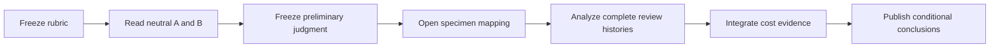

<!-- cspell:words counterevidence implementability overclaimed -->

# Review Diversity, Order, and Diminishing Returns in AI Architecture Review

## An artifact-grounded comparison of SAR → SPR → XPR and XPR → SPR → SAR

### Executive summary

This case study compares two completed review sequences applied to the same 883-line architecture baseline for AI Task Manager's MCP and external-system adapter design. One sequence used Single Agent Review, then Same Provider Review, then Cross Provider Review. The reverse sequence began with Cross Provider Review, followed with Same Provider Review, and ended with Single Agent Review. Both used GPT-6 Astra at high effort as Author, GPT-5.6 Sol at medium effort as the same-provider Reviewer, and Claude Opus 5 at medium effort as the cross-provider Reviewer.

The final artifact from **SAR → SPR → XPR is higher quality for this design's risk profile**. Its advantage is not that it is longer or accumulated more findings. It is that it contains materially stronger, testable contracts for first-authority bootstrap, evidence-write recovery, evidence retention, caller and approval identity, recovery after configuration changes, concurrent execution, migration cutover, operational feasibility, and acceptance-to-verification traceability. The XPR → SPR → SAR artifact is easier to read and better grounded in several current repository/version facts, but leaves more consequential policy to later implementers.

That artifact-level result does not establish a universal causal winner. The experiment has two trajectories, no randomization, one artifact per order, and different starting states at every later stage. The Author accumulated context, the same models were reused, and review repairs changed what the next Reviewer saw. The defensible conclusion is narrower: for this high-consequence architecture, the late cross-provider challenge in SAR → SPR → XPR exposed and repaired risks that remained in the reverse sequence's final artifact.

A practical cost/quality policy to test is staged and conditional. Begin with SAR for repository-grounded defect removal, use a fresh SPR as the first independent gate, and reserve XPR for mature, high-impact designs or when the first independent review leaves uncertainty in trust, recovery, concurrency, or operations. Stop on evidence of convergence and regression closure, not after a fixed number of rounds. Cost conclusions in this paper separate measured model usage, hypothetical API-equivalent value, actual billed spend, subscription utilization, and wall-clock delay; unavailable categories remain unknown rather than zero.

## The question this experiment can answer

The experiment asks two distinct questions that need different standards of evidence.

The first is an artifact question: which frozen final specification is better, and why? That question can be answered by inspecting the artifacts against requirements, accepted ADRs, and current implementation constraints. The evaluation used an eight-dimension rubric frozen before the evaluator opened either artifact, neutral labels A and B, exact line citations, and a frozen preliminary judgment before opening the method mapping or review histories. This was not a preregistration before the review experiment itself.

The second is a method question: is SAR, SPR, or XPR generally better, and which order causes better results? Two sequential trajectories cannot identify that causal effect. Later reviewers saw revised artifacts. The Author's context changed. Repair regressions created new review opportunities. Model/provider identity and effort were fixed rather than randomized. Finding records are correlated observations, not independent trials. Any universal ranking would therefore overstate the evidence.

This separation matters. Refusing to name an artifact winner would discard useful engineering evidence. Naming a universal method winner would claim evidence the experiment did not produce.

## Experimental design and assessment safeguard

Both trajectories started from Git commit `c2e33f4d0ae704900437a0659119bad6eb30dc01`, whose architecture artifact has SHA-256 `7066ff40fdfffa399d279f453b3e4ee7dd0e26f96effcc2dff0475b76c2cf783`. The baseline describes a headless orchestration kernel, peer CLI/MCP transports, capability-specific provider ports, a single external backlog authority, append-first evidence, recovery, plugin discovery, and phased rollout.

The assessment followed this order:

This was an assessment-order precaution, not perfect blinding. Repository file discovery exposed a path containing `XPR-first` before the preliminary judgment, although no method-to-specimen manifest or substantive review record had been opened. The evaluator is GPT-5.6 Sol, from a provider family used in the experiment, so same-provider evaluation bias is possible. Repository evidence may also omit organizational or runtime facts known to the original participants.

The rubric judged requirements correctness, contract completeness, repository consistency, implementability, operational feasibility, recovery/trust/concurrency, clarity, and testability. Each dimension used ordinal anchors rather than a pseudo-precise total score. Additional prose, reviewer agreement, and finding count received no automatic credit.

## Final artifact judgment

Specimen A is the SAR → SPR → XPR result at commit `94c32e12d845b621311a4597ac1dbaf3715c9d67`, SHA-256 `4c3e51d93861e93ced662efbdbd551221be1e5e114fe0c68c3d3219d822f2382`. Specimen B is the XPR → SPR → SAR result at commit `5b54f897c7a5d039536cba1153579e3246f219f9`, SHA-256 `99c5ca567e533e6b1b7913dc98b2723b1f561ab5a0903cfa5d6fe227b449fddf`.

### Where A is materially stronger

The largest difference is not feature scope. It is whether the design closes the failure loops created by its own durability and safety claims.

**Authority bootstrap.** Both designs say external authority must record a mutation before the mutation proceeds. The first authority container cannot record a request to create itself. B acknowledges that a durable binding must exist before governed external effects and otherwise requires maintainer provisioning (B:874-876). A specifies the missing protocol: a stable bootstrap key, provider uniqueness or exclusive ownership, an `authority.genesis` envelope in the creation payload, read-back verification, response-loss reconciliation, duplicate-root refusal, and honest reporting of partial provisioning (A:835-874). Without those rules, two concurrent setups or a lost creation response can create ambiguous roots.

**Evidence-write recovery.** An architecture that uses durable evidence to authorize business effects must handle uncertainty in writing that evidence. B states that journal writes are not recursive domain requests (B:786-796), but does not completely define their idempotency and response-loss behavior. A gives every append a stable event identity and fixed envelope, requires lookup and exact read-back, forbids inventing a new predecessor after an uncertain write, blocks dependent effects until the request record is verified, and prevents repeated business effects when the outcome append is uncertain (A:911-940).

**Retention and replay.** B protects references, acknowledges that referenced objects can disappear (B:716-743), reserves invocation bindings for the authority generation's lifetime, retains a binding/tombstone and receipt locator during compaction, and blocks reuse when binding history is ambiguous (B:855-860). A goes further: complete canonical payloads, approval provenance, predecessor traversal, and request-key continuity must remain retrievable; a provider-native archive must preserve them; missing replay history blocks admission (A:801-833). A's advantage is full-corpus recovery and archive continuity, not the mere existence of tombstones.

**Identity and approval.** B's invocation-key design is strong. It binds action, schema, payload, authority, actor, expected head, capability fingerprint, and repository execution context, with a useful lost-response table (B:811-902). A adds a stable initiating-principal namespace and separates initiator, provider execution principal, and approver (A:974-998). It also specifies that human approval requires verifiable provenance and an exact subject binding; provider credentials, caller-supplied labels, or permission to invoke a generic tool do not prove a human decision (A:1144-1176). That preserves existing AITM guards that distinguish human, automated, and exception authority.

**Recovery through change.** B binds an invocation to its original authority generation and refuses redirect on lookup (B:824-867). A specifies the general case for pending actions while plugins, bindings, credentials, and configuration generations change. Setup must inventory pending actions, settle them or prove a continuing recovery path, fence retired-generation dispatch, and treat changed targets as new actions rather than retries (A:1113-1142).

**Migration cutover.** B preserves old evidence and avoids destructive migration, but its failure contract remains local enough that an old clone could keep writing after checkpoint capture (B:1204-1231). A requires exclusive migration ownership, fencing or verifiably stopping old writers, settling in-flight effects, a durable activation record, fail-closed behavior on ambiguous activation, and a separately reviewed reverse cutover (A:1660-1690).

**Feasibility and verification.** A does not pretend these mechanisms are already viable. It introduces Phase 0 to prove a default-provider execution topology, verified plugin loading, target loss and takeover behavior, quota/retention limits, and local Git effects before Phase 1 can be approved (A:1507-1553). It then maps 21 acceptance criteria to named verification coverage (A:1780-1808). That converts architecture promises into falsifiable gates.

### Where B is better

B is not merely an inferior draft. It is the clearer artifact and retains useful brownfield detail.

B explicitly distinguishes the proposed external-system adapter from the existing `scripts/providers/provider-adapter.mjs` AI-vendor abstraction and requires a compatibility migration to `AgentHostBridge` (B:200-209). A does not state this concrete naming collision. B also states that the current package is `0.1.0`, has no adapter SDK export, and needs a deliberate `exports` map and packed-package consumer test before a Phase 5 `1.0.0` release (B:243-260). A uses illustrative future ABI 2 examples and delegates the actual first ABI version to another specification (A:231-258), which is safer against premature commitment but less plan-ready.

B's compact lost-response table is easier to audit than A's distributed recovery prose. More broadly, B is 526 lines shorter. That number is not a quality score, but the comprehension burden is real. A's retention, staleness, evidence-only recovery, configuration generation, and execution ownership rules interact across distant sections. A's acceptance map mitigates the problem without eliminating it.

### A's residual risks

A's winner status is conditional because its strongest rules still need engineering proof.

The verified plugin-loader design requires a complete immutable executable closure, restricted module resolution, a specially bound SDK peer edge, and host-enforced writer exclusion (A:332-375). This may exclude native add-ons, runtime-generated assets, or common package layouts unless Phase 0 demonstrates a workable mechanism. The design handles that honestly by marking unsupported runtimes and blocking rollout, but the feasibility risk remains.

A requires numeric action-rate, retained-byte, cold-replay, and recovery-latency budgets, yet supplies no values (A:1075-1111). This is a good requirement and an unresolved result. Its first implementation plan should also incorporate B's repository vocabulary and package-release detail. Finally, the specification's density increases the chance that an implementation team will miss a cross-section dependency.

Under a safety/operations priority, A wins clearly. Under implementation/delivery, A wins if Phase 0 is treated as a real stop gate and B's brownfield details are incorporated. Under comprehension/maintainability, B wins narrowly. For a system whose purpose is governed mutation and durable recovery, the safety weighting is decisive.

## What the trajectories show about SAR, SPR, and XPR

Raw review counts are easy to misuse. A recorded 11 SAR findings, four SPR findings, and 13 XPR actionable findings across two XPR correction cycles. B recorded eight XPR findings, one SPR prose finding with three required change items, and five SAR finding records. Those totals mix baseline defects, carried-forward observations, repair regressions, qualified premises, and clean convergence passes. They are process evidence, not a quality metric.

A contained ten review passes or Reviewer turns—five SAR, two SPR, and three XPR—and seven correction cycles. B contained eight—three XPR, two SPR, and three SAR—and five correction cycles. This mixed “pass or turn” count describes protocol shape; SAR self-passes and peer-review turns are not equivalent compute units. Fewer rounds in B did not correspond to the stronger judged artifact, but two cases cannot establish that additional rounds caused A's advantage.

### SAR: efficient context-rich threat modeling

SAR was strongest where current repository behavior and the design's own invariants had to be reconciled. A's SAR found unsafe concurrent dispatch before fork detection, missing retry identity, missing bootstrap recovery, ambiguous evidence writes, an unfenced migration cutover, approval-provenance gaps, recovery redirection after binding changes, an invalid single-predecessor fork join, and incomplete local Git recovery. B's SAR found route-permission bypass, misleading pre-binding error semantics, the missing repository adapter owner, and clone portability; its next pass caught a repository retry defect introduced by the prior repair.

SAR therefore has real value. It is inexpensive to coordinate and can exploit the Author's repository context. It is also bounded by the Author's frame. A reached a clean fifth SAR pass before a fresh SPR found four more material issues and XPR found further operational and consistency gaps. A clean self-pass is evidence of internal convergence, not independent adequacy.

### SPR: independent context without provider diversity

SPR produced high-value findings in both sequences. After A's five SAR passes, fresh Sol review identified an overclaimed plugin trust boundary, missing executable-content identity, inadequate retention guarantees, and ambiguous ownership of canonical evidence writes. After B's accepted XPR, Sol identified the missing caller-retained invocation key, a failure that could duplicate a work item after a lost response.

These are not stylistic observations. They changed trust, durability, and idempotency contracts. The result shows why “same provider” should not be treated as “same review”: a different model with fresh context can challenge assumptions the Author no longer notices. It also remains reasonable to expect correlated blind spots from shared provider training and product conventions.

### XPR: valuable diversity with coordination and correction cost

Early XPR in B efficiently repaired broad baseline problems: missing generic invocation coverage, dropped ADR coordination rules, inadequate observability classes, no credible public ABI/version baseline, an unbounded strict-assurance claim, a repository vocabulary collision, and unbounded discovery payloads. Its second round caught a contradiction introduced by the first repair.

Late XPR in A operated on a much more mature and more complex artifact. It forced the design to confront whether its non-CAS execution rule could work on the default provider, whether stale-state recovery had an exit, whether compatibility was semantic rather than exact-version equality, whether the protocol had an operating budget, how initiating identity worked, how plugin bytes stayed immutable after validation, and whether acceptance criteria had complete test coverage. The next XPR round found four new inconsistencies created or exposed by those repairs.

This is the strongest process observation in the study: **a diverse reviewer applied after substantial maturation found consequential assumptions and repair regressions that same-author convergence had missed**. It does not prove that XPR is always superior. The Reviewer also made four premises that the Author qualified or withdrew, and the stage incurred launcher-recovery overhead. The value came from different challenge patterns plus repeated repair review.

## Cost, latency, and the quality frontier

The accompanying [cost evidence](cost-evidence.md) is the authority for measured usage and rate-card calculations. The analysis keeps four ledgers separate:

1. measured model usage attributable to a documented stage or participant;
2. hypothetical API-equivalent value using an official rate card;
3. actual billed spend, which can differ under subscriptions or bundled products; and
4. fixed subscription capacity/utilization, which is not allocated into per-review story cost.

Wall-clock duration is reported separately from active reasoning and dollars. Tool output returned to a model is input-token usage where telemetry captures it; separately billed tools remain separate. Cached input is not added again at the uncached rate, and reasoning tokens already included in output accounting are not double-counted. Missing telemetry remains unknown.

For the peer-review protocols, observed create-to-finalize time was 679.991 seconds for A SPR, 2,206.592 seconds for A XPR, 1,164.455 seconds for B XPR, and 655.201 seconds for B SPR. These event-bound intervals include waiting, tools, handoffs, Author repair, and—in A XPR—launcher recovery. SAR used a different self-review record and has no directly comparable protocol clock. The telemetry attribution windows in the cost supplement are wider and must not be substituted for these durations.

The measured stage windows, valued at hypothetical Standard API rates, were:

| Arm | Stage     | API-equivalent value | Coverage qualification                                           |
| --- | --------- | -------------------: | ---------------------------------------------------------------- |
| A   | SAR r2-r5 |                $9.42 | SAR r1 missing; not a complete SAR cost                          |
| A   | SPR       |               $10.02 | Author/orchestrator plus Sol Reviewer                            |
| A   | XPR       |               $22.08 | Includes launcher failure/repair overhead                        |
| B   | XPR       |               $20.18 | Fresh Author, Opus Reviewer, and separate parent coordinator     |
| B   | SPR       |               $16.76 | Continuing Author, Sol Reviewer, and separate parent coordinator |
| B   | SAR       |               $12.09 | Continuing Author and separate parent coordinator                |

The host advertises priority service but individual OpenAI usage records do not identify a billed tier. A sensitivity scenario doubles OpenAI rates for Fast mode while retaining Anthropic's Standard rates; the corresponding stage values are $18.85, $20.05, $38.35, $35.45, $33.52, and $24.18 in table order. These are valuation scenarios, not a billed-cost interval. Actual billed cash remains unknown.

There is no comparable all-in arm total. A lacks SAR r1 telemetry, while B includes a separate parent coordinator whose stage values were $4.45, $6.06, and $5.38 at Standard rates. A's Author and coordinator were the same actor. A's XPR window includes runtime repair; B reused that repaired machinery. Original authoring, preflight gaps, an abandoned contaminated reverse attempt, integration/CI, and this paper are excluded and remain unknown rather than zero.

The reviewer-only numbers are more comparable as planning observations: the Sol Reviewer corresponded to $1.67 in A and $1.82 in B; the Opus Reviewer corresponded to $5.81 in A and $4.92 in B. The larger stage totals show that adjudication, repair, verification, context replay, and orchestration dominated the reviewer-only price. Buying another review is therefore not just buying one model response.

Within A's observed windows, late XPR cost about 2.2 times SPR at Standard API-equivalent rates and produced important operational and consistency repairs after SPR acceptance. Within B, SPR and SAR still produced material changes after XPR acceptance, at $16.76 and $12.09 respectively. These observations support staged gating: expensive diversity can be worthwhile for high-consequence residual risk, while no evidence supports applying it indiscriminately. They do not support dividing dollars by finding counts or declaring either arm cheaper overall.

Even with complete telemetry, “cost per finding” would be misleading. One bootstrap flaw can dominate ten editorial issues. A review can create a regression that consumes another round. A clean independent pass has assurance value despite producing zero findings. The relevant quantity is expected loss avoided, adjusted for repair risk and evidence strength.

For stage `s`, the decision can be expressed without pretending to know an exact probability, provided every term is converted to the same monetary basis:

`run s when expected avoided-loss value > model/tool cost + coordination-time cost + expected repair/regression cost`.

When consequence or time cannot be defensibly monetized, this remains a qualitative multi-criteria decision. Raw minutes, dollars, and severity labels must not be arithmetically combined.

This experiment strengthens the qualitative case for late XPR on designs with irreversible external effects, multiple authority stores, distributed writers, or human-approval semantics. It does not estimate a probability or establish the same benefit for a local, reversible feature.

## Recommended staged policy

For high-consequence architecture, **SAR → SPR → XPR is a practical risk-tiered candidate supported by this artifact comparison, not a causally demonstrated optimum**:

1. **SAR first:** require full-artifact review against requirements, ADRs, and current implementation. Correct material gaps and run a regression pass.
2. **SPR second:** use a fresh Reviewer context and a different model where practical. Treat this as the first independent adequacy gate.
3. **XPR last when warranted:** use provider diversity on the mature artifact when remaining failure consequences are high, the architecture crosses trust/authority boundaries, or SPR exposes unresolved assumptions.

For moderate-risk designs, SAR → SPR is a reasonable candidate to test; this experiment did not establish its cost/quality balance for that population. XPR should be triggered by risk, novelty, unresolved disagreement, or evidence that repair complexity is growing. For low-risk and easily reversible changes, a bounded SAR plus normal code/test review may be sufficient.

The incremental benefit of another stage is the reduction in residual material risk, including an independent reread of repairs. It is not the opportunity to accumulate another reviewer badge.

## Stopping rule

Stop when all five conditions hold:

1. no known high-consequence requirements, trust, recovery, concurrency, migration, or operability gap remains;
2. the latest independent pass reports no new required finding, or only observations already resolved with evidence;
3. every accepted repair has received a focused regression reread across affected contracts;
4. remaining items are optional, editorial, or explicitly accepted residual risks; and
5. provenance, artifact hashes, dispositions, and verification obligations are complete for the next governed lifecycle step.

A clean self-pass alone does not satisfy condition two. Reviewer consensus alone does not constitute human approval. A fixed “two rounds” rule is weaker than this evidence-based boundary because repair regressions can appear in the second round, as both sequences demonstrate.

## Limitations

This is a two-trajectory case study. It cannot separate order from artifact maturity, Author learning, model identity, or chance. The architecture's runtime mechanisms were specified but not implemented or tested. Review protocols relied on declared or runtime identity evidence with different assurance levels. A had an XPR launcher-recovery episode that inflated elapsed time. B SPR disclosed incidental exposure to unrelated repository design snippets, though not the target's prior reviews. B SAR preserved a verification-script failure and corrected the record. Neither branch had human architecture ratification merely because AI reviewers reached consensus.

The evaluator's neutral-label safeguard reduced direct method anchoring but did not eliminate it. File discovery revealed an `XPR-first` path before the preliminary judgment, and the evaluator shares a provider family with two experimental participants. No independent human adjudicator repeated the rubric.

The experiment coordinator was also Arm A's Author and later Arm B's parent coordinator. The coordinator independently prepared telemetry, then audited this draft for factual accuracy. That audit identified B's binding/tombstone retention counterevidence and corrected the baseline line count after the preliminary judgment was frozen. The preliminary record preserves those corrections in an explicit addendum. This editorial process improved factual accuracy but means the paper is not independent authorship or independent adjudication.

These limitations narrow the method claim. They do not erase the cited differences between the frozen artifacts.

A stronger next study should use multiple architecture designs, randomize review order, start each Reviewer and Author condition with controlled fresh context, equalize orchestration and review budgets, and use independent judges who do not know the sequence. Event-keyed telemetry should capture every model, tool, repair, and coordination action from the first pass, with service tier and billing reconciliation where available. The judges should assess both final quality and defects introduced during repair. That design could estimate order effects and stopping efficiency; this study cannot.

## Conclusion

The final SAR → SPR → XPR specification is the stronger engineering contract for AITM's adapter architecture. It earns that judgment through concrete protections against duplicate effects, ambiguous evidence, stale authority, lost history, invalid approval, unsafe cutover, and unproved operating assumptions. The reverse-order artifact is more readable and preserves useful brownfield details that should be reincorporated before implementation planning.

SAR, SPR, and XPR solve different problems. SAR exploits existing context to challenge omissions. SPR supplies fresh attention while retaining the same provider tooling. XPR adds provider diversity and demonstrated value on the mature artifact here, but it is not automatically correct; its evaluation must include operational overhead and repair cycles.

The candidate cost-quality policy emerging from this case is a gated sequence: SAR first, fresh SPR next, and XPR for high-risk residuals. Its economic advantage remains a hypothesis for the next study. Continue while a materially different review can plausibly reduce consequential uncertainty. Stop after independent clean convergence and verified repair closure.

## Methods and provenance appendix

The complete rubric and assessment-order procedure are in [assessment-protocol.md](assessment-protocol.md). The frozen neutral-label judgment is in [preliminary-blinded-assessment.md](preliminary-blinded-assessment.md). The line-by-line dimension and trajectory matrix is in [comparison.md](comparison.md). Machine-readable specimen, participant, and count provenance is in [provenance.json](provenance.json). Cost sources, coverage, assumptions, and calculations are in [cost-evidence.md](cost-evidence.md) and [cost-evidence.json](cost-evidence.json).

The [source map](source-map.md) gives exact Git object paths, protocol IDs, original review roots, event-defined duration boundaries, and reproduction commands for every `A:line` and `B:line` citation.

Publication duplicates were used only as readable mirrors when their provenance proved equality to sealed originals. They were never counted as additional reviews. Finding records were classified by function: required finding, change item, carried-forward observation, repair regression, qualified premise, optional suggestion, clean pass, protocol correction, or excluded setup. Raw provider handles, credentials, private transcripts, and hidden reasoning are excluded.
