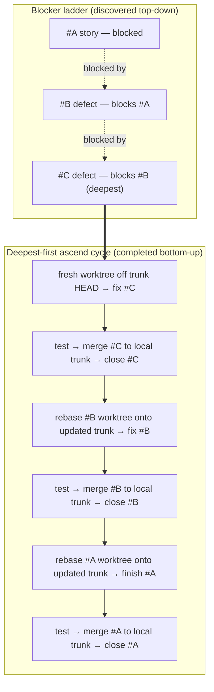

# Blocking-defect Isolation Dance Implementation Plan

> **For agentic workers:** REQUIRED SUB-SKILL: Use superpowers:subagent-driven-development (recommended) or superpowers:executing-plans to implement this plan task-by-task. Steps use checkbox (`- [ ]`) syntax for tracking.

**Goal:** Document the blocking-defect isolation dance (worktree-per-rung, deepest-first ascend) in the workflow guide with a mermaid diagram, and cross-link it from the CLAUDE.md Blocked-Task Annotation rule.

**Architecture:** Documentation-only change against issue #530. Two files edited: a new `## Blocking-defect isolation dance` section in `docs/guides/workflow.md` carrying a mermaid diagram, and a one-line cross-link added to the Blocked-Task Annotation rule in `CLAUDE.md`. No source changes. Verification is presence-based (grep).

**Tech Stack:** Markdown, GitHub-flavored mermaid fences.

## Global Constraints

- No source-code changes. Documentation deliverable only.
- Attribution is message-based (`[#N]` token grep), not SHA-reachability — the docs must not reintroduce a SHA-fixup step.
- Every commit subject leads with the `[#530]` issue-ID token (auto-injected + lint-enforced).
- The design spec of record is `docs/superpowers/specs/2026-07-11-blocking-defect-isolation-design.md`.
- The workflow-guide section heading must contain the literal text `isolation dance` (AC1 verifier `grep -n 'isolation dance' docs/guides/workflow.md`).
- The CLAUDE.md cross-link must contain the literal text `isolation` (AC2 verifier `grep -n 'isolation' CLAUDE.md`).
- The guide section must contain a ` ```mermaid ` fence (AC3 verifier `grep -nA1 'mermaid' docs/guides/workflow.md`).

---

### Task 1: Workflow-guide section + mermaid diagram

**Files:**

- Modify: `docs/guides/workflow.md` (insert a new `## Blocking-defect isolation dance` section immediately before `## Priority Tiers` at line 325, i.e. after the `---` on line 323)

**Interfaces:**

- Consumes: the design spec at `docs/superpowers/specs/2026-07-11-blocking-defect-isolation-design.md` (for wording + diagram); the existing `## Commit Attribution` section anchor `#commit-attribution` (linked from the "No SHA-fixup" paragraph).
- Produces: a section whose heading text contains `isolation dance` and whose body contains a ` ```mermaid ` fence and a relative link to the spec — relied on by the CLAUDE.md cross-link in Task 2 (anchor `#blocking-defect-isolation-dance`).

- [ ] **Step 1: Insert the section**

Insert the following block into `docs/guides/workflow.md` between the `---` on line 323 and `## Priority Tiers` on line 325:

````markdown
## Blocking-defect isolation dance

When work on a story `#A` is interrupted to fix a blocking defect `#B`, the
defect fix must be isolated so the two issues merge and close independently.
Committing both onto one worktree branch entangles their histories: because git
history is linear, `#B`'s commits become ancestors of `#A`'s, and `#A` cannot
reach trunk without dragging `#B` along. This blocked closing #522 behind the
#516 commit `228c814`, which required a cherry-pick to separate.

**Worktree-per-rung is the sole default.** Every blocking-defect fix gets its own
fresh git worktree rooted at the current trunk HEAD — never branched off the
blocked story's branch. Rooting at trunk (not at the parent branch) is what keeps
the defect's commits off the story's ancestry.

**Ascend deepest-first.** Blockers form a ladder (`#A` blocked by `#B` blocked by
`#C`), discovered top-down but completed bottom-up. For each rung, ascending:

1. On its trunk-rooted worktree, fix the rung.
2. Test it in isolation.
3. Merge it to trunk.
4. Close it.
5. Rebase the next rung up's worktree onto the now-updated trunk.
6. Repeat until the original story is finished, merged, and closed.

Because each rung reaches trunk before the rung above rebases onto trunk, the
upper rung always sits cleanly on top — no entanglement, no cherry-picks.

"Merge to trunk" means whatever the project's integration path is: a direct local
merge, or (under the PR-based flow) push the rung's branch → CI → PR → merge to
origin trunk → pull into local trunk. The dance only requires each rung reach
local trunk **before** the rung above rebases.

**No SHA-fixup needed.** Rebasing rewrites commit SHAs, but attribution is
[message-based](#commit-attribution): `close`, `commit-trace`, and
`review-preflight` locate a deliverable by grepping the `[#N]` token across commit
messages, not by SHA-reachability, and the `close` gate scopes to the trunk ref. A
post-rebase SHA change therefore does not fail any gate — stale SHAs recorded in
proof markers are cosmetic, not close-blocking. No SHA-remapping step is required.



Full design: [`docs/superpowers/specs/2026-07-11-blocking-defect-isolation-design.md`](../superpowers/specs/2026-07-11-blocking-defect-isolation-design.md).
````

- [ ] **Step 2: Verify the section anchor + mermaid fence (AC1, AC3)**

Run: `grep -n 'isolation dance' docs/guides/workflow.md`
Expected: at least the `## Blocking-defect isolation dance` heading line matches.

Run: `grep -nA1 'mermaid' docs/guides/workflow.md`
Expected: the ` ```mermaid ` fence and its `flowchart TD` next line match.

- [ ] **Step 3: Lint + format the changed doc**

Run: `node scripts/task-tracker/verify-develop.mjs`
Expected: lint:js + prettier pass; "nothing to verify" for tests (no `*.test.mjs` changed). If the spell-check lane flags `mermaid`/`worktree`/etc., add them to the project dictionary as prior commits have (see `132d44d`, `db55ccc`).

- [ ] **Step 4: Commit**

```bash
git add docs/guides/workflow.md
git commit -m "[#530] docs(workflow): document blocking-defect isolation dance + mermaid"
```

---

### Task 2: CLAUDE.md cross-link

**Files:**

- Modify: `CLAUDE.md` (the `## Blocked-Task Annotation (mandatory when spawning a defect mid-task)` section — append a cross-link line after its numbered steps)

**Interfaces:**

- Consumes: the workflow.md section anchor `#blocking-defect-isolation-dance` produced by Task 1.
- Produces: a line in CLAUDE.md containing the literal text `isolation` (AC2 verifier).

- [ ] **Step 1: Add the cross-link**

In `CLAUDE.md`, at the end of the `## Blocked-Task Annotation` section (after the numbered steps, before the following `---` or `## Cleanup` heading), add:

```markdown
For **how to physically isolate** the blocker fix so `#A` and `#B` merge and close
independently — worktree-per-rung off trunk, deepest-first ascend — follow the
[Blocking-defect isolation dance](docs/guides/workflow.md#blocking-defect-isolation-dance)
in the workflow guide.
```

- [ ] **Step 2: Verify the cross-link (AC2)**

Run: `grep -n 'isolation' CLAUDE.md`
Expected: the new cross-link line matches.

- [ ] **Step 3: Lint + format**

Run: `node scripts/task-tracker/verify-develop.mjs`
Expected: lint + format pass; "nothing to verify" for tests.

- [ ] **Step 4: Commit**

```bash
git add CLAUDE.md
git commit -m "[#530] docs(claude): cross-link Blocked-Task rule to isolation dance guide"
```

---

## Self-Review

**Spec coverage:**

- Spec deliverable 1 (design spec) — already written + committed (`0342bd5`), out of this plan's scope by design.
- Spec deliverable 2 (workflow.md section + mermaid) — Task 1. ✓
- Spec deliverable 3 (CLAUDE.md cross-link) — Task 2. ✓
- Spec "Why no SHA-fixup" — captured in Task 1 Step 1 "No SHA-fixup needed" paragraph. ✓
- Spec diagram — embedded verbatim in Task 1 Step 1. ✓

**Placeholder scan:** No TBD/TODO; all doc content is shown verbatim in the steps.

**Type consistency:** N/A (no code). Anchor consistency: Task 2 links `#blocking-defect-isolation-dance`, which is the GitHub-slug of Task 1's `## Blocking-defect isolation dance` heading. ✓

**Note:** AC verifiers (vc:1/vc:2/vc:3) on #530 are the three greps above; they are satisfied by Task 1 (vc:1, vc:3) and Task 2 (vc:2). The `test:all`/`lint`/`format`/`git log` verification commands are the DoD floor, run at the Test stage.
