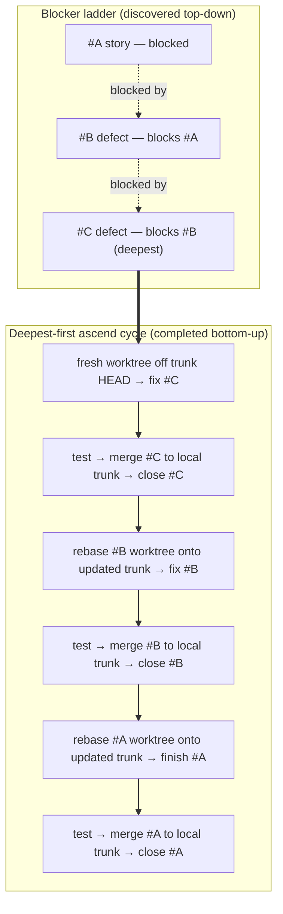

# Blocking-defect isolation dance — design

**Issue:** #530
**Status:** Approved (design), pending implementation
**Date:** 2026-07-11

## Context

When work on a story `#A` is interrupted to fix a blocking defect `#B`, the
pre-existing workflow committed both issues onto the **same** worktree branch.
Git history is linear, so the blocker's commits become ancestors of the story's
commits: `#A` cannot merge to trunk and close without also dragging the
(possibly still-open) `#B` commits along. This surfaced closing #522, where the
#516 commit `228c814` sat underneath the #522 commits and could not be separated
without a cherry-pick. Per-issue work was being entangled on one branch.

## Goals

- Every issue — story or defect — lands on trunk and closes **independently**,
  with no cross-issue commit entanglement.
- The isolation procedure is **documented** and **discoverable** from the place an
  operator already looks (the Blocked-Task Annotation rule in `CLAUDE.md`).
- Daisy-chained blockers (`#A` blocked by `#B` blocked by `#C`) have a single,
  unambiguous completion order.

## Non-goals

- **SHA-remapping tooling is out of scope** (see "Why no SHA-fixup" below).
- Auto-enforcing the dance at `promote`/`close` time. The dance is an operator
  procedure documented in the guide; enforcement of worktree hygiene is not part
  of this issue.
- Rewriting historical issue bodies.

## The dance

### Worktree-per-rung is the sole default

Each blocking-defect fix gets its **own fresh git worktree rooted at the current
trunk HEAD** — never branched off the blocked story's branch. This is the default
for every blocking-defect spawn, not an opt-in. Rooting at trunk (not at the
parent branch) is what keeps the defect's commits off the story's ancestry.

### Deepest-first ascend cycle

Blockers form a ladder, discovered top-down as work uncovers them:

- `#A` (story) is blocked by `#B`
- `#B` is blocked by `#C` (the deepest rung)

They are **completed bottom-up (deepest-first)**. For each rung, ascending:

1. On its trunk-rooted worktree, fix the rung.
2. Test it in isolation.
3. Merge it to **local trunk**.
4. Close it.
5. Rebase the next rung up's worktree onto the now-updated trunk.
6. Repeat until the original story is reached, completed, merged, and closed.

Because each rung merges to trunk before the rung above it rebases onto trunk,
the rung above always sits cleanly on top of everything below it — no
entanglement, no cherry-picks.

### Close is gated on local-trunk merge

An issue closes only once its `[#N]` deliverable commit is merged into **local
trunk**. This is already the behavior of the message-based `close` gate (it scopes
its attribution query to the trunk ref); the dance relies on it rather than
introducing a new gate.

"Merge to trunk" here means whatever the project's trunk-integration path is —
a direct local merge, or (under the PR-based flow) push the rung's branch → CI →
PR → merge to origin trunk → pull into local trunk. The dance is agnostic to that
choice; what it requires is only that each rung reaches local trunk **before** the
rung above it rebases onto trunk.

## Why no SHA-fixup

An earlier draft of #530 called for tooling to re-map every commit SHA recorded
in a story body after a rebase, because rebasing rewrites SHAs and stale SHAs were
assumed to fail close-gates. **That tooling is dropped.**

Attribution is now **message-based**: `commit-trace`, `review-preflight`, and
`close` locate an issue's deliverable by grepping the `[#N]` token
(`\[#(\d+)\]`) across commit messages, not by SHA-reachability. A post-rebase SHA
change therefore does not fail those gates — the `[#N]` token is stable across the
rewrite. Stale SHAs recorded in proof markers are **cosmetic, not
close-blocking**. Building SHA-remapping tooling would add machinery to solve a
problem the message-based attribution model already dissolved.

## Diagram



## Deliverables

1. **This design spec** under `docs/superpowers/specs/`.
2. A **section in `docs/guides/workflow.md`** documenting the dance, with the
   mermaid diagram above embedded.
3. A **cross-link** from the `CLAUDE.md` Blocked-Task Annotation rule to that guide
   section, so an operator following the blocked-task steps is pointed at the
   isolation procedure.

No source changes. This is a documentation deliverable.

## Verification

Because the deliverables are documentation, verification is presence-based:

- The `workflow.md` section exists and names the dance (grep for the section
  heading text).
- The `CLAUDE.md` Blocked-Task Annotation rule links the section (grep `CLAUDE.md`).
- A ` ```mermaid ` fence is present in the guide section (grep `workflow.md`).

## Related

- `CLAUDE.md` → Blocked-Task Annotation (mandatory when spawning a defect mid-task)
- `docs/guides/workflow.md` → Dependency representation, Commit Attribution
- `docs/guides/parallel-agents.md` → worktree requirements
- Message-based attribution contract:
  `scripts/task-tracker/lib/commit-attribution-format.mjs`
