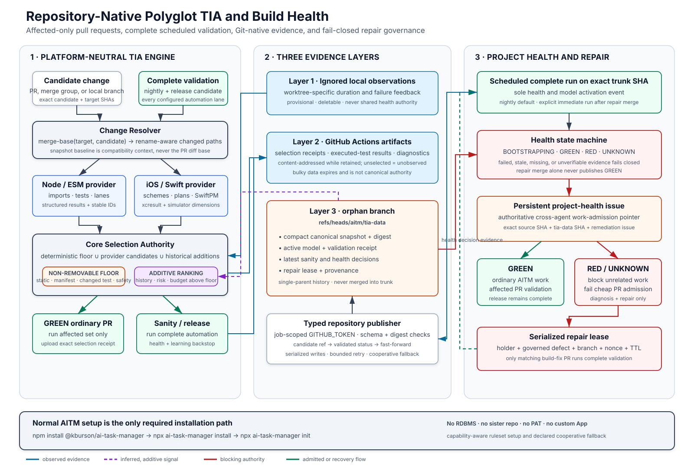

# Repository-Native Polyglot TIA and Build-Health Design

**Date:** 2026-08-14

**Status:** Approved in chat; authoritative design, not implementation authorization

**Predecessors:**

- `docs/superpowers/specs/2026-08-12-language-agnostic-develop-verification-design.md`
- Main-session ML-augmented TIA investigation begun 2026-08-13
- Ignored side-conversation comparison draft dated 2026-08-13, SHA-256
  `6737cd7e126d06d0a5fab53e47fed2b269237e4d8a176c56fa7e76adbccdbf8c`

**Disposition:** This specification selectively merges the side-conversation
draft into the broader TIA design. The repository-native evidence plane is a
subordinate service of the TIA engine. Project health is a sibling AITM
governance component because lint, format, build, packaging, environment, and
test failures can all make a project unhealthy.

## Executive Decision

AITM will evolve its current JavaScript-specific affected-test selector into a
platform-neutral, provider-based test impact analysis (TIA) engine. Pull request
validation will execute an explainable affected set, while a scheduled complete
validation run on `trunk` remains the correctness backstop, updates canonical
learning data, and controls project health.

The system uses no external RDBMS, hosted metrics service, custom GitHub App,
bot account, dedicated personal access token, or separately administered
metrics repository. Shared canonical state lives on a protected orphan branch
named `aitm/tia-data` in the source repository. The branch contains only compact,
normalized, disclosure-safe records. Bulky and short-lived diagnostics remain
GitHub Actions artifacts.

When complete validation is RED or its result becomes stale and therefore
UNKNOWN, AITM refuses unrelated mutating work. GitHub CI also refuses ordinary
PR admission before checkout or dependency installation. Only diagnosis,
project-health recovery, and the lease-bound repair issue and PR may proceed.
The repair PR always runs complete validation. A merge does not restore GREEN;
only a new complete run on repaired `trunk` can do so.

The initial implementation remains deliberately conservative:

1. correct the current changed-path baseline;
2. retain deterministic selection floors;
3. add transparent historical heuristics only after trustworthy observations
   exist; and
4. activate an ML ranker only after its minimum data and validation thresholds
   are met.



## 1. Verified Current-State Constraints

The design begins from the following repository-grounded facts:

- `scripts/task-tracker/verify-develop.mjs` currently derives changes from a
  diff against `HEAD` plus untracked files. It omits committed branch changes
  against `trunk`.
- `scripts/task-tracker/lib/test-impact-selector.mjs` is JavaScript/ESM-specific.
  It unions changed tests, direct and transitive import consumers, basename
  matching, checked-in manifest rules, and conservative lane escalation.
- Test discovery is tied to JavaScript `*.test.mjs` files under `scripts`.
- The observed suite at investigation time contained 897 test files: 823 unit,
  24 integration, and 50 slow.
- `.aitm/test-timing.json` is an ignored, overwritten local snapshot. It is not
  durable history.
- CI currently runs its fast lane for PRs and runs the slow lane on a schedule,
  manual dispatch, or selected PRs. It does not publish a durable TIA history.
- The approved Phase 1 language-neutral seam is the fixed
  `lint:affected`, `format:affected`, and `test:affected` script-label roster plus
  the stable affected-file manifest. A structured provider API remains Phase 2.

These constraints make the merge-base correction a prerequisite. Historical
ranking cannot repair an incomplete change set.

## 2. Goals

- Run only an explainable affected set for ordinary PR validation.
- Preserve static and policy-driven selection as a mandatory safety floor.
- Run every configured automation lane on a scheduled exact `trunk` SHA.
- Learn from complete outcomes without treating partial PR execution as a full
  observation.
- Detect selector escapes and regressions before learned signals gain trust.
- Apply the same core to Node/ESM, iOS/Swift, and future platforms.
- Support solo development, a team of roughly five developers, linked
  worktrees, cloud agents, and multiple machines.
- Keep shared evidence durable and Git-native without database administration.
- Make each selection reproducible from pinned source, configuration, provider,
  model, and evidence identities.
- Block unrelated governed work while project health is RED or stale UNKNOWN.
- Require no installation workflow beyond normal AITM installation and
  initialization.

## 3. Non-Goals

- Replacing deterministic analysis with an opaque classifier.
- Eliminating complete scheduled or release-candidate validation.
- Using Git as a high-frequency general-purpose database.
- Retaining raw logs, coverage directories, screenshots, or Xcode result bundles
  forever.
- Cross-project model training in the initial release.
- Preventing a repository administrator from deliberately changing workflows,
  rulesets, or history.
- Preventing unmanaged Git commands outside AITM. AITM refuses to authorize
  unrelated work while unhealthy, but cannot make arbitrary local editing
  physically impossible.
- Designing the provider protocol solely from hypothetical platforms. The
  structured protocol follows Node and real iOS/Android dogfooding.

## 4. Authority Model

The system distinguishes three authority classes.

| Class         | Examples                                                                             | May authorize work or health changes? |
| ------------- | ------------------------------------------------------------------------------------ | ------------------------------------- |
| Observed      | Test outcome, duration, changed path, environment, coverage edge                     | No                                    |
| Inferred      | Failure likelihood, co-failure edge, flake classification, rank score                | No                                    |
| Authoritative | Deterministic floor, activated model identity, project-health decision, repair lease | Yes, only through core policy         |

Providers submit observed facts and candidate tests. Learners submit inferred
signals and model candidates. Neither can remove a deterministic selection,
activate its own model, write project health, or grant a repair exception.

The `aitm/tia-data` branch stores the validated health decision and its evidence.
A persistent source-project health issue contains the operational marker that
AITM preflight reads before authorizing work. The issue marker points to the
exact data-branch commit and source SHA. A stale, missing, or inconsistent
pointer becomes UNKNOWN and fails closed.

The local AITM ledger remains authoritative for task lifecycle state. It may
cache health for performance, but a local cache cannot turn RED or UNKNOWN into
GREEN.

## 5. Component Architecture

### 5.1 Change resolver

The change resolver owns all Git semantics. For PR candidate `C` targeting base
branch `B`, it resolves:

```text
base_tip       = exact target-branch SHA used by CI
merge_base     = merge-base(base_tip, C)
changed_paths  = diff --find-renames(merge_base, C)
```

For a merge queue, `C` is the exact merge-group candidate. For local Develop
iteration, the resolver combines committed branch changes from the merge base
with tracked working-tree changes and untracked paths.

The snapshot baseline is not the PR diff base. It has a different purpose:

```text
history_compatible = is-ancestor(snapshot.baseline_sha, C)
history_gap         = diff(snapshot.baseline_sha, C)
```

`history_gap` detects whether intervening changes invalidate or broaden a
historical association. Using it as the ordinary PR change set would repeatedly
charge every PR for changes already merged into `trunk`.

### 5.2 Deterministic candidate generator

For candidate `C`, the non-removable floor is:

```text
deterministic_floor(C) =
    static_affected(C)
  union changed_or_new_tests(C)
  union explicit_manifest_rules(C)
  union always_run_safety_tests(C)
  union conservative_lane_escalations(C)
```

High-blast-radius changes to build configuration, package manifests, test
runners, lane classifiers, global helpers, TIA configuration, or provider
configuration broaden to the configured complete lanes.

### 5.3 Historical augmenter and ranker

Historical signals may add tests and order work above the deterministic floor.
They may also choose additional tests under a configurable time budget. They
may never remove or defer a floor test.

```text
selected(C) =
    deterministic_floor(C)
  union historical_associations(C)
  union policy_backstop(C)
```

Every selected test records one or more reason codes. A budget exhausted while
mandatory tests remain is a configuration error, not permission to drop them.

### 5.4 Recorder and learner

The recorder emits normalized observations and a selection receipt. The learner
uses complete, compatible observations to update aggregate features and may
propose a new model. Core policy validates and activates a model only after its
trust gates pass.

### 5.5 Project Health Gate

Project health consumes the complete outcome of every configured automation
lane. It is not limited to tests. The gate owns:

- `BOOTSTRAPPING`, `GREEN`, `RED`, and `UNKNOWN` transitions;
- the persistent project-health issue marker;
- admission policy for AITM verbs and GitHub CI;
- repair-lease validation; and
- restoration of ordinary work after a complete GREEN run.

## 6. Platform Provider Boundary

The core owns diff semantics, safety-floor unioning, scoring and budgets, audit
and escape measurement, fallback, model lifecycle, and project-health
enforcement.

A provider supplies versioned, platform-specific capabilities:

- test discovery and stable test identifiers;
- source, target, and build dependency relationships;
- statically affected candidates;
- execution commands and structured result parsing;
- lane, scheme, or test-plan definitions;
- per-test coverage or co-change edges where available;
- environment dimensions that affect result comparability; and
- platform-specific critical-path escalations.

Provider configuration pins at least:

```json
{
  "id": "aitm-tia-node",
  "version": "1.0.0",
  "capabilities": ["discover", "static-impact", "execute", "results"],
  "fallback": "full-suite"
}
```

Providers may add candidates and observations. They may not remove candidates
selected by another provider or signal. Missing, incompatible, or failed
providers broaden selection, ultimately to the complete affected platform
suite. A polyglot repository unions provider candidates before ranking.

### 6.1 Phase 1 compatibility seam

The already-approved Phase 1 contract remains intact:

```text
lint:affected -> format:affected -> test:affected
```

Each script receives the stable affected-file manifest. A project without a
meaningful affected selector maps `test:affected` to its complete suite. Empty
selection is legal; an absent contract is not.

### 6.2 Node/ESM provider

The first provider extracts the current import-graph, changed-test, basename,
manifest, and lane-escalation logic behind the core boundary. Stable test IDs
include provider identity and normalized repository-relative test path.

### 6.3 iOS/Swift provider

The iOS provider reuses the same core and evidence plane while supplying:

- Xcode scheme and test-plan discovery;
- SwiftPM target relationships where present;
- normalized bundle, class, and test-method identifiers;
- `xcodebuild` or `swift test` execution plans;
- `.xcresult` parsing and summarized coverage edges;
- simulator runtime, device family, OS, architecture, configuration, and scheme
  dimensions; and
- iOS-specific complete-lane escalation rules.

Official Node and iOS support must be available through the normal AITM package
and `install`/`init` flow. Third-party providers may be added later through the
same pinned contract without introducing a separate AITM setup command.

## 7. Three-Layer Data Model

### 7.1 Ignored local runtime layer

Suggested location:

```text
.ai-task-manager/.cache/tia/
```

Local observations accelerate feedback in the current worktree. They may
overlay compatible canonical data only for the current branch. They are never
shared health authority and may be deleted without weakening shared
correctness.

### 7.2 PR and complete-run artifact layer

Each PR or merge-group run uploads:

- selection receipt and exact selected-test roster;
- candidate, target, merge-base, data-branch, snapshot, provider, configuration,
  and model identities;
- explanation records for selected tests and lane escalations;
- per-test observations for tests actually executed; and
- bounded structured diagnostics and hashes for larger outputs.

Complete scheduled and release runs upload the same structure with `scope=full`.

PR data is selection-biased:

- an executed failure is observed;
- an executed duration is observed;
- an executed pass is observed for that test and environment;
- an unselected test is `unobserved`, never passed; and
- full-suite pass rates, exposure counts, escape rates, and health decisions are
  updated only from complete compatible runs.

Actions artifacts are retention-limited evidence. Their digest and identity are
immutable while retained, but the artifacts may expire or be deleted. Canonical
selection and health must not depend on indefinite artifact availability.

### 7.3 Canonical orphan-branch layer

The permanent branch is:

```text
aitm/tia-data
```

It is orphaned: its root commit has no parent and the branch has no merge base
with `trunk`. It is never merged into an application branch. Consumers fetch and
pin its exact head or individual objects.

Canonical tree:

```text
README.md
schema/
  observation.schema.json
  snapshot.schema.json
  model.schema.json
  health.schema.json
  repair-lease.schema.json
tia/
  snapshot.json
  snapshot.sha256
  provenance.json
models/
  active.json
  validation.json
sanity/
  latest.json
health/
  status.json
  repair-lease.json
```

The branch stores compact sufficient statistics, the active model and
validation receipt, the latest complete-run receipt, health decisions, and
lease state. Prior versions remain reachable through branch history.

It does not store raw logs, screenshots, coverage directories, `.xcresult`
bundles, SQLite databases, secrets, environment dumps, or unbounded failure
text.

Because a data branch shares its source repository's visibility, public
repositories require disclosure-safe normalization. Failure records use stable
test IDs, bounded fingerprints, categories, and artifact hashes rather than raw
stdout or secret-bearing paths.

## 8. Normalized Records and Identity

The logical schema includes:

- `tia_run`;
- `changed_path`;
- `test_definition`;
- `selection_decision`;
- `test_execution`;
- `dependency_edge`;
- `model_snapshot`; and
- `health_decision`.

An observation has a content-derived identity:

```json
{
  "observation_id": "sha256:...",
  "observed_at": "2026-08-14T07:00:00Z",
  "source": "local|pr|merge-group|sanity|release",
  "code_sha": "...",
  "base_sha": "...",
  "workflow_run_id": "...",
  "attempt": 1,
  "scope": "selected|full",
  "provider": "aitm-tia-node@1.0.0",
  "environment_id": "sha256:...",
  "test_id": "...",
  "result": "pass|fail|skipped",
  "duration_ms": 1234
}
```

The canonical snapshot pins at least:

```json
{
  "schema": 1,
  "project_id": "...",
  "baseline_sha": "...",
  "generated_at": "...",
  "source_run_id": "...",
  "parent_snapshot_digest": "sha256:...",
  "observation_watermark": "...",
  "provider_lock_digest": "sha256:...",
  "configuration_digest": "sha256:...",
  "active_model_digest": "sha256:...",
  "aggregates": {}
}
```

Aggregation must:

1. verify schema, digest, project identity, provider identity, and lineage;
2. accept only permitted ancestry and environment relationships;
3. deduplicate by observation identity and grouped workflow attempts;
4. advance monotonically beyond the observation watermark;
5. preserve observed versus inferred classification;
6. apply timestamps only for decay after compatibility is established; and
7. leave the last known-good model active until a validated replacement exists.

Selection is reproducible from candidate SHA, target SHA, exact data-branch SHA,
snapshot digest, provider lock, configuration digest, selector version, and
model digest. Exact model retraining may cease to be reproducible after raw
artifact expiry; preserving sufficient statistics, model parameters, validation
receipt, and training observation hashes is therefore mandatory.

## 9. Candidate Snapshot Resolution

An admission or selection run resolves the data branch once and pins:

- `tia_data_sha`;
- `snapshot_digest`;
- `snapshot_baseline_sha`;
- `candidate_sha`;
- `target_sha` and `merge_base_sha`;
- `snapshot_age_seconds`;
- provider and configuration digests; and
- active model digest.

The snapshot baseline must be an ancestor of the candidate. A newer data-branch
commit published during the run is ignored until the next run.

Stale but otherwise compatible learning data may be used only within the
configured learning-age policy. Health has a separate, stricter freshness
limit. Expired health becomes UNKNOWN and blocks ordinary admission. Missing,
corrupt, unsupported, non-ancestral, or incompatible learning data is ignored
and cannot shrink selection.

## 10. CI Execution Model

### 10.1 Ordinary PR

1. A minimal admission job reads the project-health marker and exact data
   branch record without checking out or executing candidate code.
2. RED or UNKNOWN fails admission and skips installation, build, and tests.
3. GREEN checks out the exact candidate and target history needed for the
   merge-base calculation.
4. Providers discover and union the deterministic floor.
5. Compatible historical signals add and rank candidates.
6. CI executes the affected set and uploads the selection receipt and results.

### 10.2 Merge queue

The workflow handles `merge_group` and validates the exact synthetic merge
candidate. A PR-head result cannot be reused as proof for a different
merge-group SHA.

### 10.3 Scheduled complete sanity run

The default cadence is nightly. The cadence is configurable and may increase to
two or three runs per day if measured staleness materially broadens PR selection
or exceeds the health freshness budget.

Runs share one concurrency group and execute every configured automation lane
against an exact pinned `trunk` SHA.

On GREEN, the publisher:

1. validates and aggregates eligible observations;
2. evaluates model candidates and escape policy;
3. uploads raw structured artifacts;
4. publishes a new snapshot, model receipts, sanity receipt, and GREEN health
   record; and
5. updates the persistent project-health issue to the exact data-branch SHA.

On RED, the publisher:

1. preserves the last known-good snapshot and model;
2. uploads bounded diagnostics and result artifacts;
3. publishes RED tied to the failed `trunk` SHA and workflow attempt;
4. updates the persistent project-health issue;
5. admits repair-lease acquisition; and
6. cancels queued ordinary validation where safe and useful.

A failed run may retry to classify environmental or flaky behavior. A mixed
pass/fail sequence is untrusted and remains RED. It cannot silently clear
health.

### 10.4 Release candidate

Every deployment or release candidate receives complete configured validation,
even when ordinary PR validation was affected-only. Affected selection is a
feedback optimization, not the sole release-confidence mechanism.

## 11. Project-Health State Machine

| Current state | Event                                                           | Next state    | Effect                                             |
| ------------- | --------------------------------------------------------------- | ------------- | -------------------------------------------------- |
| Absent        | `init` creates root ledger                                      | BOOTSTRAPPING | Only setup and first complete baseline may proceed |
| BOOTSTRAPPING | Complete run passes                                             | GREEN         | Ordinary work and affected PR validation admitted  |
| BOOTSTRAPPING | Complete run fails                                              | RED           | Repair flow required                               |
| GREEN         | Complete run passes                                             | GREEN         | Refresh evidence and freshness                     |
| GREEN         | Complete run fails or stable selector escape is confirmed       | RED           | Block unrelated work and ordinary PR validation    |
| GREEN         | Health evidence exceeds freshness limit or becomes unverifiable | UNKNOWN       | Fail closed; recovery run required                 |
| RED           | Repair PR passes before merge                                   | RED           | Evidence only; trunk remains unhealthy             |
| RED           | Repair merges                                                   | RED           | Trigger immediate complete sanity run              |
| RED           | Post-repair complete run passes                                 | GREEN         | Clear lease and resume ordinary work               |
| Any           | Marker, digest, schema, or source identity mismatch             | UNKNOWN       | Fail closed and diagnose                           |
| UNKNOWN       | Complete trusted run fails                                      | RED           | Repair flow required                               |
| UNKNOWN       | Complete trusted run passes                                     | GREEN         | Resume ordinary work                               |

The source-project health issue carries a machine-readable marker such as:

```text
<!-- aitm-project-health schema="1" status="red"
source-sha="..." tia-data-sha="..." health-path="health/status.json"
sanity-run="..." remediation-issue="..." lease-id="..." -->
```

The marker is updated idempotently. Until the marker and referenced branch
record agree, readers treat health as UNKNOWN.

## 12. RED Work-Admission Policy

RED and stale UNKNOWN block unrelated governed work, not only state movement.
The check belongs in the shared AITM verb preflight because starting or binding
work may not move lifecycle state.

Allowed operations are limited to:

- read-only status, history, and diagnostic commands;
- complete recovery validation;
- repair-lease claim, renewal, binding, release, or expiry processing;
- sanctioned creation or reuse of the remediation defect;
- work explicitly bound to the active repair defect; and
- administrative health recovery with an auditable reason.

Starting, binding, promoting, demoting, planning, developing, testing,
reviewing, or closing unrelated issues is refused. AITM also refuses to record
unrelated agent work as authorized progress while unhealthy.

At GitHub, an ordinary PR event still produces a lightweight failed admission
record. Expensive jobs remain skipped. Merge protection requires the admission
result, so an ordinary PR cannot enter the merge queue while unhealthy.

## 13. Repair Lease and Incident Flow

The repair lease coordinates a low-frequency incident. It is not a general
distributed lock.

The RED publisher first updates the persistent project-health issue. A claimant
then dispatches the typed ledger workflow. Workflow concurrency serializes
claims; the first valid claim wins and later claimants observe the active lease
without mutation.

A lease pins:

- unique lease ID and nonce;
- project and source repository identity;
- RED health decision and data-branch SHA;
- failed `trunk` SHA and sanity run;
- holder identity;
- governed defect number once bound;
- repair branch and expected base SHA;
- acquisition, expiry, and last-heartbeat timestamps; and
- lease schema version.

The holder:

1. creates or reuses the governed defect through AITM's sanctioned defect
   creation path;
2. binds the defect and repair branch to the lease;
3. creates a trunk-rooted repair worktree;
4. diagnoses and repairs the failure;
5. pushes the lease-matching branch;
6. opens a `build-fix` PR matching the lease;
7. receives complete validation;
8. merges through normal protected-trunk review; and
9. triggers an immediate complete sanity run.

Repair PR admission requires RED, the `build-fix` label, an active unexpired
lease, matching repository and issue identities, matching branch and lease
nonce, and a candidate descended from the lease's permitted base. The label
alone grants nothing.

The lease has a configurable TTL and heartbeat interval. Reclamation is allowed
only after expiry through the same serialized workflow. A reclaimed lease
supersedes the old repair PR; only the currently leased PR can receive the
exception. GREEN publication clears the lease.

After GREEN, ordinary branch owners must update onto repaired `trunk`, retest,
and publish a new head before affected validation resumes for that work.

## 14. Repository-Native Publication and Protection

AITM installs repository-owned workflows on `trunk`. Data mutation accepts only
typed operations:

```text
publish-bootstrap
publish-sanity-green
publish-sanity-red
claim-repair
renew-repair
bind-repair-defect
release-repair
```

No operation accepts arbitrary shell commands, file paths, or caller-supplied
ledger content.

Permissions are job-scoped:

- admission: `contents: read`, `pull-requests: read`;
- ledger publication: `contents: write`, `statuses: write`;
- health-issue projection: `issues: write`;
- repair-label operations, if separated: `pull-requests: write`; and
- cancellation only: `actions: write`.

Publication protocol:

1. fetch and pin the current `aitm/tia-data` head;
2. generate exactly one single-parent child commit;
3. validate permitted paths, canonical serialization, schemas, digests,
   lineage, health transitions, and lease invariants;
4. reject symlinks, merge commits, application content, unknown files, secrets,
   and oversized records;
5. push to a temporary candidate ref;
6. attach `aitm-ledger-validated` to that exact commit;
7. fast-forward `aitm/tia-data` to the validated SHA;
8. delete the temporary ref; and
9. on a concurrent-head rejection, refetch, recompute, and retry within a
   bounded limit.

Stale candidate refs are garbage-collected by the publisher after a retention
window. A `GITHUB_TOKEN` ledger push is not expected to recursively trigger
ordinary push workflows; recovery or post-repair runs use explicit dispatch.

When supported, `init` creates a ruleset targeting exactly
`refs/heads/aitm/tia-data` that:

- prohibits deletion and force pushes;
- requires linear history;
- requires the validation status on the proposed head;
- does not require pull requests; and
- does not depend on a custom bot or App identity.

`init` must prove the candidate-status and fast-forward protocol through a
publication/readback smoke test. It must not claim protected mode merely because
the ruleset API accepted configuration.

If protection is unavailable or the smoke test fails, AITM enters declared
cooperative mode. The installed workflow remains the only sanctioned writer;
guards refuse direct agent writes; every reader verifies lineage and digests;
invalid heads are ignored in favor of the most recent valid ancestor; and
`aitm doctor` reports the reduced guarantee.

## 15. Installation, Initialization, and Upgrade

The complete baseline experience remains:

```text
npm install @kburson/ai-task-manager
npx ai-task-manager install
npx ai-task-manager init
```

`install` supplies:

- TIA and project-health skill instructions and hooks;
- PR, merge-group, sanity, admission, and typed publisher workflows;
- versioned schemas and configuration templates;
- official platform adapter contracts and templates; and
- doctor and migration support.

`init`:

1. discovers repository, GitHub, platform, and test-runner capabilities;
2. writes explicit provider configuration and a provider lock digest;
3. creates the orphan branch with BOOTSTRAPPING health, never false GREEN;
4. installs the strongest self-contained protection the repository supports;
5. creates or identifies the persistent project-health issue;
6. performs a publication/readback and protection smoke test;
7. runs or dispatches the first complete baseline validation; and
8. reports degraded protections or unavailable guarantees explicitly.

The commands use the operator's repository access already required for normal
AITM setup. Workflows use only the repository-scoped `GITHUB_TOKEN`. No separate
automation credential is requested.

Schema and provider upgrades are explicit and monotonic. A reader encountering
an unsupported future schema ignores historical augmentation and broadens
validation. Destructive ledger rewrites are not an upgrade mechanism.

## 16. Learning and Trust Policy

The initial historical augmenter is transparent and heuristic. Candidate
signals include:

- per-test runtime distribution;
- complete-run failure rate;
- source and test churn;
- co-change and co-failure edges;
- dependency/path distance and shared path tokens;
- criticality and historical selector escapes;
- changed-file and affected-target cardinality; and
- provider-namespaced environment dimensions.

Initial minimum trust thresholds are:

- runtime median: five compatible successful executions;
- failure-rate augmentation: 20 complete compatible exposures;
- co-failure edge: 20 applicable exposures and three stable pair failures;
- suspected flake: one mixed same-SHA retry episode;
- confirmed flake: two mixed episodes within the configured 30-day window; and
- learned classifier/ranker: at least 200 complete labeled runs and 30 stable
  positive outcomes, plus backtest acceptance.

These are conservative defaults, not promises that a model will be useful. A
small repository may remain on heuristics indefinitely.

A model candidate must record feature schema, training observation hashes,
provider/environment scope, parameters, calibration, recall, escape rate,
backtest window, and comparison with the active baseline. Activation is a core
policy decision and produces a new validated model receipt.

Nightly complete results provide the counterfactual backstop. A stable failure
outside the recorded selection for the attributable merged candidate is a
selector escape. Aggregate nightly failure alone does not prove which PR caused
an escape; attribution requires compatible selection receipts and source
ancestry. Unattributed failures still make health RED but do not fabricate a
model label.

A confirmed stable escape:

1. publishes RED;
2. creates or reuses the remediation flow;
3. preserves the escaping selector/model snapshot;
4. suspends learned narrowing and broadens affected validation to the complete
   relevant suite;
5. requires correction and backtest over at least the last 30 applicable runs;
   and
6. requires a GREEN complete `trunk` run before learned augmentation can be
   reactivated.

## 17. Failure Behavior

| Failure                                           | Required behavior                                                                    |
| ------------------------------------------------- | ------------------------------------------------------------------------------------ |
| Current selector sees only uncommitted paths      | Phase 0 blocks learned-TIA rollout until merge-base behavior is proven               |
| Data branch missing during bootstrap              | Run configured complete lanes and establish BOOTSTRAPPING visibly                    |
| Data branch unexpectedly missing after activation | Health UNKNOWN; refuse ordinary admission; retain static/full recovery path          |
| Snapshot corrupt or digest mismatch               | Walk to latest valid ancestor or ignore history and broaden safely                   |
| Snapshot baseline is not candidate ancestor       | Ignore historical overlay; preserve deterministic floor                              |
| Unsupported schema or provider                    | Ignore overlay or run complete affected platform suite                               |
| Data branch moves during validation               | Continue with the pinned data SHA                                                    |
| Concurrent publication                            | Non-fast-forward rejection, recomputation, bounded retry                             |
| Publisher cannot update issue marker              | Branch decision may exist, but operational health is UNKNOWN until projection agrees |
| Health exceeds freshness limit                    | UNKNOWN and fail closed                                                              |
| Sanity run fails                                  | RED without replacing last known-good snapshot/model                                 |
| Sanity retry is mixed pass/fail                   | Remain RED and classify as unstable evidence                                         |
| Ordinary PR opened during RED                     | Fail lightweight admission; skip expensive jobs                                      |
| Forged `build-fix` label                          | Reject without matching lease, issue, branch, nonce, and ancestry                    |
| Repair holder disappears                          | Lease expires and may be reclaimed through serialized workflow                       |
| Repair merges without post-merge sanity           | Remain RED                                                                           |
| Protection unavailable                            | Cooperative mode plus explicit doctor diagnostic                                     |
| Raw artifacts expire                              | Preserve canonical snapshot/model/health; accept loss of bulky diagnostics           |
| Entire data branch is lost                        | Reset learning and health to UNKNOWN; recover through static and complete validation |

Every missing, stale, corrupt, incompatible, or unverifiable input broadens
validation or closes admission. It never shrinks the deterministic floor.

## 18. Verification Strategy

Implementation is not complete until tests prove at least:

### Change and selection

- committed changes between merge base and candidate are included;
- local uncommitted and untracked paths compose correctly with committed paths;
- snapshot baseline and PR merge-base intervals cannot be confused;
- deterministic candidates cannot be removed by providers, scoring, or budgets;
- high-blast-radius changes escalate to complete lanes; and
- selection receipts reproduce the exact roster from pinned inputs.

### Platform behavior

- the non-JavaScript Phase 1 fixture executes all three affected scripts;
- missing affected-script labels fail loudly rather than reporting empty green;
- Node behavior remains equivalent to the current deterministic selector;
- an iOS fixture normalizes schemes, plans, test IDs, and result records; and
- multiple providers union candidates before ranking.

### Data and publication

- the data branch has no merge base with `trunk`;
- its history contains only allowed paths and single-parent commits;
- canonical serialization produces stable digests;
- duplicate observations and workflow attempts are not double-counted;
- incompatible ancestry or environment cannot contaminate aggregates;
- concurrent publication has one fast-forward winner and safe retry;
- direct invalid publication is rejected in protected mode; and
- cooperative-mode readers recover the latest valid ancestor.

### Health and repair

- bootstrap never emits GREEN before complete validation;
- RED and stale UNKNOWN block unrelated AITM mutating verbs;
- RED skips expensive ordinary PR jobs;
- a repair label without a matching lease is rejected;
- only the current lease-matching repair PR receives complete validation;
- lease expiry and reclamation cannot admit two repair PRs simultaneously;
- repair merge alone does not clear RED;
- successful post-repair sanity publishes GREEN and clears the lease; and
- issue-marker/data-branch disagreement becomes UNKNOWN.

### Learning safety

- unselected tests remain unobserved;
- complete versus selected exposures cannot be mixed;
- model activation thresholds and backtest gates are enforced;
- mixed same-SHA retries cannot silently clear health;
- an attributable stable escape suspends learned augmentation; and
- selection remains correct when all learned data is deleted.

## 19. Delivery Phases

1. **Phase 0 — correctness:** repair merge-base changed-path collection and add
   committed-branch regression coverage.
2. **Phase 1 — language-neutral seam:** deliver the already-approved affected
   script roster and manifest, including a non-JavaScript fixture.
3. **Phase 2 — evidence foundation:** normalized records, selection receipts,
   local overlay, and Actions artifact publication.
4. **Phase 3 — canonical ledger:** orphan branch, typed publisher, pin/read
   logic, schemas, protection probing, and cooperative fallback.
5. **Phase 4 — sanity and health:** complete scheduled validation, health issue
   projection, freshness policy, and GREEN/RED/UNKNOWN state machine.
6. **Phase 5 — PR admission and repair:** affected-only PR and merge-group flow,
   RED admission, repair lease, governed defect binding, and post-repair sanity.
7. **Phase 6 — historical heuristics:** duration, failure, churn, co-change,
   flake, criticality, and escape signals with shadow evaluation.
8. **Phase 7 — structured providers:** extract the Node provider, dogfood iOS,
   then finalize the reusable provider protocol.
9. **Phase 8 — learned ranking:** train and activate only if minimum data,
   calibration, recall, and backtest requirements are met.

No phase may weaken the deterministic floor or remove complete scheduled and
release validation.

## 20. Adopted Decisions

- Platform-neutral core with narrow, pinned providers.
- Static, manifest, changed-test, critical-path, and escalation rules are
  non-removable.
- Phase 0 merge-base correction precedes learned selection.
- Affected-only ordinary PR validation plus complete scheduled and release
  validation.
- Explicit local, artifact, and canonical data layers.
- Same-repository orphan data branch as the default canonical store.
- Repository-native publisher using typed operations and `GITHUB_TOKEN`.
- Persistent project-health issue pointing to exact evidence SHA.
- Hard RED/UNKNOWN AITM work gate plus GitHub PR-admission gate.
- Lease-bound repair PR with complete validation and post-merge GREEN proof.
- JSON/JSONL-compatible normalized schemas and disclosure-safe Git contents.
- Normal AITM `install` and `init` as the only required setup experience.
- Nightly initial cadence with measured, configurable increase.

## 21. Rejected or Superseded Decisions

- External RDBMS or hosted metrics service: too heavy for the target scale.
- Sister metrics repository as the default: unnecessary repository, credential,
  and administration surface. A future opt-in exporter may target one.
- Trunk-committed snapshots: create application-history churn and candidate
  invalidation.
- Actions artifacts as the sole or permanent store: retention is finite.
- Empty initial GREEN: creates trust without evidence.
- Snapshot baseline as PR diff base: conflates compatibility with impact.
- Ordinary feature work continuing under AITM while RED: conflicts with the
  approved project-first repair policy.
- Data-branch health as the only work authority: omits the source-project issue
  pointer and cross-agent governance boundary.
- Broad workflow write permissions: unnecessary and unsafe.
- A `build-fix` label as sufficient repair admission: forgeable and ambiguous.
- Learned selection as the release gate: insufficient correctness backstop.
- Cross-project model training in the initial version: privacy, comparability,
  and data-volume benefits are unproven.

## 22. Configurable Policy Values

The architecture is settled; these operational values remain configuration,
not topology decisions:

- scheduled sanity cadence;
- maximum GREEN-health age before UNKNOWN;
- artifact retention within GitHub's available limits;
- repair-lease TTL and heartbeat interval;
- affected-set time budget above mandatory tests;
- provider-specific environment compatibility rules;
- escape-rate thresholds that suspend learned augmentation; and
- whether a project enables a future sanitized cross-project exporter.

Defaults must fail safely and `aitm doctor` must report their effective values.

## 23. Research Basis

The architecture is informed by, but does not copy, these systems and primary
references:

- Meta's [Predictive Test Selection](https://arxiv.org/abs/1810.05286) provides
  evidence for combining change, history, failure, ownership, and path-distance
  features while measuring failure recall.
- Mozilla's
  [task scheduling documentation](https://firefox-source-docs.mozilla.org/taskcluster/optimization/schedules.html)
  demonstrates learned scheduling backed by conservative mechanisms rather
  than an unguarded model.
- Jest's
  [`--findRelatedTests` contract](https://jestjs.io/docs/cli#--findrelatedtests-spaceseparatedlistofsourcefiles)
  and [pytest-testmon](https://testmon.org/) illustrate ecosystem-specific
  affected-test providers rather than a universal dependency parser.
- The [Node.js test runner](https://nodejs.org/api/test.html) remains the primary
  execution substrate for the first provider.
- Google's
  [flaky-test definition](https://testing.googleblog.com/2016/05/flaky-tests-at-google-and-how-we.html)
  supports treating same-code pass/fail mixtures as unstable evidence rather
  than silently GREEN.
- GitHub documents the repository scope and non-recursive event behavior of
  [`GITHUB_TOKEN`](https://docs.github.com/en/actions/concepts/security/github_token),
  the available
  [workflow permissions](https://docs.github.com/en/actions/reference/workflows-and-actions/workflow-syntax#permissions),
  [ruleset capabilities](https://docs.github.com/en/repositories/configuring-branches-and-merges-in-your-repository/managing-rulesets/available-rules-for-rulesets),
  and finite
  [artifact retention](https://docs.github.com/en/actions/how-tos/manage-workflow-runs/remove-workflow-artifacts).

Reported performance from another organization is not an AITM acceptance
threshold. AITM must establish its own recall, escape, latency, and cost evidence
from compatible project-local observations.

## 24. Provenance and Supersession

This document is the authoritative consolidation of the 2026-08-13 main and
side TIA conversations. It supersedes the ignored side-conversation draft whose
SHA-256 is recorded in the header. That draft should not be committed as a
second competing specification.

The approved language-agnostic Develop-stage verification specification remains
authoritative for its Phase 1 script roster and manifest. This document extends
that seam; it does not silently revise it.

Implementation requires a separate reviewed plan and governed AITM issues. This
design does not authorize code, workflow, ruleset, branch, or issue mutations.
