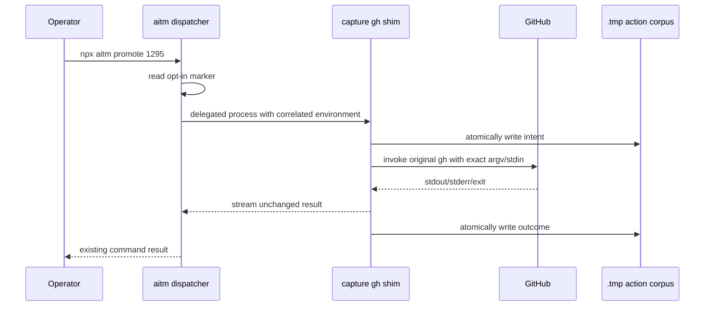

<!-- @story #1295 -->
<!-- cspell:ignore backchannel -->

# GitHub-Bound Action Capture Spike Design

## Status and authority

This spike adds an opt-in observational side channel. GitHub issues, GitHub
Project fields, and Git commit history remain authoritative. Capture artifacts
are temporary machine-local evidence used to measure the shape and volume of
AITM traffic. They are not an offline source of truth, cannot authorize a state
transition, and are not replayed by this spike.

The design was approved through the preceding discussion and the explicit
instruction to drive issue #1295 to Done in Full-Auto mode.

## Alternatives considered

### Instrument each semantic writer

Add capture calls to `mutateIssueBody`, owned comments, project-field helpers,
label writers, ownership writers, and close/reopen paths. This yields rich
semantic records but misses older direct `gh` subprocesses unless every
mutation path is first found and migrated. That migration is larger and riskier
than the experiment.

### Replace GitHub access with a new transport abstraction

Move every GitHub read and write behind one new client and capture there. This
is the likely long-term direction if offline replay is approved, but it changes
the production architecture before the experiment has measured the actual
traffic. It also couples the spike to a broad migration.

### Observe the existing `gh` process boundary

When capture is enabled, the public `aitm` dispatcher prepends a package-owned
`gh` shim to the delegated command's `PATH`. The shim records the request,
invokes the original `gh` executable unchanged, streams its output unchanged,
and records the outcome. Capture is disabled by default.

This is the selected approach. It sees both shared helpers and direct legacy
calls while leaving their GitHub semantics, optimistic concurrency, retries,
and read-back checks intact.

## Operator surface

The operator uses one standalone command:

```text
npx aitm capture-actions on
npx aitm capture-actions status
npx aitm capture-actions summary [--issue N] [--json]
npx aitm capture-actions off
```

`on` creates a main-worktree-anchored enable marker. `off` removes only that
marker; it preserves the captured corpus for later analysis. `status` reports
the marker and corpus path. `summary` scans completed and incomplete records
without modifying them.

When the marker is absent, `aitm` delegates with the existing environment and
creates no capture files.

## Storage layout

All linked worktrees share this main-worktree-anchored tree:

```text
.tmp/aitm/action-capture/
  enabled.json
  repositories/kburson__ai-task-manager/
    issue-1295/
      000001-<ulid>/
        intent.json
        request.bin
        outcome.json
        stdout.bin
        stderr.bin
```

The repository and issue partition allows multiple agents to work on different
tasks without sharing an append file. A short per-issue allocation lock assigns
the monotonically increasing sequence. Each action gets its own directory, so
writers never contend over record content.

`intent.json` is written atomically before transport. `outcome.json` is written
atomically after the real `gh` process exits. A directory with an intent but no
outcome is an observable interrupted or still-running call.

## Record model

Every `gh` call within an enabled `aitm` invocation is recorded because reads
following a mutation are the existing read-back evidence. Each intent contains:

- schema version and action identity;
- stable per-issue sequence;
- repository and active issue identity;
- parent `aitm` invocation identity and command;
- start timestamp and process identity;
- operation class (`read` or `mutation`) and mutation kind;
- safe argument and request-body storage metadata;
- byte counts and SHA-256 hashes computed over exact bytes.

Each outcome contains:

- completion timestamp and elapsed milliseconds;
- exit code or terminating signal;
- stdout and stderr byte counts and SHA-256 hashes;
- safe exact-output storage metadata.

The shim classifies known write families: issue creation, body/title/label/
assignee edits, comments, close/reopen, REST write methods, and GraphQL
mutations. Unknown calls are conservatively recorded as reads unless their
method or GraphQL document proves they mutate.

## Exact bytes and secret handling

Arguments, stdin, stdout, and stderr are treated as byte sequences. Hash and
size metadata always describe the original bytes. Exact bytes are written only
when the existing GitHub-record credential policy accepts them. If it detects a
credential signature, the raw bytes are omitted and the metadata records
`stored: false` and `redacted: true`.

The shim never records environment variables. In particular, GitHub tokens
used by the real `gh` process remain outside the corpus.

## Process behavior and failures

The dispatcher resolves the original `gh` executable before prepending the
shim directory and passes its absolute path in a private environment variable.
The shim refuses recursion and executes only that resolved binary.

Capture is observational and fail-open. If marker inspection, allocation, or
record writing fails, the dispatcher or shim emits a concise warning and still
runs the original command. The real command's stdin, stdout, stderr, signal,
and exit status remain the source of behavior.

The wrapper buffers stdin so it can hash and forward the exact request. It tees
stdout and stderr to the caller while retaining bounded copies for safe local
storage. Hashes and byte counts cover the complete streams even when raw output
storage is omitted.

## Data flow



## Summary output

The summary reports, globally or for one issue:

- invocation, call, mutation, read, succeeded, failed, and incomplete counts;
- counts by mutation kind;
- serialized manifest bytes and captured raw payload bytes;
- redacted payload count;
- largest records with repository, issue, sequence, action identity, kind, and
  byte counts.

This is sufficient to estimate a future offline outbox or cloud-agent return
package without implementing either.

## Testing

Tests first characterize:

1. disabled mode leaves delegation and the filesystem unchanged;
2. enabled dispatcher injection preserves existing command exit behavior;
3. classification covers body, comments, project GraphQL, labels, ownership,
   creation, close, and reopen;
4. intent precedes the injected transport call;
5. exact safe bytes round-trip with matching hashes and sizes;
6. credential-bearing bytes are omitted while metadata remains;
7. success, failure, and missing-outcome records are distinguishable;
8. concurrent allocation produces unique ordered action directories;
9. repository and issue partitions isolate different active agents;
10. summary totals and largest-record ordering match a fixture corpus.

Focused tests run during each red-green cycle, followed by formatting, linting,
the full fast suite, and a captured dry-run against deterministic fake `gh`
transport. Live GitHub is used only by the governed issue lifecycle, not by the
automated tests.

## Explicit non-goals

- no offline replay or reconciliation;
- no mutation while GitHub authority is unverifiable;
- no local authorization of issue or project state;
- no task pickup while disconnected;
- no alternate Git or source-change transport;
- no archival JSON format for completed tasks;
- no cloud-agent backchannel protocol.
